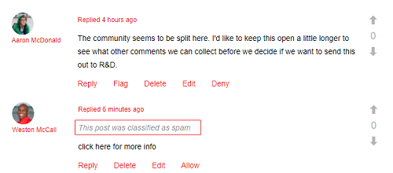

# Notas de versão gerais do Adobe Experience Manager 6.4 {#general-release-notes-for-adobe-experience-manager}

## Informações da versão {#release-information}

| Produto | Adobe Experience Manager |
|---|---|
| Versão | 6.4 |
| Tipo | Versão Principal |
| Data de disponibilidade geral | 4 de abril de 2018 |
| Atualizações recomendadas | Consulte [Versões e atualizações do AEM](https://experienceleague.adobe.com/docs/experience-manager-release-information/aem-release-updates/aem-releases-updates.html?lang=pt-BR) |

### Trívia {#trivia}

O ciclo de lançamento desta versão do Adobe Experience Manager começou em 27 de abril de 2017, passou por 22 iterações de garantia de qualidade e correção de problemas, terminando em 22 de março de 2018. O número total de problemas relatados por clientes incluindo melhorias e novos recursos corrigidos nesta versão é de 704.

O Adobe Experience Manager 6.4 está disponível por completo desde 4 de abril de 2018.

>[!NOTE]
>
>O Adobe recomenda instalar o service pack mais recente, pois todos os novos pacotes de recursos só são entregues via [Service Packs](https://helpx.adobe.com/experience-manager/maintenance-releases-roadmap.html).

## Novidades {#what-s-new}

O Adobe Experience Manager 6.4 é uma versão de atualização para o código de base do Adobe Experience Manager 6.3. Ele fornece funcionalidades novas e melhoradas, correções essenciais para o cliente, melhorias de alta prioridade para o cliente e correções gerais de bugs voltadas para a estabilização do produto. Ele também inclui a maioria de todos os pacotes de recursos do Adobe Experience Manager 6.3, hotfix e versões de service pack.

A lista abaixo fornece uma visão geral, enquanto as páginas subsequentes listam os detalhes completos.

### Base do Experience Manager {#experience-manager-foundation}

Lista completa de alterações em [Base do AEM](wcm-platform.md).

A plataforma do Adobe Experience Manager 6.4 integrada na parte superior das versões atualizadas da estrutura baseada em OSGi (Apache Sling e Apache Felix) e o repositório de conteúdo do Java: Apache Jackrabbit Oak 1.8.2.

O Quickstart usa o Eclipse Jetty 9.3.22 como mecanismo servlet.

#### Interface do usuário {#user-interface}

Vários aprimoramentos foram feitos à interface do usuário para torná-la mais produtiva e fácil de usar.

* [Novo painel Árvore de conteúdo](/help/sites-authoring/basic-handling.md#content-tree) para navegar rapidamente em uma hierarquia. Em combinação com a exibição em lista, isso restaura o modelo de interação da interface do usuário clássica.
* Melhoria na experiência de rolagem na exibição de cartão e lista de pastas grandes.
* [Interação aprimorada com os resultados da pesquisa](/help/sites-authoring/search.md) - o botão Voltar restaura o resultado da pesquisa anterior.
* [Atalhos adicionais do teclado](/help/sites-authoring/keyboard-shortcuts.md), para as ações mais comuns, como abrir um painel específico, editar, mover e excluir itens ou abrir propriedades.
* [Capacidade de desativar atalhos do teclado](/help/sites-authoring/user-properties.md) (ativar/desativar em Preferências).
* [Parar de mostrar carimbos de data e hora em toda a interface do usuário](/help/sites-authoring/user-properties.md) relativo após 7 dias (definir padrão em Preferências).

Consulte a [Documentação de criação](/help/sites-authoring/home.md) para obter mais informações sobre esses recursos.

>[!CAUTION]
>
>A Adobe não planeja fazer aprimoramentos adicionais à interface do usuário clássica. O AEM 6.4 tem a interface do usuário clássica incluída, e os clientes que atualizam de versões anteriores podem continuar a usando da mesma forma. Observe que a interface do usuário clássica permanece completamente compatível mesmo enquanto obsoluta. [Leia mais](/help/sites-deploying/ui-recommendations.md).

#### Repositório de conteúdo {#content-repository}

* Compactação mais rápida e eficiente pela Limpeza de Revisão Online. Testes internos mostram que a nova compactação de cauda é até 10 vezes mais rápida e pode recuperar mais espaço em disco com menos IOPS em comparação ao AEM 6.3. Isso resulta em menos impacto no desempenho enquanto a Limpeza de Revisão Online está em execução. Para obter mais informações, consulte [a página de documentação](/help/sites-deploying/revision-cleanup.md#full-and-tail-compaction-modes).

* A Limpeza de Revisão Contínua para MongoMK substitui a manutenção de limpeza agendada
* Eficiência aprimorada para limpeza de revisão em notebooks de documento

#### Pesquisar e indexar {#search-indexing}

* Suporte aprimorado para operações de indexação via oak-run (CLI):

   * Verificação de consistência do índice
   * Estatísticas de indexação
   * Importação ou exportação da configuração do índice
   * Reindexação

* Redução do crescimento do repositório relacionado ao Lucene para um desempenho geral aprimorado do sistema

Para obter mais informações, visite [esta página de documentação](/help/sites-deploying/indexing-via-the-oak-run-jar.md).

#### Monitoramento {#monitoring}

* Um novo [Visão geral do sistema](/help/sites-administering/operations-dashboard.md#system-overview) O fornece uma visualização instantânea de todas as atividades e status do sistema relacionados ao desempenho.
* Um novo conjunto de [Verificações de integridade](/help/sites-administering/operations-dashboard.md#health-checks) sobre indexação, consultas e manutenção

#### Projetos e fluxos de trabalho {#projects-and-workflows}

* Todos os novos [Editor de fluxo de trabalho para criar e editar modelos de fluxo de trabalho](/help/sites-developing/workflows-models.md).

#### Atualizar da versão anterior {#upgrade-from-earlier-version}

* [Compatibilidade com versões anteriores](/help/sites-deploying/backward-compatibility.md): Os recursos compatíveis com versões anteriores da versão 6.4 ajudam o código personalizado a permanecer compatível na maioria dos casos e reduzem o esforço de atualização.
* [Avaliação da Complexidade de Atualização](/help/sites-deploying/pattern-detector.md): Nova ferramenta de Detector de padrões para avaliar a complexidade de suas atualizações, antes de atualizar.
* [Reestruturação do Repositório](/help/sites-deploying/repository-restructuring.md): reestruturação significativa (principalmente /etc.) para facilitar as atualizações e promover as práticas recomendadas de implementação
* Para obter mais informações gerais sobre atualizações, consulte o [esta página](/help/sites-deploying/upgrade.md) para obter mais detalhes.

### Sites do Experience Manager {#experience-manager-sites}

Lista completa de alterações em [AEM Sites e complementos](sites.md).

#### Experiências fluídas {#fluid-experiences}

A introdução de Experiências fluídas no início de 2017, apoiada por Fragmentos de conteúdo, Fragmentos de experiência e Serviços de conteúdo, foi o início da evolução para um gerenciamento de conteúdo com vários canais e início. O AEM 6.4 alarga de forma significativa cada uma das zonas:

**[Fragmentos de conteúdo](/help/assets/content-fragments.md)**

Novidades na versão 6.4 são um visual [modelo de conteúdo](/help/assets/content-fragments-models.md) e um novo [componente configurável](https://docs.adobe.com/content/help/pt-BR/experience-manager-core-components/using/components/content-fragment-component.html) para fornecer saída HTML flexível e JSON para incluir nos Serviços de conteúdo.

**Fragmentos de experiência**

A criação de variações em um fragmento com o mesmo conteúdo, mas com layout diferente, agora é mais eficiente, graças à capacidade de blocos de construção . Além de enviar Fragmentos de experiência para o Facebook e o Pinterest, agora é possível enviá-los para o Adobe Target como oferta.

**Content Services**

Várias melhorias no Sling Model Exporter e nos Componentes principais são incluídas para fornecer uma saída JSON robusta para incorporar conteúdo em aplicativos móveis e experiências criadas com aplicativos de página única.

#### Obter sites criados mais rapidamente {#gettings-sites-built-quicker}

AEM 6.4 conclui a transformação para o modelo de componente da próxima geração. O conceito dos Componentes principais introduzido no AEM 6.3 e agora associado pelo Sistema de estilos fornece uma maneira eficiente de criar sites novos e estender sites existentes.

Tutorial recomendado para saber como aproveitar melhor o novo modelo de componente: [Introdução ao AEM Sites - Tutorial do WKND](https://docs.adobe.com/content/help/pt-BR/experience-manager-learn/getting-started-wknd-tutorial-develop/overview.html)

#### Complemento do Screens {#screens-add-on}

Fornecer uma mensagem consistente em todos os canais de marketing, incluindo redes de sinalização digital e quiosque, é o que o AEM Screens significa. O AEM 6.4 adiciona suporte para executar o Player de sinalização no hardware do sistema operacional Microsoft Windows e Google Chrome. Além disso, estão disponíveis aprimoramentos no gerenciamento remoto de dispositivos e programações (grupos de canais).

Para obter mais informações sobre as atualizações do Screens, consulte [Guia do usuário do AEM Screens](https://docs.adobe.com/content/help/br/experience-manager-screens/user-guide/aem-screens-introduction.html).

### Comunidades do Experience Manager {#experience-manager-communities}

O AEM 6.4 adiciona muitos novos recursos e melhorias às Comunidades. A lista completa de alterações está disponível em [AEM Communities](communities-release-notes.md). Os destaques desta versão são:

#### Melhorias na moderação {#enhancements-to-moderation}

**Detecção automática de spam**

Foi fornecido um novo mecanismo de detecção de spam para filtrar conteúdo indesejado gerado pelo usuário em sites e grupos da comunidade. Depois de habilitado do sistema/console/configMgr, ele marca uma parte do conteúdo gerado pelo usuário como spam com base em um conjunto predefinido de palavras de spam. Para saber mais sobre o mecanismo de detecção de spam, consulte [automatizando a geração de conteúdo pelo usuário da comunidade](/help/communities/moderate-ugc.md#spam-detection).

**Novos filtros para QnA**

Novos filtros, chamados de Respondido e Não respondido, foram adicionados ao console de moderação em massa para filtrar perguntas de QnA. Para saber como funcionam os filtros de status Respondido e Não respondido, consulte [moderação em massa de conteúdo gerado pelo usuário](/help/communities/moderation.md#main-pars-note-521961797).

**Filtros de moderação de marcador**

A capacidade de marcar os filtros de moderação predefinidos no console de moderação foi fornecida. Esses filtros são anexados ao final da cadeia de caracteres do URL, portanto, podem ser compartilhados, reutilizados e revisitados posteriormente. Saiba como marcar filtros em [console de moderação em massa](/help/communities/moderation.md#main-pars-note-429176623).

#### Excluir UGC e perfis de usuário {#delete-ugc-and-user-profiles}

AEM 6.4 Comunidades expõe [APIs prontas para uso](/help/communities/user-ugc-management-service.md) e amostra [servlet](https://github.com/Adobe-Marketing-Cloud/aem-communities-ugc-migration/tree/master/bundles/communities-ugc-management-servlet) para permitir que os usuários finais tenham controle sobre seus dados. Essas APIs também permitem que as organizações de processamento e controle de dados atendam às solicitações de conformidade do GDPR da UE.

#### Melhorias no gerenciamento de site e de grupos {#enhancements-to-site-and-group-management}

**Criar grupos com várias localidades em uma única etapa**

A capacidade de criar grupos multilíngues em uma única operação foi fornecida. Para criar esses grupos, os usuários podem navegar até a Coleção de grupos do site de comunidades desejado no console Sites . Crie um grupo e especifique os idiomas desejados na página Modelo do grupo da comunidade. Para saber mais sobre essa funcionalidade, consulte [console grupos da comunidade](/help/communities/groups.md).

**[Excluir sites e grupos da comunidade em um clique](/help/communities/groups.md)**

O ícone Excluir agora está disponível nos respectivos sites e grupos, enquanto navega a partir da navegação global. Usar esse ícone exclui todos os itens e conteúdo associados ao site ou grupo e remove todas as associações de usuários. Para saber mais sobre essa funcionalidade, consulte [gerenciamento de sites da comunidade](/help/communities/create-site.md#main-pars-text-fe17) e [gerenciamento de grupos da comunidade](/help/communities/groups.md#main-pars-text-5e8c).

#### Melhorias na ativação {#enhancements-to-enablement}

As funções Atribuição e Catálogo agora estão disponíveis nos grupos. Isso permite que o conteúdo de aprendizagem seja criado, gerenciado e publicado para um conjunto específico de membros da comunidade direcionados. Para saber mais sobre como habilitar grupos da comunidade, consulte [gerenciamento de recursos de habilitação](/help/communities/resource.md).

### Experience Manager Assets {#experience-manager-assets}

O AEM 6.4 traz vários novos recursos e melhorias para os Ativos, incluindo a integração nova e aprimorada da Creative Cloud, as principais inovações em Inteligência artificial, gerenciamento aprimorado de metadados, melhorias nos relatórios e melhorias gerais na experiência do usuário. A lista completa de alterações disponíveis em [AEM Assets](assets.md). Os destaques da versão são:

**Adobe Asset Link**

O Adobe Asset Link no Creative Cloud for enterprise simplifica a colaboração entre criadores e profissionais de marketing no processo de criação de conteúdo. É um novo recurso nativo no Creative Cloud para empresas que conecta o Photoshop, o Illustrator e o InDesign à AEM — sem que os criadores tenham que deixar suas ferramentas de escolha.

Para saber mais sobre esse recurso, os pré-requisitos e como acessá-lo, consulte [Adobe Asset Link](https://www.adobe.com/br/creativecloud/business/enterprise/adobe-asset-link.html).

**Aplicativo de desktop do AEM**

AEM aplicativo de desktop foi atualizado para a versão 1.8, que é compatível com a AEM 6.4. A lista completa de alterações para AEM aplicativo de desktop é fornecida em um aplicativo dedicado [Notas de versão do aplicativo de desktop do AEM](https://docs.adobe.com/content/help/pt-BR/experience-manager-desktop-app/using/release-notes.html) documento.

Os aprimoramentos introduzidos desde a versão do AEM 6.3 incluem a capacidade de fazer upload de pastas hierárquicas em segundo plano, uma nova interface do usuário para monitorar operações em segundo plano de ativos, aprimoramento do cache, operação em rede e logon, bem como melhorias gerais na estabilidade. A documentação também inclui uma [guia de práticas recomendadas](https://docs.adobe.com/content/help/en/experience-manager-desktop-app/using/using.html).

**Serviços Adobe Sensei**

Os novos recursos incluem Tags inteligentes aprimoradas, com a capacidade de aprender a taxonomia comercial do cliente, marcar ativos digitais automaticamente com tags específicas do cliente e Pesquisa de tradução inteligente, o que melhora a descoberta em vários idiomas ao traduzir termos de pesquisa dinamicamente. Para saber mais sobre esse recurso, consulte [Tags inteligentes aprimoradas](/help/assets/enhanced-smart-tags.md).

**Metadados**

Vários aprimoramentos incluem a capacidade de importar e exportar metadados simultaneamente para grandes números de ativos e construções de metadados avançadas, como [Metadados em cascata](/help/assets/cascading-metadata.md).

**Relatórios**

O relatório de ativos sofreu uma grande revisão no AEM 6.4 com a nova estrutura de relatórios, experiência do usuário e mais relatórios OTB para casos de uso do cliente. Para saber como gerar vários relatórios, consulte [Relatórios de ativos](/help/assets/asset-reports.md).

**Experiência do usuário**

Várias melhorias para melhorar a navegação, a pesquisa e a experiência administrativa para usuários do Assets, como experiência de rolagem, botão de pesquisa, filtros de pesquisa aprimorados e muito mais. A lista completa disponível em [AEM Assets](assets.md).

**Brand Portal**

Várias melhorias em áreas de metadados, relatórios, direitos digitais, experiência de logon e desempenho de publicação para distribuição de ativos. Para saber mais sobre os novos aprimoramentos e recursos, consulte [Novidades no AEM Assets Brand Portal](https://docs.adobe.com/content/help/pt-BR/experience-manager-brand-portal/using/introduction/whats-new.html).

#### Complemento do Dynamic Media {#dynamic-media-add-on}

O AEM 6.4 inclui muitos novos recursos e melhorias no Dynamic Media. A lista completa está disponível em [AEM Assets](assets.md). Os principais destaques incluem:

**Corte inteligente**

O Smart Crop, desenvolvido pela Adobe Sensei, fornece automaticamente recortes não destrutivos de imagens, preservando o ponto de interesse para um design responsivo. Você pode visualizar as sugestões de imagens cortadas e ajustá-las manualmente, se necessário. Esse recurso também permite a geração automatizada de amostras para imagens de produtos.

Consulte [Perfis de imagem](/help/assets/image-profiles.md) documentação para saber mais sobre como usar o Recorte inteligente.

Consulte [Adicionar ativos Dynamic Media às páginas](/help/assets/adding-dynamic-media-assets-to-pages.md) para saber mais sobre como trabalhar com o Recorte inteligente no componente do Dynamic Media.

**Imagem inteligente**

A geração de imagens inteligentes aproveita as características de exibição exclusivas de cada usuário para fornecer automaticamente imagens otimizadas para sua experiência, resultando em melhor desempenho e envolvimento.

Consulte [Imagem inteligente](/help/assets/imaging-faq.md) documentação para saber mais.

**Melhorias emergentes da mídia e do visualizador**

Novos visualizadores, incluindo Panorâmica e VR, permitem fornecer experiências mais imersivas.

Consulte [Imagens panorâmicas](/help/assets/panoramic-images.md) documentação para saber mais.

### Formulários do Experience Manager {#experience-manager-forms}

O AEM 6.4 Forms traz vários novos recursos e melhorias. Os destaques incluem:

* Comunicações interativas multicanais
* Preencher Comunicações Interativas a partir de aplicativos de negócios
* Modernização do fluxo de trabalho e suporte ao trabalhador móvel
* Carregamento lento de fragmentos
* Atualização de salto único do LiveCycle para o Experience Manager Forms 6.4

Mais detalhes sobre [AEM Forms](forms.md) página de notas de versão. Além disso, consulte o [Resumo dos novos recursos e melhorias no AEM 6.4 Forms](/help/forms/using/whats-new.md) para obter informações sobre recursos novos e aprimorados e recursos de documentação.

### Experience Manager Livefyre {#experience-manager-livefyre}

É possível integrar o Livefyre com sua instância do AEM 6.4. As informações sobre como integrar o Livefyre com o AEM estão localizadas aqui:

* [Integração do Livefyre](https://docs.adobe.com/content/help/en/experience-manager-64/administering/integration/livefyre.html)

### Aproveite o desenvolvimento voltado ao cliente {#leverage-customer-focused-development}

A Adobe está usando um modelo de desenvolvimento focado no cliente que permite aos clientes contribuir para todos os estágios do processo de desenvolvimento, durante a especificação, o desenvolvimento e o teste. Agradecemos a todos os clientes e parceiros neste processo.

A Adobe tem os procedimentos e processos estabelecidos para permitir a coleta, priorização e rastreamento de resolução de erros com foco no cliente e desenvolvimento de solicitação de melhoria. O [Portal de suporte Adobe Marketing Cloud](https://helpx.adobe.com/br/contact/enterprise-support.ec.html) O é integrado ao Sistema de aprimoramento e rastreamento de falhas do Adobe. As perguntas do cliente são identificadas e resolvidas pelo Atendimento do cliente sempre que possível. Ao ser dimensionada ao P&amp;D, todas as informações do cliente são coletadas e usada para fins de priorização e relatório. A prioridade é concedida durante o processo de desenvolvimento para problemas de suporte pago e de garantia, além de e aprimoramentos do cliente pago.

Esse processo de priorização gerou a correção de mais de 500 alterações focadas no cliente no AEM 6.4.

## Lista de arquivos que fazem parte da versão {#list-of-files-that-are-part-of-the-release}

**Foundation**

* Quickstart independente: cq-quickstart-6.4.0.jar
* Início rápido do servidor de aplicativos: cq-quickstart-6.4.0.war
* Dispatcher 4.3.1 ou mais recente para vários servidores e plataformas da Web. Consulte [link de download](https://docs.adobe.com/content/help/en/experience-manager-dispatcher/using/getting-started/release-notes.html).
* Plug-in para o Eclipse IDE. [Leia mais e baixe](/help/sites-developing/aem-eclipse.md).

* Extensão para o Editor de código de colchetes. [Leia mais e baixe](/help/sites-developing/aem-brackets.md).
* Dependências de Maven/Gradle. Consulte [link de download](https://repo.adobe.com/nexus/content/repositories/releases/com/adobe/aem/uber-jar/6.1.0/).

**Sites**

* Componentes principais ([projeto do GitHub](https://github.com/Adobe-Marketing-Cloud/aem-core-wcm-components))
* Implementação de referência We.Retail ([leia mais](/help/sites-developing/we-retail.md))
* Arquétipo de blueprint do projeto ([Projeto do GitHub](https://github.com/Adobe-Marketing-Cloud/aem-project-archetype))
* Reprodutores do AEM Screens para várias plataformas de destino ([download](https://download.macromedia.com/screens/))
* Modelos de linguagem de conteúdo inteligente. O inglês está pré-instalado - mais idiomas podem ser baixados

   * [Alemão](https://experience.adobe.com/#/downloads/content/software-distribution/en/aem.html?package=/content/software-distribution/en/details.html/content/dam/aem/public/adobe/packages/cq630/product/smartcontent-model-de)
   * [Espanhol](https://experience.adobe.com/#/downloads/content/software-distribution/en/aem.html?package=/content/software-distribution/en/details.html/content/dam/aem/public/adobe/packages/cq630/product/smartcontent-model-es)
   * [Italiano](https://experience.adobe.com/#/downloads/content/software-distribution/en/aem.html?package=/content/software-distribution/en/details.html/content/dam/aem/public/adobe/packages/cq630/product/smartcontent-model-it)
   * [Francês](https://experience.adobe.com/#/downloads/content/software-distribution/en/aem.html?package=/content/software-distribution/en/details.html/content/dam/aem/public/adobe/packages/cq630/product/smartcontent-model-fr)

* [Ferramentas de Modernização AEM](/help/sites-developing/modernization-tools.md) para migrar componentes da interface clássica para o Coral 3

**Assets**

* Aplicativo de desktop do Adobe Experience Manager ([leia mais](https://docs.adobe.com/content/help/en/experience-manager-desktop-app/using/using.html) e [download](https://docs.adobe.com/content/help/en/experience-manager-desktop-app/using/release-notes.html))

* Pacote para adicionar PDF Rasterizer aprimorado ([leia mais](/help/assets/aem-pdf-rasterizer.md) e [download](https://experience.adobe.com/#/downloads/content/software-distribution/en/aem.html?package=/content/software-distribution/en/details.html/content/dam/aem/public/adobe/packages/cq640/product/assets/aem-assets-pdf-rasterizer-pkg))

* Pacote para adicionar suporte de imagem RAW estendido ([leia mais](/help/assets/camera-raw.md))

**Forms**

* Pacotes para recursos do AEM Forms:

   * [adobe-aemfd-aix-pkg](https://experienceleague.adobe.com/docs/experience-manager-release-information/aem-release-updates/forms-updates/aem-forms-releases.html)
   * [adobe-aemfd-linux-pkg](https://experienceleague.adobe.com/docs/experience-manager-release-information/aem-release-updates/forms-updates/aem-forms-releases.html)
   * [adobe-aemfd-solaris-pkg](https://experienceleague.adobe.com/docs/experience-manager-release-information/aem-release-updates/forms-updates/aem-forms-releases.html)
   * [adobe-aemfd-win-pkg](https://experienceleague.adobe.com/docs/experience-manager-release-information/aem-release-updates/forms-updates/aem-forms-releases.html)
   * [adobe-aemfd-osx-pkg](https://experienceleague.adobe.com/docs/experience-manager-release-information/aem-release-updates/forms-updates/aem-forms-releases.html)

## Idiomas {#languages}

A interface de usuário está disponível nos idiomas a seguir:

* Inglês
* Alemão
* Francês
* Espanhol
* Italiano
* Português do Brasil
* Japonês
* Chinês simplificado
* Chinês tradicional (suporte limitado)
* Coreano

O Experience Manager 6.4 foi certificado para GB18030-2005 CITS para usar o Padrão de codificação chinês.

## Instalar e atualizar {#install-update}

Consulte as [instruções de instalação](/help/sites-deploying/custom-standalone-install.md) para obter os requisitos de instalação.

Consulte a [documentação de atualização](/help/sites-deploying/upgrade.md) para obter instruções detalhadas.

## Plataformas compatíveis {#supported-platforms}

Consulte a matriz completa de plataformas suportadas, incluída. Nível de suporte nos [Requisitos técnicos do AEM 6.4](/help/sites-deploying/technical-requirements.md).

>[!NOTE]
>
>O Oracle migrou para um modelo de &quot;Suporte de longo prazo&quot; (LTS) dos produtos Oracle Java SE. O Java 9 e 10 são versões não LTS do Oracle (consulte [Roteiro de suporte do Oracle Java SE](https://www.oracle.com/technetwork/java/eol-135779.html)). A adobe fornecerá apenas o suporte para versões LTS do Java para executar o AEM na produção. Portanto, o Java 8 é a versão recomendada para usar com o AEM 6.4.

## Recursos obsoletos e removidos {#deprecated-and-removed-features}

A Adobe avalia constantemente as funcionalidades do produto e planeja substituí-las por versões mais potentes, ou decide reimplementar partes selecionadas para serem melhor preparadas para as expectativas ou extensões futuras.

Para o Adobe Experience Manager 6.4, [leia a lista de recursos obsoletos e funcionalidades removidas](deprecated-removed-features.md). A página também contém o anúncio prévio das alterações em 2019 e um aviso importante para os clientes que atualizam de versões anteriores.

## Listas de alterações detalhadas {#detailed-changes-lists}

[AEM Sites](sites.md)

[AEM Assets](assets.md)

[AEM Communities](communities-release-notes.md)

[AEM Forms](forms.md)

[AEM Foundation](wcm-platform.md)

## Problemas conhecidos {#known-issues}

[Lista de problemas conhecidos](known-issues.md)

### Download e suporte ao produto (sites restritos) {#product-download-and-support-restricted-sites}

Estes sites estão disponíveis somente para clientes. Se você for um cliente e precisar de acesso, entre em contato com o gerente de contas da Adobe.

* [Baixe o produto em licensing.adobe.com](https://licensing.adobe.com/).
* Atualizações, patches e pacotes de produtos para obter funcionalidade adicional em [Distribuição de software](https://experience.adobe.com/#/downloads/content/software-distribution/br/aem.html).
* [Suporte ao cliente via Admin Console](https://adminconsole.adobe.com/). Para obter mais informações, consulte [Nova experiência de suporte ao cliente do Adobe](https://docs.adobe.com/content/help/en/customer-one/using/home.html).
