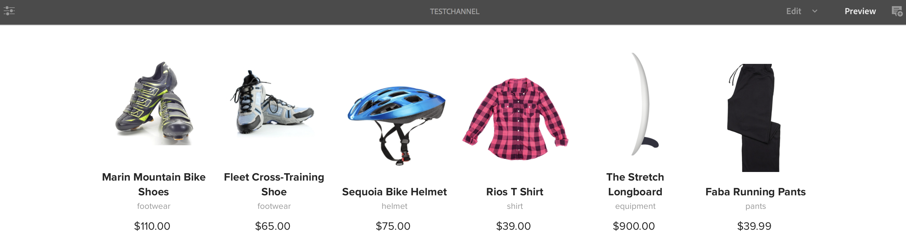
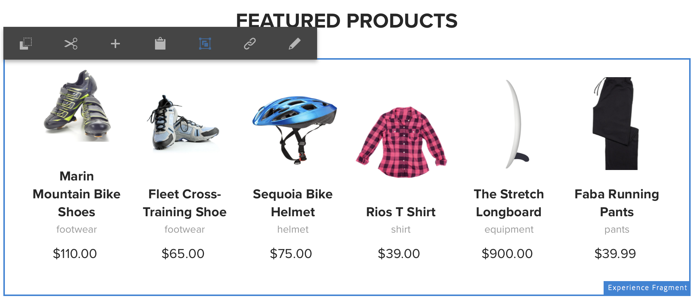

# Uso de Fragmentos de experiência{#using-experience-fragments}

O uso de fragmentos de experiência abrange os seguintes tópicos:

* **Visão geral**
* **Usando Fragmentos de experiência no AEM Screens**
* **Propagando alterações da página mestre**

## Visão geral {#overview}

Um ***Fragmento de experiência*** é um grupo de um ou mais componentes, incluindo o conteúdo e o layout que podem ser referenciados nas páginas. Fragmentos de experiência podem conter qualquer componente, como um ou vários componentes que podem conter qualquer elemento dentro de um sistema de parágrafos, que será referenciado na experiência completa ou solicitado por um terceiro terminal.

## Usando Fragmentos de experiência no AEM Screens {#using-experience-fragments-in-aem-screens}

>[!NOTE]
>
>O exemplo a seguir usa **We.Retail** como um projeto de demonstração de onde o Fragmento de experiência é aproveitado de uma página **Sites** para um projeto do AEM Screens.

Como exemplo, o fluxo de trabalho a seguir demonstra o uso de fragmentos de experiência de We.Retail em Sites. Você pode escolher uma página da Web e aproveitar esse conteúdo no canal do AEM Screens em um de seus projetos.

### Pré-requisitos {#pre-requisites}

**Criação de um projeto de demonstração com um canal**

***Criação de um projeto***

1. Click Screens and select **Create** --> **Create Project **to create a new project.

1. Selecione **Screens **no **Create Screens Project **assistente.

1. Insira o Título como **DemoProject**.
1. Clique em **Criar**.

Um **DemoProject** será adicionado às telas do AEM.  ***Criação de um canal***

1. Navigate to the **DemoProject** you created and select the **Channels** folder.

1. Click **Create** from the action bar (see the figure below). Um assistente será aberto.
1. Choose the **Sequence Channel** and click **Next**.

1. Enter the **Title** as **TestChannel** and click **Create**.

Um **TestChannel** será adicionado ao seu **DemoProject**.\

>[!NOTE]
>
>Para saber mais detalhes sobre como criar um projeto e um canal, consulte [Criação de um projeto](creating-a-screens-project.md) e [Gerenciamento de canais](managing-channels.md) , respectivamente.

### Criação de um fragmento de experiência {#creating-an-experience-fragment}

Siga as etapas abaixo para aproveitar o conteúdo de **We.Retail** até seu **TestChannel** no **DemoProject**.

1. **Navegue até a página Sites em We.Retail**

   1. Navegue até Sites e selecione **We.Retail **->** Estados Unidos **->**Inglês ** **e selecione a página** Equipamentopara usá-lo como um fragmento de experiência para seu canal de Telas.
   1. Clique em **Editar** na barra de ações para abrir a página que deseja usar como um fragmento de experiência para o seu canal do Screens.
   

1. **Reutilizar o conteúdo**

   1. Selecione o fragmento que deseja incluir no canal.
   1. Clique no último ícone à direita para abrir a caixa de diálogo **Converter em fragmento** de experiência.
   

1. **Criar fragmento de experiência**

   1. Escolha a **Ação** como **Criar um novo fragmento** de experiência.
   1. Selecione o caminho **** Pai.
   1. Select the **Template**. Escolha o modelo **We.Retail** aqui.
   1. Enter the **Fragment Title **as **ScreensFragment**.
   1. Clique na marca de seleção para concluir a criação de um novo fragmento de experiência.
   

1. **Criar Live Copy do fragmento de experiência**

   1. Navegue até a página inicial do AEM.
   1. Selecione Fragmentos **de** experiência e destaque o Fragmento de **tela** e clique em **Variação como live-Copy**, como mostrado na figura abaixo:
   

   c. Selecione o** ScreensFragment **do assistente Create Live Copy** e clique em** Next (Avançar) ****.

   d. Insira o **Título** e o **Nome** como **Telas**.

   e. Clique em **Criar** para criar a Live Copy.

   

1. **Uso do fragmento de experiência no canal de telas**

   1. Navegue até o canal Telas no qual deseja usar o fragmento **Telas** .
   1. Selecione **TestChannel** e clique em **Editar** na barra.
   1. Clique no ícone de componentes na guia lateral.
   1. Arraste e solte a Página **** Incorporada em seu canal.
   

   e. Selecione o componente Página **** incorporada e selecione o ícone superior esquerdo (chave) para abrir a caixa de diálogo **Página** .

   f. Selecione a cópia ativa **Telas** do fragmento criado na *Etapa 3* do campo **Caminho **Caminho.

   

   h. Digite os segundos no campo ** Duração**.

   
i. Clique na marca de seleção para concluir o processo.

   

### Validação do resultado {#validating-the-result}

Após a conclusão das etapas anteriores, você pode validar o fragmento da experiência no **TestChannel** :

1. Navegação até o **TestChannel**.
1. Selecionando a opção **Visualizar** na barra de ações.

Você visualizará o conteúdo da página **Sites** (live-copy do fragmento da experiência) no seu canal, como mostrado na figura abaixo:\

## Propagando alterações da página mestre {#propagating-changes-from-the-master-page}

***A Live Copy*** se refere à cópia (da origem), mantida pelas ações de sincronização, conforme definido pelas configurações de implantação.

Como o Fragmento de experiência, nós criamos uma cópia ao vivo das páginas **Sites** , portanto, se você fizer alterações nesse fragmento específico a partir da página mestre, visualizará as alterações no seu canal ou no destino onde você usou o Fragmento de experiência.

>[!NOTE]
>
>Para obter mais informações sobre o Live Copy, consulte [Reutilizando conteúdo: Gerenciador de vários sites e Live Copy](/help/sites-administering/msm.md).

Siga as etapas abaixo para propagar as alterações do canal mestre para o canal de destino:

1. Selecione o Fragmento de experiência na página **Sites** (Mestre) e clique no ícone de lápis para editar os itens no Fragmento de experiência.

   

1. Selecione o Fragmento de experiência e clique no ícone de chave para abrir a caixa de diálogo para editar as imagens.

   

1. A caixa de diálogo Grade **do** produto é aberta.

   

1. É possível editar qualquer uma das imagens. Por exemplo, aqui a primeira imagem é substituída nesse fragmento.

   

1. Selecione o Fragmento de experiência e clique no ícone de Rollout para propagar as alterações no fragmento que é usado em seu canal.

   

1. Clique em Rollout para confirmar as alterações.

   Você verá que as alterações foram distribuídas.

   

### Validando as alterações {#validating-the-changes}

Siga as etapas abaixo para confirmar as alterações em seu canal:

1. Navegue até **Screens** -> **Channels** -> **TestChannel**.

1. Clique em **Visualizar** na barra de ações para confirmar as alterações.

A imagem a seguir ilustra as alterações em seu **TestChannel**:\

