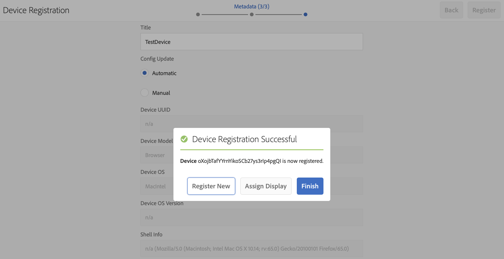

# Guia de Início Rápido{#kickstart-guide}

Esta seção é um início rápido para o AEM Screens e mostra como realizar ações básicas. Ele o orienta a configurar uma experiência básica de sinalização digital com conteúdo/ativos e publicação em um player do Screens. Para obter uma compreensão profunda de todos os componentes para o desenvolvimento do Screens, consulte os recursos no final da página.

## Criação de uma experiência de sinalização digital em 5 minutos {#creating-a-digital-signage-experience-in-minutes}

As etapas a seguir permitem que você crie um projeto de amostra para o Screens e publique conteúdo no Screens player.

1. Para baixar o **AEM Screens Player**, clique [aqui](https://download.macromedia.com/screens/).

   O AEM Screens também está disponível no **Google Play**.

   Para obter mais informações sobre a implementação do Chrome OS Player, consulte Console [de gerenciamento do](implementing-chrome-os-player.md) Chrome.

   Consulte [Instalação e configuração de telas](configuring-screens-introduction.md) para obter mais detalhes.

   >[!NOTE]
   >
   >**Configurações de OSGI**
   >
   >É necessário ativar o referenciador vazio para permitir que o dispositivo publique dados no servidor. Por exemplo, se a propriedade de referenciador vazia estiver desativada, o dispositivo não poderá postar uma captura de tela novamente. Atualmente, alguns desses recursos só estão disponíveis se o Filtro de referência Apache Sling Permitir vazio estiver ativado na configuração OSGI. O painel pode exibir um aviso de que as configurações de segurança podem impedir que alguns desses recursos funcionem.
   >
   >Siga as etapas abaixo para ativar o Filtro de referência do ***Apache Sling Permitir vazio***:
   >
   >1. Navegue até Configuração [do console da Web do](http://localhost:4502/system/console/configMgr/org.apache.sling.security.impl.ReferrerFilter)Adobe Experience Manager.
   >1. Verifique a opção **allow.empty** .
   >1. Clique em **Salvar**.
   >    
   >Para saber mais sobre as etapas anteriores em detalhes, consulte a seção ***Pré-requisitos*** em [Configuração e implantação de telas](configuring-screens-introduction.md)AEM.

1. **Criação de um novo projeto**

   1. Selecione o link do Adobe Experience Manager (parte superior esquerda) e o **Screens**. Alternatively, you can go directly to: [http://localhost:4502/screens.html/content/screens](http://localhost:4502/screens.html/content/screens).
   1. Clique em **Criar** para criar um novo projeto do Screens (consulte a figura abaixo).
   1. Select **Screens** from the **Create Screens Project** wizard and click **Next**.
   1. Enter the title as **Test_Project** and click **Create**.
   

   Depois que o projeto é criado, ele retorna ao console do Screens Project. Agora, você pode selecionar seu projeto. Em um projeto, existem cinco tipos de pastas, **Programações**, **Locais**, **Aplicativos**, **Dispositivos** e **Canais**, como mostrado na figura abaixo.

   >[!NOTE]
   >
   >Os agendamentos só estarão disponíveis se você tiver instalado o AEM 6.3 Sites Feature Pack 1. Para obter acesso a esse Feature Pack, você deve entrar em contato com o Suporte da Adobe e solicitar acesso. Com as devidas permissões, você pode baixá-lo em Compartilhamento de pacotes.

   

   Consulte [Criar e gerenciar projetos](creating-a-screens-project.md) de telas para obter mais detalhes.

1. **Criação de um novo canal**

   Depois que o projeto estiver em andamento, será necessário criar um novo canal no qual você gerencia o conteúdo.

   Siga as etapas abaixo para criar um novo canal para seu projeto:

   1. Navigate to the **Test_Project** you created and select the **Channels** folder.
   1. Click **Create** from the action bar (see the figure below). Um assistente será aberto.
   1. Choose the **Sequence Channel** and click **Next**.
   1. Enter the **Name** and **Title** as **TestChannel** and click **Create**.
   

   O *TestChannel* é criado e adicionado à sua pasta de canais, como mostrado na figura abaixo.

   

   Consulte Gerenciamento [de](managing-channels.md) canal para obter mais detalhes sobre como criar e gerenciar canais.

1. **Adicionar conteúdo a um canal**

   Depois que o canal estiver no lugar, você precisará adicionar conteúdo ao seu canal que o AEM Screens player exibirá.

   Siga as etapas abaixo para adicionar conteúdo ao canal (*TestChannel*) em seu projeto:

   1. Navigate to the *Test_Project* you created and select the **Channels** folder.
   1. Click **Edit** from the action bar (see the figure below). The editor for the *TestChannel* opens.
   1. Clique no ícone que alterna o painel lateral no lado esquerdo da barra de ações para abrir os ativos e componentes.
   1. Arraste e solte os componentes que você deseja adicionar ao seu canal.
   

   Neste exemplo, o editor mostra uma imagem adicionada ao canal.

   

1. **Criação de uma nova localização**

   Depois de colocar o canal no lugar, é necessário criar o local.

   ***Os locais*** compartimentalizam suas várias experiências de sinalização digital e contêm as configurações dos monitores de acordo com onde estão as várias telas.

   Siga as etapas abaixo para criar um novo local para seu projeto:

   1. Navigate to the *Test_Project* you created and select the **Locations** folder.
   1. Clique em **Criar** ao lado do ícone de adição na barra de ação (consulte a figura abaixo). Um assistente será aberto.
   1. Select **Location** from the wizard and click **Next**.
   1. Enter the **Name** and **Title** for your location (enter the title as *TestLocation*) and click **Create**.
   

   O *TestLocation* é criado e adicionado à pasta **Locais** .

   

1. **Criação de uma nova exibição para *TestLocation ***

   Depois de criar um local, é necessário criar uma nova exibição para o seu local.

   ***As telas*** representam a experiência digital executada em uma ou várias telas.

   1. Navegue até o local onde deseja criar sua exibição (*Test_* Project —> **Locais** —> *TestLocation)* , conforme mostrado na figura acima, e selecione *TestLocation*.
   1. Clique em** Criar **na barra de ações.
   1. Select **Display** from the **Create** wizard and click **Next**.
   1. Enter **Title** for your display location (enter the title as *TestDisplay*).
   1. Clique em **Criar**.
   Uma nova tela *TestDisplay* é adicionada à sua localização *TestLocation*, como mostrado na figura abaixo.

   

1. **Adicionando um agendamento**

   No AEM Screens, o recurso *Agendamentos* permite organizar canais em grupos reutilizáveis, para que você não precise repetir a atribuição individualmente para cada exibição na qual deseja mostrar seu conteúdo.

   >[!NOTE]
   >
   >Essa funcionalidade do Screens só estará disponível se você tiver instalado o AEM 6.3 Sites Feature Pack 1 ou superior. Para obter acesso a esse Feature Pack, você deve entrar em contato com o Suporte da Adobe e solicitar acesso. Com as devidas permissões, você pode baixá-lo em Compartilhamento de pacotes.

   1. Navegue até a pasta **Programações** de Test_Project —> **Programações**.
   1. Clique em** Criar **na barra de ações. Um assistente será aberto.
   1. Selecione **Agendar** na página do assistente **Criar** .
   1. Informe o **Título** como *MorningSchedule* na página de propriedades.
   1. Clique em **Criar** e o agendamento será adicionado à pasta **Programações** , como mostrado na figura abaixo.
   

   Além disso, selecione o agendamento (*MorningSchedule*) e clique em **Dashboard** na barra de ação para exibir o painel de agendamentos. Você pode exibir/alterar as propriedades da programação, atribuir canais e exibir exibições atribuídas usando o painel.

   

   Consulte [Criar e gerenciar programações](managing-schedules.md) para obter informações detalhadas sobre programações.

1. **Atribuição de um canal**

   1. Navigate to the display from *Test_Project* --> **Locations** --> *TestLocation* --> *TestDisplay*.
   1. Select *TestDisplay* and tap/click **Assign Channel **from the action bar, *Or*,
   1. Click **Dashboard** and select **+Assign Channel** at the top right from **ASSIGNED CHANNELS &amp; SCHEDULES** panel, as shown in the figure below. **A caixa de diálogo Atribuição** de canal é aberta.
   1. Select **Reference Channel** by **path**.
   1. Selecione o Caminho **do** canal (*Test_Project* —> *Canais* —> *TestChannel* ) no **canal**. A Função **de** canal será automaticamente preenchida com o nome do canal.
   1. Select the **Priority** for this channel as *1*.
   1. Choose the **Supported Events** as **Initial Load** and **Idle Screen**.
   1. Informe **Agendamento** e selecione as datas em **ativo** e **ativo até**. *(Você precisa preencher esses campos somente se quiser que o canal seja exibido por um intervalo de tempo específico.)*
   1. Clique em **Salvar**.
   O canal é atribuído e adicionado ao painel.

   

   Para saber mais sobre a caixa de diálogo Atribuição **de** canal e as propriedades associadas a ela, consulte Atribuição de [canal.](channel-assignment.md)

1. **Adicionar agendamento a um canal**

   1. Navigate to the display from *Test_Project* --> **Locations** --> *TestLocation* --> *TestDisplay*.
   1. Click **Dashboard** and select **+Assign Schedule** at the top right from **ASSIGNED CHANNELS &amp; SCHEDULES** panel, as shown in the figure above. **A caixa de diálogo Agendar atribuição** é aberta.
   1. Escolha o caminho onde você criou seu agendamento (aqui, *Test_Project* —> **Programações** —> *MorningSchedule*).
   1. Clique em **Salvar** para adicionar seu agendamento ao canal.
   

1. **Registrando um dispositivo**

   Você precisa registrar seu dispositivo usando o painel AEM.

   >[!NOTE]
   >
   >Você pode abrir o player do Screens usando o aplicativo AEM Screens que você baixou ou usando o navegador da Web.

   Para exibir o dispositivo pendente:

   1. Inicialize uma janela de navegador separada.
   1. Go to Screens player using the [web browser](http://localhost:4502/content/mobileapps/cq-screens-player/firmware.html) or launch the AEM Screens app. Ao abrir o dispositivo, você perceberá o estado do dispositivo como não registrado.
   1. From the AEM dashboard, navigate to *Test_Project* --> **Devices**
   1. Click **Device Manager** from the action bar.
   1. Clique em **Device Registration (Registro** do dispositivo) e você verá os dispositivos pendentes, conforme mostrado na figura abaixo.
   >[!NOTE]
   >
   >Se você estiver usando o AEM Screens Player como uma extensão do ChromeOS, consulte a consulta em ***Como instalar o ChromeOS player como Plug-in*** Chrome Browser na página Perguntas frequentes [do](aem-screens-faqs.md) AEM Screens.

   

   Select the device you want to register and click **Register Device**.

   

   Você precisará validar o código verificando-o no navegador da web ou no player do AEM Screens.

   Click **Validate** to navigate to **Device Registration** screen.

   

   Enter **Title** and click **Register** and the device will be registered.

   Clique em **Concluir** para concluir a etapa de registro do dispositivo.

   

   Clicar em **Concluir** retorna à página do dispositivo que exibe dispositivos não atribuídos e atribuídos.

   

   >[!NOTE]
   >
   >O dispositivo adicionado é exibido como **Não atribuído** em Status **atribuído** .

1. **Atribuindo o dispositivo à exibição**

   Depois de registrar o dispositivo, é necessário atribuí-lo a uma tela.

   Siga as etapas abaixo para atribuir um dispositivo:

   1. Selecione o dispositivo que deseja atribuir.
   1. Click **Assign Device** from the action bar.
   1. Select the display path for your channel as */content/screens/Test_Project/***Locations***/TestLocation/TestDisplay.*
   1. Click **Assign**.
   1. Click **Finish** to complete the process, and now the device is assigned.
   

   O painel de exibição é aberto e você verá todas as informações relacionadas aos canais e programações atribuídos, juntamente com os detalhes de configuração do dispositivo.

   

### Viewing the content in Screens Player {#viewing-the-content-in-screens-player}

Depois que você tiver adicionado as configurações acima, o player deverá mostrar automaticamente o canal padrão para a exibição em seu dispositivo, por exemplo, uma imagem (nesse cenário, um canal de sequência e o conteúdo estará visível no Screens Player para o navegador da Web).

Consulte [AEM Screens Player](working-with-screens-player.md)para obter informações mais detalhadas sobre o AEM Screens player.

### Additional Resources {#additional-resources}

Para obter uma compreensão profunda de todos os módulos para o Screens, consulte os recursos abaixo:

1. [Instalar e configurar telas](configuring-screens-introduction.md)
1. [Criar e gerenciar projetos de telas](creating-a-screens-project.md)
1. [Atribuir dispositivos](managing-devices.md)
1. [Criar e gerenciar canais](managing-channels.md)
1. [Criar e gerenciar locais](managing-locations.md)
1. [Criar e gerenciar exibições](managing-displays.md)
1. [Atribuir canais](channel-assignment.md)
1. [Gerenciar dispositivos](managing-devices.md)
1. [Criar e gerenciar programações](managing-schedules.md)
1. [Player do AEM Screens](working-with-screens-player.md)
1. [Solução de problemas do Device Control Center](monitoring-screens.md)

