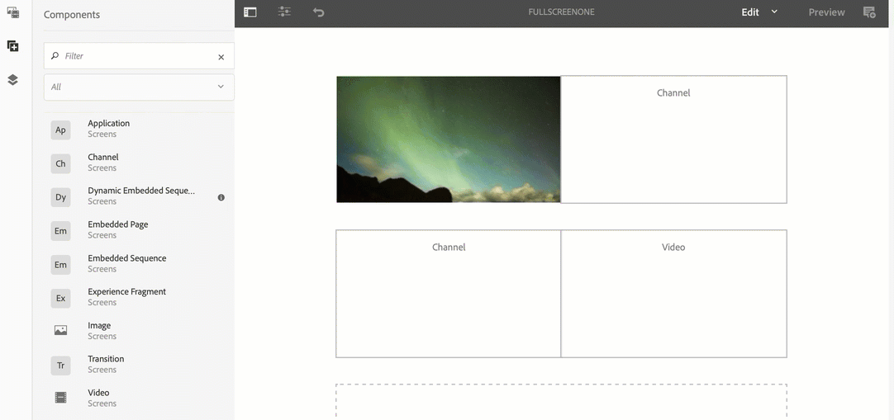

# Zona Única para Aquisição de Várias Zonas {#single-zoneto-multizone}

## Descrição do caso de uso {#use-case-description}

Esta seção descreve um exemplo de caso de uso que enfatiza como configurar um canal de layout de várias zonas que alterna com um canal de layout de zona única. Cada canal tem ativos de imagem/vídeo em sequência.

### Condições prévias {#preconditions}

Antes de iniciar este caso de uso, certifique-se de saber como:

* **[Criar e gerenciar canais](/help/screens/managing-channels.md)**
* **[Criar e gerenciar locais](/help/screens/managing-locations.md)**
* **[Criar e gerenciar programações](/help/screens/managing-schedules.md)**
* **[Registro do dispositivo](/help/screens/device-registration.md)**

### Principais intervenientes {#primary-actors}

Autores de conteúdo

## Configuração do projeto {#setting-up-the-project}

Siga as etapas abaixo para configurar um projeto:

1. Crie um projeto do AEM Screens chamado de **ZonesDemo**, conforme mostrado abaixo.

   >[!NOTE]
   >
   >Para saber mais sobre como criar e gerenciar projetos no AEM Screens, consulte [Criar um projeto](/help/screens/creating-a-screens-project.md).

   

1. **Criação de um canal de sequência com uma imagem**

   1. Selecione a pasta **Canais** e clique em **Criar** na barra de ações para abrir o assistente para criar um canal.
   1. Selecione Canal **de** sequência no assistente e crie o canal chamado **FullScreenOne**.

      
   1. Selecione o canal e clique em **Editar** na barra de ações para abrir o editor e arraste e solte uma imagem nesse canal, como mostrado abaixo.
      

1. **Criação de um canal 2X2 com quatro imagens**

   1. Selecione a pasta **Canais** e clique em **Criar** na barra de ações para abrir o assistente para criar um canal.

   1. Selecione o modelo Canal **de tela dividida** 2X2 no assistente e crie o canal chamado **TwobyTwoChannel**.

      
   1. Selecione o canal e clique em **Editar** na barra de ações para abrir o editor e arraste e solte quatro imagens (quatro zonas diferentes) nesse canal, como mostrado abaixo.
      

1. **Criação de um canal de tela dividida 1X2 com duas imagens**

   1. Selecione a pasta **Canais** e clique em **Criar** na barra de ações para abrir o assistente para criar um canal.

   1. Selecione o modelo **1X2 de Canal** de Tela Dividida do assistente e crie o canal chamado **OneTwoChannel**.

      
   1. Selecione o canal e clique em **Editar** na barra de ações para abrir o editor e arraste e solte duas imagens (duas zonas diferentes) nesse canal, como mostrado abaixo.
      

1. **Criação de um canal com um vídeo em tela cheia**

   1. Selecione a pasta **Canais** e clique em **Criar** na barra de ações para abrir o assistente para criar um canal.

   1. Selecione o modelo de Canal **de** sequência no assistente e crie o canal chamado **FullScreensVideo**.

      
   1. Selecione o canal e clique em **Editar** na barra de ações para abrir o editor, arrastar e soltar o componente de vídeo nesse canal e adicionar o vídeo desejado, como mostrado abaixo.
      

## Configurando o canal de tomada para transição de uma única zona para outra {#takeover-channel-setup}

1. **Edição do canal de zona única para aquisição de várias zonas**

   1. Selecione o canal (**FullScreenOne)** criado na etapa 1.
   1. Clique em **Editar** na barra de ações para abrir o editor. Arraste e solte dois componentes de canal e um componente de vídeo no editor.
   

1. **Preenchimento dos componentes adicionados ao canal FullScreenOne**

   1. Selecione o primeiro componente de canal do editor do **FullScreenOne** e clique em **Configurar** para apontar para o canal criado nas etapas anteriores. Adicione o caminho ao canal no Caminho **do** canal para os componentes do canal e arraste e solte o vídeo no componente de vídeo, como mostrado abaixo.
   

1. **Configurar a duração do tempo para os canais durante a transição**

   >[!NOTE]
   >
   >Por padrão, os ativos farão a transição a cada 8 segundos, mas se você quiser que os ativos façam a transição após uma duração específica, siga a etapa abaixo.

   1. Selecione o segundo componente de canal no editor do **FullScreenOne** e clique em **Configurações** para configurar a duração do tempo para este canal. Da mesma forma, configure a duração do tempo para o canal dois, conforme mostrado abaixo.
Neste exemplo, o tempo é definido como 3 segundos.
   

## Visualização do resultado {#previewing-result}

Você pode clicar em **Visualizar** no editor e verificar como os ativos serão transferidos de uma única zona para outra.

