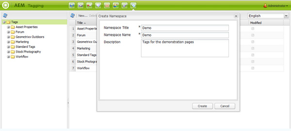

# Console de marcação da interface clássica{#classic-ui-tagging-console}

>[!CAUTION]
>
>AEM 6.4 chegou ao fim do suporte estendido e esta documentação não é mais atualizada. Para obter mais detalhes, consulte nossa [períodos de assistência técnica](https://helpx.adobe.com/br/support/programs/eol-matrix.html). Encontre as versões compatíveis [here](https://experienceleague.adobe.com/docs/).

Esta seção é para o Console de marcação da interface clássica.

O console de Marcação da interface otimizada para toque é [here](/help/sites-administering/tags.md#tagging-console).

Para acessar o console Marcação da interface clássica :

* sobre o autor
* fazer logon com privilégios administrativos
* navegue até o console

   por exemplo, [http://localhost:4502/tagging](http://localhost:4502/tagging)

## Criação de tags e namespaces {#creating-tags-and-namespaces}

1. Dependendo do nível a partir do qual você está começando, é possível criar uma tag ou um namespace usando **Novo**:

   Se você selecionar **Tags** você pode criar um namespace:

   

   Se você selecionar um namespace (por exemplo, **Demonstração**) você pode criar uma tag dentro desse namespace:

   

1. Em ambos os casos, insira

   * **Título**
(
*Obrigatório*) O título de exibição da tag. Enquanto qualquer caractere pode ser inserido,

      é recomendável não usar esses caracteres especiais :

      * `colon (:)` - delimitador de namespace
      * `forward slash (/)` - delimitador de subtags

      Esses caracteres não serão exibidos se forem inseridos.

   * **Nome**

      (*Obrigatório*) O nome do nó da tag.

   * **Descrição**

      (*Opcional*) Uma descrição da tag.

   * select **Criar**

## Edição de tags {#editing-tags}

1. No painel direito, selecione a tag que deseja editar.
1. Clique em **Editar**.
1. Você pode modificar o **Título** e **Descrição**.
1. Clique em **Salvar** para fechar a caixa de diálogo.

## Exclusão de tags {#deleting-tags}

1. No painel direito, selecione a tag que deseja excluir.
1. Clique em **Excluir**.
1. Clique em **Sim** para fechar a caixa de diálogo.

   A tag não deve mais ser listada.

## Ativação e desativação de tags {#activating-and-deactivating-tags}

1. No painel direito, selecione o namespace ou tag que deseja ativar (publicar) ou desativar (cancelar publicação).
1. Clique em **Ativar** ou **Desativar** conforme necessário.

## Lista - mostrar onde as tags são referenciadas {#list-showing-where-tags-are-referenced}

**Lista** abre uma nova janela mostrando os caminhos de todas as páginas usando a tag realçada:

## Mover tags {#moving-tags}

Para ajudar os administradores de tags e desenvolvedores a limpar a taxonomia ou renomear uma ID de tag, é possível mover uma tag para um novo local :

1. Abra o **Marcação** console.
1. Selecione a tag e clique em **Mover...** na barra de ferramentas superior (ou no menu de contexto).
1. No **Mover tag** , defina:

   * **para**, o nó de destino.
   * **Renomear para**, o novo nome do nó.

1. Clique em **Mover**.

O **Mover tag** Essa caixa de diálogo tem a seguinte aparência:

>[!NOTE]
>
>Os autores não devem mover tags ou renomear uma ID de tag. Quando necessário, os Autores deverão apenas [alterar os títulos das tags](#editing-tags).

## Mesclar tags {#merging-tags}

A mesclagem de tags pode ser usada quando uma taxonomia tem duplicatas. Quando a tag A é unida na tag B, todas as páginas marcadas com a tag A serão marcadas com a tag B e a tag A não estará mais disponível para os autores.

Para mesclar uma tag em outra:

1. Abra o **Marcação** console.
1. Selecione a tag e clique em **Mesclar...** na barra de ferramentas superior (ou no menu de contexto).
1. No **Mesclar Tag** , defina:

   * **em**, o nó de destino.

1. Clique em **Mesclar**.

O **Mesclar Tag** Essa caixa de diálogo tem a seguinte aparência:

## Uso de contagem de tags {#counting-usage-of-tags}

Para ver quantas vezes uma tag está sendo usada:

1. Abra o **Marcação** console.
1. Clique em **Uso de contagem** na barra de ferramentas superior: a coluna Contagem exibe o resultado.

## Gerenciamento de tags em diferentes idiomas {#managing-tags-in-different-languages}

O `title`a propriedade de uma tag pode ser traduzida para vários idiomas. Tag `titles` pode ser exibido de acordo com o idioma do usuário ou com o idioma da página.

### Definição de títulos de tag em vários idiomas {#defining-tag-titles-in-multiple-languages}

O procedimento a seguir mostra como traduzir a variável `title`da tag **Animais** em inglês, alemão e francês:

1. Vá para o **Marcação** console.
1. Editar a tag **Animais** below **Tags** > **Fotografia de bancos de dados**.
1. Adicione as traduções nos seguintes idiomas:

   * **Inglês**: Animais
   * **Alemão**: Tiere
   * **Francês**: Animaux

1. Salve as alterações.

A caixa de diálogo tem a seguinte aparência:

O console Marcação usa a configuração do idioma do usuário, portanto, para a tag Animal, &quot;Animaux&quot; é exibido para um usuário que define o idioma como francês nas propriedades do usuário.

Para adicionar um novo idioma à caixa de diálogo, consulte a seção [Adicionar um novo idioma à caixa de diálogo Editar tag](/help/sites-developing/building.md#adding-a-new-language-to-the-edit-tag-dialog) no **Marcação para desenvolvedores** seção.

### Exibição dos títulos de tag nas propriedades da página em um idioma especificado {#displaying-tag-titles-in-page-properties-in-a-specified-language}

Por padrão, a tag `titles`nas propriedades da página são exibidas no idioma da página. A caixa de diálogo da tag nas propriedades da página tem um campo de idioma que permite a exibição da tag `titles`em um idioma diferente. O procedimento a seguir descreve como exibir a tag `titles`em francês:

1. Consulte a seção anterior para adicionar a tradução em francês ao **Animais** below **Tags** > **Fotografia de bancos de dados**.
1. Abra as propriedades da página do **Produtos** na ramificação inglesa do **Geometrixx** site.
1. Abra o **Tags/Palavras-chave** (selecionando o menu suspenso à direita da área de exibição Tags/Palavras-chave) e selecione o **Francês** no menu suspenso, no canto inferior direito.
1. Role usando as setas para a esquerda e para a direita até selecionar a variável **Fotografia de bancos de dados** guia

   Selecione o **Animais** (**Animaux**) e selecione fora da caixa de diálogo para fechá-la e adicionar a tag às propriedades da página.

   

Por padrão, a caixa de diálogo Propriedades da página exibe a tag `titles`de acordo com o idioma da página.

Em geral, o idioma da tag é retirado do idioma da página se o idioma estiver disponível. Quando a variável [widget de tags](/help/sites-developing/building.md#tagging-on-the-client-side) é usada em outros casos (por exemplo, em formulários ou em caixas de diálogo), o idioma da tag depende do contexto.

>[!NOTE]
>
>A nuvem de tags e as meta palavras-chave no componente de página padrão usam a tag localizada `titles`com base no idioma da página, se disponível.
