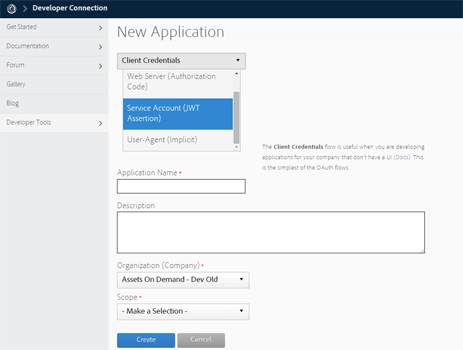
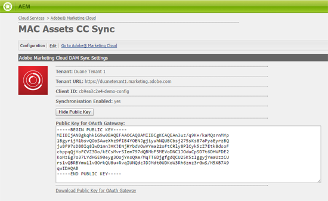

# Configurar a integração do AEM Assets com Experience Cloud e Creative Cloud {#configure-aem-assets-integration-with-experience-cloud-and-creative-cloud}

Se você for um cliente da Adobe Experience Cloud, poderá sincronizar seus ativos dentro do Adobe Experience Manager (AEM) Assets com a Adobe Creative Cloud e vice-versa. Você também pode sincronizar seus ativos com Experience Cloud e vice-versa. É possível configurar essa sincronização por meio de E/S de Adobe.

O fluxo de trabalho para configurar essa integração é:

1. Crie uma autenticação em E/S de Adobe usando um gateway público e obtenha um ID da aplicação.
1. Crie um perfil em sua instância do AEM Assets usando a ID do aplicativo.
1. Use essa configuração para sincronizar seus ativos no AEM Assets com o Creative Cloud.

No backend, o servidor AEM autentica seu perfil com o gateway e sincroniza os dados entre o AEM Assets e o Experience Cloud.

>[!NOTE]
>
>O recurso de compartilhamento de pastas AEM para o Adobe Creative Cloud está obsoleto. Saiba mais e encontre um método melhor nas práticas [recomendadas de integração de](../assets/aem-cc-integration-best-practices.md)AEM e Creative Cloud. A configuração de AEM para replicação de Marketing Cloud e troca de ativos entre a AEM Assets e o Marketing Cloud não está obsoleta.

Fluxo de dados quando o AEM Assets e o Creative Cloud são integrados

>[!NOTE]
>
>O compartilhamento de ativos entre a Adobe Experience Cloud e a Adobe Creative Cloud requer privilégios de administrador na instância AEM.

>[!CAUTION]
>
>A Adobe Marketing Cloud foi reclassificada como Adobe Experience Cloud. Os procedimentos abaixo ainda mencionam o Marketing Cloud para refletir a interface atual.

## Criar um aplicativo {#create-an-application}

1. Acesse a interface de gateway do Desenvolvedor do Adobe fazendo logon em [https://legacy-oauth.cloud.adobe.io](https://legacy-oauth.cloud.adobe.io/).

   >[!NOTE]
   >
   >Você precisa de privilégios de administrador para criar um ID da aplicação.

1. No painel esquerdo, navegue até **[!UICONTROL Developer Tools]** > **[!UICONTROL Applications]** (Ferramentas do desenvolvedor > Aplicativos) para visualização de uma lista de aplicativos.
1. Clique em **[!UICONTROL Adicionar]**  para criar um aplicativo.
1. Na lista Credenciais **[!UICONTROL do]** cliente, selecione Conta **[!UICONTROL de serviço (asserção JWT)]**, que é um serviço de comunicação servidor a servidor para autenticação do servidor.

   

1. Especifique um nome para o aplicativo e uma descrição opcional.
1. Na lista **[!UICONTROL Organização]** , selecione a organização para a qual deseja sincronizar ativos.
1. Na lista **[!UICONTROL Escopo]** , selecione **[!UICONTROL dam-read]**, **[!UICONTROL dam-sync]**, **[!UICONTROL dam-write]** e **[!UICONTROL cc-share]**.
1. Clique em **[!UICONTROL Criar]**. Uma mensagem notifica que o aplicativo é criado.

   

1. Copie o **[!UICONTROL ID da aplicação]** gerado para o novo aplicativo.

   >[!CAUTION]
   >
   >Certifique-se de não copiar inadvertidamente a **[!UICONTROL Senha da aplicação]** em vez da **[!UICONTROL ID da aplicação]**.

## Adicionar uma nova configuração ao Marketing Cloud {#add-a-new-configuration-to-marketing-cloud}

1. Clique no logotipo AEM na interface do usuário da sua instância local do AEM Assets e navegue até **[!UICONTROL Ferramentas]** > **[!UICONTROL Cloud Services]** > Cloud Services **** herdados.

1. Localize o serviço **[!UICONTROL Adobe Marketing Cloud]** . Se nenhuma configuração existir, clique em **[!UICONTROL Configurar agora]**. Se houver configurações, clique em **[!UICONTROL Mostrar configurações]** e clique em **[!UICONTROL [+]]** para adicionar uma nova configuração.

   >[!NOTE]
   >
   >Use uma conta da Adobe ID que tenha privilégios de administrador para a organização.

1. Na caixa de diálogo **[!UICONTROL Criar configuração]** , especifique um título e nome para a nova configuração e clique em **[!UICONTROL Criar]**.

   

1. No campo URL **[!UICONTROL do]** locatário, especifique o URL do AEM Assets.

   >[!CAUTION]
   >
   >Devido à reformulação da marca, se você inseriu o URL do locatário como **https://&lt;locatário_id>.marketing.adobe.com** , é necessário alterá-lo para **https://&lt;locatário_id>.experience.ecloud.adobe.com.** Para fazer isso, siga as etapas abaixo:
   1. Navegue até **Ferramentas > Serviços da nuvem > Serviços da nuvem herdados**.
   1. Em Adobe Marketing Cloud, clique em **Mostrar configurações**.
   1. Selecione a configuração que foi criada ao configurar a sincronização AEM-MAC-CC.
   1. Edite a configuração do serviço de nuvem e substitua **marketing.adobe.com** no campo URL do locatário por **experience.adobe.com**.
   1. Salve a configuração.
   1. Teste os agentes de replicação mac-sync.

1. No campo ID **[!UICONTROL do]** cliente, cole o ID da aplicação copiado ao final do procedimento [Crie um aplicativo](/help/sites-administering/configure-assets-cc-integration.md#create-an-application).

   

1. Em **[!UICONTROL Sincronização]** , selecione **[!UICONTROL Ativado]** para ativar a sincronização e clique em **[!UICONTROL OK]**.

   >[!NOTE]
   Se você selecionar **desativado**, a sincronização funcionará em uma única direção.

1. Na página de configuração, clique em **[!UICONTROL Exibir chave]** pública para exibir a chave pública gerada para sua instância. Como alternativa, clique em **[!UICONTROL Baixar chave pública para o gateway]** OAuth para baixar o arquivo que contém a chave pública. Em seguida, abra o arquivo para exibir a chave pública.

## Ativar sincronização {#enable-synchronization}

1. Exiba a chave pública usando um dos métodos a seguir mencionados na última etapa do procedimento [Adicione uma nova configuração ao Marketing Cloud](/help/sites-administering/configure-assets-cc-integration.md#add-a-new-configuration-to-marketing-cloud). Click **[!UICONTROL Display Public Key]**.

   

1. Copie a chave pública e cole-a no campo Chave **** pública da interface de configuração do aplicativo criado em [Criar um aplicativo](/help/sites-administering/configure-assets-cc-integration.md#create-an-application).

   

1. Click **[!UICONTROL Update]**. Sincronize agora seus ativos com a instância do AEM Assets.

## Testar a sincronização {#test-the-synchronization}

1. Clique no logotipo AEM na interface de usuário da sua instância local do AEM Assets e navegue até **[!UICONTROL Ferramentas]**> **[!UICONTROL Implantação]**> **[!UICONTROL Replicação]**para localizar os perfis de replicação criados para sincronização.
1. Na página **[!UICONTROL Replicação]** , clique em **[!UICONTROL Agentes no autor]**.
1. Na lista de perfis, clique no perfil de replicação padrão de sua organização para abri-lo.
1. Na caixa de diálogo, clique em **[!UICONTROL Testar conexão]**.

   

1. Quando o restante da replicação for concluído, verifique se há uma mensagem de sucesso no final dos resultados do teste.

## Adicionar usuários ao Marketing Cloud {#add-users-to-marketing-cloud}

1. Faça logon no Marketing Cloud usando as credenciais de administrador.
1. Nos trilhos, vá para **[!UICONTROL Administração]**e clique/toque em **[!UICONTROL Iniciar o Painel]** Enterprise.
1. No trilho, clique em **[!UICONTROL Usuários]** para abrir a página Gerenciamento **[!UICONTROL de]** usuários.
1. Na barra de ferramentas, clique/toque em **Adicionar** .
1. Adicione um ou mais usuários aos quais você deseja fornecer a capacidade de compartilhar ativos com o Creative Cloud.

   >[!NOTE]
   Somente os usuários adicionados ao Marketing Cloud podem compartilhar ativos do AEM Assets para o Creative Cloud.

## Trocar ativos entre a AEM Assets e o Marketing Cloud {#exchange-assets-between-aem-assets-and-marketing-cloud}

1. Faça logon no AEM Assets.
1. No console Ativos, crie uma pasta e carregue alguns ativos nela. Por exemplo, crie uma pasta **mc-demo** e faça upload de um ativo para ela.
1. Selecione a pasta e clique em **Compartilhar** .
1. No menu, selecione **[!UICONTROL Adobe Marketing Cloud]** e clique em **[!UICONTROL Compartilhar]**. Uma mensagem notifica que a pasta é compartilhada com o Marketing Cloud.

   

   >[!NOTE]
   O compartilhamento de uma pasta Assets do tipo `sling:OrderedFolder`não é suportado no contexto do compartilhamento no Adobe Marketing Cloud. Se desejar compartilhar uma pasta, ao criá-la no AEM Assets, não selecione a opção **[!UICONTROL Solicitado]** .

1. Atualize a interface do usuário do AEM Assets. A pasta que você criou no console Ativos da instância local do AEM Assets é copiada para a interface do usuário do Marketing Cloud. O ativo que você carrega para a pasta no AEM Assets aparece na cópia da pasta no Marketing Cloud depois que é processada pelo servidor AEM.
1. Você também pode carregar um ativo na cópia replicada da pasta no Marketing Cloud. Depois de processado, o ativo é exibido na pasta compartilhada no AEM Assets.

## Trocar ativos entre AEM Assets e Creative Cloud {#exchange-assets-between-aem-assets-and-creative-cloud}

O AEM Assets permite que você compartilhe pastas que contêm ativos com usuários do Adobe Creative Cloud.

1. No console Ativos, selecione a pasta que deseja compartilhar com o Creative Cloud.
1. Na barra de ferramentas, clique em **[!UICONTROL Compartilhar]** .
1. Na lista, selecione a opção **[!UICONTROL Adobe Creative Cloud]** .

   >[!NOTE]
   As opções estão disponíveis para usuários com permissões de leitura na raiz. Os usuários devem ter a permissão necessária para acessar as informações do agente de replicação do Marketing Cloud.

1. Na página Compartilhamento **[!UICONTROL de]** Creative Cloud, adicione o usuário para compartilhar a pasta e escolha uma função para o usuário. Clique em **[!UICONTROL Salvar]** e em **[!UICONTROL OK]**.

1. Faça logon no Creative Cloud com as credenciais do usuário com o qual você compartilhou a pasta. A pasta compartilhada está disponível no Creative Cloud.

A sincronização do Marketing Cloud AEM Assets é projetada de forma que a instância do computador do usuário a partir da qual o ativo é carregado mantenha o direito de modificar o ativo. Somente essas alterações são propagadas para a outra instância.

Por exemplo, se um ativo for carregado de uma instância do AEM Assets (no local), as alterações no ativo dessa instância serão propagadas para a instância do Marketing Cloud. No entanto, as alterações feitas da instância do Marketing Cloud para o mesmo ativo não são propagadas para a instância AEM e vice-versa para o ativo carregado do Marketing Cloud.

>[!MORELIKETHIS]
* [Práticas recomendadas de integração de AEM e Creative Cloud](../assets/aem-cc-integration-best-practices.md)
* [Práticas recomendadas de compartilhamento de pasta de AEM para Creative Cloud](../assets/aem-cc-folder-sharing-best-practices.md)

