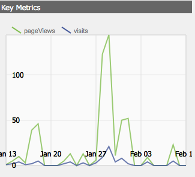

# Painéis{#dashboards}

Ao usar AEM você é capaz de gerenciar um monte de conteúdo de tipos diferentes (por exemplo, páginas, ativos). AEM Painéis oferecem uma maneira fácil de usar e personalizável de definir páginas que exibem dados consolidados.

>[!NOTE]
>
>AEM Painéis são criados por usuário, de modo que um usuário só pode acessar seus próprios painéis.
>
>
>No entanto, os modelos [de](#creating-a-dashboard-template) Painéis podem ser usados para compartilhar configurações comuns e layout de Painéis.


## Administração de Painéis {#administering-dashboards}

### Criação De Um Painel {#creating-a-dashboard}

Para criar um novo Painel, proceda da seguinte forma:

1. Na seção **Ferramentas** , clique em Console **de configuração**.

1. Na árvore, clique no **Painel** Duplo.

1. Clique em **Novo Painel**.

1. Digite o **Título** (por exemplo, Meu Painel) e o **Nome**.

1. Clique em **Criar**.

### Clonar Um Painel {#cloning-a-dashboard}

Você pode querer ter vários painéis para ver rapidamente informações sobre o seu conteúdo de diferentes visualizações. Para ajudá-lo a criar um novo Painel, AEM fornece um recurso de clone que pode ser usado para duplicado de um Painel existente. Para clonar um Painel, faça o seguinte:

1. Na seção **Ferramentas** , clique em Console **de configuração**.

1. Na árvore, clique em **Painel**.
1. Clique no painel que deseja clonar.

1. Clique em **Clonar**.

1. Digite o **Nome** do novo painel.

### Remoção De Um Painel {#removing-a-dashboard}

1. Na seção **Ferramentas** , clique em Console **de configuração**.

1. Na árvore, clique em **Painel**.
1. Clique no painel que deseja excluir.

1. Clique em **Remover**.

1. Click **Yes** to confirm.

## Componentes do Painel {#dashboard-components}

### Visão geral {#overview}

Os componentes do Painel não passam de componentes [comuns](/help/sites-developing/developing-components-samples.md)AEM. Esta seção descreve os componentes do relatórios fornecidos com AEM.

### Componentes do Relatórios do Web Analytics {#web-analytics-reporting-components}

AEM vem com um conjunto de componentes que renderizam várias métricas dos dados do seu [SiteCatalyst](/help/sites-administering/adobeanalytics.md) . Esses componentes estão listados no Sidekick na seção **Painel** .

Cada componente de relatórios fornece pelo menos três guias:

* **Básico**: contém a configuração principal.

* **Relatório:** contém a configuração específica de cada relatório.
* **Estilo**: contém uma configuração de estilo, como tamanho e margem do gráfico.

Os componentes do relatórios são inicializados com uma configuração padrão que ajuda a configurar rapidamente seu painel.

#### Basic configuration {#basic-configuration}

A guia **Básico** fornece acesso às seguintes entradas de configuração:

**Título** O título exibido no painel.

**Tipo** de solicitação A forma como os dados são solicitados.

**Configuração do SiteCatalyst (opcional)** A configuração que você deseja usar para se conectar ao SiteCatalyst. Se não fornecido, presume-se que a configuração está configurada na página do Painel (por meio das propriedades da página).

**ID do conjunto de relatórios (opcional)** O conjunto de relatórios do SiteCatalyst que você deseja usar para gerar o gráfico.

#### Configuração do relatório {#report-configuration}

Para exibir as estatísticas da Web, é necessário definir o intervalo de datas dos dados que deseja preencher. A guia **Relatório** fornece dois campos para definir esse intervalo.

>[!NOTE]
>
>Definir um intervalo de datas grande pode diminuir a capacidade de resposta do painel.

**Data de início** absoluto ou data relativa a partir da qual os dados são obtidos.

**Data até** Absoluto ou data relativa à qual os dados são obtidos.

Cada componente também define configurações específicas.

#### Relatório de horas extras {#overtime-report}



**Granularidade** Data Unidade de tempo do eixo X (por exemplo, dia, hora).

**Métricas** A lista de eventos que você deseja exibir.

**Elementos** A lista de elementos que detalha os dados das métricas no gráfico.

#### Relatório da lista classificada {#ranked-list-report}


**Elementos** O elemento que divide os dados das métricas no gráfico.

**Métricas** O evento que você deseja exibir.

**Não. dos itens** principais Número de itens exibidos pelo relatório.

#### Relatório classificado {#ranked-report}


**Métricas** O evento que você deseja exibir.

**Elementos** O elemento que divide os dados das métricas no gráfico.

#### Relatório principal da seção do site {#top-site-section-report}

Este componente exibe um gráfico que mostra a seção mais visitada de um site, de acordo com a seguinte configuração.


**Não. dos principais itens** Número da seção exibida no relatório.

#### Relatório de tendências {#trended-report}


**Granularidade** Data Unidade de tempo do eixo X (por exemplo, dia, hora).

**Métricas** O evento que você deseja exibir.

**Elementos** O elemento que divide os dados das métricas no gráfico.

## Extensão do Painel {#extending-dashboard}

### Visão geral {#overview-1}

Painéis são páginas normais ( `cq:Page`), portanto, qualquer componente pode ser usado para montar Painéis.

Há um grupo de componentes padrão `Dashboard` contendo componentes de relatórios de análise que são ativados no modelo por padrão.

### Creating A Dashboard Template {#creating-a-dashboard-template}

Um modelo define o conteúdo padrão de um novo Painel. Você pode usar vários modelos para criar diferentes tipos de painéis.

Os modelos de Painéis são criados como outros modelos de página, exceto pelo fato de serem armazenados em `/libs/cq/dashboards/templates/`. Consulte a seção [Criação de modelo](/help/sites-developing/website.md#creating-the-contentpage-template) de página de conteúdo.

>[!NOTE]
>
>Os modelos de Painéis são compartilhados entre usuários.

### Desenvolvimento de um componente de Painel {#developing-a-dashboard-component}

O desenvolvimento de um componente de Painel consiste na criação de um Componente AEM comum. Esta seção descreve um exemplo de um componente que exibe os 10 principais contribuidores.


Os principais componentes do autor são armazenados no repositório em `/apps/geometrixx-outdoors/components/reporting` e são compostos por:

1. um `jsp` arquivo que lê dados jcr e define o `html` espaço reservado.

1. uma biblioteca do lado do cliente que contém um `js` arquivo que busca e solicita os dados e, em seguida, preenche o `html` espaço reservado.


O arquivo Javascript a seguir é definido na Biblioteca `geout.reporting.topauthors` de [](/help/sites-developing/clientlibs.md) clientes como um filho do próprio componente.

O [QueryBuilder](/help/sites-developing/querybuilder-api.md) é usado para query do repositório para `cq:AuditEvent` nós de leitura. O resultado do query é um objeto JSON do qual as contribuições do autor são extraídas.

#### top_author.js {#top-authors-js}

```
$.ajax({
  url: "/bin/querybuilder.json",
  cache: false,
  data: {
       "orderby": "cq:time",
       "orderby.sort": "desc",
       "p.hits": "full",
       "p.limit": 100,
       "path": "/var/audit/com.day.cq.wcm.core.page/",
       "type": "cq:AuditEvent"
   },
  dataType: "json"     
}).done(function( res ) {
    var authors = {};
    // from JSON to Object
    for(var r in res.hits) {
        var userId = res.hits[r].userId;
        if(userId == undefined) {
            continue;
        }
        var auth = authors[userId] || {userId : userId};
        auth.contrib = (auth.contrib || 0) +1;
        
        authors[userId] = auth;
    }
    
    // order by contribution
    var orderedByContrib = [];
    for(var a in authors) {
        orderedByContrib.push(authors[a]);
    }
    orderedByContrib.sort(function(a,b){return b.contrib - a.contrib});
    
    // produce the list
    for (var i=0, tot=orderedByContrib.length; i < tot; i++) {
        var current = orderedByContrib[i];
        $("<div> #" + (i + 1) +" "+ current.userId + " (" + current.contrib +" contrib.)</div>").appendTo("#authors-list");

    }
});  
```

O `JSP` inclui tanto `global.jsp` quanto `clientlib`.

#### top_author.jsp {#top-authors-jsp}

```java
<%@page session="false" contentType="text/html; charset=utf-8" %><%
%><%
%><%@include file="/libs/foundation/global.jsp" %><%
%>
<ui:includeClientLib categories="geout.reporting.topauthors" />
<%
String reportletTitle = properties.get("title", "Top Authors");
%>
<html>
     <h3><%=xssAPI.encodeForHTML(reportletTitle) %></h3>
     <div id="authors-list"></div>
</html>
```

