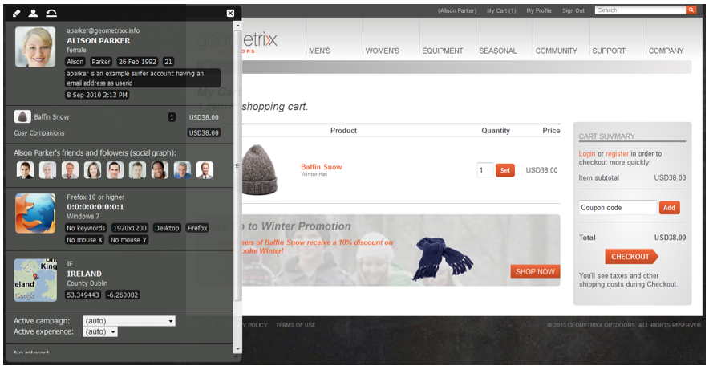

# eCommerce{#ecommerce}

* [Conceitos ](/help/sites-administering/concepts.md)
* [Administração (genérica)](/help/sites-administering/generic.md)
* [Commerce Cloud SAP](/help/sites-administering/sap-commerce-cloud.md)
* [Salesforce Commerce Cloud](https://github.com/adobe/commerce-salesforce)
* [Magento](https://www.adobe.io/apis/experiencecloud/commerce-integration-framework/integrations.html#!AdobeDocs/commerce-cif-documentation/master/integrations/02-AEM-Magento.md)

O Adobe fornece duas versões da Commerce Integration Framework:

|  | CIF no local | CIF Cloud |
|-------------------------|--------------------------------------------------------------------------------------------------------------------------------------------------------------------------------------------------------|------------------------------------------------------------------------------------------------------------------------|
| Versões compatíveis do AEM | AEM no local ou AMS 6.x | AEM AMS 6.4 e 6.5 |
| Back-end | - AEM, Java   - Integração monolítica, mapeamento pré-compilação (modelo)  - repositório JCR | - Magento  - Java e Javascript  - Nenhum dado de comércio armazenado no repositório JCR |
| Front-end | Páginas renderizadas do servidor AEM | Aplicativo de página mista (renderização híbrida) |
| Catálogo de produtos | - Importador de produtos, editor, cache em AEM  - Catálogos regulares com páginas AEM ou proxy | - Nenhuma importação de produto  - Modelos genéricos  - Dados sob demanda via conector |
| Escalabilidade | - Pode suportar até alguns milhões de produtos (depende do caso de uso)   - Cache no Dispatcher | - Sem limitação de volume  - Cache no Dispatcher ou CDN |
| Modelo de dados padronizado | Não | Sim, schema Magento GraphQL |
| Disponibilidade | Sim:  - SAP Commerce Cloud (Extensão atualizada para suportar AEM 6.4 e Hybris 5 (padrão) e mantém a compatibilidade com Hybris 4  - Salesforce Commerce Cloud (Conector de fonte aberta para suporte ao AEM 6.4) | Sim via código aberto via GitHub.   Magento Commerce (Suporta Magento 2.3.2 (padrão) e compatível com Magento 2.3.1). |
| Quando usar | Casos de utilização limitados: Para situações em que catálogos pequenos e estáticos podem precisar ser importados | Solução preferencial na maioria dos casos de uso |

O eCommerce, juntamente com o Gerenciamento de Informações do Produto (PIM), trata das atividades de um site focado na venda de produtos por meio de uma loja online:

* Criação, duração e obsolescência de um produto
* Gestão de preços
* Gerenciamento de transações
* Gerenciamento de catálogos inteiros
* Registros de armazenamentos ao vivo e centralizados
* Interfaces Web

AEM eCommerce ajuda os comerciantes a oferecerem experiências de compras personalizadas e com marca em pontos de contato da Web, móveis e sociais. O ambiente de criação de AEM permite personalizar páginas e componentes com base no contexto do visitante do público alvo e nas estratégias de comercialização; por exemplo:

* Páginas de produto
* Componentes do carrinho de compras
* Componentes de checkout

A implementação permite acesso em tempo real às informações do produto. Isso pode ser usado para impor:

* Integridade das informações do produto
* Preços
* Inventário de manutenção de existências
* Variações no estado de um carrinho de compras

>[!NOTE]
>
>Para usar a estrutura de integração com provedores externos de comércio eletrônico, primeiro é necessário instalar os pacotes necessários. Para obter mais informações, consulte [Implantação do eCommerce](/help/sites-deploying/ecommerce.md).
>
>Para obter informações sobre como estender os recursos de eCommerce, consulte [Desenvolvimento de eCommerce](/help/sites-developing/ecommerce.md).

## Principais recursos {#main-features}

AEM eCommerce fornece:

* Vários componentes **de AEM** prontos para uso para ilustrar o que pode ser feito para o seu projeto:

   * Exibição do produto
   * Carrinho de compras
   * Check-out
   * Produtos visualizados recentemente
   * Vouchers
   * e outros

   

   >[!NOTE]
   >
   >A estrutura de integração fornecida pela AEM também permite que você construa componentes AEM adicionais para recursos de comércio, independentemente do seu mecanismo específico de eCommerce.

* **Pesquisar** - usando:

   * a pesquisa AEM
   * a pesquisa do sistema de comércio eletrônico
   * uma pesquisa de terceiros (como o Search &amp; Promote)
   * ou uma combinação dos mesmos.

   

* Usa a capacidade AEM de **apresentar seu conteúdo em vários canais**, seja na janela completa do navegador ou no dispositivo móvel. Isso fornece o conteúdo no formato necessário aos seus visitantes.

   

* A capacidade de **desenvolver sua própria implementação de integração com base na[AEM estrutura](#the-framework)**de comércio eletrônico.

   As duas implementações atualmente disponíveis são ambas construídas na mesma base - além da API geral (a estrutura). A implementação de uma nova integração envolve apenas a implementação dos recursos de que sua integração precisa. Os componentes front-end podem ser usados por qualquer nova implementação, pois usam interfaces (portanto, são independentes da implementação).

* A possibilidade de desenvolver um comércio orientado por **experiências, com base em dados e atividades** do comprador. Isso permite que você realize vários cenários:

   * Um exemplo pode ser o de oferecer reduções nos custos de envio quando o pedido total exceder uma quantia específica.
   * Outra opção pode permitir que você forneça ofertas sazonais que usam dados do perfil (por exemplo, localização). Estes podem ser depois salientados, dependendo novamente de outros fatores, quando necessário.

   No exemplo abaixo, um teaser é mostrado, pois o conteúdo do carrinho é inferior a $75:

   

   Isso pode ser alterado quando o conteúdo do carrinho exceder $75:

   

* E outros recursos, incluindo:

   * Conteúdo do carrinho de compras retido nas sessões
   * Histórico completo do pedido
   * Atualização do catálogo expresso

## A estrutura {#the-framework}

A seção [Conceitos](/help/sites-administering/concepts.md) cobre a estrutura com mais detalhes, mas o seguinte fornece uma visualização de alto nível e alta velocidade da estrutura:

### O quê? {#what}

* A estrutura de integração fornece a API, uma variedade de componentes para ilustrar a funcionalidade e várias extensões para fornecer exemplos de métodos de conexão.
* O quadro fornece a estrutura básica necessária para a execução de um projeto.
* A estrutura é extensível.
* A estrutura não fornece um site pronto para uso e pronto para uso. É sempre necessário um certo trabalho de desenvolvimento para adaptar a estrutura às suas especificações.

### Por quê? {#why}

* Fornecer os mecanismos básicos necessários para realizar rapidamente um site personalizado de eCommerce.
* A Tp oferece a flexibilidade necessária para desenvolver um site real de comércio eletrônico.
* Ilustrar as práticas recomendadas.

