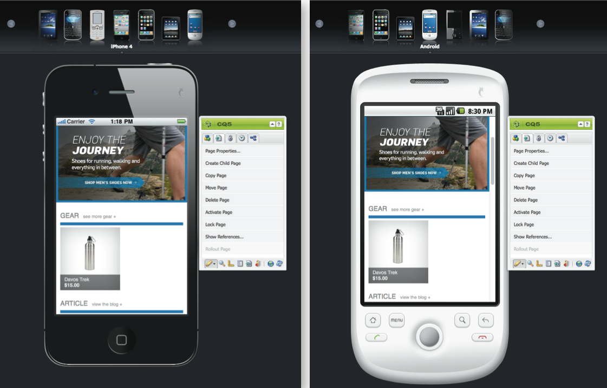

# eCommerce{#ecommerce}

* [Conceitos ](/help/sites-administering/concepts.md)
* [Administração (genérica)](/help/sites-administering/generic.md)
* [Commerce Cloud SAP](/help/sites-administering/sap-commerce-cloud.md)
* [Salesforce Commerce Cloud](https://github.com/adobe/commerce-salesforce)
* [Magento](https://www.adobe.io/apis/experiencecloud/commerce-integration-framework/integrations.html#!AdobeDocs/commerce-cif-documentation/master/integrations/02-AEM-Magento.md)

O Adobe fornece duas versões da Estrutura de integração de comércio:

|  | CIF no local | CIF Cloud |
|-------------------------|--------------------------------------------------------------------------------------------------------------------------------------------------------------------------------------------------------|------------------------------------------------------------------------------------------------------------------------|
| Versões compatíveis do AEM | AEM no local ou AMS 6.x | AEM AMS 6.4 e 6.5 |
| Back-end | - AEM, Java   - Integração monolítica, mapeamento de pré-compilação (modelo)  - Repositório JCR | - Magento   - Java e Javascript   - Nenhum dado do Commerce armazenado no repositório JCR |
| Front-end | AEM páginas renderizadas do lado do servidor | Aplicativo de página mista (renderização híbrida) |
| Catálogo de produtos | - Importador de produto, editor, armazenamento em cache em AEM  - Catálogos regulares com páginas AEM ou proxy | - Nenhuma importação de produto  - Modelos genéricos  - Dados sob demanda via conector |
| Escalabilidade | - Pode suportar até alguns milhões de produtos (depende do caso de uso)   - Armazenamento em cache no Dispatcher | - Sem limitação de volume  - Armazenamento em cache no Dispatcher ou CDN |
| Modelo de dados padronizado | Não | Sim, esquema Magento GraphQL |
| Disponibilidade | Sim:  - SAP Commerce Cloud (Extensão atualizada para suportar o AEM 6.4 e o Hybris 5 (padrão) e mantém compatibilidade com o Hybris 4  - Salesforce Commerce Cloud (Conector de código aberto para suporte ao AEM 6.4) | Sim por meio do código aberto via GitHub.   Magento Commerce (Suporta Magento 2.3.2 (padrão) e compatível com o Magento 2.3.1). |
| Quando usar | Casos de uso limitados: Para cenários em que catálogos pequenos e estáticos podem precisar ser importados | Solução preferencial na maioria dos casos de uso |

O eCommerce, juntamente com o Product Information Management (PIM), lida com as atividades de um site focado na venda de produtos por meio de uma loja online:

* Criação, duração e obsolescência de um produto
* Gestão de preços
* Gerenciamento de transações
* Gestão de catálogos inteiros
* Registros de armazenamento ao vivo e centralizado
* Interfaces da Web

AEM eCommerce ajuda os profissionais de marketing a fornecer experiências de compras personalizadas e com marca em todos os pontos de contato da Web, móveis e sociais. O ambiente de criação de AEM permite personalizar páginas e componentes com base no contexto do visitante do público-alvo e nas estratégias de comercialização; por exemplo:

* Páginas de produto
* Componentes do carrinho de compras
* Componentes de check-out

A implementação permite acesso em tempo real às informações do produto. Isso pode ser usado para impor:

* Integridade das informações do produto
* Preços
* Inventário de manutenção de estoque
* Variações no estado de um carrinho de compras

>[!NOTE]
>
>Para usar a estrutura de integração com provedores externos de comércio eletrônico, primeiro é necessário instalar os pacotes necessários. Para obter mais informações, consulte [Implantação do comércio eletrônico](/help/sites-deploying/ecommerce.md).
>
>Para obter informações sobre como estender os recursos do eCommerce, consulte [Desenvolvendo eCommerce](/help/sites-developing/ecommerce.md).

## Principais recursos {#main-features}

AEM eCommerce fornece:

* Vários **componentes prontos para uso do AEM** para ilustrar o que pode ser alcançado no seu projeto:

   * Exibição do produto
   * Carrinho de compras
   * Check-out
   * Produtos visualizados recentemente
   * Vouchers
   * e outros

   

   >[!NOTE]
   >
   >A estrutura de integração fornecida pelo AEM também permite que você crie componentes de AEM adicionais para recursos de comércio, independentemente do mecanismo de comércio eletrônico específico.

* **Pesquisar**  - usando:

   * a pesquisa de AEM
   * a pesquisa do sistema de comércio eletrônico
   * uma pesquisa de terceiros (como o Search &amp; Promote)
   * ou uma combinação destes.

   

* Usa a capacidade de AEM para **apresentar seu conteúdo em vários canais**, seja essa janela completa do navegador ou dispositivo móvel. Isso entrega seu conteúdo no formato necessário para seus visitantes.

   

* A capacidade de **desenvolver sua própria implementação de integração com base no [AEM estrutura de comércio eletrônico](#the-framework)**.

   As duas implementações atualmente disponíveis são criadas na mesma base - além da API geral (a estrutura). A implementação de uma nova integração envolve apenas a implementação dos recursos de que sua integração precisa. Os componentes de front-end podem ser usados por qualquer nova implementação, pois usam interfaces (assim, são independentes da implementação).

* A possibilidade de desenvolver **comércio orientado por experiência com base em dados e atividade do comprador**. Isso permite que você perceba vários cenários:

   * Um exemplo pode ser fornecer reduções nos custos de envio quando o pedido total exceder um valor específico.
   * Outro pode permitir que você forneça ofertas sazonais que usam dados de perfil (por exemplo, localização). Estes podem ser realçados, novamente dependendo de outros fatores, quando necessário.

   No exemplo abaixo, um teaser é mostrado, pois o conteúdo do carrinho é inferior a US$ 75:

   

   Isso pode ser alterado quando o conteúdo do carrinho exceder $75:

   

* E outros recursos, incluindo:

   * Conteúdo do carrinho de compras retido nas sessões
   * Histórico completo do pedido
   * Atualização do catálogo expresso

## A Estrutura {#the-framework}

A seção [Conceitos](/help/sites-administering/concepts.md) cobre a estrutura com mais detalhes, mas o seguinte fornece uma exibição de alto nível e alta velocidade da estrutura:

### O quê? {#what}

* A estrutura de integração fornece a API, uma variedade de componentes para ilustrar a funcionalidade e várias extensões para fornecer exemplos de métodos de conexão.
* O quadro fornece a estrutura básica necessária para a implementação de um projeto.
* A estrutura é extensível.
* A estrutura não fornece um site pronto para uso e pronto para uso. É sempre necessário um certo trabalho de desenvolvimento para adaptar a estrutura às suas especificações.

### Por quê? {#why}

* Fornecer os mecanismos básicos necessários para realizar rapidamente um site personalizado de eCommerce.
* A Tp oferece a flexibilidade necessária para desenvolver um site de comércio eletrônico real.
* Ilustre as práticas recomendadas.

