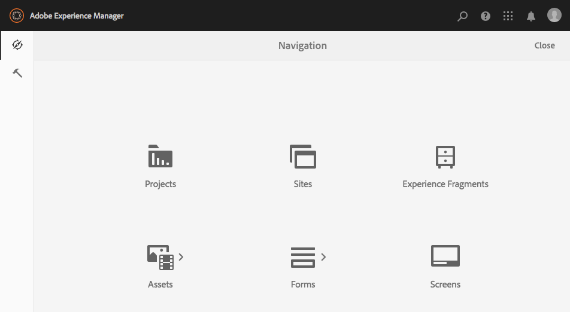

# Admin Console{#admin-consoles}

Por padrão, a capacidade de alternar para a interface clássica por meio dos consoles admin foi desativada. Portanto, os ícones de pop-up que foram vistos ao passar o mouse sobre certos ícones de console, permitindo o acesso à interface clássica, não são mais exibidos.

Cada console que tem uma versão de interface clássica em `/libs/cq/core/content/nav` pode ser reativado individualmente para que a opção de interface **clássica** apareça novamente sobre o ícone do console quando o mouse for passado.

Neste exemplo, estamos reativando a interface clássica para o console Sites.

1. Usando o CRXDE Lite, localize o nó correspondente ao console de administração para o qual você deseja reativar a interface clássica. Encontram-se em:

   `/libs/cq/core/content/nav`

   Por exemplo

   [ `http://localhost:4502/crx/de/index.jsp#/libs/cq/core/content/nav`](http://localhost:4502/crx/de/index.jsp#/libs/cq/core/content/nav)

1. Selecione o nó correspondente ao console para o qual você deseja reativar a interface clássica. Para nosso exemplo, reativaremos a interface clássica para o console Sites.

   `/libs/cq/core/content/nav/sites`

1. Criar uma sobreposição usando a opção **Sobrepor nó** ; por exemplo:

   * **Caminho**: `/apps/cq/core/content/nav/sites`
   * **Local de sobreposição**: `/apps/`
   * **Corresponder tipos** de nós: ativo (marque a caixa de seleção)

1. Adicione a seguinte propriedade booleana ao nó sobreposto:

   `enableDesktopOnly = {Boolean}true`

1. A opção Interface do usuário **** clássica está disponível novamente como uma opção de entrega no console de administração.

   

Repita essas etapas para cada console para o qual você deseja reativar o acesso à versão da interface clássica.
