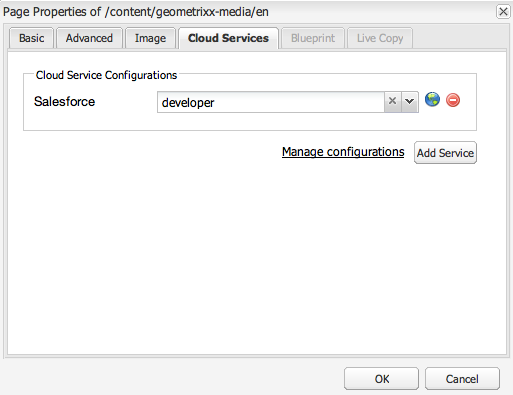
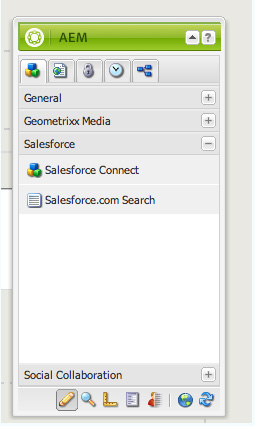
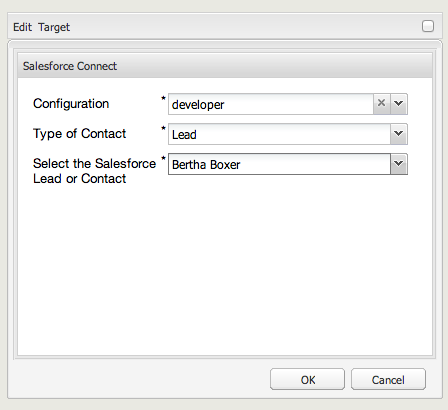

# Integração com o Salesforce{#integrating-with-salesforce}

A integração do Salesforce com o AEM fornece recursos de gerenciamento de lead e aproveita os recursos existentes fornecidos prontamente pelo Salesforce. Você pode configurar AEM para publicar clientes potenciais no Salesforce e criar componentes que acessam dados diretamente do Salesforce.

A integração bidirecional e extensível entre AEM e Salesforce permite:

* Organizações para usar e atualizar totalmente os dados para aprimorar a experiência do cliente.
* Participação do marketing para atividades de vendas.
* Organizações para transmitir e receber dados automaticamente de um armazenamento de dados do Salesforce.

Este documento descreve o seguinte:

* como configurar os Cloud Services do Salesforce (configurar AEM para integração com o Salesforce).
* como usar informações de cliente potencial/contato do Salesforce no Contexto do cliente e para personalização.
* como usar o modelo de fluxo de trabalho do Salesforce para publicar AEM usuários como resulta no salesforce.
* como criar um componente que mostra dados do Salesforce.

## Configuração de AEM para integração com o Salesforce {#configuring-aem-to-integrate-with-salesforce}

Para configurar AEM para integração com o Salesforce, é necessário configurar primeiro um aplicativo de acesso remoto no Salesforce. Em seguida, você configura o serviço de nuvem salesforce para apontar para esse aplicativo de acesso remoto.

>[!NOTE]
>
>Você pode criar uma conta gratuita de desenvolvedor no Salesforce.

Para configurar AEM para integração com o Salesforce:

1. Em AEM, navegue até **Cloud Services**. Em Serviços de terceiros, clique em **Configurar agora** no **Salesforce**.

   

1. Crie uma nova configuração, por exemplo, **desenvolvedor**.

   >[!NOTE]
   >
   >A nova configuração redireciona para uma nova página: **http://localhost:4502/etc/cloudservices/salesforce/developer.html**. Esse é exatamente o mesmo valor que você precisa especificar no URL de retorno de chamada ao criar o aplicativo de acesso remoto no Salesforce. Esses valores devem corresponder.

1. Faça logon em sua conta do salesforce (ou, se você não tiver uma, crie uma em [https://developer.force.com](https://developer.force.com)).
1. No Salesforce, navegue até **Criar** > **Aplicativos** para acessar Aplicativos **** conectados (em versões anteriores do salesforce, o fluxo de trabalho era **Implantar** > Acesso **** remoto).
1. Clique em **Novo** para conectar AEM com o Salesforce.

   

1. Digite o nome **do aplicativo** conectado, o nome **da** API e o e-mail **de** contato. Marque a caixa de seleção **Ativar configurações** OAuth e digite o URL **de** retorno de chamada e adicione um escopo OAuth (por exemplo, acesso completo). O URL de retorno de chamada é semelhante a: `http://localhost:4502/etc/cloudservices/salesforce/developer.html`

   Altere o nome do servidor/número da porta e o nome da página para corresponder à sua configuração.

   

1. Clique em **Salvar** para salvar a configuração do salesforce. O Salesforce cria um **consumer key** e um **consumer secret**, necessários para AEM configuração.

   

   >[!NOTE]
   >
   >Talvez seja necessário aguardar vários minutos (até 15 minutos) para que o aplicativo de acesso remoto no Salesforce seja ativado.

1. Em AEM, navegue até **Cloud Services** e navegue até a configuração do salesforce criada anteriormente (por exemplo, **desenvolvedor**). Clique em **Editar** e insira a chave do cliente e o segredo do cliente em salesforce.com.

   

   | URL de login | Este é o Ponto Final de Autorização do Salesforce. Seu valor é pré-preenchido e serve a maioria dos casos. |
   |---|---|
   | Chave do cliente | Digite o valor obtido na página Registro de aplicativo de acesso remoto em salesforce.com |
   | Segredo do cliente | Digite o valor obtido na página Registro de aplicativo de acesso remoto em salesforce.com |

1. Clique em **Conectar-se ao Salesforce** para se conectar. O Salesforce solicita que você permita que sua configuração se conecte ao salesforce.

   

   No AEM, uma caixa de diálogo de confirmação é aberta informando que você se conectou com êxito.

1. Navegue até a página raiz do site e clique em Propriedades **da** página. Em seguida, selecione **Cloud Services** e adicione **Salesforce** e selecione a configuração correta (por exemplo, **desenvolvedor**).

   

   Agora, você pode usar o modelo de fluxo de trabalho para postar clientes potenciais no Salesforce e criar componentes que acessam dados do Salesforce.

## Exportar usuários AEM como clientes potenciais do Salesforce {#exporting-aem-users-as-salesforce-leads}

Se você quiser exportar um usuário AEM como um cliente potencial salesforce, é necessário configurar o fluxo de trabalho para publicar os clientes potenciais no salesforce.

Para exportar AEM usuários como o Salesforce leva:

1. Navegue até o fluxo de trabalho do Salesforce `http://localhost:4502/workflow` clicando com o botão direito do mouse no fluxo de trabalho Exportação **do** Salesforce.com e clicando em **Start**.

   

1. Selecione o usuário AEM que deseja criar como cliente potencial como a **Carga** para este fluxo de trabalho (home -> usuários). Certifique-se de selecionar o nó do perfil do usuário, pois ele contém informações como **determinadoName**, **familyName** e assim por diante, que são mapeadas para os campos **FirstName** e **LastName** do cliente potencial do Salesforce.

   

   >[!NOTE]
   >
   >Antes de iniciar esse fluxo de trabalho, há determinados campos obrigatórios que um nó principal no AEM deve ter antes de ser publicado no Salesforce. Estes são **providedName**, **familyName**, **** empresa e **email**. Para ver uma lista completa de mapeamento entre AEM usuário e o cliente potencial Salesforce, consulte Configuração de [mapeamento entre AEM usuário e o cliente potencial Slaesforce.](#mapping-configuration-between-aem-user-and-salesforce-lead)

1. Clique em **OK**. As informações do usuário são exportadas para salesforce.com. Você pode verificá-lo em salesforce.com.

   >[!NOTE]
   >
   >Os registros de erros mostrarão se um cliente potencial é importado. Consulte o log de erros para obter mais informações.

### Configuração do fluxo de trabalho de exportação do Salesforce.com {#configuring-the-salesforce-com-export-workflow}

Talvez seja necessário configurar o fluxo de trabalho de exportação do Salesforce.com para equipará-lo à configuração correta do Salesforce.com ou para fazer outras alterações.

Para configurar o fluxo de trabalho de exportação do Salesforce.com:

1. Vá até `http://localhost:4502/cf#/etc/workflow/models/salesforce-com-export.html.`

   

1. Abra a etapa Exportar do Salesforce.com, selecione a guia **Argumentos** e selecione se a configuração correta está selecionada e clique em **OK**. Além disso, se você quiser que o fluxo de trabalho recrie um cliente potencial que foi excluído no Salesforce, marque a caixa de seleção.

   

1. Click **Save** to save your changes.

   

### Mapeamento da configuração entre AEM usuário e o cliente potencial do Salesforce {#mapping-configuration-between-aem-user-and-salesforce-lead}

Para visualização ou edição da configuração de mapeamento atual entre um usuário AEM e um cliente potencial Salesforce, abra o Configuration Manager: `https://<hostname>:<port>/system/console/configMgr` e pesquise pela Configuração **de mapeamento de clientes potenciais do** Salesforce.

1. Abra o Configuration Manager clicando em Console **** Web ou indo diretamente para `https://<hostname>:<port>/system/console/configMgr.`
1. Pesquise a Configuração **do Mapeamento de Chumbo do** Salesforce.

   

1. Altere os mapeamentos, conforme necessário. O mapeamento padrão segue o padrão** aemUserAttribute=sfLeadAttribute**. Click **Save** to save your changes.

## Configuração do Salesforce Client Context Store {#configuring-salesforce-client-context-store}

O repositório de contexto do cliente salesforce mostra informações adicionais sobre o usuário conectado no momento do que o que já está disponível no AEM. Ele obtém essas informações adicionais do Salesforce, dependendo da conexão do usuário com o Salesforce.

Para fazer isso, é necessário configurar o seguinte:

1. Vincule um usuário AEM com uma ID do Salesforce por meio do componente do Salesforce Connect.
1. Adicione os Dados do Perfil do Salesforce na página de contexto do cliente para configurar quais propriedades você deseja visualizar.
1. (Opcional) Crie um segmento que use os dados do Salesforce Client Context Store.

### Vincular um usuário AEM com uma ID do Salesforce {#linking-an-aem-user-with-a-salesforce-id}

É necessário mapear um usuário AEM com uma ID do Salesforce para carregá-lo no contexto do cliente. Em um cenário real, você estaria vinculando com base em dados conhecidos do usuário com validação. Para fins de demonstração, nesse procedimento, você usa o componente **Salesforce Connect** .

1. Navegue até um site da Web em AEM, faça logon e arraste e solte o componente **Salesforce Connect** do sidekick.

   >[!NOTE]
   >
   >Se o componente **Salesforce Connect** não estiver disponível, vá para **Design** visualização e selecione-o para disponibilizá-lo em **Editar** visualização.

   

   Quando você arrasta o componente para a página, ele exibe **Link para Salesforce=Off**.

   

   >[!NOTE]
   >
   >Este componente é apenas para fins de demonstração. Para cenários do mundo real, haveria outro processo para vincular/igualar usuários a clientes potenciais.

1. Depois de arrastar o componente na página, abra-o para configurá-lo. Selecione a configuração, o tipo de contato e o cliente potencial ou contato do Salesforce e clique em **OK**.

   

   AEM vincula o usuário ao contato ou cliente potencial do Salesforce.

   

### Adicionar dados do Salesforce ao contexto do cliente {#adding-salesforce-data-to-client-context}

Você pode carregar os dados do usuário do Salesforce no Contexto do cliente para usá-los na personalização:

1. Abra o contexto do cliente que deseja estender navegando até ele, por exemplo, `http://localhost:4502/etc/clientcontext/default/content.html.`

   

1. Arraste o componente Dados **do Perfil do** Salesforce para o contexto do cliente.

   

1. Clique no componente com o Duplo do mouse para abri-lo. Selecione **Adicionar item** e selecione uma propriedade na lista suspensa. Adicione quantas propriedades desejar e selecione **OK**.

   

1. Agora, você vê propriedades específicas do Salesforce exibidas no contexto do cliente.

   

### Criação de um segmento usando dados do Salesforce Client Context Store {#building-a-segment-using-data-from-salesforce-client-context-store}

Você pode criar um segmento que usa dados do Salesforce Client Context Store. Para fazer isso:

1. Navegue até a segmentação no AEM em **Ferramentas** > **Segmentação** ou vá para [http://localhost:4502/miscadmin#/etc/segmentation](http://localhost:4502/miscadmin#/etc/segmentation).
1. Crie ou atualize um segmento para incluir dados do Salesforce. For more information, see [Segmentation](/help/sites-administering/campaign-segmentation.md).

## Pesquisando clientes potenciais {#searching-leads}

AEM é fornecido com um componente de pesquisa de amostra que pesquisa clientes potenciais no Salesforce de acordo com os critérios especificados. Este componente mostra como usar a API REST do Salesforce para pesquisar objetos do salesforce. É necessário vincular uma página com uma configuração do Salesforce para acionar uma chamada para salesforce.com.

>[!NOTE]
>
>Este é um componente de amostra que mostra como usar a API REST do Salesforce para query de objetos do Salesforce. Use-o como exemplo para criar componentes mais complexos com base em suas necessidades.

Para usar este componente:

1. Navegue até a página onde deseja usar essa configuração. Abra as propriedades da página e selecione **Cloud Services.** Clique em **Adicionar serviços** e selecione **Salesforce** e a configuração apropriada e clique em **OK**.

   

1. Arraste o componente de pesquisa do Salesforce para a página (desde que tenha sido ativado). Para ativá-lo, vá para o modo Design e adicione-o à área apropriada).

   

1. Abra o componente de Pesquisa e especifique os parâmetros de pesquisa e clique em **OK.**

   

1. AEM exibe os clientes em potencial especificados em seu componente de pesquisa que correspondem aos critérios especificados.

   

