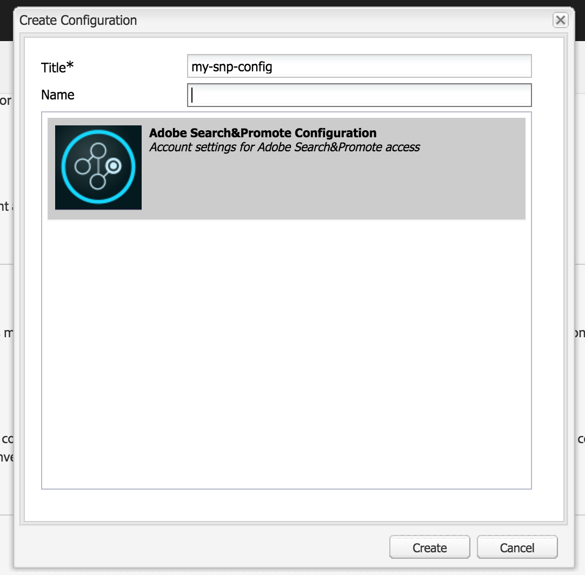

# Integrating with Adobe Search&amp;Promote{#integrating-with-adobe-search-promote}

Para chamar o serviço Adobe Search&amp;Promote de seu site, execute as seguintes tarefas:

1. Especifique o URL da nuvem.
1. Configure a conexão com o serviço Search&amp;Promote.
1. Adicionar componentes do Search&amp;Promote ao [!UICONTROL Sidekick].
1. Use os componentes para criar o conteúdo. (Consulte [Adicionar recursos do Search&amp;Promote a uma página](/help/sites-authoring/search-and-promote.md)da Web.)
1. Adicione banners às suas páginas. As imagens de banner são sensíveis aos dados do Search&amp;Promote.
1. Gere um mapa do site para o serviço Search&amp;Promote consumir.

>[!NOTE]
>
>Se você estiver usando o Search&amp;Promote com uma configuração de proxy personalizada, precisará configurar ambas as configurações de proxy do Cliente HTTP, já que algumas funcionalidades do AEM estão usando as APIs 3.x e outras as APIs 4.x:
>
>* 3.x é configurado com [http://localhost:4502/system/console/configMgr/com.day.commons.httpclient](http://localhost:4502/system/console/configMgr/com.day.commons.httpclient)
>* 4.x é configurado com [http://localhost:4502/system/console/configMgr/org.apache.http.proxyconfigurator](http://localhost:4502/system/console/configMgr/org.apache.http.proxyconfigurator)
>

## Alteração do URL do serviço Search&amp;Promote {#changing-the-search-promote-service-url}

O URL padrão configurado para o serviço Search&amp;Promote é `https://searchandpromote.omniture.com/px/`. Para usar um serviço diferente, use o console OSGi para especificar um URL diferente.

**Para alterar o URL** do serviço Search&amp;Promote:

1. Abra o console do [!UICONTROL OSGi] e toque na guia **[!UICONTROL Configuração]** . ([http://localhost:4502/system/console/configMgr.](http://localhost:4502/system/console/configMgr))

1. Clique no item Configuração **[!UICONTROL do]** Dia CQ Search&amp;Promote.
1. No campo de texto URI **[!UICONTROL do Servidor]** Remoto, digite o URL e toque em **[!UICONTROL Salvar]**.

## Configurar a conexão com o Search&amp;Promote {#configuring-the-connection-to-search-promote}

Configure uma ou mais conexões para o Search&amp;Promote para que suas páginas da Web possam interagir com o serviço. Para se conectar, você precisa da identificação do membro e do número da conta da sua conta do Search&amp;Promote.

**Para configurar a conexão com o Search&amp;Promote**:

1. No ícone **[!UICONTROL Ferramentas]** > **[!UICONTROL Implantação]**, selecione Serviços **[!UICONTROL em]** nuvem.

   Isso leva você ao Painel de serviços em nuvem. Se estiver em uma máquina local, o url do painel terá a seguinte aparência:

   [http://localhost:4502/libs/cq/core/content/tools/cloudservices.html](http://localhost:4502/libs/cq/core/content/tools/cloudservices.html)

1. Na página Serviços [!UICONTROL da] Cloud, toque no link do **[!UICONTROL Adobe Search&amp;Promote]** ou no ícone do **[!UICONTROL Search&amp;Promote]** .

1. Se esta for a primeira vez que você estiver configurando o Adobe Search&amp;Promote, toque em **[!UICONTROL Configurar agora]** para abrir o painel [!UICONTROL Criar configuração] .

   Se você quiser saber mais sobre o Search&amp;Promote, clique em **[!UICONTROL Saiba mais]** .

   

1. Insira um **[!UICONTROL Título]** reconhecível aos autores da página, insira um **[!UICONTROL Nome]** exclusivo e, em seguida, toque em **[!UICONTROL Criar]**.

   Além disso, a configuração recém-criada é exibida abaixo de Configurações **** disponíveis no item de lista do painel **[!UICONTROL Serviços em]** nuvem do Adobe Search&amp;Promote.

   

1. Na caixa de diálogo [!UICONTROL Editar componente] , adicione o seguinte aos campos:

   * **[!UICONTROL ID de membro]**
   * **[!UICONTROL Número da conta]**
   >[!NOTE]
   >
   >Para obter essas informações por conta própria, faça logon no seguinte:
   >
   >[https://searchandpromote.omniture.com/center/](https://searchandpromote.omniture.com/center/)
   >
   >usando suas credenciais válidas do Search&amp;Promote (email/senha).
   >
   >Observe o URL na barra de endereços do seu navegador. Deve ser semelhante ao seguinte:
   >
   >
   >
   >[https://searchandpromote.omniture.com/px/home/?sp_id=XXXXXXXX-spYYYYYYYY](https://searchandpromote.omniture.com/px/home/?sp_id=XXXXXXXX-spYYYYYYYY)
   >
   >Onde **XXXXXXXX** corresponde à ID **[!UICONTROL do seu]** membro e **[!UICONTROL spYYYYYYY]** corresponde ao número da sua conta.

1. Tap **[!UICONTROL Connect To Search&amp;Promote]**.

   Quando a mensagem de sucesso da conexão for exibida, toque em **[!UICONTROL OK]**.

   Após a conexão, o texto do botão muda para **[!UICONTROL Reconectar ao Search&amp;Promote]**.

1. Toque em **[!UICONTROL OK]**. A página Configurações do Search&amp;Promote é exibida para a configuração que você acabou de criar.

## Configuração do data center {#configuring-the-data-center}

Se sua conta do Search&amp;Promote estiver na Ásia ou na Europa, você precisará alterar o data center padrão para que ele aponte para a direita (o data center padrão é para contas norte-americanas).

**Para configurar o data center**:

1. Navegue até o console da Web em `http://localhost:4502/system/console/configMgr/com.day.cq.searchpromote.impl.SearchPromoteServiceImpl`

   

1. Dependendo do local do servidor, altere o URI para um dos seguintes:

   * América do Norte: [https://center.atomz.com/px/](https://center.atomz.com/px/)
   * EMEA: [https://center.lon5.atomz.com/px/](https://center.lon5.atomz.com/px/)
   * APAC: [https://center.sin2.atomz.com/px/](https://center.sin2.atomz.com/px/)

1. Toque em **[!UICONTROL Salvar]**.

## Adicionar componentes do Search&amp;Promote ao Sidekick {#adding-search-promote-components-to-sidekick}

No modo [!UICONTROL Design] , edite um componente **[!UICONTROL par]** para permitir os componentes do Search&amp;Promote no [!UICONTROL Sidekick]. (See the [Components](/help/sites-developing/components.md) documentation for more information.)

Para obter informações sobre como usar os componentes, consulte [Adicionar recursos do Search&amp;Promote a uma Página](/help/sites-authoring/search-and-promote.md)da Web.

## Especificação do serviço Search&amp;Promote que suas páginas usam {#specifying-the-search-promote-service-that-your-pages-use}

Configure páginas da Web para que elas usem um serviço do Search&amp;Promote específico. Os componentes do Search&amp;Promote usam automaticamente o serviço de sua página de host.

Quando você define as propriedades do Search&amp;Promote para uma página, todas as páginas secundárias herdam as configurações. Se necessário, é possível configurar páginas secundárias para substituir as configurações herdadas.

>[!NOTE]
>
>A conexão de serviço já deve estar configurada. Consulte [Configurar a conexão com o Search&amp;Promote](#configuring-the-connection-to-search-promote).

1. Abra a caixa de diálogo Propriedades **[!UICONTROL da]** página. Por exemplo, na página **[!UICONTROL Sites]** , clique com o botão direito do mouse na página e clique em **[!UICONTROL Propriedades]**.

1. Clique na guia Serviços **[!UICONTROL em]** nuvem.

1. Para desativar a herança das configurações de serviços em nuvem de uma página pai, clique no ícone de cadeado ao lado do caminho de herança.

   

1. Clique em **[!UICONTROL Adicionar serviço]**, selecione **[!UICONTROL Adobe Search&amp;Promote]** e clique em **[!UICONTROL OK]**.

1. Selecione a configuração de conexão para sua conta do Search&amp;Promote e clique em **[!UICONTROL OK]**.

## Product Feed {#product-feed}

A integração do Search&amp;Promote permite fazer o seguinte:

* Use a API [!UICONTROL eCommerce] , independentemente da estrutura do repositório subjacente e da plataforma de comércio.
* Aproveite o recurso Conector [!UICONTROL de] índice do Search&amp;Promote para fornecer um feed de produto no formato XML.
* Aproveite o recurso Controle  remoto do Search&amp;Promote para executar solicitações sob demanda ou programadas do feed do produto.
* Geração de feed para diferentes contas do Search&amp;Promote, configuradas como configurações de serviços em nuvem.

Para obter mais informações, consulte Feed [do produto](/help/sites-administering/product-feed.md).
