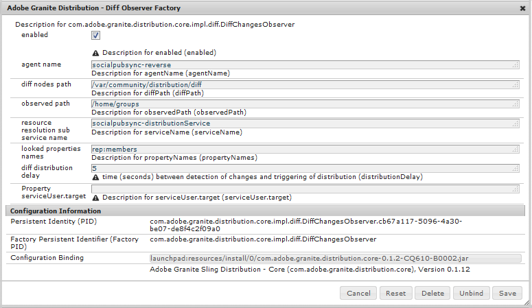

# Sincronização de usuários{#user-synchronization}

>[!CAUTION]
>
>AEM 6.4 chegou ao fim do suporte estendido e esta documentação não é mais atualizada. Para obter mais detalhes, consulte nossa [períodos de assistência técnica](https://helpx.adobe.com/br/support/programs/eol-matrix.html). Encontre as versões compatíveis [here](https://experienceleague.adobe.com/docs/).

## Introdução {#introduction}

Quando a implantação é uma [publicar farm](/help/sites-deploying/recommended-deploys.md#tarmk-farm), os membros do precisam fazer logon e ver seus dados em qualquer nó de publicação.

Usuários e grupos de usuários (dados de usuários) criados no ambiente de publicação não são necessários no ambiente de criação.

A maioria dos dados do usuário criados no ambiente de criação tem o objetivo de permanecer no ambiente de criação e não ser copiada para as instâncias de publicação.

O registro e as modificações feitas em uma instância de publicação precisam ser sincronizados com outras instâncias de publicação para que elas tenham acesso aos mesmos dados do usuário.

A partir do AEM 6.1, quando a sincronização do usuário é ativada, os dados do usuário são sincronizados automaticamente entre as instâncias de publicação no farm e não são criados no autor.

## Distribuição Sling {#sling-distribution}

Os dados do usuário, juntamente com seus [ACLs](/help/sites-administering/security.md)são armazenadas no [Oak Core](/help/sites-deploying/platform.md), a camada abaixo do JCR do Oak e são acessadas usando o [API Oak](https://helpx.adobe.com/experience-manager/6-4/sites/developing/using/reference-materials/javadoc/org/apache/jackrabbit/oak/api/package-tree.html). Com atualizações infrequentes, é razoável que os dados do usuário sejam sincronizados com outras instâncias de publicação usando [Distribuição de conteúdo Sling](https://github.com/apache/sling/blob/trunk/contrib/extensions/distribution/README.md) (Distribuição Sling).

Os benefícios da sincronização de usuários usando a distribuição do Sling, em comparação com a replicação tradicional são:

* *usuários*, *perfis de usuário* e *grupos de usuários* criados na publicação não são criados no autor

* A distribuição do Sling define propriedades em eventos jcr, permitindo agir dentro de ouvintes de eventos do lado da publicação sem preocupação com loops de replicação infinitos
* A distribuição do Sling envia apenas dados do usuário para instâncias de publicação não originárias, eliminando tráfego desnecessário
* [ACLs](/help/sites-administering/security.md) definidos no nó do usuário são incluídos na sincronização

>[!NOTE]
>
>Se as sessões forem necessárias, é recomendável usar uma solução SSO ou usar uma sessão fixa e fazer com que os clientes façam logon se mudarem para outro publicador.

>[!CAUTION]
>
>Sincronização do ***administradores** *grupo não é suportado, mesmo quando a sincronização do usuário está ativada. Em vez disso, uma falha em &#39;importar o diff&#39; será registrada no log de erros.
>
>Portanto, quando a implantação é um farm de publicação, se um usuário for adicionado ou removido do ***administradores** *grupo, a modificação deve ser feita manualmente em cada instância de publicação.

## Ativar sincronização de usuários {#enable-user-sync}

>[!NOTE]
>
>Por padrão, a sincronização do usuário é `disabled`.
>
>A habilitação da sincronização de usuários envolve modificar *existente* Configurações OSGi.
>
>Nenhuma nova configuração deve ser adicionada como resultado da ativação da sincronização do usuário.

A sincronização de usuários depende do ambiente de criação para gerenciar as distribuições de dados do usuário, mesmo que os dados do usuário não sejam criados no autor. Muitas, mas não todas, das configurações ocorrem no ambiente de criação e cada etapa identifica claramente se elas devem ser executadas no autor ou na publicação.

A seguir estão as etapas necessárias para habilitar a sincronização do usuário, seguido por um [Solução de problemas](#troubleshooting) seção:

### Pré-requisitos {#prerequisites}

1. Se usuários e grupos de usuários já tiverem sido criados em um editor, é recomendável [sincronizar manualmente](#manually-syncing-users-and-user-groups) os dados do usuário para todos os editores antes de configurar e ativar a sincronização do usuário.

   Quando a sincronização do usuário estiver ativada, somente os usuários e grupos recém-criados serão sincronizados.

1. Verifique se o código mais recente foi instalado:

* [Atualizações da plataforma AEM](https://helpx.adobe.com/br/experience-manager/kb/aem62-available-hotfixes.html)
* [Atualizações do AEM Communities](/help/communities/deploy-communities.md#latest-releases)

### 1. Apache Sling Distribution Agent - Fábrica de agentes de sincronização {#apache-sling-distribution-agent-sync-agents-factory}

**Ativar sincronização de usuários**

* **sobre o autor**

   * fazer logon com privilégios de administrador
   * acesse o [Console da Web](/help/sites-deploying/configuring-osgi.md)

      * por exemplo, [http://localhost:4502/system/console/configMgr](http://localhost:4502/system/console/configMgr)
   * localizar `Apache Sling Distribution Agent - Sync Agents Factory`

      * selecione a configuração existente a ser aberta para edição (ícone de lápis)

         Verificar `name`: **`socialpubsync`**

      * selecione o `Enabled` caixa de seleção
      * select `Save`


### 2. Criar usuário autorizado {#createauthuser}

**Configurar permissões**
Esse usuário autorizado será usado na etapa 3 para configurar a distribuição do Sling no autor.

* **em cada instância de publicação**

   * fazer logon com privilégios de administrador
   * acesse o [Console de segurança](/help/sites-administering/security.md)

      * por exemplo, [http://localhost:4503/useradmin](http://localhost:4503/useradmin)
   * criar um novo usuário

      * por exemplo, `usersync-admin`
   * adicionar este usuário ao **`administrators`** grupo de usuários
   * [adicionar ACL a este usuário para /home](#addacls)

      * `Allow jcr:all` com restrição `rep:glob=*/activities/*`


>[!CAUTION]
>
>Um novo usuário deve ser criado.
>
>* O usuário padrão atribuído é **`admin`**.
>* Não utilizar `*communities-user-admin *user*.*`
>


#### Como adicionar ACL {#addacls}

* CRXDE Lite de acesso

   * por exemplo, [http://localhost:4503/crx/de](http://localhost:4503/crx/de)

* select `/home` nó
* no painel direito, selecione o `Access Control` guia
* selecione o `+` botão para adicionar uma entrada ACL

   * **Principal**: *procurar usuário criado para sincronização de usuário*
   * **Tipo**: `Allow`
   * **Privilégios**: `jcr:all`
   * **Restrições** rep:glob: `*/activities/*`
   * select **OK**

* select **Salvar tudo**


Consulte também:

* [Gerenciamento de direitos de acesso](/help/sites-administering/user-group-ac-admin.md#access-right-management)
* Seção Solução de problemas [Modificar Exceção da Operação Durante o Processamento de Resposta](#modify-operation-exception-during-response-processing).

### 3. Distribuição de Adobe Granite - Provedor secreto de transporte de senha criptografado {#adobegraniteencpasswrd}

**Configurar permissões**

Depois de um usuário autorizado, um membro do **`administrators`**grupo de usuários, foi criado em todas as instâncias de publicação, e o usuário autorizado deve ser identificado no autor como tendo permissão para sincronizar os dados do usuário do autor para publicação.

* **sobre o autor**

   * fazer logon com privilégios de administrador
   * acesse o [Console da Web](/help/sites-deploying/configuring-osgi.md)

      * por exemplo, [http://localhost:4502/system/console/configMgr](http://localhost:4502/system/console/configMgr)
   * localizar `com.adobe.granite.distribution.core.impl.CryptoDistributionTransportSecretProvider.name`
   * selecione a configuração existente a ser aberta para edição (ícone de lápis)

      Verificar `property name` : **`socialpubsync-publishUser`**

   * defina o nome de usuário e a senha como [usuário autorizado](#createauthuser) criado na publicação na etapa 2

      * por exemplo, `usersync-admin`


### 4. Apache Sling Distribution Agent - Fábrica de Agentes de Fila {#apache-sling-distribution-agent-queue-agents-factory}

**Ativar sincronização de usuários**

* **ao publicar** :

   * fazer logon com privilégios de administrador
   * acesse o [Console da Web](/help/sites-deploying/configuring-osgi.md)

      * por exemplo, [http://localhost:4503/system/console/configMgr](http://localhost:4503/system/console/configMgr)
   * localizar `Apache Sling Distribution Agent - Queue Agents Factory`

      * selecione a configuração existente a ser aberta para edição (ícone de lápis)

         Verificar `Name` : `socialpubsync-reverse`

      * selecione o `Enabled` caixa de seleção
      * select `Save`
   * **repetição** para cada instância de publicação


### 5. Distribuição Adobe Granite - Fábrica de Observadores Diff {#diffobserver}

**Ativar sincronização de grupos**

* **em cada instância de publicação** :

   * fazer logon com privilégios de administrador
   * acesse o [Console da Web](/help/sites-deploying/configuring-osgi.md)

      * por exemplo, [http://localhost:4503/system/console/configMgr](http://localhost:4503/system/console/configMgr)
   * localizar `Adobe Granite Distribution - Diff Observer Factory`

      * selecione a configuração existente a ser aberta para edição (ícone de lápis)

         Verificar `agent name` : `socialpubsync-reverse`

      * selecione o `Enabled` caixa de seleção
      * select `Save`




### 6. Acionador de distribuição do Apache Sling - Acionadores agendados de fábrica {#apache-sling-distribution-trigger-scheduled-triggers-factory}

**(Opcional) modificar o intervalo de sondagem**

Por padrão, o autor pesquisará as alterações a cada 30 segundos. Para alterar esse intervalo :

* **sobre o autor**

   * fazer logon com privilégios de administrador
   * acesse o [Console da Web](/help/sites-deploying/configuring-osgi.md)

      * por exemplo, [http://localhost:4502/system/console/configMgr](http://localhost:4502/system/console/configMgr)
   * localizar `Apache Sling Distribution Trigger - Scheduled Triggers Factory`

      * selecione a configuração existente a ser aberta para edição (ícone de lápis)

         * Verificar `Name` : `socialpubsync-scheduled-trigger`
      * defina as `Interval in Seconds` para o intervalo desejado
      * select `Save`


## Configurar para várias instâncias de publicação {#configure-for-multiple-publish-instances}

A configuração padrão é para uma única instância de publicação. Como o motivo para ativar a sincronização do usuário é sincronizar várias instâncias de publicação, como para um farm de publicação, as instâncias de publicação adicionais precisarão ser adicionadas à Fábrica de agentes de sincronização.

### 7. Apache Sling Distribution Agent - Fábrica de agentes de sincronização {#apache-sling-distribution-agent-sync-agents-factory-1}

**Adicionar instâncias de publicação :**

* **sobre o autor**

   * fazer logon com privilégios de administrador
   * acesse o [Console da Web](/help/sites-deploying/configuring-osgi.md)

      * por exemplo, [http://localhost:4502/system/console/configMgr](http://localhost:4502/system/console/configMgr)
   * localizar `Apache Sling Distribution Agent - Sync Agents Factory`

      * selecione a configuração existente a ser aberta para edição (ícone de lápis)

         Verificar `Name` : `socialpubsync`


* **Endpoints do exportador**
Deve haver um terminal de exportador para cada editor. Por exemplo, se houver 2 editores, localhost:4503 e 4504, deverá haver 2 entradas:

   * http://localhost:4503/libs/sling/distribution/services/exporters/socialpubsync-reverse
   * http://localhost:4504/libs/sling/distribution/services/exporters/socialpubsync-reverse

* **Endpoints do importador**
Deve haver um ponto de extremidade de importador para cada editor. Por exemplo, se houver 2 editores, localhost:4503 e 4504, deverá haver 2 entradas:

   * http://localhost:4503/libs/sling/distribution/services/importers/socialpubsync
   * http://localhost:4504/libs/sling/distribution/services/importers/socialpubsync

* select `Save`

### 8. Ouvinte de sincronização de usuários do AEM Communities {#aem-communities-user-sync-listener}

**(Opcional) Sincronizar nós JCR adicionais**

Se houver dados personalizados que desejam ser sincronizados em várias instâncias de publicação, então:

* **em cada instância de publicação**:

   * fazer logon com privilégios de administrador
   * acesse o [Console da Web](/help/sites-deploying/configuring-osgi.md)

      * por exemplo, [http://localhost:4503/system/console/configMgr](http://localhost:4503/system/console/configMgr)
   * localizar `AEM Communities User Sync Listener`
   * selecione a configuração existente a ser aberta para edição (ícone de lápis)

      Verificar `Name`: `socialpubsync-scheduled-trigger`


* **Tipos de nós**

   Esta é a lista de tipos de nós que serão sincronizados. Qualquer tipo de nó diferente de sling:Folder precisa ser listado aqui (sling:folder é manipulado separadamente).

   Lista padrão de tipos de nó a serem sincronizados:

   * rep:User
   * nt:unstructured
   * nt:resource

* **Propriedades Ignoráveis**

   Esta é a lista de propriedades que será ignorada se qualquer alteração for detectada. As alterações nessas propriedades podem ser sincronizadas como um efeito colateral de outras alterações (já que a sincronização está sempre no nível do nó), mas as alterações nessas propriedades não acionarão a sincronização por si só.

   Propriedade padrão a ser ignorada:

   * cq:lastModified

* **Nós ignoráveis**

   Subcaminhos que serão totalmente ignorados durante a sincronização. Nada nesses subcaminhos será sincronizado a qualquer momento.

   Nós padrão a serem ignorados:

   * .tokens
   * system

* **Pastas Distribuídas**

   A maioria das sling:Folders é ignorada porque a sincronização não é necessária. As poucas exceções estão listadas aqui.

   Pastas padrão para sincronizar

   * segmentos/pontuação
   * relações sociais
   * atividades

### 9. ID de Sling exclusiva {#unique-sling-id}

>[!CAUTION]
>
>Se a ID do Sling corresponder entre duas ou mais instâncias de publicação, a sincronização do grupo de usuários falhará.

Se a ID do Sling for a mesma para várias instâncias de publicação em um farm de publicação, os grupos de usuários não serão sincronizados.

Para validar se todos os valores da ID do Sling são diferentes, em cada instância de publicação :

1. navegue até `http://<host>:<port>/system/console/status-slingsettings`
1. verifique o valor de **Sling ID**


Se a ID do Sling de uma instância de publicação corresponder à ID do Sling de qualquer outra instância de publicação, então:

1. pare uma das instâncias de publicação que tenha uma ID do Sling correspondente
1. no diretório crx-quickstart/launchpad/felix

   * pesquise e exclua o arquivo chamado *sling.id.file*

      * por exemplo, em um sistema Linux:

         `rm -i $(find . -type f -name sling.id.file)`

      * por exemplo, em um sistema Windows:

         `use windows explorer and search for *sling.id.file*`

1. inicie a instância de publicação

   * na inicialização, será atribuído um novo Sling ID

1. valide que a variável **Sling ID** agora é exclusivo

Repita essas etapas até que todas as instâncias de publicação tenham uma ID do Sling exclusiva.

## Compilador de pacote de cofre de fábrica {#vault-package-builder-factory}

Para que as atualizações sejam sincronizadas corretamente, é necessário modificar o construtor de pacotes de cofre para sincronização do usuário :

* em cada instância de publicação de AEM
* acesse o [Console da Web](/help/sites-deploying/configuring-osgi.md)

   * por exemplo, [http://localhost:4503/system/console/configMgr](http://localhost:4503/system/console/configMgr)

* localize o `Apache Sling Distribution Packaging - Vault Package Builder Factor`

   * `Builder name: socialpubsync-vlt`

* selecione o ícone editar
* adicionar dois `Package Filters` :

   * `/home/users|-.*/.tokens`
   * `/home/users|-.*/rep:cache`

* tratamento de políticas :

   * para substituir os nós rep:policy existentes por novos, adicione um terceiro Filtro de Pacote :

      * `/home/users|+.*/rep:policy`
   * para evitar que as políticas sejam distribuídas, defina

      * `Acl Handling :` `IGNORE`


## O que acontece quando ... {#what-happens-when}

### Perfil de Autoregistros ou edições do usuário na publicação {#user-self-registers-or-edits-profile-on-publish}

Por design, usuários e perfis criados no ambiente de publicação (autoregistro) não aparecem no ambiente do autor.

Quando a topologia for uma [publicar farm](/help/sites-deploying/recommended-deploys.md#tarmk-farm) e a sincronização do usuário foi configurada corretamente, o *usuário *e *perfil de usuário* é sincronizado no farm de publicação usando a distribuição do Sling.

### Usuários ou grupos de usuários são criados usando o Console de segurança {#users-or-user-groups-are-created-using-security-console}

Por design, os dados do usuário criados no ambiente de publicação não aparecem no ambiente de criação e vice-versa.

Quando a variável [Administração e segurança do usuário](/help/sites-administering/security.md) O console é usado para adicionar novos usuários no ambiente de publicação, a sincronização do usuário sincronizará os novos usuários e a associação do grupo a outras instâncias de publicação, se necessário. A sincronização de usuários também sincronizará os grupos de usuários criados pelo console de segurança.

## Resolução de problemas {#troubleshooting}

### Como colocar a sincronização do usuário offline {#how-to-take-user-sync-offline}

Para colocar a sincronização do usuário offline, para [remover um editor](#how-to-remove-a-publisher) ou [sincronizar dados manualmente](#manually-syncing-users-and-user-groups), a fila de distribuição deve estar vazia e quieta.

Para verificar o estado da fila de distribuição:

* sobre o autor:

   * usar [CRXDE Lite](/help/sites-developing/developing-with-crxde-lite.md)

      * procurar entradas em `/var/sling/distribution/packages`

         * nós de pasta nomeados com o padrão `distrpackage_*`
   * usar [Gerenciador de pacotes](/help/sites-administering/package-manager.md)

      * procurar pacotes pendentes (ainda não instalados)

         * nomeado com o padrão `socialpubsync-vlt*`
         * criado por `communities-user-admin`


Quando a fila de distribuição estiver vazia, desative a sincronização do usuário :

* sobre o autor

   * *desmarque *a `Enabled` caixa de seleção para [Apache Sling Distribution Agent - Fábrica de agentes de sincronização](#apache-sling-distribution-agent-sync-agents-factory)

Depois que as tarefas forem concluídas, para reativar a sincronização do usuário :

* sobre o autor

   * verifique a `Enabled` caixa de seleção para [Apache Sling Distribution Agent - Fábrica de agentes de sincronização](#apache-sling-distribution-agent-sync-agents-factory)

### Diagnóstico de sincronização de usuário {#user-sync-diagnostics}

O User Sync Diagnostics é uma ferramenta que verifica a configuração e tenta identificar qualquer problema.

Ao criar, basta navegar do console principal por **Ferramentas, Operações, Diagnóstico, Diagnóstico de Sincronização do Usuário.**

Basta entrar no console do Diagnóstico de sincronização do usuário para exibir os resultados.

O que é exibido quando a Sincronização de usuários não foi ativada:


#### Como executar diagnósticos para editores {#how-to-run-diagnostics-for-publishers}

Quando o diagnóstico é executado a partir do ambiente do autor, os resultados de passagem/falha incluirão um [INFO] exibindo a lista de instâncias de publicação configuradas para confirmação.

Incluído na lista é um URL para cada instância de publicação que executará o diagnóstico para essa instância. O parâmetro de url `syncUser` é anexado ao URL do diagnóstico com seu valor definido como *usuário de sincronização autorizado* criado em [Etapa 2](/help/sites-administering/sync.md#createauthuser).

**Observação** : antes de iniciar o URL, a variável *usuário de sincronização autorizado* já deve estar conectado a essa instância de publicação.


### Configuração adicionada incorretamente {#improperconfig}

Quando a sincronização do usuário falha, o problema mais comum é que configurações adicionais eram *adicionado*. Em vez disso, a *configuração *padrão existente deveria ter sido *editado*.

A seguir estão as exibições de como as configurações padrão editadas devem aparecer no Console da Web. Se mais de uma instância for exibida, a configuração adicionada deverá ser removida.

#### (autor) One Apache Sling Distribution Agent - Fábrica de agentes de sincronização {#author-one-apache-sling-distribution-agent-sync-agents-factory}


#### (autor) Distribuição de um Adobe Granite - Provedor secreto de transporte de senha criptografado {#author-one-adobe-granite-distribution-encrypted-password-transport-secret-provider}


#### (publicar) Um Apache Sling Distribution Agent - Fábrica de agentes de fila {#publish-one-apache-sling-distribution-agent-queue-agents-factory}


#### (publicar) Distribuição de um Adobe Granite - Fábrica de Observadores Diff {#publish-one-adobe-granite-distribution-diff-observer-factory}


#### (autor) Um Acionador de Distribuição do Apache Sling - Fábrica de Acionadores Agendados {#author-one-apache-sling-distribution-trigger-scheduled-triggers-factory}


### Modificar Exceção da Operação Durante o Processamento de Resposta {#modify-operation-exception-during-response-processing}

Se o seguinte estiver visível no log :

`org.apache.sling.servlets.post.impl.operations.ModifyOperation Exception during response processing.`

`java.lang.IllegalStateException: This tree does not exist`

Em seguida, verifique se a seção [2. Criar usuário autorizado](#createauthuser) foi seguido corretamente.

Esta seção descreve como criar um usuário autorizado, que existe em todas as instâncias de publicação e identificá-lo na configuração OSGi do &quot;Provedor secreto&quot; no autor. Por padrão, o usuário é `admin`.

O usuário autorizado deve se tornar membro do **`administrators`** grupo de usuários e permissões para esse grupo não devem ser alteradas.

O usuário autorizado deve ter explicitamente os seguintes privilégios e restrições em todas as instâncias de publicação :

| **caminho** | **jcr:all** | **rep:glob** |
|---|---|---|
| /home | X | &amp;ast;/activities/&amp;ast; |
| /home/users | X | &amp;ast;/activities/&amp;ast; |
| /home/groups | X | &amp;ast;/activities/&amp;ast; |

Como membro do `administrators` , o usuário autorizado deve ter os seguintes privilégios em todas as instâncias de publicação :

| **caminho** | **jcr:all** | **jcr:read** | **rep:write** |
|---|---|---|---|
| /etc/packages/sling/distribution |  |  | X |
| /libs/sling/distribution |  | X |  |
| /var |  |  | X |
| /var/eventing |  | X | X |
| /var/sling/distribution |  | X | X |

### Falha na Sincronização do Grupo de Usuários {#user-group-sync-failed}

Se a ID do Sling corresponder entre duas ou mais instâncias de publicação, a sincronização do grupo de usuários falhará.

Consulte a seção [9. ID exclusiva do Sling](#unique-sling-id)

### Sincronização manual de usuários e grupos de usuários {#manually-syncing-users-and-user-groups}

* no editor em que existem usuários e grupos de usuários :

   * [se ativado, desabilitar a sincronização do usuário](#how-to-take-user-sync-offline)
   * [criar um pacote](/help/sites-administering/package-manager.md#creating-a-new-package) de `/home`

      * ao editar o pacote

         * Guia Filtros : Adicionar filtro : Caminho raiz: `/home`
         * Guia Avançado : Manuseio de AC : `Overwrite`
   * [exportar o pacote](/help/sites-administering/package-manager.md#downloading-packages-to-your-file-system)


* em outras instâncias de publicação :

   * [importar o pacote](/help/sites-administering/package-manager.md#installing-packages)

Para configurar ou habilitar a sincronização do usuário, vá para a etapa 1: [Apache Sling Distribution Agent - Fábrica de agentes de sincronização](#apache-sling-distribution-agent-sync-agents-factory)

### Quando um editor fica indisponível {#when-a-publisher-becomes-unavailable}

Quando uma instância de publicação se tornar indisponível, ela não deverá ser removida se estiver novamente online no futuro. As alterações serão colocadas em fila para o editor e, uma vez online novamente, as alterações serão processadas.

Se a instância de publicação nunca voltar a ficar online, se estiver offline permanentemente, ela deverá ser removida, pois a construção de fila resultará no uso notável do espaço em disco no ambiente do autor.

Quando um editor estiver inativo, o log de autor terá exceções semelhantes a :

```
28.01.2016 15:57:48.475 ERROR
 [pool-12-thread-34-org_apache_sling_distribution_queue_socialpubsync_endpoint1
 (org/apache/sling/distribution/queue/socialpubsync/endpoint1)]
 org.apache.sling.distribution.agent.impl.SimpleDistributionAgent [agent][socialpubsync] could not deliver package distrpackage_1454014575838_a2b45ec8-0400-42f3-bed8-ae09b66381cb
 org.apache.sling.distribution.packaging.DistributionPackageImportException: failed in importing package ...
```

### Como remover um editor {#how-to-remove-a-publisher}

Para remover um editor da [Apache Sling Distribution Agent - Fábrica de agentes de sincronização](#apache-sling-distribution-agent-sync-agents-factory), a fila de distribuição deve estar vazia e quieta.

* sobre o autor :

   * [Colocar a sincronização de utilizador offline](#how-to-take-user-sync-offline)
   * seguir [etapa 7](#apache-sling-distribution-agent-sync-agents-factory) para remover o publicador de ambas as listas de servidores :

      * `Exporter Endpoints`
      * `Importer Endpoints`
   * reativar sincronização de usuários

      * verifique a `Enabled` caixa de seleção para [Apache Sling Distribution Agent - Fábrica de agentes de sincronização](#apache-sling-distribution-agent-sync-agents-factory)
