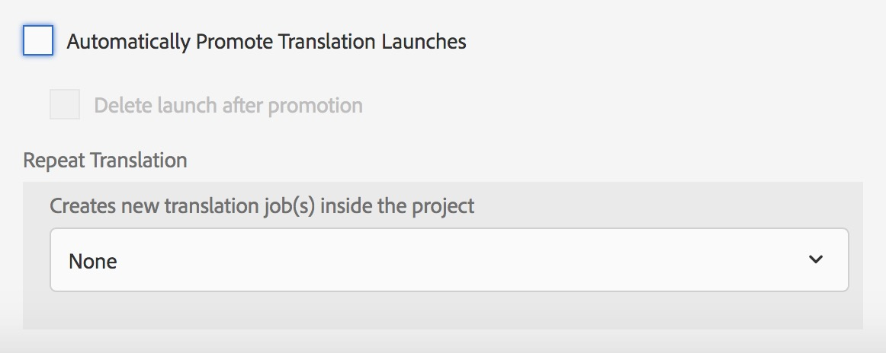

# Aprimoramentos de tradução{#translation-enhancements}

>[!CAUTION]
>
>AEM 6.4 chegou ao fim do suporte estendido e esta documentação não é mais atualizada. Para obter mais detalhes, consulte nossa [períodos de assistência técnica](https://helpx.adobe.com/br/support/programs/eol-matrix.html). Encontre as versões compatíveis [here](https://experienceleague.adobe.com/docs/).

Esta página apresenta aprimoramentos e refinamentos incrementais para AEM recursos de gerenciamento de tradução.

## Automação de projetos de tradução {#translation-project-automation}

Foram adicionadas opções para melhorar a produtividade ao trabalhar com projetos de tradução, como promover e excluir automaticamente inicializações de tradução e agendar a execução recorrente de um projeto de tradução.

1. No seu projeto de tradução, clique ou toque nas reticências na parte inferior do **Resumo da tradução** mosaico.

   

1. Alterne para **Avançado** guia . Na parte inferior, você pode selecionar **Promover automaticamente inicializações de tradução**.

   

1. Como opção, você pode selecionar se, depois de receber o conteúdo traduzido, as inicializações de tradução devem ser promovidas e excluídas automaticamente.

   

1. Para selecionar a execução recorrente de um projeto de tradução, selecione a frequência com a lista suspensa em **Repetir tradução**. A execução do projeto recorrente criará e executará automaticamente tarefas de tradução nos intervalos especificados.

   

## Projetos de tradução multilíngues {#multilingual-translation-projects}

É possível configurar vários idiomas de destino em um projeto de tradução, para reduzir o número total de projetos de tradução criados.

1. No seu projeto de tradução, clique ou toque nos pontos na parte inferior da **Resumo da tradução** mosaico.

   

1. Alterne para **Avançado** guia . Você pode adicionar vários idiomas em **Idioma de destino**.

   

1. Como alternativa, se você estiver iniciando a tradução por meio do painel de referências no Sites, adicione os idiomas e selecione **Criar projeto de tradução em vários idiomas**.

   

1. Os trabalhos de tradução serão criados no projeto para cada idioma de destino. Eles podem ser iniciados um por um no projeto ou de uma só vez executando o projeto globalmente no Administrador de projetos.

   

## Atualizações da memória de tradução {#translation-memory-updates}

As edições manuais de conteúdo traduzido podem ser sincronizadas de volta ao Sistema de Gerenciamento de Tradução (TMS) para treinar sua memória de tradução.

1. No console Sites , depois de atualizar o conteúdo do texto em uma página traduzida, selecione **Atualizar memória de tradução**.

   

1. Uma exibição de lista mostra uma comparação lado a lado da origem e da tradução para cada componente de texto que foi editado. Selecione quais atualizações de tradução devem ser sincronizadas com a Memória de Tradução e selecione **Atualizar memória**.

   

   >[!NOTE]
   >
   >O AEM enviará as strings selecionadas de volta para o Sistema de Gerenciamento de Tradução.

## Cópias de idioma em vários níveis {#language-copies-on-multiple-levels}

As raízes de idioma agora podem ser agrupadas em nós, por exemplo, por região, enquanto ainda são reconhecidas como raízes de cópias de idioma.

>[!CAUTION]
>
>Somente um nível é permitido. Por exemplo, o seguinte não permitirá que a página &quot;es&quot; seja resolvida para uma cópia de idioma:
>
>* `/content/we-retail/language-masters/en`
>* `/content/we-retail/language-masters/americas/central-america/es`
>
>Essa `es` a cópia do idioma não será detectada, pois está a dois níveis (américas/américa central) longe do `en` nó .

>[!NOTE]
>
>As raízes de idioma podem ter qualquer nome de página, em vez de apenas o código ISO do idioma. AEM sempre verificará o caminho e o nome primeiro, mas se o nome da página não identificar um idioma, AEM verificará a propriedade cq:language da página para a identificação do idioma.

## Relatório de status da tradução {#translation-status-reporting}

Uma propriedade agora pode ser selecionada na exibição da lista Sites que mostra se uma página foi traduzida, está na tradução ou ainda não foi traduzida. Para exibi-lo:

1. Em Sites, alterne para **Exibição de lista.**

   

1. Clique ou toque em **Exibir configurações**.

   

1. Verificar **Traduzido** caixa de seleção em **Tradução** e toque/clique **Atualizar**.

   

Agora você pode ver um **Traduzido** coluna que mostra o status de tradução das páginas.

