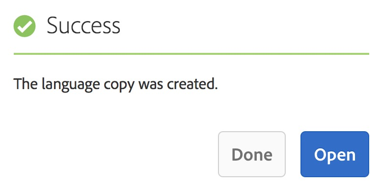

# Assistente de cópia de idioma{#language-copy-wizard}

O assistente de Cópia de idioma é uma experiência guiada para criar e instrumentar a estrutura de conteúdo multilíngue. Agora, é muito mais simples e rápido criar uma cópia de idioma.

>[!NOTE]
>
>O usuário precisa ser membro do grupo de administradores do projeto para criar a Cópia de idioma de um site.

Para acessar este assistente:

1. Em Sites, selecione uma página e toque/clique em Criar.

   

1. Selecione Cópia de idioma e o assistente será aberto.

   

1. A etapa **Selecionar origem** do assistente permite adicionar/remover páginas. Você também tem a opção de incluir ou excluir as subpáginas.

   

1. O botão **Avançar** leva você para a etapa **Configurar** do assistente. Aqui você pode adicionar/remover idiomas e selecionar o método de tradução.

   

   >[!NOTE]
   >
   >Por padrão, há apenas uma configuração de conversão. Para poder selecionar outras configurações, primeiro é necessário configurar a nuvem. Consulte [Configuração da estrutura](/help/sites-administering/tc-tic.md)de integração de tradução.

1. O botão **Avançar** leva você para a etapa **Traduzir** do assistente. Aqui você pode escolher entre criar a estrutura apenas, criar um novo projeto de tradução ou adicionar a um projeto de tradução existente.

   >[!NOTE]
   >
   >Se você selecionou vários idiomas na etapa anterior, vários projetos de tradução serão criados.

   

1. O botão **Criar** encerra o assistente.

   

