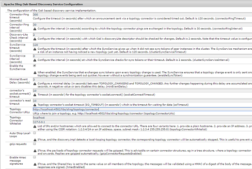
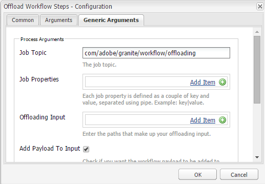

# Descarregamento do fluxo de trabalho de ativos{#assets-workflow-offloader}

>[!CAUTION]
>
>AEM 6.4 chegou ao fim do suporte estendido e esta documentação não é mais atualizada. Para obter mais detalhes, consulte nossa [períodos de assistência técnica](https://helpx.adobe.com/br/support/programs/eol-matrix.html). Encontre as versões compatíveis [here](https://experienceleague.adobe.com/docs/).

O descarregamento do fluxo de trabalho de ativos permite ativar várias instâncias do Adobe Experience Manager (AEM) Assets para reduzir a carga de processamento na instância principal (líder). A carga de processamento é distribuída entre a instância líder e as várias instâncias de descarregamento (trabalhador) que você adiciona a ela. A distribuição da carga de processamento de ativos aumenta a eficiência e a velocidade com que a AEM Assets processa ativos. Além disso, ajuda a alocar recursos dedicados para processar ativos de um tipo MIME específico. Por exemplo, você pode alocar um nó específico em sua topologia para processar ativos do InDesign somente.

## Configurar topologia do desloader {#configure-offloader-topology}

Use o Configuration Manager para adicionar o URL da instância líder e os nomes de host de instâncias de offloader para solicitações de conexão na instância líder.

1. Toque/clique no logotipo do AEM e escolha **Ferramentas** > **Operações** > **Console da Web** para abrir o Configuration Manager.
1. No Console da Web, selecione **Sling** >  **Gerenciamento de topologia**.

   

1. Na página Gerenciamento de topologia , toque/clique no botão **Configurar o serviço Discovery.Oak** link .

   

1. Na página Configuração do serviço de descoberta, especifique o URL do conector para a instância líder no **URLs do conector de topologia** campo.

   

1. No **Lista de permissões do conector de topologia** , especifique o endereço IP ou os nomes de host das instâncias de offloader que podem se conectar à instância líder. Toque/clique **Salvar**.

   

1. Para ver as instâncias de descarregamento conectadas à instância líder, acesse **Ferramentas** > **Implantação** > **Topologia** e toque/clique na exibição Cluster.

## Desabilitar descarregamento {#disable-offloading}

1. Toque/clique no logotipo do AEM e escolha **Ferramentas** > **Implantação** > **Descarregamento**. O **Descarregamento do navegador** página exibe tópicos e as instâncias do servidor que podem consumir os tópicos.

   

1. Desative o *com/adobe/granite/workflow/offloading* tópico sobre as instâncias principais com as quais os usuários interagem para fazer upload ou alterar ativos AEM.

   

## Configurar inicializadores de fluxo de trabalho na instância líder {#configure-workflow-launchers-on-the-leader-instance}

Configurar inicializadores de fluxo de trabalho para usar o **Descarregamento de ativo de atualização DAM** fluxo de trabalho na instância de pontilhado, em vez de **Ativo de atualização Dam** fluxo de trabalho.

1. Toque/clique no logotipo do AEM e escolha, **Ferramentas** > **Fluxo de trabalho** > **Lançadores** para abrir o **Iniciadores de fluxo de trabalho** console.

   

1. Localize as duas configurações do Iniciador com o tipo de evento **Nó criado** e **Nó Modificado** , que executam o **Ativo de atualização DAM** fluxo de trabalho.
1. Para cada configuração, marque a caixa de seleção antes dela e toque/clique no botão **Propriedades da exibição** ícone na barra de ferramentas para exibir o **Propriedades do Iniciador** caixa de diálogo.

   

1. No **Fluxo de trabalho** listar, escolha **Descarregamento de ativo de atualização DAM** e toque/clique **Salvar**.

   

1. Toque/clique no logotipo do AEM e escolha, **Ferramentas** > **Fluxo de trabalho** > **Modelos** para abrir o **Modelos de fluxo de trabalho** página.
1. Selecione o **Descarregamento de ativo de atualização DAM** e toque/clique **Editar** na barra de ferramentas para exibir seus detalhes.

   

1. Exibe o menu de contexto para a **Descarregamento do fluxo de trabalho do DAM** e escolha **Editar**. Verifique a entrada no **Tópico da tarefa** do **Argumentos genéricos** da caixa de diálogo de configuração.

   

## Desative os inicializadores do fluxo de trabalho nas instâncias do descarregador {#disable-the-workflow-launchers-on-the-offloader-instances}

Desative os inicializadores do fluxo de trabalho que executam o **Ativo de atualização DAM** fluxo de trabalho na instância de pontilhado.

1. Toque/clique no logotipo do AEM e escolha, **Ferramentas** > **Fluxo de trabalho** > **Lançadores** para abrir o **Iniciadores de fluxo de trabalho** console.

   

1. Localize as duas configurações do Iniciador com o tipo de evento **Nó criado** e **Nó Modificado** , que executam o **Ativo de atualização DAM** fluxo de trabalho.
1. Para cada configuração, marque a caixa de seleção antes dela e toque/clique no botão **Propriedades da exibição** ícone na barra de ferramentas para exibir o **Propriedades do Iniciador** caixa de diálogo.

   

1. Na seção **Ativar **, arraste o controle deslizante para desativar o iniciador do fluxo de trabalho e toque/clique **Salvar** para desativá-lo.

   

1. Carregue qualquer ativo de imagem do tipo na instância líder. Verifique as miniaturas geradas e portadas para o ativo pela instância descarregada.
