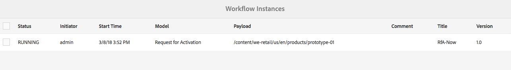
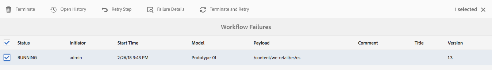

# Administração de instâncias do fluxo de trabalho{#administering-workflow-instances}

>[!CAUTION]
>
>AEM 6.4 chegou ao fim do suporte estendido e esta documentação não é mais atualizada. Para obter mais detalhes, consulte nossa [períodos de assistência técnica](https://helpx.adobe.com/br/support/programs/eol-matrix.html). Encontre as versões compatíveis [here](https://experienceleague.adobe.com/docs/).

O console do fluxo de trabalho fornece várias ferramentas para administrar instâncias do fluxo de trabalho e garantir que elas estejam em execução conforme esperado.

>[!NOTE]
>
>O [Console JMX](/help/sites-administering/jmx-console.md#workflow-maintenance) O fornece operações adicionais de manutenção de workflow.

Há vários consoles disponíveis para administrar seus fluxos de trabalho. Use a [navegação global](/help/sites-authoring/basic-handling.md#global-navigation) para abrir o painel **Ferramentas** e selecione **Fluxo de trabalho**:

* **Modelos**: gerenciar definições de fluxo de trabalho
* **Instâncias**: exibir e gerenciar instâncias de fluxos de trabalho em execução
* **Iniciadores**: gerenciar o modo como os fluxos de trabalho devem ser inicializados
* **Arquivo**: exibir o histórico de fluxos de trabalho que foram concluídos com sucesso
* **Falhas**: exibir o histórico de fluxos de trabalho que foram concluídos com erros

## Monitorar o status de instâncias de fluxo de trabalho {#monitoring-the-status-of-workflow-instances}

1. Usando a navegação, selecione **Ferramentas** e, em seguida, **Fluxo de trabalho**.
1. Selecione **Instâncias** para exibir a lista de instâncias de fluxo de trabalho em andamento.

   

1. Selecione um item específico e **Abra o histórico** para ver mais detalhes:

   

## Suspensão, retomada e encerramento de uma instância de fluxo de trabalho {#suspending-resuming-and-terminating-a-workflow-instance}

1. Usando a navegação, selecione **Ferramentas** e, em seguida, **Fluxo de trabalho**.
1. Selecione **Instâncias** para exibir a lista de instâncias de fluxo de trabalho em andamento.

   

1. Selecione um item específico e use **Encerrar**, **Suspender** ou **Retomar**, conforme adequado; é necessária uma confirmação e/ou outros pormenores:

   

## Visualização de fluxos de trabalho arquivados {#viewing-archived-workflows}

1. Usando a navegação, selecione **Ferramentas** e, em seguida, **Fluxo de trabalho**.
1. Selecione **Arquivo** para exibir a lista de instâncias de fluxo de trabalho concluídas com sucesso.

   

   >[!NOTE]
   >
   >O status interrompido é considerado um encerramento bem-sucedido, pois ocorre como resultado da ação do usuário; por exemplo:
   >
   >* o uso da ação **Encerrar**
   >* quando uma página que está sujeita a um fluxo de trabalho é excluída (à força), o fluxo de trabalho é encerrado

1. Selecione um item específico e **Abra o histórico** para ver mais detalhes:

   

## Correção de falhas na instância do fluxo de trabalho {#fixing-workflow-instance-failures}

Quando um fluxo de trabalho falha, o AEM fornece o console **Falhas**, que permite investigar e tomar as medidas apropriadas após tratar a causa original:

* **Detalhes da falha**
Abre uma janela para mostrar a  
**Mensagem de falha**, **Etapa** e **Pilha de falhas**.

* **Abrir histórico**
Mostra detalhes do histórico do fluxo de trabalho.

* **Repetir etapa** Executa a instância do componente Etapa do script novamente. Use o comando Repetir etapa após corrigir a causa do erro original. Por exemplo, repita a etapa depois de corrigir um erro no script que a Etapa do processo executa.
* **Encerrar** Encerre o fluxo de trabalho se o erro tiver causado uma situação irreversível para o fluxo de trabalho. Por exemplo, o workflow pode depender de condições ambientais, como informações no repositório que não são mais válidas para a instância do workflow.
* **Encerrar e repetir** Semelhante a **Encerrar**, exceto que uma nova instância de fluxo de trabalho é iniciada usando a carga, o título e a descrição originais.

Para investigar falhas e, em seguida, retomar ou encerrar o fluxo de trabalho, use as seguintes etapas:

1. Usando a navegação, selecione **Ferramentas** e, em seguida, **Fluxo de trabalho**.
1. Selecione **Falhas** para exibir a lista de instâncias de fluxo de trabalho que não foram concluídas com sucesso.
1. Selecione um item específico e, em seguida, a ação apropriada:

   

## Limpeza regular de instâncias de fluxo de trabalho {#regular-purging-of-workflow-instances}

Minimizar o número de instâncias de fluxo de trabalho aumenta o desempenho do motor de workflow. Portanto, você pode remover regularmente do repositório as instâncias de fluxo de trabalho concluídas ou em execução.

Configure a **Configuração de limpeza de fluxos de trabalho do Adobe Granite** para remover instâncias de fluxo de trabalho de acordo com sua idade e status. Você também pode remover as instâncias de fluxo de trabalho de todos os modelos ou de um modelo específico.

Você também pode criar várias configurações do serviço para remover as instâncias de fluxo de trabalho que satisfaçam critérios diferentes. Por exemplo, crie uma configuração que remova as instâncias de um modelo de fluxo de trabalho específico quando elas estiverem em execução por muito mais tempo do que o esperado. Crie outra configuração que remova todos os fluxos de trabalho concluídos após um determinado número de dias para minimizar o tamanho do repositório.

Para configurar o serviço, você pode usar o [Console da Web](/help/sites-deploying/configuring-osgi.md#osgi-configuration-with-the-web-console) ou [adicionar uma configuração OSGi ao repositório](/help/sites-deploying/configuring-osgi.md#osgi-configuration-in-the-repository). A tabela a seguir descreve as propriedades necessárias para qualquer método.

>[!NOTE]
>
>Para adicionar a configuração ao repositório, o PID do serviço é:
>
>`com.adobe.granite.workflow.purge.Scheduler`
>
>Como o serviço é de fábrica, o nome do nó `sling:OsgiConfig` requer um sufixo identificador. Por exemplo:
>
>`com.adobe.granite.workflow.purge.Scheduler-myidentifier`

<table> 
 <tbody> 
  <tr> 
   <th>Nome da propriedade (console da Web)</th> 
   <th>Nome da propriedade OSGi</th> 
   <th>Descrição</th> 
  </tr> 
  <tr> 
   <td>Nome da tarefa</td> 
   <td>scheduledpurge.name</td> 
   <td>Um nome descritivo para a limpeza agendada.</td> 
  </tr> 
  <tr> 
   <td>Status do fluxo de trabalho</td> 
   <td>scheduledpurge.workflowStatus</td> 
   <td>
O status das instâncias de fluxo de trabalho a serem removidas. Os seguintes valores são válidos:
 
    <ul> 
     <li>CONCLUÍDO: as instâncias de fluxo de trabalho concluídas são removidas.</li> 
     <li>EM EXECUÇÃO: as instâncias de fluxo de trabalho em execução são removidas.</li> 
    </ul> </td> 
  </tr> 
  <tr> 
   <td>Modelos a remover</td> 
   <td>scheduledpurge.modelIds</td> 
   <td>
A ID dos modelos de fluxo de trabalho a serem removidos. A ID é o caminho para o nó do modelo, por exemplo:  /conf/global/settings/workflow/models/dam/update_asset/jcr:content/model  Não especifique nenhum valor para remover instâncias de todos os modelos de fluxo de trabalho.
 
Para especificar vários modelos, clique no botão + no console da Web. 
 </td> 
  </tr> 
  <tr> 
   <td>Idade do fluxo de trabalho</td> 
   <td>scheduledpurge.daysold</td> 
   <td>A idade das instâncias de fluxo de trabalho a serem removidas, em dias.</td> 
  </tr> 
 </tbody> 
</table>

## Configuração do tamanho máximo da caixa de entrada {#setting-the-maximum-size-of-the-inbox}

Você pode definir o tamanho máximo da caixa de entrada configurando o **Serviço de fluxo de trabalho do Adobe Granite**, usando o [Console da Web](/help/sites-deploying/configuring-osgi.md#osgi-configuration-with-the-web-console) ou [adicionar uma configuração OSGi ao repositório](/help/sites-deploying/configuring-osgi.md#osgi-configuration-in-the-repository). A tabela a seguir descreve a propriedade configurada para qualquer método.

>[!NOTE]
>
>Para adicionar a configuração ao repositório, o PID do serviço é:
>
>`com.adobe.granite.workflow.core.WorkflowSessionFactory`.

| Nome da propriedade (console da Web) | Nome da propriedade OSGi |
|---|---|
| Tamanho máximo da consulta da caixa de entrada | granite.workflow.inboxQuerySize |
