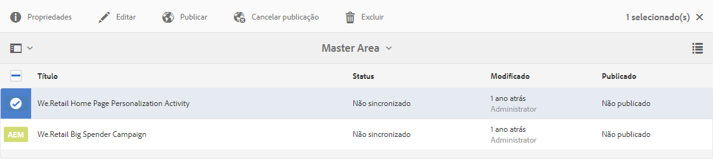
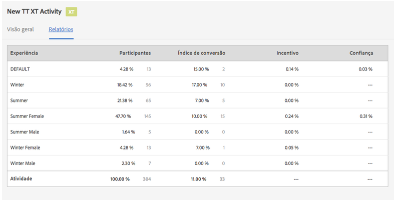
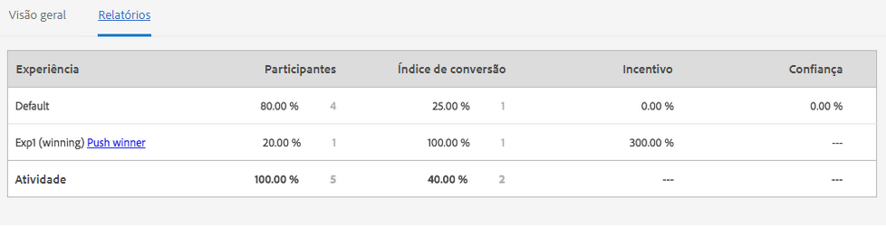
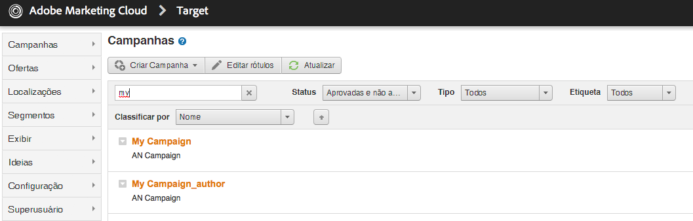

# Gerenciamento de atividades{#managing-activities}

>[!CAUTION]
>
>AEM 6.4 chegou ao fim do suporte estendido e esta documentação não é mais atualizada. Para obter mais detalhes, consulte nossa [períodos de assistência técnica](https://helpx.adobe.com/br/support/programs/eol-matrix.html). Encontre as versões compatíveis [here](https://experienceleague.adobe.com/docs/).

O console Atividades permite criar, organizar e gerenciar o marketing [atividades](/help/sites-authoring/personalization.md#activities) de suas marcas:

* Adicionar marcas.
* Para cada marca, adicione e configure atividades.
* Administrar atividades.

>[!NOTE]
>
>Se você estiver usando o Adobe Target como seu mecanismo de direcionamento, também poderá [exibir dados de desempenho de suas atividades](#viewing-performance-and-converting-winning-experiences-a-b-test). Se você estiver usando testes A/B, é possível [converter vencedores](#viewing-performance-and-converting-winning-experiences-a-b-test).

No console Atividades , as atividades são organizadas por marca. Você pode usar marcas e pastas para estruturar a organização de suas atividades. Navegue até o console Atividades tocando/clicando em **Personalização** e tocando/clicando **Atividades**.

As atividades estão disponíveis no modo Direcionar para a [criação de conteúdo direcionado](/help/sites-authoring/content-targeting-touch.md), onde você também pode criar atividades. As atividades criadas no modo Direcionar aparecem no console Atividades .

As atividades são exibidas com um rótulo descrevendo o tipo de atividade definido:

* XT - Direcionamento de experiência do Adobe Target
* A/B - Teste A/B do Adobe Target
* AEM - Direcionamento Adobe Experience Manager (orientado por contexthub ou clientcontext)

>[!NOTE]
>
>Os tipos de atividades disponíveis são determinados pelo seguinte:
>
>* Se a variável **xt_only** estiver ativada no locatário do Adobe Target (clientcode) usado no AEM para se conectar ao Adobe Target, você poderá criar **only** Atividades XT no AEM.
>
>* Se a variável **xt_only** opções é **not** habilitado no locatário do Adobe Target (clientcode), você poderá criar **both** Atividades XT e A/B no AEM.
>
>**Nota adicional:** **xt_only** é uma configuração aplicada em um determinado locatário do Target (clientcode) e só pode ser modificada diretamente no Adobe Target. Não é possível ativar ou desativar essa opção no AEM.

>[!CAUTION]
>
>Você deve proteger o nó de configurações de atividade **cq:ActivitySettings** na instância de publicação para que ele fique inacessível aos usuários normais. O nó de configurações de atividade só deve estar acessível ao serviço que lida com a sincronização de atividades com o Adobe Target.
>
>Consulte [Pré-requisitos para integração com o Adobe Target](/help/sites-administering/target-requirements.md) para obter informações detalhadas.

## Criação de uma marca usando o console Atividades {#creating-a-brand-using-the-activities-console}

Crie uma marca para a qual você deseja gerenciar as atividades de marketing.

Ao criar uma marca usando o console Atividades, ela também aparece no [console Ofertas](/help/sites-authoring/offerlib.md), onde é possível criar ofertas para as experiências das suas atividades.

1. No console Navegação, clique ou toque em **Personalização**. Clique ou toque em **Atividades**.

   

1. No console Atividades , clique ou toque em **Criar** then **Criar marca**.
1. Selecione o modelo da marca e clique ou toque **Próximo**.
1. Digite um título para a marca como deseja que apareça nos consoles Atividades e Ofertas . Opcionalmente, digite ou selecione uma ou mais tags para associar à marca.
1. Clique ou toque em **Criar**. Sua marca aparece no console Atividades.

## Adicionar/editar uma atividade usando o console Atividades {#adding-editing-an-activity-using-the-activities-console}

Adicione uma atividade ou edite uma atividade existente para concentrar seus esforços de marketing em públicos-alvo específicos. Ao criar/editar uma atividade, você especifica as seguintes informações:

* **Nome:** o nome da atividade.
* **Mecanismo de definição de metas:** o [AEM](/help/sites-authoring/personalization.md#aem) ou o [Adobe Target](/help/sites-authoring/personalization.md#adobe-target) como mecanismo de conteúdo direcionado.

* **Selecionar uma configuração de destino:** (somente no Adobe Target) a configuração em nuvem que essa atividade deve usar para se conectar ao Adobe Target. Essa opção aparece somente quando o Adobe Target é selecionado para o Mecanismo de direcionamento.
* **Tipo de atividade:** O tipo de atividade - Teste A/B ou Direcionamento de experiência
* **Objetivo:** (opcional) uma descrição da atividade.
* **Experiências:** mapeamentos entre os nomes de público-alvo e os segmentos de marketing que você está direcionando.
* **Porcentagens de tráfego:** se o teste A/B for selecionado, você poderá alterar a quantidade de tráfego (em porcentagem) de cada experiência.
* **Duração:** o período em que a atividade é aplicada.
* **Prioridade**: a prioridade relativa da atividade. Quando as atividades fornecem conteúdo para os mesmos segmentos de usuários, a atividade de maior prioridade é priorizada.
* **Métrica de meta:** se o Adobe Target for selecionado como o mecanismo de definição de metas, você poderá adicionar métricas de sucesso à atividade. É necessária uma métrica de sucesso.

>[!NOTE]
>
>As novas atividades do Adobe Target precisam ser **criadas** no editor de conteúdo direcionado, não no console **Atividades**, pois a sincronização com o Adobe Target falhará.
>
>No entanto, você pode editar atividades existentes do Adobe Target no console.

Para adicionar uma atividade:

1. Clique ou toque na marca para a qual você está criando a atividade, clique ou toque em **Criar** e depois **Criar atividade**. Se estiver editando, selecione a atividade e clique ou toque em **Editar**.
1. Forneça as seguintes informações e clique ou toque em **Próximo**:

   * Um nome para a atividade.
   * O mecanismo de direcionamento a ser usado. O ContextHub (AEM) é selecionado por padrão. Se precisar usar o Adobe Target, crie a atividade no editor de conteúdo direcionado.
   * Se você selecionou o Adobe Target como mecanismo de direcionamento, selecione/edite a configuração da nuvem a ser usada para se conectar ao Adobe Target. (Tenha cuidado para não selecionar uma estrutura criada para a configuração da nuvem.)
   * (Opcional) O objetivo ou uma descrição da atividade.
   * Selecione o Tipo de atividade.

1. Adicione uma ou mais experiências à atividade. Clique ou toque em **Adicionar experiência**.
1. Se estiver usando o direcionamento AEM ou o direcionamento de experiência do Adobe Target:

   1. Clique ou toque em **Selecionar público-alvo ** e selecione o segmento ao qual sua experiência está direcionada.
   1. Clique ou toque em **Adicionar experiência**, digite um nome e clique ou toque em **OK**.
   1. Clique ou toque em **Próximo**.

   Se estiver usando o Teste A/B do Adobe Target:

   1. Clique ou toque no lápis na caixa de públicos-alvo para selecionar um público-alvo.
   1. Clique ou toque em **Adicionar experiência**, digite um nome e clique ou toque em **OK**.
   1. Insira a porcentagem de tráfego que exibe cada experiência.
   1. Clique ou toque em **Próximo**.

1. Para especificar quando a atividade começa, use o **Iniciar** menu suspenso para selecionar um dos seguintes valores:

   * **Quando ativado:** A atividade começa quando a página que contém o conteúdo direcionado é ativada.
   * **Data e hora especificadas:** Um horário específico. Ao selecionar essa opção, clique ou toque no ícone de calendário, selecione uma data e especifique a hora para iniciar a atividade.

1. Para especificar quando a atividade termina, use o menu suspenso Fim para selecionar um dos seguintes valores:

   * **Quando desativado**: A atividade termina quando a página que contém o conteúdo direcionado é desativada.
   * **Data e hora especificadas**: Um horário específico. Ao selecionar essa opção, clique ou toque no ícone de calendário, selecione uma data e especifique a hora para terminar a atividade.

1. Para especificar uma prioridade para a atividade, use o controle deslizante para selecionar **Baixo**, **Normal** ou **Alto**.
1. Se estiver usando o Adobe Target como mecanismo de direcionamento, selecione o que deseja medir com essa atividade. Consulte [Configuração da atividade e definição de objetivos](/help/sites-authoring/content-targeting-touch.md) para obter mais informações sobre as métricas de sucesso disponíveis. Você deve selecionar pelo menos uma meta.
1. Clique ou toque em **Salvar**.

   >[!NOTE]
   >
   >Depois de criar uma atividade, você precisa publicá-la para que ela esteja disponível.

## Publicar e desfazer a publicação de atividades {#publishing-and-unpublishing-activities}

Você precisa publicar atividades para disponibilizá-las. Por outro lado, talvez você queira tornar as atividades indisponíveis ao cancelar a publicação.

>[!NOTE]
>
>Ao cancelar a publicação de uma atividade, o status da atividade não é alterado, a menos que você atualize a página.

Para publicar ou cancelar a publicação de atividades:

1. Clique ou toque na marca e, em seguida, na área que contém a atividade que você deseja publicar ou desfazer a publicação.
1. Toque ou clique no ícone ao lado da atividade ou atividades que você deseja publicar ou cancelar a publicação.

   

1. Para publicar, toque ou clique em **Publicar**. Para cancelar a publicação, toque ou clique em **Cancelar publicação**. Suas atividades são publicadas ou não, e seu status é alterado no console Atividades (pode exigir uma atualização).

## Atividades em instâncias de Autor e Publicação {#activities-on-author-and-publish-instances}

Quando uma atividade que usa o mecanismo direcionado do Adobe Target é ativada, uma segunda atividade é criada na instância de publicação:

* A atividade na instância do autor rastreia a atividade na instância do autor e é útil para simular a experiência do visitante. A análise registrada para essa atividade reflete somente o que ocorre na instância do autor.
* A atividade na instância de publicação reflete e responde à atividade no servidor de publicação. Essa é a atividade que é executada no site público. Somente a atividade de publicação é relevante para rastrear e analisar o uso do site público real.

## Visualização do desempenho e conversão de experiências vencedoras (Teste A/B) {#viewing-performance-and-converting-winning-experiences-a-b-test}

Você pode ver o desempenho de qualquer atividade do Adobe Target (XT ou A/B). Se você estiver usando testes A/B, também poderá converter a experiência vencedora, que se tornará a experiência padrão.

Para visualizar o desempenho da atividade e converter experiências vencedoras:

1. Em **Personalização**, clique ou toque em **Atividades** para navegar até o console **Atividades**.
1. Clique ou toque na marca cujas atividades você deseja ver.
1. Selecione a atividade e clique ou toque em **Propriedades da exibição **e clique na guia **Relatórios** e selecione a atividade na qual deseja visualizar o desempenho/converter experiências vencedoras. Os dados de desempenho são exibidos.

   

1. Clique ou toque no link **** Selecionar vencedor para promover esta como a experiência padrão.

   A conversão do vencedor faz o seguinte:

   * Desativa a atividade atual
   * Modifica todas as páginas e substitui o conteúdo segmentado pelo conteúdo real da experiência vencedora. O conteúdo da experiência vencedora torna-se parte da página normal **sem** direcionamento.

   

   Uma experiência vencedora é a experiência que gera mais Incentivo nos relatórios, que se baseia na taxa de conversão.

1. Clique ou toque em **Sim** para confirmar que deseja converter o vencedor, desative a experiência atual e substitua-a pelo conteúdo da experiência vencedora.

## Sincronização de atividades com o Adobe Target {#synchronizing-activities-with-adobe-target}

As atividades que usam o mecanismo de direcionamento do Adobe Target são sincronizadas com as campanhas do Adobe Target. Uma atividade é sincronizada automaticamente com o Adobe Target quando as seguintes condições são atendidas:

* A atividade contém pelo menos uma experiência.
* Pelo menos uma experiência contém um segmento mapeado e uma oferta.
* Cada experiência na atividade deve ter o mesmo número de ofertas.

Essas condições se aplicam a atividades em instâncias de autor e publicação.

Quando uma atividade é sincronizada, uma campanha correspondente é criada no Adobe Target:

* As atividades na instância de publicação têm o mesmo nome da campanha correspondente do Adobe Target.
* As atividades na instância do autor correspondem às campanhas do Target com o mesmo nome, mais o sufixo `_author`.

As atividades _author são sincronizadas imediatamente quando a atividade é modificada. A sincronização imediata permite a simulação de atividades com o ClientContext ou o ContextHub.

As atividades de publicação são sincronizadas quando a atividade é publicada na instância de publicação AEM.

## Solução de problemas de sincronização de atividades {#troubleshooting-activity-synchronization}

Quando o AEM sincroniza uma atividade com o Adobe Target, ele inclui uma propriedade dessa atividade denominada `thirdPartyId`. O valor dessa propriedade se baseia no caminho da atividade no repositório do AEM. Nenhuma campanha no Adobe Target pode ter o mesmo valor para a propriedade `thirdPartyId`. Portanto, uma atividade não será sincronizada se uma campanha existente (de um tipo diferente AB, XT) no Adobe Target usar o mesmo valor para `thirdPartyId`.

Essa situação pode ocorrer nas seguintes circunstâncias:

1. Uma atividade é criada e sincronizada com o Adobe Target.
1. Em outra instância do AEM, uma atividade é criada com a mesma marca e usando o mesmo nome. A sincronização dessa atividade falha ao tentar.

Essa situação também pode ocorrer nas seguintes circunstâncias:

1. Uma atividade é criada e sincronizada com o Adobe Target. A atividade é então excluída em AEM.
1. Uma atividade é criada com a mesma marca e usando o mesmo nome da atividade excluída. A sincronização dessa atividade falha ao tentar.

Para evitar problemas de sincronização, sempre use nomes exclusivos para atividades do . Se uma atividade não for sincronizada, você poderá excluir a campanha no Adobe Target que usa o mesmo nome se essa campanha não estiver sendo usada.

>[!NOTE]
>
>Ao criar uma campanha no Adobe Target, ela atribui uma propriedade chamada `thirdPartyId t`Para cada campanha. Quando você exclui a campanha no Adobe Target, a propriedade `thirdPartyId` não é excluída. Não é possível reutilizar o `thirdPartyId` para campanhas de tipos diferentes (AB, XT) e ele não pode ser removido manualmente. Para evitar esse problema, dê a cada campanha um nome exclusivo. Por isso, nomes de campanhas não podem ser reutilizados em diferentes tipos de campanha.
>
>Se você usar o mesmo nome no mesmo tipo de campanha, a campanha existente será substituída.
>
>Se, durante a sincronização, você encontrar o erro “A solicitação falhou. `thirdPartyId` já existe”, altere o nome da campanha e sincronize novamente.
