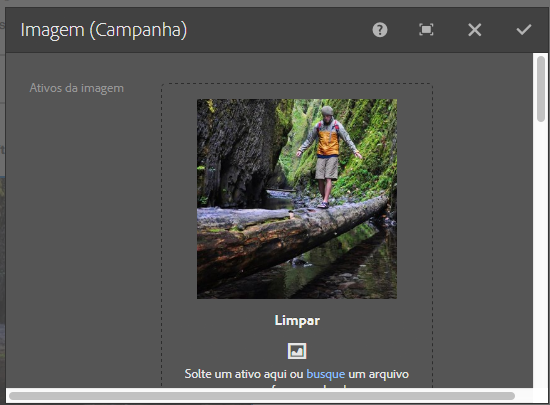

# Componentes do Adobe Campaign{#adobe-campaign-components}

Ao fazer a integração com o Adobe Campaign, você tem componentes disponíveis para trabalhar com informativos e formulários. Ambos estão descritos neste documento.

## Componentes de informativos do Adobe Campaign {#adobe-campaign-newsletter-components}

Todos os componentes de Campanha seguem as práticas recomendadas descritas em [Práticas recomendadas para modelos de email](/help/sites-administering/best-practices-for-email-templates.md) e se baseiam na linguagem de marcação [HTL](https://helpx.adobe.com/experience-manager/htl/using/overview.html) da Adobe.

Ao abrir um informativo/email configurado para integração com o Adobe Campaign, você deve ver os seguintes componentes na seção **Informativo do Adobe Campaign**:

* Cabeçalho (Campaign)
* Imagem (Campaign)
* Link (Campaign)
* Modelo de imagem do Scene7 (Campaign)
* Referência direcionada (Campaign)
* Texto e imagem (Campaign)
* Texto e personalização (Campaign)

Uma descrição desses componentes encontra-se na seção a seguir.

Os componentes aparecem da seguinte maneira:

### Cabeçalho (Campaign) {#heading-campaign}

O componente de cabeçalho pode:

* Exibir o nome da página atual, deixando o campo **Título** em branco.
* Exibir um texto especificado no campo **Título**.

A edição do componente **Cabeçalho (Campaign)** é feita diretamente. Deixe em branco para utilizar o título da página.

É possível configurar os seguintes itens:

* **Título** Caso deseje usar um nome diferente do título da página, insira-o aqui.

* **Nível de cabeçalho (1, 2, 3, 4)** O nível de cabeçalho com base nos tamanhos de cabeçalho HTML de 1 a 4.

O exemplo a seguir mostra um componente Cabeçalho (Campaign) sendo exibido.

### Imagem (Campaign) {#image-campaign}

O componente Imagem (Campaign) exibe uma imagem e o texto anexo de acordo com os parâmetros especificados.

Você pode fazer upload de uma imagem e depois editá-la e manipulá-la (por exemplo, recortar, girar, adicionar link/título/texto).

Você pode arrastar e soltar uma imagem do [Navegador de ativos](/help/sites-authoring/author-environment-tools.md#assets-browser) diretamente no componente ou na caixa de diálogo [Configurar](/help/sites-authoring/editing-content.md#edit-configure-copy-cut-delete-paste). Você também pode fazer upload de uma imagem na caixa de diálogo Configurar; esta caixa de diálogo também controla todas as definições e manipulações da imagem:

>[!NOTE]
>
>You must enter information in the **Alt Text** field, or the image cannot be saved.

After the image is uploaded (and not before) you can use [inplace editing](/help/sites-authoring/editing-content.md#edit-configure-copy-cut-delete-paste) to crop/rotate the image as required:

>[!NOTE]
>
>O editor local usa o tamanho e a proporção original da imagem durante a edição. Você também pode especificar as propriedades de altura e largura. Qualquer restrição de tamanho e aspecto definida nas propriedades será aplicada ao salvar as alterações de edição.
>
>Dependendo do seu caso, restrições mínimas e máximas também podem ser impostas pelo [design da página ](/help/sites-developing/designer.md); estas são desenvolvidas durante a implementação do projeto.

Várias opções adicionais estão disponíveis no modo de edição de tela cheia; por exemplo, mapa e zoom:

Quando uma imagem é carregada, você pode configurar o seguinte:

* **Mapa**

   Para mapear uma imagem, selecione Mapa. É possível selecionar como deseja criar o mapa de imagem (retângulo, polígono e assim por diante) e especificar para onde a área deve apontar.

* **Cortar**

   Selecione Recortar para recortar uma imagem. Use o mouse para recortar a imagem.

* **Girar**

   Para girar uma imagem, selecione Girar. Clique repetidamente até que a imagem seja girada da maneira que desejar.

* **Limpar**

   Remova a imagem atual.

* Barra de zoom (somente clássica)

   Para ampliar e reduzir a imagem, use a barra de rolagem abaixo da imagem (acima dos botões OK e Cancelar)

* **Título**

   O título da imagem.

* **Texto alternativo**

   Um texto alternativo para usar ao criar conteúdo acessível.

* **Vincular ao**

   Crie um link para ativos ou outras páginas em seu site.

* **Descrição**

   A descrição da imagem.

* **Tamanho**

   Define a altura e a largura da imagem.

>[!NOTE]
>
>Você deve inserir informações no campo **Alternar texto** da guia **Avançado**, ou a imagem não poderá ser salva, e a seguinte mensagem de erro será exibida:
>
>`Validation failed. Verify the values of the marked fields.`

O exemplo a seguir mostra um componente Imagem (Campaign) sendo exibido.

### Link (Campaign) {#link-campaign}

O componente Link (Campaign) permite adicionar um link ao seu informativo.

É possível configurar os seguintes itens nas guias **Exibir**, **Informações de URL** ou **Avançado**:

* **Legenda do link**

   A legenda do link. Este é o texto visualizado pelos usuários.

* **Dica de ferramenta de link**

   Adiciona informações adicionais sobre como usar o link.

* **LinkType**

   In the drop-down list, select between a **Custom URL** and an **Adaptive Document**. Este campo é obrigatório. Se você selecionar um URL personalizado, será possível fornecer o URL do link. Se você selecionar Documento adaptável, é possível fornecer o caminho do documento.

* **Parâmetro de URL adicional**

   Adicione outros parâmetros de URL. Clique em Adicionar item para adicionar vários itens.

>[!NOTE]
>
>You must enter information in the **Link Type** field in the **URL Info** tab, or the component cannot save and you see the following error message:
>
>`Validation failed. Verify the values of the marked fields.`

O exemplo a seguir mostra um componente Link (Campaign) sendo exibido.

### Modelo de imagem do Scene7 (Campaign) {#scene-image-template-campaign}

[Os Modelos](https://help.adobe.com/en_US/scene7/using/WS60B68844-9054-4099-BF69-3DC998A04D3C.html) de imagem Scene7 são em camadas de arquivos de imagem, onde o conteúdo e as propriedades podem ser parametrizados para a variabilidade. O componente **Modelo de imagem** permite usar modelos do Scene7 em informativos e alterar os valores dos parâmetros de modelo. Além disso, você pode usar variáveis de metadados do Adobe Campaign dentro dos parâmetros, para que cada usuário experimente a imagem de forma personalizada.

Clique em **Editar** para configurar o componente. Você pode definir as configurações descritas nesta seção. This Scene7 Image template is described in detail in [Scene7 Image Template component](/help/assets/scene7.md#image-template).

Além disso, o painel de parâmetros lista todos os parâmetros de modelo que foram definidos para o modelo no Scene7. Para cada um desses parâmetros, você pode adaptar o valor, inserir variáveis ou redefini-las para seus valores padrão.

### Referência direcionada (Campaign) {#targeted-reference-campaign}

O componente Referência direcionada (Campaign) permite criar uma referência a um parágrafo direcionado.

Nesse componente, você navega até o parágrafo direcionado para selecioná-lo.

Clique no ícone de pasta para navegar até o parágrafo que você deseja referenciar. Quando terminar, clique na marca de seleção.

### Texto e imagem (Campaign) {#text-image-campaign}

O componente Texto e imagem (Campaign) adiciona um bloco de texto e uma imagem.

Ao clicar para configurar o componente, você seleciona Texto ou Imagem.

Selecionar **Texto** exibe um editor em linha:

Selecionar **Imagem** exibe o editor local de imagens:

Consulte [Componente de imagem (Campaign)](#image-campaign) para obter mais informações sobre como trabalhar com imagens. Consulte [Componente de texto e personalização (Campaign)](#text-personalization-campaign) para obter mais informações sobre como trabalhar com texto.

Assim como nos componentes Texto e personalização (Campaign) e Imagem (Campaign), é possível configurar:

* **Texto**

   Insira o texto. Use a barra de ferramentas para modificar a formatação, criar listas e adicionar links.

* **Imagem**

   Arraste uma imagem do localizador de conteúdo ou clique para navegar até uma imagem. Recorte e gire, conforme necessário.

* **Propriedades** da imagem (Propriedades **** avançadas da imagem)

   Permite que você especifique o seguinte:

   * **Título**

      O título do bloco; serão mostrados ao passar o mouse.

   * **Texto alternativo**

      O texto alternativo a ser exibido se a imagem não puder ser exibida.

   * **Vincular para**

      Crie um link para ativos ou outras páginas em seu site.

   * **Descrição**

      A descrição da imagem.

   * **Tamanho**

      Define a altura e a largura da imagem.

>[!NOTE]
>
>O campo **Alternar texto** na guia **Avançado** é necessário, ou o componente não poderá ser salvo, e você verá a seguinte mensagem de erro:
>
>`Validation failed. Verify the values of the marked fields.`

O exemplo a seguir mostra um componente Texto e imagem (Campaign) sendo exibido.

### Texto e personalização (Campaign) {#text-personalization-campaign}

The Text &amp; Personalization (Campaign) component lets you enter a text block using a WYSIWYG editor, with functionality provided by the [Rich Text editor](/help/sites-authoring/rich-text-editor.md). Além disso, esse componente permite usar campos de contexto e blocos de personalização disponíveis no Adobe Campaign. Consulte também [Inserir personalização](/help/sites-authoring/campaign.md#inserting-personalization).

A seleção de ícones permite que você formate o texto, incluindo características de fontes, alinhamento, links, listas e recuo. The functionality is basically the same in [both UIs](/help/sites-authoring/editing-content.md), although the look-and-feel is different:

No editor local, você pode adicionar texto, alterar a justificação, adicionar e remover links, adicionar campos de contexto ou blocos de personalização e entrar no modo de tela inteira. Quando terminar de adicionar texto/personalização, clique na marca de seleção para salvar suas alterações (ou clique no X para cancelar). See [Inplace editing](/help/sites-authoring/editing-content.md#edit-configure-copy-cut-delete-paste) for more information.

>[!NOTE]
>
>* Os campos de personalização disponíveis dependem do modelo do Adobe Campaign ao qual o seu informativo está vinculado.
>* Após a seleção de uma persona no ContextHub, os campos de personalização são automaticamente substituídos pelos dados do perfil selecionado.

>
>
Consulte [Inserir personalização](/help/sites-authoring/campaign.md#inserting-personalization).

>[!NOTE]
>
>Apenas os campos definidos no esquema **nms:seedMember** ou em uma de suas extensões são levados em consideração. Os atributos das tabelas vinculadas a **nms:seedMember** não estão disponíveis.

## Componentes de formulário do Adobe Campaign {#adobe-campaign-form-components}

Você usa componentes do Adobe Campaign para criar um formulário que os usuários preenchem para assinar um informativo, cancelar a assinatura de um informativo ou atualizar seus perfis de usuário. Consulte [Criação de formulários do Adobe Campaign](/help/sites-authoring/adobe-campaign-forms.md) para obter mais informações.

Cada campo de componente pode ser vinculado a um campo de banco de dados do Adobe Campaign. Os campos disponíveis diferem de acordo com o tipo de dados que eles contêm, conforme descrito na seção [Componentes e tipo de dados](#components-and-data-type). Se você estender o esquema de destinatários no Adobe Campaign, os novos campos estarão disponíveis nos componentes cujos tipos de dados corresponderem.

When you open a form that is configured to integrate with Adobe Campaign, you see the following components in the **Adobe Campaign** section:

* Caixa de seleção (Campaign)
* Campo de dados (Campaign) e Campo de data/HTML5 (Campaign)
* Chave primária criptografada (Campaign)
* Exibição de erro (Campaign)
* Chave de reconciliação oculta (Campaign)
* Campo numérico (Campaign)
* Campo de opções (Campaign)
* Lista de verificação de assinaturas (Campaign)
* Campo de texto (Campaign)

Os componentes aparecem da seguinte maneira:

Esta seção descreve cada componente em detalhes.

### Componentes e tipo de dados {#components-and-data-type}

A tabela a seguir descreve os componentes disponíveis para exibir e modificar dados de perfil do Adobe Campaign. Cada componente pode ser mapeado para um campo de perfil do Adobe Campaign para exibir seu valor e atualizar o campo quando o formulário for enviado. Os diferentes componentes só podem ser correspondidos a campos de um tipo de dados apropriado.

<table> 
 <tbody> 
  <tr> 
   <td>
<strong>Componente</strong>
 </td> 
   <td>
<strong>Tipo de dados do campo Adobe Campaign</strong>
 </td> 
   <td>
<strong>Exemplo de campo</strong>
 </td> 
  </tr> 
  <tr> 
   <td>
Caixa de seleção (Campaign)
 </td> 
   <td>
boolean
 </td> 
   <td>
Não há mais contato (por nenhum canal)
 </td> 
  </tr> 
  <tr> 
   <td>
Campo de dados (Campanha)
 
Campo de data/HTML 5 (Campanha)
 </td> 
   <td>
date
 </td> 
   <td>
Data de nascimento
 </td> 
  </tr> 
  <tr> 
   <td>
Campo numérico (Campaign)
 </td> 
   <td>
numérico (byte, curto, longo, duplo)
 </td> 
   <td>
Idade
 </td> 
  </tr> 
  <tr> 
   <td>
Campo de opções (Campaign)
 </td> 
   <td>
byte com valores associados
 </td> 
   <td>
Sexo
 </td> 
  </tr> 
  <tr> 
   <td>
Campo de texto (Campaign)
 </td> 
   <td>
string
 </td> 
   <td>
E-mail
 </td> 
  </tr> 
 </tbody> 
</table>

### Configurações comuns à maioria dos componentes {#settings-common-to-most-components}

Os componentes do Adobe Campaign têm configurações que são comuns em todos os componentes (exceto os componentes Chave primária criptografada e Chave de reconciliação oculta).

Na maioria dos componentes, você pode configurar o seguinte:

#### Título e texto {#title-and-text}

* **Título**

   Se quiser usar um nome diferente do nome do elemento, insira-o aqui.

* **Ocultar título**

   Marque essa caixa de seleção se não quiser que o título fique visível.

* **Descrição**

   Adicione uma descrição ao campo para fornecer mais informações aos usuários.

* **Mostrar apenas o valor**

   Mostra somente o valor, se houver

#### Adobe Campaign {#adobe-campaign}

É possível configurar os seguintes itens:

* **Mapeamento**

   Selecione um campo de personalização do Adobe Campaign, se apropriado.

* **Tecla de reconciliação**

   Marque essa caixa de seleção se este campo fizer parte da chave de reconciliação.

#### Restrições {#constraints}

* **Obrigatório**

   Marque essa caixa de seleção para tornar este componente necessário; ou seja, os usuários devem digitar um valor.

* **Mensagem obrigatória**

   Como opção, adicione uma mensagem informando que o campo é obrigatório.

#### Estilo {#styling}

* **CSS** Insira as classes CSS que você deseja usar para esse componente.

### Caixa de seleção (Campaign) {#checkbox-campaign}

O componente Caixa de seleção (Campaign) permite que o usuário modifique campos de perfil do Adobe Campaign que são do tipo de dados booleano. Por exemplo, você pode ter um componente Caixa de seleção (Campaign) que permite ao destinatário especificar que ele não deseja ser contatado por meio de nenhum canal.

É possível [definir configurações comuns à maioria dos componentes do Adobe Campaign](#settings-common-to-most-components) no componente Caixa de seleção (Campaign).

O exemplo a seguir mostra um componente Caixa de seleção (Campaign) sendo exibido.

### Campo de dados (Campaign) e Campo de data/HTML 5 (Campaign) {#date-field-campaign-and-date-field-html-campaign}

Use o campo de data para permitir que os destinatários especifiquem uma data. Por exemplo, você pode querer que os destinatários especifiquem suas datas de nascimento. O formato da data corresponde ao formato usado na sua instância do Adobe Campaign.

Além das [configurações comuns à maioria dos componentes do Adobe Campaign](#settings-common-to-most-components), você pode configurar o seguinte:

* **Restrições - lista suspensa Restrição**

   You can select - **None** or **Date**- to add the constraint of a date or no constraint. Se você selecionar data, a resposta que os usuários inserirem no campo deverão estar em um formato de data.

* **Mensagem de restrição**

   Além disso, você pode adicionar uma mensagem de restrição para que os usuários saibam como formatar corretamente suas respostas.
* **Estilo - Largura** Ajusta a largura do campo clicando ou tocando no botão 
**+** e **-** ícones ou inserir um número.

O exemplo a seguir mostra um componente Campo de dados (Campaign) com a largura ajustada sendo exibida.

### Chave primária criptografada (Campaign) {#encrypted-primary-key-campaign}

Esse componente define o nome do parâmetro de URL que conterá o identificador de um perfil do Adobe Campaign (**Identificador de recurso principal** ou **Chave primária criptografada** no Adobe Campaign Standard e 6.1, respectivamente).

Cada formulário que exibe e modifica dados de perfil do Adobe Campaign **deve** incluir um componente Chave primária criptografada.

Você pode configurar o seguinte no componente Chave primária criptografada (Campaign):

* **Título e texto - Nome do elemento**

   O padrão é encryptedPK. Você só precisará alterar o nome do elemento quando ele estiver em conflito com o nome de outro elemento no formulário. Dois campos de formulário não podem ter o mesmo nome de elemento.
* **Adobe Campaign - parâmetro de URL** Adicione o parâmetro de URL para a EPK. Por exemplo, você pode usar o valor 
**epk**.

O exemplo a seguir mostra um componente Chave primária criptografada (Campaign) sendo exibido.

### Exibição de erro (Campaign) {#error-display-campaign}

Esse componente permite exibir erros de back-end. O tratamento de erros do formulário deve ser definido como Encaminhar para que o componente funcione corretamente.

O exemplo a seguir mostra um componente Exibição de erro (Campaign) sendo exibido.

### Chave de reconciliação oculta (Campaign) {#hidden-reconciliation-key-campaign}

O componente Chave de reconciliação oculta (Campanha) permite adicionar campos ocultos como parte da chave de reconciliação a um formulário.

Você pode configurar os seguintes itens no componente Chave de reconciliação oculta (Campaign):

* **Título e texto - Nome do elemento**

   Assume como padrão a ReconcilKey. Você só precisará alterar o nome do elemento quando ele estiver em conflito com o nome de outro elemento no formulário. Dois campos de formulário não podem ter o mesmo nome de elemento.
* **Adobe Campaign - Mapeamento** Mapeie para um campo de personalização do Adobe Campaign.

O exemplo a seguir mostra um componente Chave de reconciliação oculta (Campaign) sendo exibido.

### Campo numérico (Campaign) {#numeric-field-campaign}

Use o campo numérico para permitir que os destinatários insiram números, por exemplo, suas idades.

Além das [configurações comuns à maioria dos componentes do Adobe Campaign](#settings-common-to-most-components), você pode configurar o seguinte:

* **Restrições - lista suspensa Restrição**

   You can select - **None** or **Numeric** - to add the constraint of either a number or no constraint. Se você selecionar um número, a resposta que os usuários inserirem no campo deverá ser numérica.

* **Mensagem de restrição**

   Além disso, você pode adicionar uma mensagem de restrição para que os usuários saibam como formatar corretamente suas respostas.
* **Estilo - Largura** Ajusta a largura do campo clicando ou tocando no botão 
**+** e **-** ícones ou inserir um número.

O exemplo a seguir mostra um componente Campo numérico (Campaign) com a largura configurada sendo exibida.

### Campo de opções (Campaign) {#option-field-campaign}

Essa lista suspensa permite selecionar uma opção, por exemplo, o sexo ou o status de um destinatário.

É possível [definir configurações comuns à maioria dos componentes do Adobe Campaign](#settings-common-to-most-components) no componente Campo de opções (Campaign). Para preencher a lista suspensa, selecione o campo apropriado nos campos de personalização do Adobe Campaign, clicando ou tocando no símbolo do Adobe Campaign e navegando até o campo.

O exemplo a seguir mostra um componente Campo de opções (Campaign) sendo exibido.

### Lista de verificação de assinaturas (Campaign) {#subscriptions-checklist-campaign}

Use o componente **Lista de verificação de assinaturas (Campaign)** para modificar as assinaturas associadas a um perfil do Adobe Campaign.

Quando adicionado a um formulário, esse componente exibe todas as assinaturas disponíveis como caixas de seleção e permite que o usuário selecione as assinaturas desejadas. When users submit the form, this component subscribes the user to or unsubscribes the user from the selected services depending on the form action type (**Adobe Campaign: Subscribe to Services** or **Adobe Campaign: Unsubscribe from Services**).

>[!NOTE]
>
>O componente não verifica quais serviços já foram assinados/cancelados pelo usuário.

É possível [definir configurações comuns à maioria dos componentes do Adobe Campaign](#settings-common-to-most-components) no componente Lista de verificação de assinaturas (Campaign). (Não há configurações do Adobe Campaign disponíveis para esse componente.)

O exemplo a seguir mostra um componente Lista de verificação de assinaturas (Campaign) sendo exibido.

### Campo de texto (Campaign) {#text-field-campaign}

O componente Campo de texto (Campaign), que permite inserir dados do tipo sequência de caracteres, como nome, sobrenome, endereço, endereço de email e assim por diante.

Além das [configurações comuns à maioria dos componentes do Adobe Campaign](#settings-common-to-most-components), você pode configurar o seguinte:

* **Restrições - lista suspensa Restrição**

   You can select - **None, Email,** or **Name (no umlauts)**- to add the constraint of either an email address, name, or no constraint. Se você selecionar um email, a resposta que os usuários inserirem no campo deverá ser um endereço de email. Se você selecionar um nome, a resposta deverá ser um nome (tremas não são permitidos).

* **Mensagem de restrição**

   Além disso, você pode adicionar uma mensagem de restrição para que os usuários saibam como formatar corretamente suas respostas.

* **Estilo - Largura**

   Adjust the width of the field by clicking or tapping the **+** and **-** icons or entering a number.

O exemplo a seguir mostra um componente Campo de texto (Campaign) sendo exibido.

