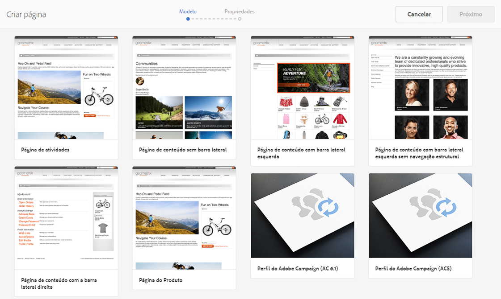
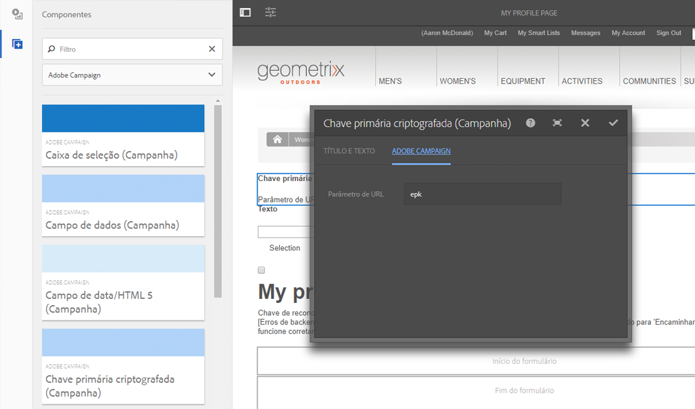

# Criação do Adobe Campaign Forms no AEM {#creating-adobe-campaign-forms-in-aem}

>[!CAUTION]
>
>AEM 6.4 chegou ao fim do suporte estendido e esta documentação não é mais atualizada. Para obter mais detalhes, consulte nossa [períodos de assistência técnica](https://helpx.adobe.com/br/support/programs/eol-matrix.html). Encontre as versões compatíveis [here](https://experienceleague.adobe.com/docs/).

AEM permite criar e usar formulários que interagem com o Adobe Campaign no seu site. Campos específicos podem ser inseridos em seus formulários e mapeados para o banco de dados do Adobe Campaign.

Você pode gerenciar novas assinaturas de contato, unsubscriptions e dados de perfil de usuário, enquanto integra seus dados ao banco de dados do Adobe Campaign.

Para usar formulários Adobe Campaign no AEM, siga estas etapas, descritas neste documento:

1. Disponibilizar um modelo.
1. Crie um formulário.
1. Edite o conteúdo do formulário.

Três tipos de formulários, específicos para o Adobe Campaign, estão disponíveis por padrão:

* Salvar um perfil
* Assinar um serviço
* Cancelar assinatura de um serviço

Esses formulários definem um parâmetro de URL que aceita a chave primária criptografada de um perfil do Adobe Campaign. Com base nesse parâmetro de URL, o formulário atualiza os dados do perfil do Adobe Campaign associado.

Embora esses formulários sejam criados independentemente, em um caso de uso típico, você gera um link personalizado para uma página de formulário dentro do conteúdo do informativo, para que os recipients possam abrir o link e fazer ajustes nos dados do perfil (seja cancelar a assinatura, assinar ou atualizar seu perfil).

O formulário é atualizado automaticamente com base no usuário. Consulte [Editar conteúdo do formulário](#editing-form-content) para obter mais informações.

## Disponibilizar um modelo {#making-a-template-available}

Antes de poder criar formulários específicos ao Adobe Campaign, você deve disponibilizar os diferentes modelos no seu aplicativo AEM.

Para fazer isso, consulte a [Documentação de modelos](/help/sites-developing/templates.md#template-availability).

## Criação de um formulário {#creating-a-form}

Primeiro, verifique a conexão entre as instâncias de autor e publicação e o Adobe Campaign está funcionando. Consulte [Integração com o Adobe Campaign Standard](/help/sites-administering/campaignstandard.md) ou [Integração com o Adobe Campaign Classic](/help/sites-administering/campaignonpremise.md).

>[!NOTE]
>
>Certifique-se de que o **acMapping** na página **jcr:content** nó está definido como **mapRecipient** ou **perfil** ao usar o Adobe Campaign Classic ou Adobe Campaign Standard, respectivamente

1. Em AEM, em Sites, navegue até o local em que deseja criar uma nova página.
1. Crie uma página e selecione **Perfil do Adobe Campaign Classic** ou **Perfil do Adobe Campaign Standard** e clique em **Próximo**.

   

   >[!NOTE]
   >
   >Se o modelo desejado não estiver disponível, consulte [Disponibilidade do modelo](/help/sites-developing/templates.md#template-availability).

1. No **Nome** , adicione o nome da página. Deve ser um nome JCR válido.
1. No **Título** , insira um título e clique em **Criar**.
1. Abra a página e selecione **Abrir propriedades** e no Cloud Services, adicione a configuração do Adobe Campaign e selecione a marca de seleção para salvar suas alterações.

   

1. Na página , no **Início do formulário** , selecione o tipo de formulário - **Assinar, Cancelar assinatura,** ou **Salvar perfil**. Só é possível ter um tipo por formulário. Agora você pode [editar o conteúdo do formulário](#editing-form-content).

## Editar conteúdo do formulário {#editing-form-content}

O Forms dedicado ao Adobe Campaign tem componentes específicos. Esses componentes têm uma opção que permite vincular cada campo do formulário a um campo no banco de dados do Adobe Campaign.

>[!NOTE]
>
>Se o modelo desejado não estiver disponível, consulte [Disponibilizar um template](/help/sites-authoring/adobe-campaign.md).

Esta seção só detalha links específicos do Adobe Campaign. Para obter mais informações sobre uma visão geral de como usar formulários no Adobe Experience Manager, consulte [Componentes do modo de edição](/help/sites-authoring/default-components-foundation.md).

1. Selecionar **Abrir propriedades** e no Cloud Services, adicione a configuração do Adobe Campaign e selecione a marca de seleção para salvar suas alterações.

   

1. Na página , no **Início do formulário** , clique no ícone Configuração .

   

1. Clique no botão **Avançado** e selecione o tipo de formulário - **Assinar, Cancelar assinatura,** ou **Salvar perfil** e clique em **Ok.** Só é possível ter um tipo por formulário.

   * **Adobe Campaign: Salvar perfil**: permite criar ou atualizar um recipient no Adobe Campaign (valor padrão).
   * **Adobe Campaign: Inscrever-se nos Serviços**: permite gerenciar as assinaturas de um recipient no Adobe Campaign.
   * **Adobe Campaign: Cancelar assinatura dos serviços**: permite cancelar as assinaturas de um recipient no Adobe Campaign.

1. Você deve ter um **Chave primária criptografada** em cada formulário. Esse componente define qual parâmetro de URL será usado para aceitar a chave primária criptografada de um perfil do Adobe Campaign. Em Componentes, selecione Adobe Campaign para que apenas esses componentes fiquem visíveis.
1. Arraste o componente **Chave primária criptografada** para o formulário (em qualquer lugar) e clique ou toque no **Configuração** ícone . No **Adobe Campaign** , especifique qualquer nome para o parâmetro do URL. Clique ou toque na marca de seleção para salvar suas alterações.

   Os links gerados para esse formulário precisam usar esse parâmetro de URL e atribuir a ele a chave primária criptografada de um perfil do Adobe Campaign. A chave primária criptografada deve ser corretamente codificada por URL (porcentagem).

   

1. Adicione componentes ao formulário conforme necessário, como um campo de Texto, um campo de Data, um campo de Caixa de seleção, um campo de Opção e assim por diante. Consulte [Componentes de formulário do Adobe Campaign](/help/sites-authoring/adobe-campaign-components.md) para obter mais informações sobre cada componente.
1. Clique no ícone Configuração para abrir o componente. Por exemplo, em **Campo de texto (Campaign)** , altere o título e o texto.

   Clique em **Adobe Campaign** para mapear o campo de formulário para uma variável de metadados Adobe Campaign. Ao enviar o formulário, o campo mapeado é atualizado no Adobe Campaign. Somente campos com tipos correspondentes estão disponíveis no seletor de variáveis (por exemplo, variáveis de sequência de caracteres para campos de texto).

   

   >[!NOTE]
   >
   >Você pode adicionar/remover campos exibidos na tabela de recipients seguindo as instruções aqui: [https://blogs.adobe.com/experiencedelivers/experience-management/aem-campaign-integration/](https://blogs.adobe.com/experiencedelivers/experience-management/aem-campaign-integration/)

1. Clique em **Publicar página**. A página é ativada em seu site. Você pode visualizá-lo acessando a instância de publicação do AEM. Você também pode [testar um formulário](#testing-a-form).

   >[!CAUTION]
   >
   >Você precisa fornecer permissões de leitura ao usuário anônimo no serviço de nuvem para usar formulários na publicação. No entanto, esteja ciente dos possíveis problemas de segurança ao fornecer permissões de leitura ao usuário anônimo e certifique-se de atenuá-lo, por exemplo, configurando o dispatcher.

## Teste de um formulário {#testing-a-form}

Depois de criar um formulário e editar o conteúdo, convém testar manualmente se ele está funcionando conforme o esperado.

>[!NOTE]
>
>Você deve ter um **Chave primária criptografada** em cada formulário. Em Componentes, selecione Adobe Campaign para que apenas esses componentes fiquem visíveis.
>
>Embora neste procedimento você insira o número da EPK manualmente, na prática, os usuários receberiam um link para esta página (para cancelar a assinatura, assinar ou atualizar seu perfil) em um boletim informativo. Com base no usuário, a EPK é atualizada automaticamente.
>
>Para criar esse link, use a variável **Identificador de recurso principal**(Adobe Campaign Standard) ou **Identificador criptografado** (Adobe Campaign Classic) (por exemplo, em um **Texto e personalização (Campaign)** componente), que vincula à EPK no Adobe Campaign.

Para fazer isso, você precisa obter manualmente a EPK de um perfil do Adobe Campaign e, em seguida, anexá-la ao URL:

1. Para obter a chave primária criptografada (EPK) de um perfil do Adobe Campaign:

   * No Adobe Campaign Standard - navegue para **Perfis e públicos-alvo** > **Perfis**, que lista os perfis existentes. Certifique-se de que a tabela exiba a variável **Identificador de recurso principal** em uma coluna (É possível configurar clicando/tocando em **Configurar lista**). Copie o identificador de recurso principal do perfil desejado.
   * No Adobe Campaign Classic, acesse **Perfis e metas** >  **Recipients**, que lista os perfis existentes. Certifique-se de que a tabela exiba a variável **Identificador criptografado** em uma coluna (É possível configurar clicando com o botão direito do mouse em uma entrada e selecionando **Configurar lista...**). Copie o identificador criptografado do perfil desejado.

1. Em AEM, abra a página do formulário na instância de publicação e anexe a EPK da etapa 1 como um parâmetro de URL: use o mesmo nome definido anteriormente no componente EPK ao criar o formulário (por exemplo: `?epk=...`)
1. O formulário agora pode ser usado para modificar os dados e assinaturas associados ao perfil vinculado do Adobe Campaign. Após modificar alguns campos e enviar o formulário, é possível verificar no Adobe Campaign se os dados apropriados foram atualizados.

Os dados no banco de dados do Adobe Campaign são atualizados assim que um formulário é validado.
