# Ambiente e ferramentas de criação{#authoring-the-environment-and-tools}

O ambiente de criação do AEM fornece vários mecanismos para organização e edição de conteúdo. As ferramentas fornecidas são acessadas de vários consoles e editores de página.

## Gerenciar o site {#managing-your-site}

O console **Sites** permite navegar e gerenciar o site, usando a barra de cabeçalho, a barra de ferramentas, os ícones de ação (aplicáveis ao recurso selecionado), as navegações estruturais e, quando selecionados, os trilhos secundários (por exemplo, linha do tempo e referências).

Por exemplo, exibição de cartão:

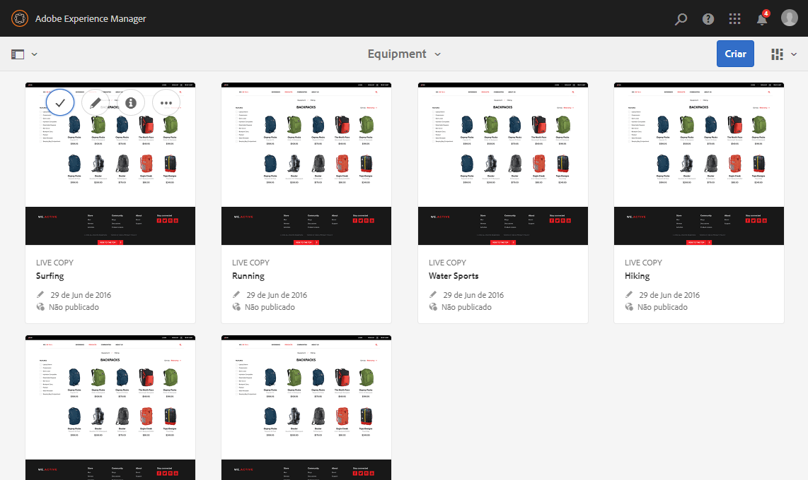

## Editar conteúdo da página {#editing-page-content}

Você pode editar uma página com o editor de páginas. Por exemplo:

`http://localhost:4502/editor.html/content/we-retail/us/en/equipment.html`

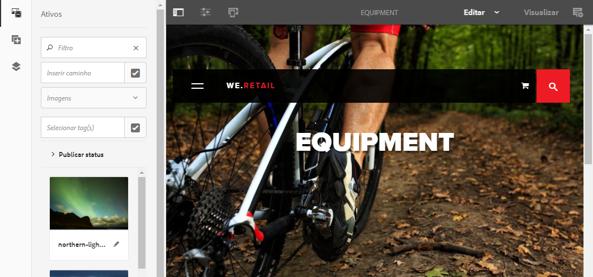

>[!NOTE]
>
>Na primeira vez que você abrir uma página para edição, uma série de slides oferecerá um tour dos recursos.
>
>Ignore o tour, se desejar, e repita-o a qualquer momento selecionando o menu **Informações da página.**

## Acessar ajuda {#accessing-help}

Ao editar uma página, a **Ajuda** pode ser acessada de:

* o seletor [**Informações da página **](/help/sites-authoring/editing-page-properties.md#page-properties); isso mostrará os slides de introdução (como na primeira vez que você acessa o editor).
* a caixa de diálogo [Configuração](/help/sites-authoring/editing-content.md#edit-configure-copy-cut-delete-paste) para componentes específicos (usando o ícone ? na barra de ferramentas da caixa de diálogo); isso mostrará a ajuda sensível ao contexto.

Mais [recursos relacionados à ajuda estão disponíveis nos consoles](/help/sites-authoring/basic-handling.md#accessing-help).

## Navegador de componentes   {#components-browser}

O navegador de componentes mostra todos os componentes disponíveis para uso na sua página atual. Eles podem ser arrastados para o local apropriado e depois editados para adição de conteúdo.

O navegador de componentes é uma guia dentro do painel lateral (junto com o [navegador de ativos](/help/sites-authoring/author-environment-tools.md#assets-browser) e a [árvore de conteúdo](/help/sites-authoring/author-environment-tools.md#content-tree)). Para abrir (ou fechar) o painel lateral, use o ícone na parte superior esquerda da barra de ferramentas:

Ao abrir o painel lateral, ele deslizará para ser aberto no lado esquerdo (selecione a guia **Componentes**, conforme necessário). Quando estiver aberta, você pode navegar por todos os componentes disponíveis para a sua página.

A aparência e o manuseio real dependem do tipo de dispositivo usado:

>[!NOTE]
>
>Um dispositivo móvel é detectado quando a largura é inferior a 1024px. Esse também pode ser o caso para uma janela pequena de desktop.

* **Dispositivo móvel (por exemplo iPad)**

   O navegador de componentes cobre completamente a página que está sendo editada.

   Para adicionar componentes à sua página, toque e segure o componente desejado e mova-o para a direita - o navegador de componentes será fechado para mostrar a página novamente - onde você poderá posicionar o componente.

   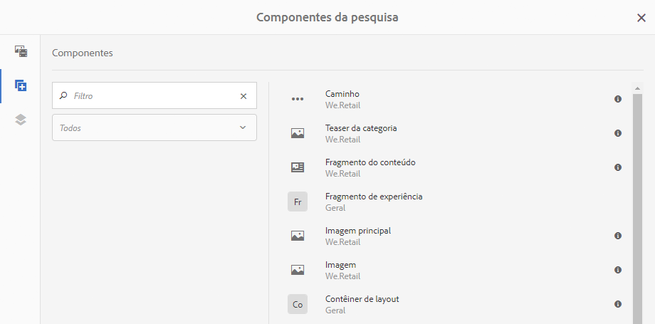

* **Dispositivo de desktop**

   O navegador de componentes é aberto no lado esquerdo da janela.

   Para adicionar um componente à página, clique no componente e arraste-o para o local desejado.

   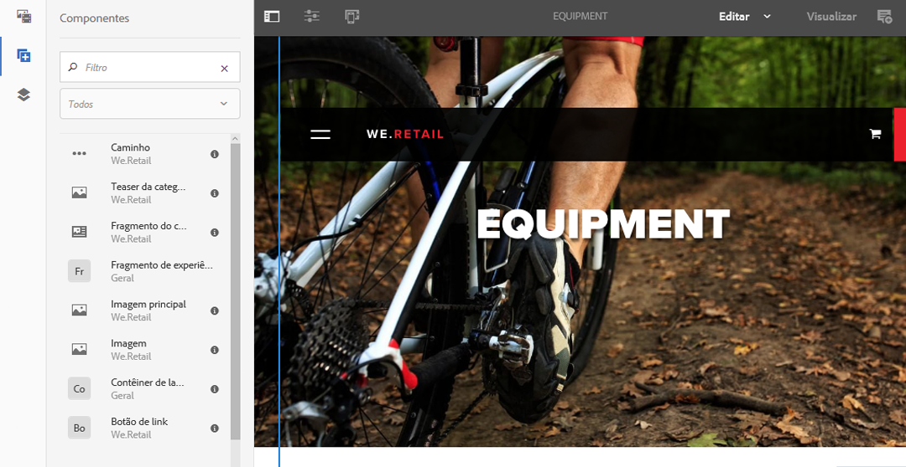

   Os componentes são representados por

   * Nome do componente
   * Grupo do componente (em cinza)
   * Ícone ou abreviação

      * Os ícones dos componentes padrão são monocromáticos.
      * As abreviações são sempre os dois primeiros caracteres do nome do componente.

   Na barra de ferramentas superior, no navegador Componentes, é possível:

   * Filtrar componentes por nome.
   * Limitar a exibição para um grupo específico usando a seleção suspensa.

   Para obter uma descrição mais detalhada do componente, clique ou toque no ícone de informações ao lado do componente no navegador Componentes (se disponível).

   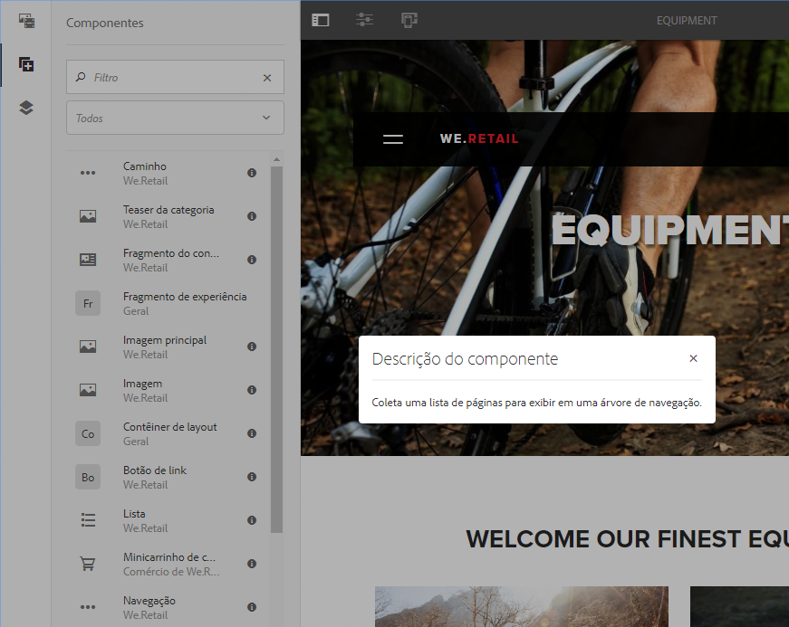

   Para mais informações sobre os componentes disponíveis para você, consulte o [Console de componentes](/help/sites-authoring/default-components-console.md).

## Navegador de ativos {#assets-browser}

O navegador de ativos mostra todos os ativos disponíveis para o uso direto na sua página atual.

O navegador de ativos é um guia no painel lateral juntamente com o [navegador de componentes](/help/sites-authoring/author-environment-tools.md#components-browser) e a [árvore de conteúdo](/help/sites-authoring/author-environment-tools.md#content-tree). Para abrir ou fechar o painel lateral, use o ícone na parte superior esquerda da barra de ferramentas:

Ao abrir o painel lateral, ele deslizará do lado esquerdo. Selecione a guia **Ativos** se necessário.

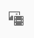

Quando o navegador de ativos está aberto, você pode navegar pelos ativos disponíveis para sua página. A rolagem infinita é usada para expandir a lista quando necessário.

Para adicionar um ativo à página, selecione e arraste para o local desejado. Isso pode ser:

* Um componente existente do tipo adequado.

   * Por exemplo, você pode arrastar um ativo de imagem para um componente de imagem.

* Um [espaço reservado](/help/sites-authoring/editing-content.md#component-placeholder) no sistema de parágrafo para criar um novo componente do tipo adequado.

   * Por exemplo, você pode arrastar um ativo de imagem para o sistema de parágrafo para criar um componente de imagem.

>[!NOTE]
>
>Essa ação está disponível para tipos de ativos e componentes específicos. Consulte [Inserir um componente usando o navegador de ativos](/help/sites-authoring/editing-content.md#inserting-a-component-using-the-assets-browser) para obter mais detalhes.

Na barra de ferramentas superior dos ativos, é possível filtrá-los por:

* Nome
* Caminho
* Tipo de ativo como imagens, manuscritos, documentos, vídeos, páginas, parágrafos e produtos
* Características do ativo como Orientação (Retrato, Paisagem, Quadrado) e Estilo (Cor, Monocromático, Escala de cinza)

   * Disponíveis somente para determinados tipos de ativos

A aparência e o manuseio real dependem do tipo de dispositivo usado:

>[!NOTE]
>
>Um dispositivo móvel é detectado quando a largura é menor do que 1024px; ou seja, também está em uma janela de desktop pequena.

* **Dispositivos móveis como o iPad**

   O navegador de ativos cobre completamente a página que está sendo editada.

   Para adicionar um ativo à sua página, toque e segure o ativo desejado, em seguida, mova-o para a direita - o navegador de ativos será fechado para mostrar a página novamente, onde você poderá adicionar o ativo ao componente desejado.

   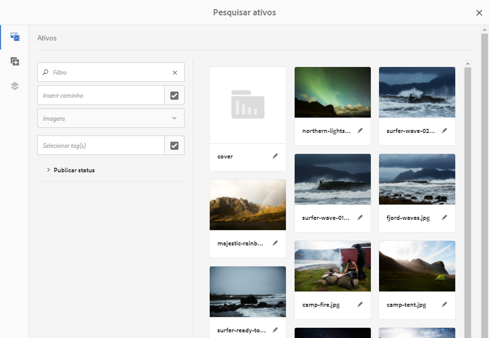

* **Dispositivo de desktop**

   O navegador de ativos é aberto no lado esquerdo da janela.

   Para adicionar um ativo à página, clique no ativo e arraste-o para o componente ou local desejado.

   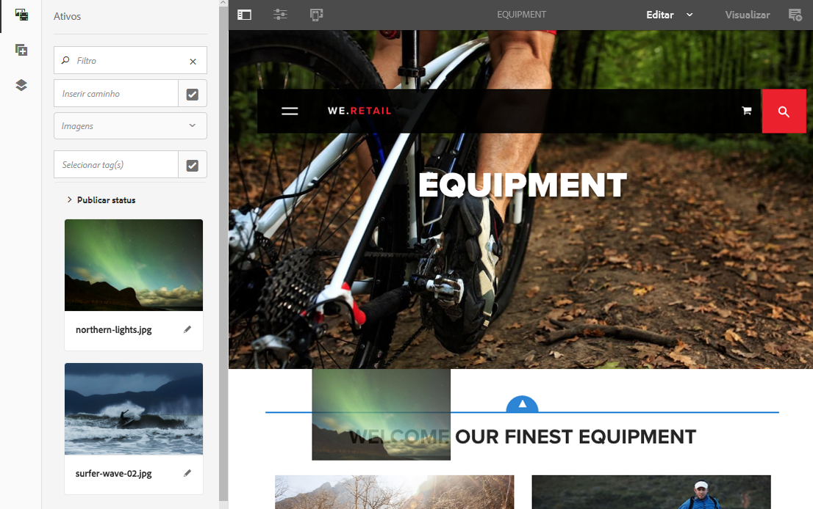

Se você precisar fazer uma alteração rápida em um ativo, pode iniciar o [editor de ativos](/help/assets/managing-assets-touch-ui.md) diretamente do navegador de ativos, clicando no ícone de edição mostrado ao lado do nome do ativo.

## Árvore de conteúdo {#content-tree}

A **Árvore de conteúdo** fornece uma visão geral de todos os componentes na página em uma hierarquia, de modo que seja possível visualizar rapidamente como a página é composta.

A Árvore de conteúdo é uma guia dentro do painel lateral (junto com o navegador de ativos e de componentes). Para abrir (ou fechar) o painel lateral, use o ícone na parte superior esquerda da barra de ferramentas:

Ao abrir o painel lateral, ele deslizará para ser aberto (a partir do lado esquerdo). Selecione a guia **Árvore de conteúdo**, se necessário. Quando aberta, é exibida uma representação de exibição em árvore de sua página ou modelo, para que seja mais fácil entender como o conteúdo é estruturado hierarquicamente. Além disso, em uma página complexa, facilita alternar entre os componentes da página.

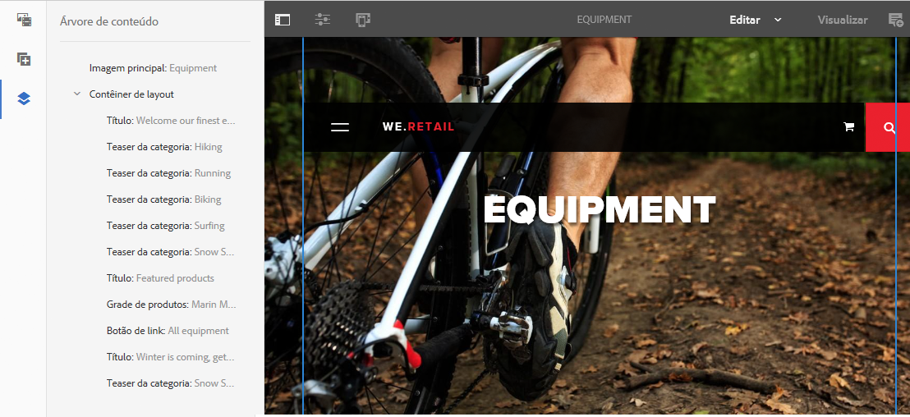

Uma página pode ser facilmente composta de vários componentes do mesmo tipo, portanto a árvore exibe o texto descritivo (em cinza) após do nome do tipo de componente (em preto). O texto descritivo é originado de propriedades comuns do componente, como título ou texto.

Os tipos de componentes serão exibidos no idioma do usuário, enquanto o texto de descrição do componente apresenta o idioma da página.

Clicar no ícone de divisa ao lado de um componente recolherá ou expandirá o respectivo nível.

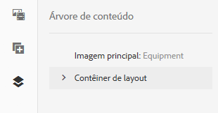

Clicar no componente realçará o componente no editor de páginas.

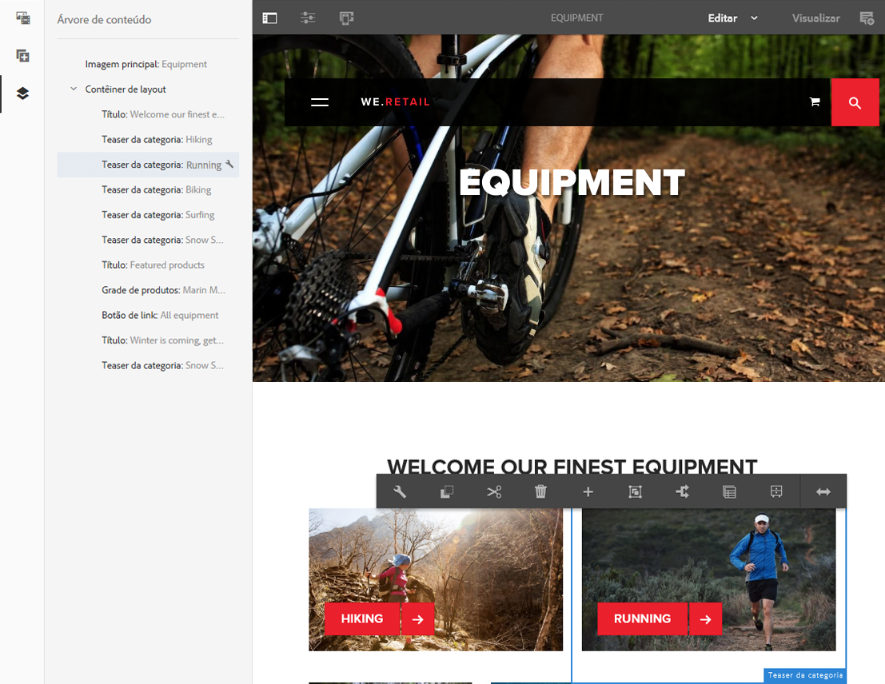

Se você clicar em um componente na árvore que seja editável, um ícone de chave inglesa aparecerá à direita do nome. Clicar no ícone de edição iniciará diretamente a caixa de diálogo referente ao componente.

>[!NOTE]
>
>A Árvore de conteúdo não ficará disponível se você estiver editando uma página em um dispositivo móvel (se a largura do navegador for menor do que 1024px).

## Fragmentos: navegador do conteúdo associado {#fragments-associated-content-browser}

Se a página contiver Fragmentos do conteúdo, então você também terá acesso ao [navegador para o conteúdo associado](/help/sites-authoring/content-fragments.md#using-associated-content).

## Referências {#references}

As **referências** mostram as conexões com a página selecionada:

* Blueprints
* Lançamentos
* Live copies
* Cópias de idioma
* Uso do componente de referência
* Referências a páginas de produtos (do console Comércio - Produtos)

Abra o console e navegue até o recurso desejado, e abra **Referências** usando:

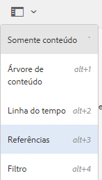

[Selecione o recurso desejado](/help/sites-authoring/basic-handling.md#viewing-and-selecting-resources) para mostrar uma lista de tipos de referências relevantes para esse recurso:

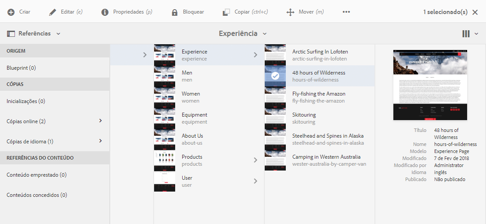

Selecione o tipo de referência apropriado para obter mais informações. Em determinadas situações, outras ações estão disponíveis ao selecionar uma referência específica, incluindo:

* Instâncias do componente de referência (por exemplo, navegue para referenciar ou até a página referenciada)
* [Referências a páginas de produtos](/help/sites-administering/generic.md#showing-product-references) (disponíveis no console Comércio - Produtos)
* [Lançamentos](/help/sites-authoring/launches.md)
* As Live Copies exibem os caminhos de todas as live copies que são baseadas no recurso selecionado.
* [Blueprint](/help/sites-administering/msm-best-practices.md)
* [Cópias de idiomas](/help/sites-administering/tc-manage.md#creating-translation-projects-using-the-references-panel)

Por exemplo, você pode corrigir uma referência desfeita em um componente de Referência:

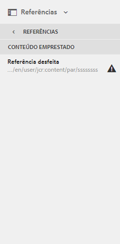

## Eventos - Linha do tempo {#events-timeline}

Para os recursos adequados (por exemplo, as páginas no console **Sites** ou os ativos no console **Ativos**), a [linha do tempo pode ser usada para mostrar a atividade recente de qualquer item selecionado](/help/sites-authoring/basic-handling.md#timeline).

Abra o console e navegue até o recurso desejado, e abra **Linha do tempo** usando:

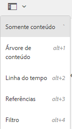

[Selecione o recurso desejado](/help/sites-authoring/basic-handling.md#viewing-and-selecting-resources), em seguida escolha **Exibir todos** ou **Atividades** para listar as ações recentes nos recursos selecionados:

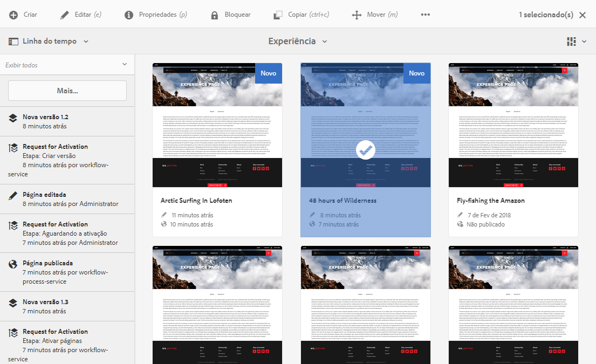

## Informações da página {#page-information}

As Informações da página (ícone de equalizador) abrem um menu que também fornece os detalhes sobre a última edição e a última publicação. Dependendo das características da página (e de seu respectivo site) mais ou menos opções podem estar disponíveis:

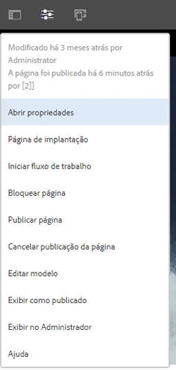

* [Abrir propriedades](/help/sites-authoring/editing-page-properties.md)
* [Página de implantação](/help/sites-administering/msm.md#msm-from-the-ui)
* [Iniciar fluxo de trabalho](/help/sites-authoring/workflows-applying.md#starting-a-workflow-from-the-page-editor)
* [Bloquear página](/help/sites-authoring/editing-content.md#locking-a-page)
* [Publicar página](/help/sites-authoring/publishing-pages.md#publishing-pages)
* [Desfazer a publicação da página](/help/sites-authoring/publishing-pages.md#unpublishing-pages)
* [Exibir como publicado](/help/sites-authoring/editing-content.md#view-as-published)
* [Exibir no admin](/help/sites-authoring/basic-handling.md#viewing-and-selecting-resources)
* [Ajuda](/help/sites-authoring/basic-handling.md#accessing-help)

Por exemplo, quando apropriado, **Informações da página** também terá as opções:

* [Promover lançamento](/help/sites-authoring/launches-promoting.md) se a página for um lançamento.
* [Editar modelo](/help/sites-authoring/templates.md) se a página for baseada em um modelo [editável](/help/sites-authoring/templates.md#editable-and-static-templates)

* [Abrir na interface do usuário](/help/sites-authoring/select-ui.md#switching-to-classic-ui-when-editing-a-page) clássica se essas opções tiverem sido [ativadas por um administrador](/help/sites-administering/enable-classic-ui-editor.md)

Além disso, **Informações da página** pode fornecer acesso ao Analytics e a recomendações, quando apropriado.

## Modos de página   {#page-modes}

Há vários modos ao editar uma página, o que permite ações diferentes:

* [Edição](/help/sites-authoring/editing-content.md) - o modo a ser usado ao editar o conteúdo da página.
* [Layout](/help/sites-authoring/responsive-layout.md) - permite que você crie e edite seu layout responsivo dependente do dispositivo (se a página for baseada em um contêiner de layout)

* [Andaime](/help/sites-authoring/scaffolding.md) - ajuda a criar um grande conjunto de páginas que compartilha a mesma estrutura, mas tem um conteúdo diferente.
* [Desenvolvedor](/help/sites-developing/developer-mode.md) - permite executar várias ações (requer privilégios). Que incluem inspecionar os detalhes técnicos de uma página e seus componentes.

* [Design](/help/sites-authoring/default-components-designmode.md) - permite que você habilite/desabilite para o uso em uma página e configure o design do componente (se a página for baseada em um [modelo estático](/help/sites-authoring/templates.md#editable-and-static-templates)).

* [Direcionamento](/help/sites-authoring/content-targeting-touch.md) - aumenta a relevância do conteúdo através do direcionamento e medição em todos os canais.
* [Mapa de atividade](/help/sites-authoring/pa-using.md) - mostra os dados do Analytics para a página.

* [Distorção](/help/sites-authoring/working-with-page-versions.md#timewarp) - permite que você veja o status de uma página em um ponto específico no tempo.
* [Status da Live Copy](/help/sites-authoring/editing-content.md#live-copy-status) - permite ter uma visão geral rápida do status da live copy e quais componentes são ou não herdados.
* [Visualização](/help/sites-authoring/editing-content.md#previewing-pages)- o modo usado para visualizar a página da forma que será exibida no ambiente de publicação; ou navegar usando os links no conteúdo.

* [Anotar](/help/sites-authoring/annotations.md) - usado para adicionar ou exibir anotações na página.

Você pode acessar esses itens usando os ícones no canto superior direito. O ícone real será alterado para refletir o modo usado no momento:

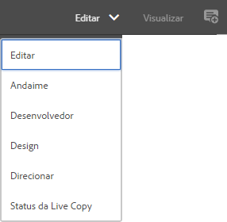

>[!NOTE]
>
>* Dependendo das características da página, alguns modos podem não estar disponíveis.
>* O acesso a alguns modos exige permissões/privilégios adequados.
>* O modo Desenvolvedor não está disponível em dispositivos móveis devido a restrições de espaço.
>* Existe um [atalho de teclado](/help/sites-authoring/page-authoring-keyboard-shortcuts.md) (`Ctrl-Shift-M`) para alternar entre o modo de **Visualização** e o atualmente selecionado (por exemplo, **Editar**, **Layout** etc).

>

## Seleção de caminho {#path-selection}

Ao criar, geralmente é necessário selecionar outro recurso, como ao definir um link para outra página ou recurso ou ao selecionar uma imagem. Para selecionar um caminho com facilidade, os [campos de caminho](/help/sites-authoring/author-environment-tools.md#path-fields) oferecem o recurso de completar automaticamente, e o [navegador de caminho](/help/sites-authoring/author-environment-tools.md#path-browser) permite uma seleção mais robusta.

### Campos de caminho   {#path-fields}

Para ilustração, o exemplo usado aqui é o componente de imagem. Para obter mais informações sobre como usar e editar componentes, consulte [Componentes para criação de página](/help/sites-authoring/default-components.md).

Agora, os campos de caminho têm as funcionalidades de completar automaticamente e de look-ahead, para facilitar a localização de um recurso. Basta começar a digitar no campo de caminho e o AEM oferecerá a caminhos correspondentes à medida que você digita.

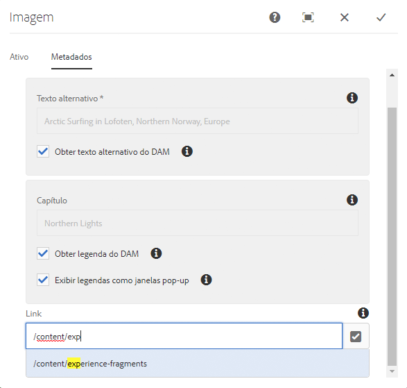

Clicar no botão **Abrir caixa de diálogo** no campo de caminho abre a caixa de diálogo [navegador de caminho](/help/sites-authoring/author-environment-tools.md#path-browser) para permitir opções mais detalhadas de seleção.

### Navegador de caminhos {#path-browser}

O navegador de caminho é organizado da mesma maneira que a [exibição de coluna](/help/sites-authoring/basic-handling.md#column-view) do console de sites, permitindo uma seleção mais detalhada dos recursos.

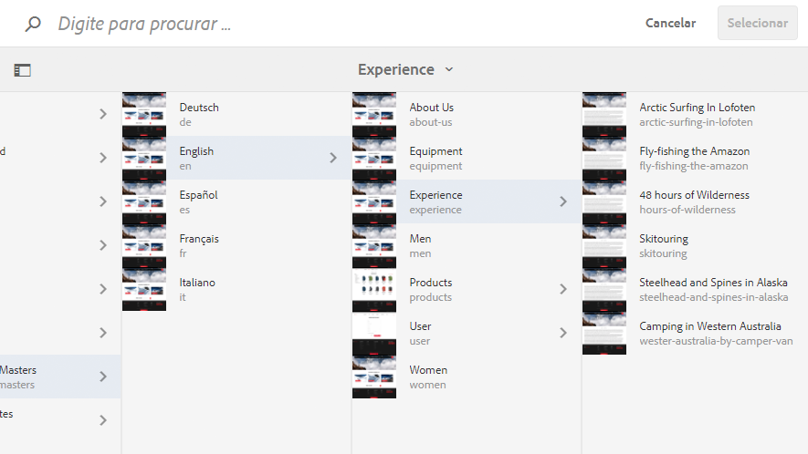

Uma vez que um recurso é selecionado, o botão **Selecionar** no canto superior direito da caixa de diálogo ficará ativo. Clique ou toque para confirmar a seleção ou **Cancele** para interromper.

Se o contexto permite a seleção de vários recursos, selecionar um recurso também ativa o botão Selecionar, mas, além disso, adiciona uma contagem do número de recursos selecionados no canto superior direito da janela. Clique no X ao lado do número para desmarcar tudo.

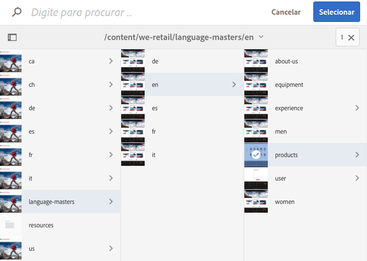

As navegações estruturais podem ser usadas para avançar rapidamente na hierarquia do recurso.

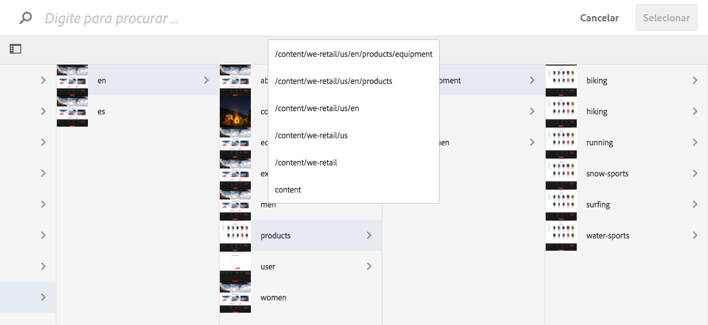

A qualquer momento, você pode usar o campo de pesquisa na parte superior da caixa de diálogo.

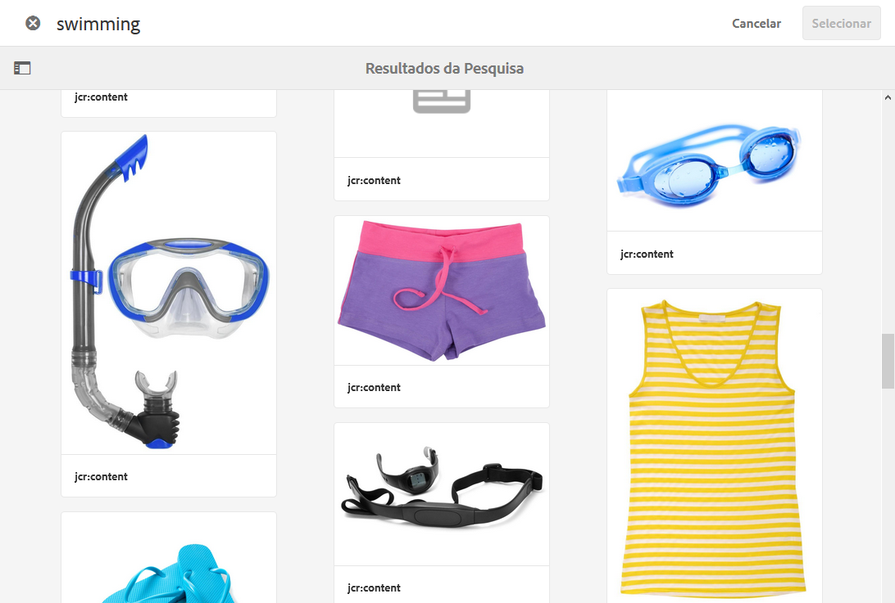

Clique no X no campo de pesquisa para cancelar a pesquisa.

Para limitar sua pesquisa, você pode revelar as opções de filtro e filtrar seus resultados com base em um determinado caminho.

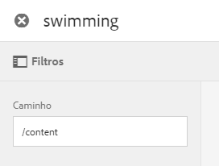

## Atalhos de teclado {#keyboard-shortcuts}

Vários [atalhos de teclado](/help/sites-authoring/page-authoring-keyboard-shortcuts.md) estão disponíveis.
