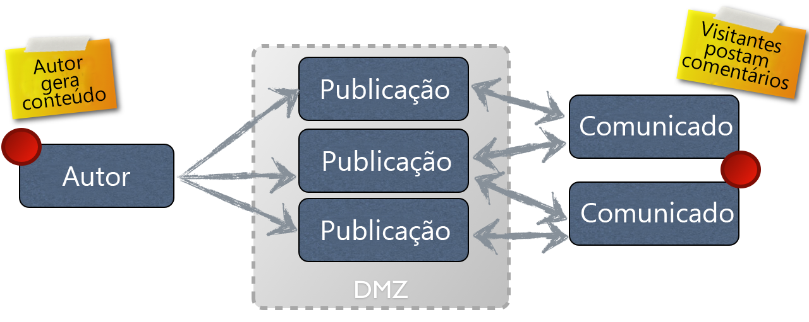

# Conceito de criação e publicação{#authoring}

>[!CAUTION]
>
>AEM 6.4 chegou ao fim do suporte estendido e esta documentação não é mais atualizada. Para obter mais detalhes, consulte nossa [períodos de assistência técnica](https://helpx.adobe.com/br/support/programs/eol-matrix.html). Encontre as versões compatíveis [here](https://experienceleague.adobe.com/docs/).

O AEM fornece dois ambientes:

* Autor
* Publicação

Eles interagem para permitir que você disponibilize conteúdo em seu site, para que seus visitantes possam lê-lo.

O ambiente de criação fornece os mecanismos para criar, atualizar e revisar esse conteúdo antes de realmente publicá-lo:

* Um autor cria e revisa o conteúdo (que pode ser de vários tipos; por exemplo, páginas, ativos, publicações etc)
* que será, em algum momento, publicado no seu site.

No ambiente de criação, a funcionalidade do AEM é disponibilizada por meio de duas interfaces de usuário. Para o ambiente de publicação, você projeta toda a aparência e comportamento da interface disponível para os usuários.

## Ambiente de criação {#author-environment}

O autor trabalha no que é conhecido como **[ambiente do autor](/help/sites-authoring/home.md)**. Isso oferece uma interface fácil de usar (interface gráfica do usuário (GUI ou UI)) para criar o conteúdo. Geralmente, ele está localizado atrás do firewall de uma empresa que oferece proteção total e exige que o autor faça logon, usando uma conta que recebeu os direitos de acesso apropriados.

>[!NOTE]
>
>Sua conta precisa dos direitos de acesso apropriados para criar, editar ou publicar conteúdo.

Dependendo de como sua instância e seus direitos de acesso pessoais são configurados, você pode executar muitas tarefas no seu conteúdo, incluindo (entre outras):

* gerar novo conteúdo ou editar conteúdo existente em uma página
* usar modelos predefinidos para criar novas páginas de conteúdo
* criar, editar e gerenciar ativos e coleções
* criar, editar e gerenciar seus aplicativos
* desenvolver suas campanhas e os recursos relacionados
* desenvolver e gerenciar sites da comunidade
* mover, copiar ou excluir páginas de conteúdo, ativos etc
* publicar (ou cancelar a publicação) páginas, ativos etc

Além disso, há tarefas administrativas que o ajudam a gerenciar seu conteúdo:

* fluxos de trabalho que controlam como as alterações são gerenciadas; por exemplo. impor uma revisão antes da publicação
* projetos que coordenam tarefas individuais

>[!NOTE]
>
>AEM também [administrado](/help/sites-administering/home.md) (para a maioria das tarefas) do ambiente do autor.

## Ambiente de publicação {#publish-environment}

Quando pronto, o conteúdo do site de AEM é publicado no **ambiente de publicação**. Aqui, as páginas do site são disponibilizadas para o público desejado de acordo com a aparência da interface projetada.

Geralmente, o ambiente de publicação está localizado dentro da zona desmilitarizada; por outras palavras, à disposição da Internet, mas já não sob a proteção total da rede interna.

Quando o site AEM é um [site da comunidade](/help/communities/overview.md)ou inclui [Componentes das comunidades](/help/communities/author-communities.md), visitantes do site que fizeram logon (membros) podem interagir com recursos das Comunidades. Por exemplo, eles podem postar em um fórum, postar um comentário ou seguir outros membros. Os membros podem receber permissão para executar atividades normalmente limitadas ao ambiente de criação, como criar novas páginas (grupos da comunidade), artigos de blog e moderar publicações de outros membros.

>[!NOTE]
>
>Infelizmente, há uma sobreposição na terminologia usada. Isso pode acontecer com:
>
>* **Publicar/Desfazer a publicação**
   >  Esses são os termos principais para as ações que tornam o conteúdo publicamente disponível no ambiente de publicação (ou não).
>
>* **Ativar / Desativar**
   >  Estes termos são sinônimos de publicar/desfazer a publicação. Eles são mais comuns na interface clássica.
>
>* **Replicar / Replicação**
   >  Esses são os termos técnicos usados para indicar a movimentação de dados (por exemplo, conteúdo da página, arquivos, código, comentários do usuário) de um ambiente para outro; ou seja, ao publicar ou replicar de forma reversa comentários do usuário.
>

## Dispatcher {#dispatcher}

Para otimizar o desempenho para os visitantes do seu site, o **[dispatcher](https://helpx.adobe.com/experience-manager/dispatcher/user-guide.html) implementa o balanceamento de carga e o cache.**
