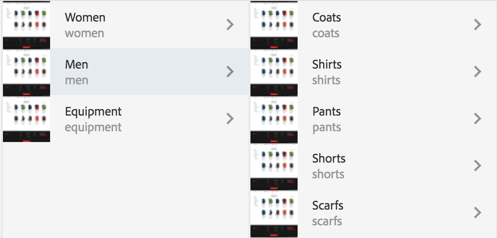
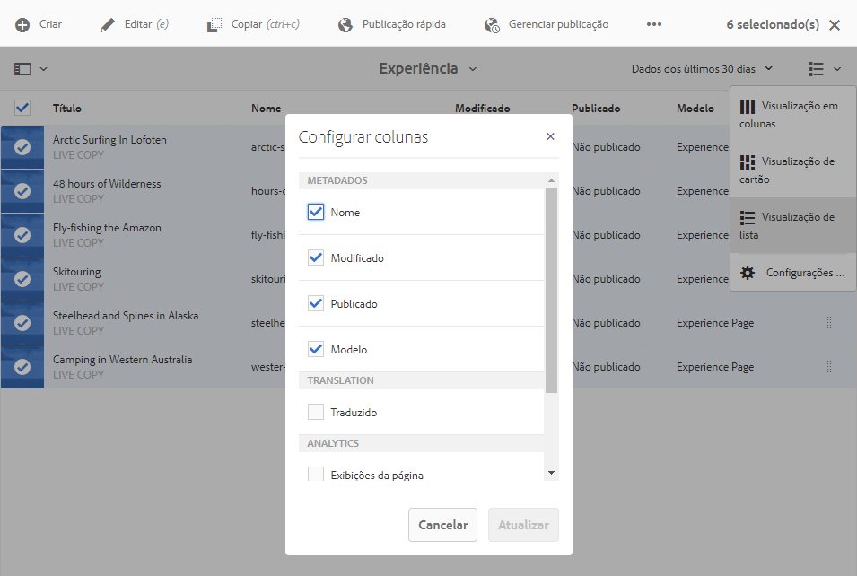

# Manuseio básico {#basic-handling}

>[!NOTE]
>
>* Esta página foi projetada para apresentar uma visão geral do manuseio básico ao usar um ambiente de criação com o AEM. Usa o console **Sites** como base.
   >
   >
* Algumas funcionalidades não estão disponíveis em todos os consoles, e funcionalidades adicionais podem estar disponíveis em alguns consoles. Informações específicas sobre os consoles individuais e o recurso relacionado serão abordadas com mais detalhes em outras páginas.
>* Os atalhos de teclado estão disponíveis em todo o AEM. Principalmente ao [usar páginas de console](/help/sites-authoring/keyboard-shortcuts.md) e [edição](/help/sites-authoring/page-authoring-keyboard-shortcuts.md).

>

## Introdução {#getting-started}

### Uma interface de usuário habilitada para toque {#a-touch-enabled-ui}

A interface do usuário do AEM foi habilitada para toque. Uma interface habilitada para toque permite que você use toques para interagir com o software por meio de gestos, como tocar, tocar e segurar e deslizar o dedo. Isso contrasta com a forma como uma interface de desktop tradicional opera com ações do mouse, como clique, clique duplo, clique com o botão direito e focalização com o cursor. Como somente gestos são necessários, a interface de usuário habilitada para toque é totalmente operacional em tablets e ainda possui funcionalidades completas em desktops.

### Primeiras etapas {#first-steps}

Logo após o logon, você acessa o [painel de Navegação](/help/sites-authoring/basic-handling.md#global-navigation). Isso será discutido com mais detalhes na seção a seguir.

Clicar em uma das opções abre o respectivo console. Para obter uma boa compreensão do uso básico do AEM, este documento se baseia no console de **Sites.**

Clique ou toque em **Sites** para começar.

### Navegação do produto   {#product-navigation}

Sempre que um usuário acessa um console pela primeira vez, um tutorial de navegação do produto é iniciado. Reserve alguns momentos para clicar ou tocar no conteúdo a fim de obter uma boa visão geral sobre a manipulação básica do AEM.

Click or tap **Got it!** para ir até a próxima página da visão geral. Click or tap **Close** or click or tap outside of the overview dialogue to close.

A visão geral será reiniciada na próxima vez que você acessar um console, a menos que marque a opção **Não mostrar esta mensagem novamente**.

## Navegação global {#global-navigation}

É possível navegar entre os consoles usando o painel de navegação global. Ele é acionado como uma lista suspensa em tela cheia ao clicar ou tocar no link do Adobe Experience Manager na parte superior esquerda da tela.

Você pode fechar o painel de navegação global clicando ou tocando em **Fechar** para retornar ao seu local anterior.

>[!NOTE]
>
>Ao fazer login pela primeira vez, você visualiza o painel de **Navegação**.

A navegação global possui dois painéis, representados por ícones na margem esquerda da tela:

* **Navegação** - Representado por uma bússola  
* **Ferramentas** - Representado por um martelo

As opções disponíveis nesses painéis estão descritas abaixo.

1. O painel de Navegação:

   

   Em Navegação, os consoles disponíveis são:

<table> 
 <tbody>
  <tr>
   <td><strong>Console</strong></td> 
   <td><strong>Propósito</strong></td> 
  </tr>
  <tr>
   <td>Assets  </td> 
   <td>Esse consoles permitem importar e <a href="/help/assets/assets.md">gerenciar ativos digitais</a> como imagens, vídeos, documentos e arquivos de áudio. Esses ativos podem ser usados por um site em execução na mesma instância do AEM. </td> 
  </tr>
  <tr>
   <td>Communities</td> 
   <td>Este console permite criar e gerenciar os <a href="/help/communities/sites-console.md">sites da comunidade</a> para a <a href="/help/communities/overview.md#engagement-community">participação</a> e <a href="/help/communities/overview.md#enablement-community">capacitação</a>.</td> 
  </tr>
  <tr>
   <td>Comércio</td> 
   <td>Permite gerenciar produtos, catálogos de produtos e pedidos relacionados ao seus sites de <a href="/help/sites-administering/ecommerce.md">Comércio</a>. </td> 
  </tr>
  <tr>
   <td>Fragmentos de experiência</td> 
   <td>Um <a href="/help/sites-authoring/experience-fragments.md">fragmento de experiência</a> é uma experiência independente que pode ser reutilizada em vários canais e que apresenta variações, evitando o trabalho de copiar e colar repetidamente as experiências ou partes das experiências.</td> 
  </tr>
  <tr>
   <td>Forms</td> 
   <td>Este console permite criar, gerenciar e processar os <a href="/help/forms/using/introduction-aem-forms.md">formulários e documentos</a>&gt;.</td> 
  </tr>
  <tr>
   <td>Personalização</td> 
   <td>Esse console fornece uma <a href="/help/sites-authoring/personalization.md">estrutura de ferramentas para a criação de conteúdo direcionado e a apresentação de experiências personalizadas</a>.</td> 
  </tr>
  <tr>
   <td>Projetos</td> 
   <td>O console <a href="/help/sites-authoring/touch-ui-managing-projects.md">Projetos</a> oferece acesso direto aos seus projetos. Os projetos são painéis virtuais. Eles podem ser usados para criar uma equipe e depois dar a ela acesso aos recursos, fluxos de trabalho e tarefas, permitindo que as pessoas trabalhem em um objetivo comum.   </td> 
  </tr>
  <tr>
   <td>Sites</td> 
   <td>O console Sites permite <a href="/help/sites-authoring/author-environment-tools.md">criar, exibir e gerenciar sites</a> em execução na sua instância do AEM. Por meio desses consoles, você pode criar, copiar, mover e excluir páginas de sites, iniciar fluxos de trabalho e publicar páginas.  </td> 
  </tr>
 </tbody>
</table>

1. No painel Ferramentas, cada opção no painel lateral contém um intervalo de submenus. Os [consoles de Ferramentas](/help/sites-administering/tools-consoles.md) disponíveis aqui fornecem acesso a uma série de ferramentas e consoles especializados que ajudam a administrar seus sites, ativos digitais e outros aspectos do seu repositório de conteúdo.

   

## O Cabeçalho {#the-header}

O cabeçalho sempre está presente na parte superior da tela. Embora a maioria das opções no cabeçalho permaneça igual, independentemente de onde você esteja no sistema, algumas são específicas do contexto.

* [Navegação global](#global-navigation)

   Selecione o link do **Adobe Experience Manager** para navegar entre consoles.

   

* [Pesquisar](/help/sites-authoring/search.md)

   

   Você também pode usar a [tecla de atalho](/help/sites-authoring/keyboard-shortcuts.md) `/` (barra) para invocar a pesquisa em qualquer console.

* [Ajuda](#accessing-help)

   

* [Soluções da Marketing Cloud](https://www.adobe.com/marketing-cloud.html)

   

* [Notificações](/help/sites-authoring/inbox.md)

   

   Esse ícone exibirá o número de notificações incompletas atribuídas atualmente.

   >[!NOTE]
   >
   >O AEM pronto para uso vem pré-carregado com tarefas administrativas atribuídas ao grupo de usuários administradores. Consulte [Sua caixa de entrada - tarefas administrativas prontas para uso](/help/sites-authoring/inbox.md#out-of-the-box-administrative-tasks) para obter detalhes.

* [Propriedades do usuário](/help/sites-authoring/user-properties.md)

   

* [Seletor de painéis](/help/sites-authoring/basic-handling.md#rail-selector)

   

   As opções apresentadas dependem do seu console atual. Por exemplo, em **Sites**, é possível selecionar somente o conteúdo (o padrão), a linha do tempo, as referências ou o painel lateral do filtro.

   

* Navegações estruturais

   

   Situadas no meio do painel e sempre mostrando a descrição do item atualmente selecionado, as navegações estruturais permitem que você navegue dentro de um console específico. No console Sites, você pode navegar pelos níveis do seu site.

   Basta clicar no texto da navegação estrutural para exibir uma lista suspensa dos níveis da hierarquia do item atualmente selecionado. Clique em uma entrada para acessar esse local.

   

* Seleção do período de tempo de análises

   

   Isso está disponível somente na exibição de lista. See [list view](#list-view) for more information.

* Botão **Criar**

   

   Uma vez clicado, as opções exibidas são adequadas ao console/contexto.

* [Exibições](/help/sites-authoring/basic-handling.md#viewing-and-selecting-resources)

   

   É possível alternar entre as exibições de coluna, de cartão e de lista e as configurações de visualização.

   

## Acessar ajuda {#accessing-help}

Há vários recursos de ajuda disponíveis:

* **Barra de ferramentas do console**

   Dependendo do seu local, o ícone **Ajuda** abrirá os recursos adequados:

   

* **Navegação**

   Na primeira vez que você navega pelo sistema, [uma série de slides apresenta a navegação no AEM](/help/sites-authoring/basic-handling.md#product-navigation).

* **Editor de página**

   A primeira vez que você editar uma página, o editor de página será apresentado por uma série de slides.

   

   Navegue por essa visão geral como faria com a [visão geral de navegação do produto](/help/sites-authoring/basic-handling.md#product-navigation) ao acessar qualquer console pela primeira vez.

   No menu [**Informações da página,**é possível selecionar** Ajuda **](/help/sites-authoring/author-environment-tools.md#accessing-help)para exibir isso novamente, a qualquer momento.

* **Console Ferramentas**

   No console **Ferramentas** é possível acessar os **Recursos** externos:

   * **Documentação**
Exibir a documentação do Adobe® Experience Manager

   * **Recursos do desenvolvedor**
Recursos e downloads do desenvolvedor
   >[!NOTE]
   >
   >É possível acessar uma visão geral das teclas de atalho disponíveis a qualquer momento, usando a tecla de atalho `?` (ponto de interrogação) em um console.
   >
   >Para obter uma visão geral de todos os atalhos de teclado, consulte a seguinte documentação:
   >
   >* [Atalhos de teclado para editar páginas](/help/sites-authoring/page-authoring-keyboard-shortcuts.md)
   >* [Atalhos de teclado para consoles](/help/sites-authoring/keyboard-shortcuts.md)

## Barra de ferramentas de Ações {#actions-toolbar}

Sempre que um recurso é selecionado (por exemplo, uma página ou um ativo), várias ações são indicadas por ícones com texto explicativo na barra de ferramentas. Essas ações dependem do seguinte:

* Do console atual.
* Do contexto atual.
* Se você estiver no [modo de seleção](#viewing-and-selecting-resources).

A ação disponível na barra de ferramentas muda para refletir as ações que você pode realizar nos itens específicos selecionados.

A forma como você [seleciona um recurso](/help/sites-authoring/basic-handling.md#viewing-and-selecting-resources) depende da exibição.

Devido às restrições de espaço em algumas janelas, a barra de ferramentas pode tornar-se rapidamente maior do que o espaço disponível. Quando isso acontecer, opções adicionais serão exibidas. Clicar ou tocar nas reticências (três pontos ou **...**) abre um seletor suspenso que contém todas as ações restantes. Por exemplo, após selecionar uma página no console **Sites**:

>[!NOTE]
>
>Os ícones individuais disponíveis são documentados em relação ao console/recurso/cenário apropriado.

## Ações rápidas {#quick-actions}

Na [Exibição de cartão](#quick-actions), determinadas ações estão disponíveis como ícones de ação rápida, além de estarem na barra de ferramentas. Os ícones de ação rápida estão disponíveis para um único item de cada vez e elimina a necessidade de pré-seleção.

As ações rápidas ficam visíveis quando você passa o mouse sobre (dispositivo de desktop) um cartão do recurso. As ações rápidas disponíveis podem depender do console e do contexto. Por exemplo, veja a seguir as ações rápidas para uma página no console **Sites**:

## Visualização e seleção de recursos {#viewing-and-selecting-resources}

Visualizar, navegar e selecionar são conceitualmente iguais em todas as exibições, mas têm pequenas variações de manuseio, dependendo da exibição usada.

É possível visualizar, navegar e selecionar (para novas ações) os recursos com qualquer uma das exibições disponíveis, que podem ser selecionadas por meio do ícone no canto superior direito:

* [Exibição de coluna](#column-view)
* [Exibição de cartão](#card-view)

* [Exibição de lista  ](#list-view)

>[!NOTE]
>
>Por padrão, o AEM Assets não exibe as representações originais de ativos na interface do usuário como miniaturas em nenhuma das visualizações. Se for um administrador, você poderá usar sobreposições para configurar o AEM Assets com o objetivo de exibir representações originais como miniaturas.

### Seleção de recursos   {#selecting-resources}

Selecionar um recurso específico depende de uma combinação da exibição e do dispositivo:

<table> 
 <tbody>
  <tr>
   <td> </td> 
   <td>Selecionar</td> 
   <td>Cancelar seleção</td> 
  </tr>
  <tr>
   <td>Exibição de coluna  </td> 
   <td>
    <ul> 
     <li>Desktop:   Clique na miniatura</li> 
     <li>Dispositivo móvel:  Toque a miniatura</li> 
    </ul> </td> 
   <td>
    <ul> 
     <li>Desktop:   Clique na miniatura</li> 
     <li>Dispositivo móvel:  Toque a miniatura</li> 
    </ul> </td> 
  </tr>
  <tr>
   <td>Exibição de cartão  </td> 
   <td>
    <ul> 
     <li>Desktop:  Mouseover, then use the checkmark quick action</li> 
     <li>Dispositivo móvel:  Tocar e segurar o cartão</li> 
    </ul> </td> 
   <td>
    <ul> 
     <li>Desktop:  Click the card</li> 
     <li>Mobile device:  Tap the card</li> 
    </ul> </td> 
  </tr>
  <tr>
   <td>Exibição de lista  </td> 
   <td>
    <ul> 
     <li>Desktop:   Clique na miniatura</li> 
     <li>Dispositivo móvel:  Toque a miniatura</li> 
    </ul> </td> 
   <td>
    <ul> 
     <li>Desktop:   Clique na miniatura</li> 
     <li>Dispositivo móvel:  Toque a miniatura</li> 
    </ul> </td> 
  </tr>
 </tbody>
</table>

#### Desmarcar tudo {#deselecting-all}

Em todos os casos, ao selecionar itens, a contagem dos itens selecionados é exibida na parte superior direita da barra de ferramentas.

É possível cancelar a seleção de todos os itens e sair do modo de seleção clicando ou tocando no X ao lado da contagem.

Em todas as visualizações, todos os itens podem ser desmarcados. Para isso, pressione a tecla Escape no teclado se você estiver usando um computador desktop.

#### Exemplo de seleção {#selecting-example}

1. Por exemplo, na exibição de cartão:

   

1. Após selecionar um recurso, o cabeçalho superior é coberto pela [barra de ferramentas das ações](#actions-toolbar), que fornece acesso às ações atualmente aplicáveis ao recurso selecionado.

   To exit selection mode select the **X** to the top-right.

### Exibição de coluna {#column-view}

A exibição de coluna permite uma navegação visual de uma árvore de conteúdo por uma série de colunas em cascata. Essa exibição permite visualizar e navegar pela estrutura em árvore do site.

A seleção de um recurso na coluna mais à esquerda mostrará os recursos filho em uma coluna à direita. A seleção de um recurso na coluna direita mostrará então os recursos filhos em outra coluna à direita e assim por diante.

* É possível navegar para cima e para baixo na árvore, tocando ou clicando no nome do recurso ou na divisa à direita do nome do recurso.

   * O nome do recurso e a divisa serão destacados quando forem tocados ou clicados.

   

   * Os filhos do recurso clicado/tocado aparecerão na coluna à direita do pai.
   * Se você tocar ou clicar em um nome de recurso sem filhos, seus detalhes aparecerão na coluna final.

* Tocar ou clicar na miniatura seleciona o recurso correspondente.

   * Quando essa opção for selecionada, uma marca de seleção será sobreposta à miniatura, e o nome do recurso também será destacado.
   * Os detalhes do recurso selecionado serão mostrados na coluna final.

   

   Quando uma página é selecionada na exibição de coluna, a página selecionada é exibida na coluna final junto com os seguintes detalhes:

   * Título da página
   * Nome da página (parte do URL da página)
   * O modelo no qual a página se baseia
   * Última data de modificação
   * Último usuário a modificar a página
   * Idioma da página
   * Status da publicação

### Exibição de cartão {#card-view}

* A Exibição de cartão exibe cartões de informações para cada item no nível atual. Estes fornecem informações como:

   * Uma representação visual do conteúdo da página.
   * O título da página.
   * Datas importantes (como a última edição/publicação).
   * Se a página estiver bloqueada, oculta ou fizer parte de uma live copy.
   * Se for o caso, quando for necessário tomar medidas como parte de um fluxo de trabalho.

      * Marcadores que indicam ações necessárias podem estar relacionados a entradas na sua [Caixa de entrada](/help/sites-authoring/inbox.md).

* [Ações rápidas](#quick-actions) também estão disponíveis nessa visualização como ações de seleção e ações comuns, como edição.

   

* É possível navegar para baixo na árvore tocando/clicando em cartões (com cautela para evitar as ações rápidas) ou para cima novamente usando a [navegação estrutural no cabeçalho](/help/sites-authoring/basic-handling.md#the-header).

### Exibição de lista   {#list-view}

* A exibição de lista apresenta informações para cada recurso no nível atual.
* É possível navegar para baixo na árvore tocando/clicando no nome do recurso e fazer backup usando a [navegação estrutural no cabeçalho](/help/sites-authoring/basic-handling.md#the-header).

* Para selecionar facilmente todos os itens na lista, use a caixa de seleção no canto superior esquerdo da lista.

   

   * Quando todos os itens da lista estão selecionados, essa caixa de seleção aparece marcada.

      * Clique ou toque na caixa de seleção para desmarcar tudo.
   * Quando apenas alguns itens estão selecionados, ela aparece com um sinal de menos.

      * Clique ou toque na caixa de seleção para selecionar tudo.
      * Clique ou toque na caixa de seleção mais uma vez para desmarcar tudo.

* Selecione as colunas a serem exibidas usando a opção **Configurações de Visualização **localizada sob o botão Visualização. As seguintes colunas estão disponíveis para exibição:

   * **Nome** - O nome da página, que pode ser útil em um ambiente de criação multilíngue, pois faz parte do URL da página e não muda, independentemente do idioma
   * **Modificado** - Data da última modificação e o usuário que a realizou
   * **Publicado**- Status de publicação
   * **Modelo** - Modelo no qual a página se baseia
   * **Análise de páginas**
   * **Visitantes únicos**
   * **Tempo na página**

   

   Por padrão, é exibida a coluna **Nome**, que faz parte do URL da página. Em alguns casos, o autor pode precisar acessar páginas que estão em um idioma diferente, e ver o nome da página (que normalmente é imutável) pode ser de grande ajuda quando ele não conhece o idioma.

* Altere a ordem dos itens usando a barra vertical pontilhada na extremidade direita de cada item da lista.

>[!NOTE]
>
>Alterar a ordem funciona somente em uma pasta ordenável que tenha o valor `jcr:primaryType` como `sling:OrderedFolder`.

Clique ou toque na barra de seleção vertical e arraste o item até uma nova posição na lista.

* É possível exibir Dados do Analytics mostrando as colunas apropriadas com o uso da caixa de diálogo Configurações de exibição.

   É possível filtrar Dados do Analytics dos últimos 30, 90 ou 365 dias usando as opções de filtro no lado direito do cabeçalho.

   

## Seletor de painéis {#rail-selector}

O **Seletor de painéis** está disponível no canto superior esquerdo da janela e exibe opções dependendo dos seus consoles atuais.

Por exemplo, no Sites, é possível selecionar somente conteúdo (padrão), árvore de conteúdo, linha de tempo, referências ou o painel lateral de filtro.

Se somente conteúdo for selecionado, apenas o ícone do painel será exibido. Se qualquer outra opção for selecionada, o nome da opção aparecerá ao lado do ícone do painel.

>[!NOTE]
>
>[Atalhos de teclado](/help/sites-authoring/keyboard-shortcuts.md) estão disponíveis para alternar rapidamente entre as opções de exibição do painel.

### Árvore de conteúdo {#content-tree}

A árvore de conteúdo pode ser usada para navegar rapidamente pela hierarquia do site no painel lateral e exibir várias informações sobre as páginas na pasta atual.

Usando o painel lateral da árvore de conteúdo, juntamente com uma exibição de lista ou de cartões, os usuários podem ver a estrutura hierárquica do projeto e navegar facilmente pela estrutura de conteúdo com o painel lateral da árvore de conteúdo, bem como exibir informações detalhadas sobre a página na exibição de lista.

>[!NOTE]
>
>Quando uma entrada na exibição hierárquica é selecionada, as teclas de seta podem ser usadas para navegar rapidamente pela hierarquia.
>
>Consulte os [atalhos de teclado](/help/sites-authoring/keyboard-shortcuts.md) para obter mais informações.

### Linha do tempo {#timeline}

A linha do tempo pode ser usada para exibir e/ou iniciar eventos que ocorreram no recurso selecionado. Para abrir a coluna da linha do tempo use o seletor do painel:

A coluna de linha do tempo permite:

* Exibir vários eventos relacionados a um item selecionado.

   * Os tipos de eventos podem ser selecionados na lista suspensa:

      * [Comentários](#TimelineAddingandViewingComments)
      * Anotações
      * Atividades
      * [Lançamentos](/help/sites-authoring/launches.md)
      * [Versões](/help/sites-authoring/working-with-page-versions.md)
      * [Fluxos de trabalhos](/help/sites-authoring/workflows-applying.md)

         * com exceção de [fluxos de trabalho transitórios](/help/sites-developing/workflows.md#transient-workflows) pois nenhuma informação de histórico é salva para eles
      * e Exibir todos

* [Adicionar/exibir comentários sobre o item selecionado. ](#TimelineAddingandViewingComments) A caixa **Comentário** é exibida na parte inferior da lista de eventos. Inserir um comentário seguido por Retornar registrará esse comentário. Ele será mostrado quando a opção **Comentários** ou **Exibir todos** estiver selecionada.

* Os consoles específicos têm funcionalidade adicional. Por exemplo, no console Sites é possível:

   * [Salvar uma versão](/help/sites-authoring/working-with-page-versions.md).
   * [Iniciar um fluxo de trabalho](/help/sites-authoring/workflows-applying.md).

Essas opções podem ser acessadas por meio da divisa ao lado do campo **Comentário**.

### Referências {#references}

A opção **Referências** mostra conexões com o recurso selecionado. Por exemplo, no console de **Sites**, as [referências](/help/sites-authoring/author-environment-tools.md#references) de páginas mostram o seguinte:

* [Lançamentos](/help/sites-authoring/launches.md#launches-in-references-sites-console)
* [Live copies](/help/sites-administering/msm-livecopy-overview.md)
* [Cópias de idioma](/help/sites-administering/tc-prep.md#seeing-the-status-of-language-roots)
* As referências de conteúdo (por exemplo, o conteúdo emprestado e/ou concedido pelo componente Referência)

### Filtro {#filter}

Isso abrirá um painel semelhante para [pesquisar](/help/sites-authoring/search.md) usando os filtros de localização apropriados já definidos, que permitem filtrar ainda mais o conteúdo que você deseja exibir.

