# Trabalho com o Adobe Campaign Classic e Adobe Campaign Standard{#working-with-adobe-campaign-classic-and-adobe-campaign-standard}

>[!CAUTION]
>
>AEM 6.4 chegou ao fim do suporte estendido e esta documentação não é mais atualizada. Para obter mais detalhes, consulte nossa [períodos de assistência técnica](https://helpx.adobe.com/br/support/programs/eol-matrix.html). Encontre as versões compatíveis [here](https://experienceleague.adobe.com/docs/).

Você pode criar conteúdo de email no AEM e processá-lo em emails do Adobe Campaign. Para fazer isso, você deve:

1. Crie um novo informativo no AEM a partir de um modelo específico do Adobe Campaign.
1. Selecionar [um serviço Adobe Campaign](#selecting-the-adobe-campaign-cloud-service-and-template) antes de editar o conteúdo para acessar toda a funcionalidade.
1. Edite o conteúdo.
1. Valide o conteúdo.

O conteúdo pode ser sincronizado com um delivery no Adobe Campaign. As instruções detalhadas estão descritas neste documento.

Consulte também [Criação do Adobe Campaign Forms no AEM](/help/sites-authoring/adobe-campaign-forms.md).

>[!NOTE]
>
>Antes de usar essa funcionalidade, você deve configurar AEM para integrar com [Adobe Campaign](/help/sites-administering/campaignonpremise.md) ou [Adobe Campaign Standard](/help/sites-administering/campaignstandard.md).

## Envio de conteúdo de email via Adobe Campaign {#sending-email-content-via-adobe-campaign}

Após configurar o AEM e o Adobe Campaign, você pode criar conteúdo de delivery de email diretamente no AEM e processá-lo no Adobe Campaign.

Ao criar o conteúdo do Adobe Campaign no AEM, você deve vincular a um serviço do Adobe Campaign antes de editar o conteúdo para acessar toda a funcionalidade.

Há dois casos possíveis:

* O conteúdo pode ser sincronizado com uma entrega do Adobe Campaign. Isso permite usar AEM conteúdo em um delivery.
* (Somente Adobe Campaign Classic) O conteúdo pode ser enviado diretamente para o Adobe Campaign, que gera automaticamente um novo delivery de email. Esse modo tem limitações.

As instruções detalhadas estão descritas neste documento.

### Criação de novo conteúdo de email {#creating-new-email-content}

>[!NOTE]
>
>Ao adicionar modelos de email, adicione-os em **/content/campaign** para as disponibilizar.

#### Criação de novo conteúdo de email {#creating-new-email-content-1}

1. Em AEM selecione **Sites** then **Campanhas**, em seguida, navegue até o local em que suas campanhas de email são gerenciadas. No exemplo a seguir, o caminho é **Sites** > **Campanhas** > **Geometrixx Outdoors** > **Campanhas de email**.

   >[!NOTE]
   >
   >[Amostras de email estão disponíveis somente no Geometrixx](/help/sites-developing/we-retail.md). Baixe o conteúdo de amostra do Geometrixx do Compartilhamento de pacotes.

   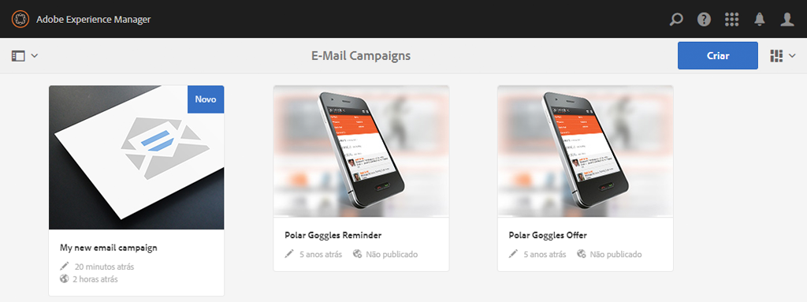

1. Selecionar **Criar** then **Criar página**.
1. Selecione um dos modelos disponíveis específico do Adobe Campaign ao qual você está se conectando e clique em **Próximo**. Três templates estão disponíveis por padrão:

   * **Email do Adobe Campaign Classic**: permite adicionar conteúdo a um modelo predefinido (duas colunas) antes de enviá-lo ao Adobe Campaign Classic para entrega.
   * **Email do Adobe Campaign Standard**: permite adicionar conteúdo a um modelo predefinido (duas colunas) antes de enviá-lo ao Adobe Campaign Standard para entrega.

1. Preencha o **Título** e, opcionalmente, **Descrição** e clique em **Criar**. O título é usado como o assunto do boletim informativo/email, a menos que você o substitua ao editar o email.

### Selecionar o modelo e o serviço de nuvem do Adobe Campaign {#selecting-the-adobe-campaign-cloud-service-and-template}

Para fazer a integração com o Adobe Campaign, é necessário adicionar um serviço de nuvem do Adobe Campaign à página. Isso fornece acesso à personalização e a outras informações do Adobe Campaign.

Além disso, também pode ser necessário selecionar o modelo do Adobe Campaign, alterar o assunto e adicionar conteúdo de texto simples para os usuários que não visualizarão o email no HTML.

Você pode selecionar o serviço de nuvem na **Sites** ou no email/informativo depois de criá-lo.

Selecionar o serviço de nuvem na **Sites** é a abordagem recomendada. Selecionar o serviço de nuvem do email/boletim informativo requer uma solução alternativa.

No **Sites** página:

1. Em AEM, selecione a página de email e clique em **Propriedades da exibição**.

   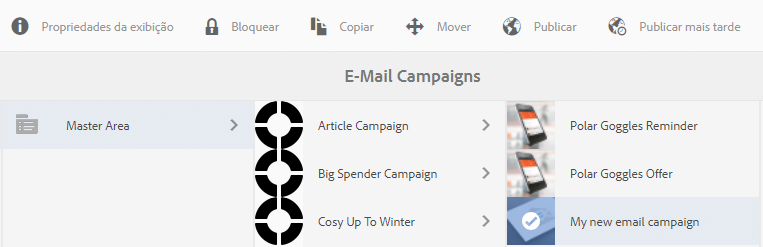

1. Selecionar **Editar** e depois a **Serviços em nuvem** e role para baixo até a parte inferior e clique no sinal + para adicionar uma configuração e selecione **Adobe Campaign**.

   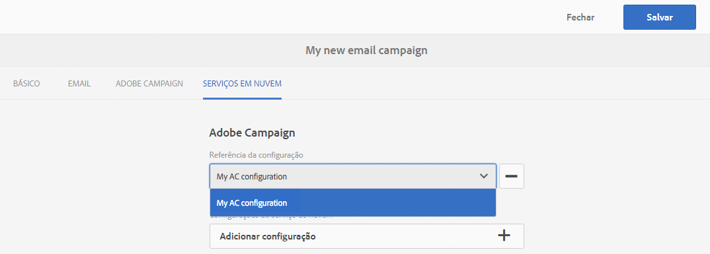

1. Selecione a configuração que corresponde à instância do Adobe Campaign na lista suspensa e confirme clicando em **Salvar**.
1. É possível exibir o modelo aplicado ao email clicando na guia** Adobe Campaign**. Se quiser selecionar outro template, você pode acessá-lo do email ao editar.

   Se quiser aplicar um template específico de delivery de email (do Adobe Campaign), diferente do template de email padrão, em **Propriedades**, selecione o **Adobe Campaign** guia . Insira o nome interno do template do delivery de email na instância relacionada do Adobe Campaign.

   O modelo selecionado determina quais campos de personalização estão disponíveis no Adobe Campaign.

   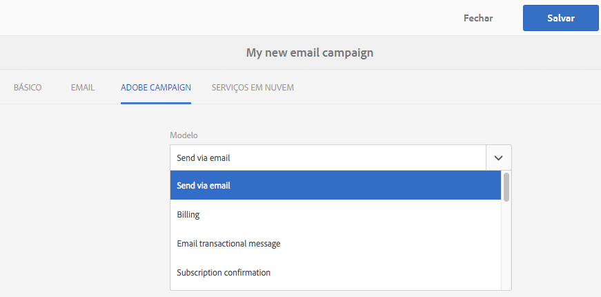

No boletim informativo/email de criação, talvez você não consiga selecionar a configuração do serviço de nuvem do Adobe Campaign em **Propriedades da página** devido a um problema de layout. Você pode usar a solução alternativa descrita aqui:

1. Em AEM, selecione a página de email e clique em **Editar**. Clique em **Abrir propriedades**.

   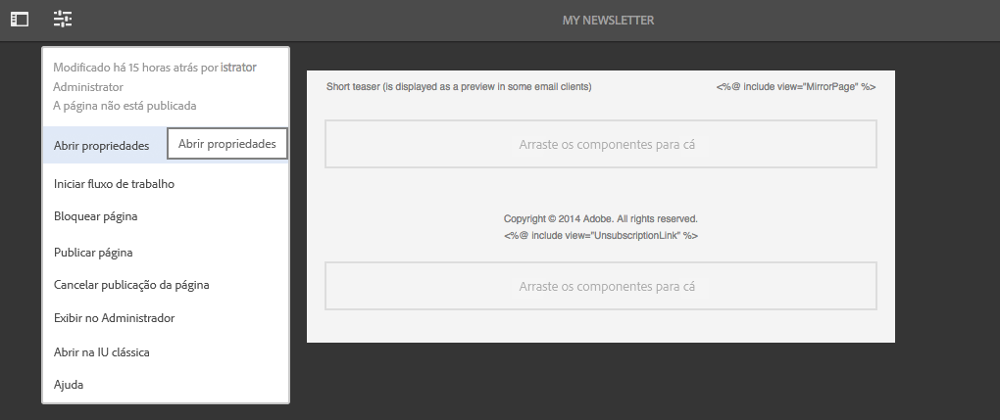

1. Selecionar **Serviços em nuvem** e clique em **+** para adicionar uma configuração. Selecione qualquer configuração visível (não importa qual). Clique ou toque no **+** assinar para adicionar outra configuração e, em seguida, selecione **Adobe Campaign**.

   >[!NOTE]
   >
   >Como alternativa, você pode selecionar os serviços em nuvem selecionando **Propriedades da exibição** no **Sites** guia .

1. Selecione a configuração que corresponde à instância do Adobe Campaign na lista suspensa, exclua a primeira configuração criada que não era para o Adobe Campaign e confirme clicando na marca de seleção.
1. Continue com a etapa 4 do procedimento anterior para selecionar modelos e adicionar texto sem formatação.

### Edição de conteúdo de email {#editing-email-content}

Para editar conteúdo de email:

1. Abra o email e, por padrão, entre no modo de Edição.

   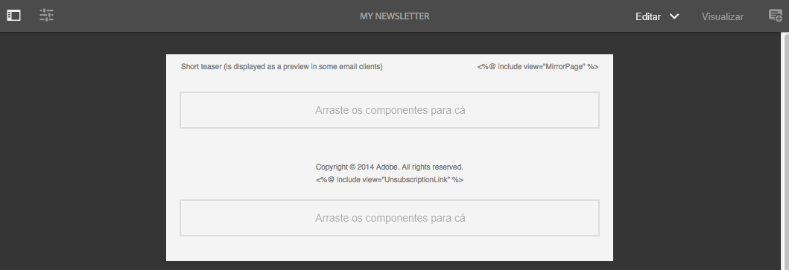

1. Se desejar alterar o assunto do email ou adicionar texto simples para os usuários que não visualizarão o email no HTML, selecione **Email** e adicione um assunto e texto. Selecione o ícone de página para gerar automaticamente uma versão de texto simples do HTML. Clique na marca de seleção ao concluir.

   Você pode personalizar o boletim informativo usando campos de personalização do Adobe Campaign. Para adicionar um campo de personalização, abra o seletor de campo de personalização clicando no botão que exibe o logotipo do Adobe Campaign. Você pode então escolher entre todos os campos disponíveis para este boletim informativo.

   >[!NOTE]
   >
   >Se os campos de personalização nas propriedades do editor estiverem esmaecidos, examine novamente sua configuração.

   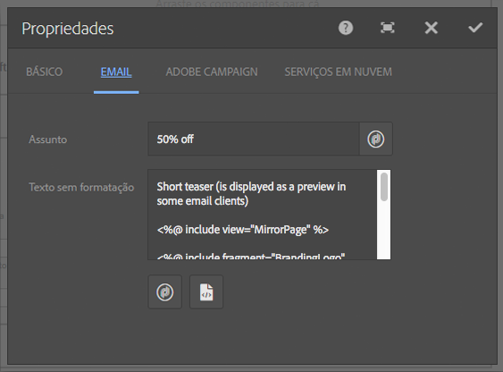

1. Abra o painel Componentes no lado esquerdo da tela e selecione **Informativo do Adobe Campaign** no menu suspenso para encontrar esses componentes.

   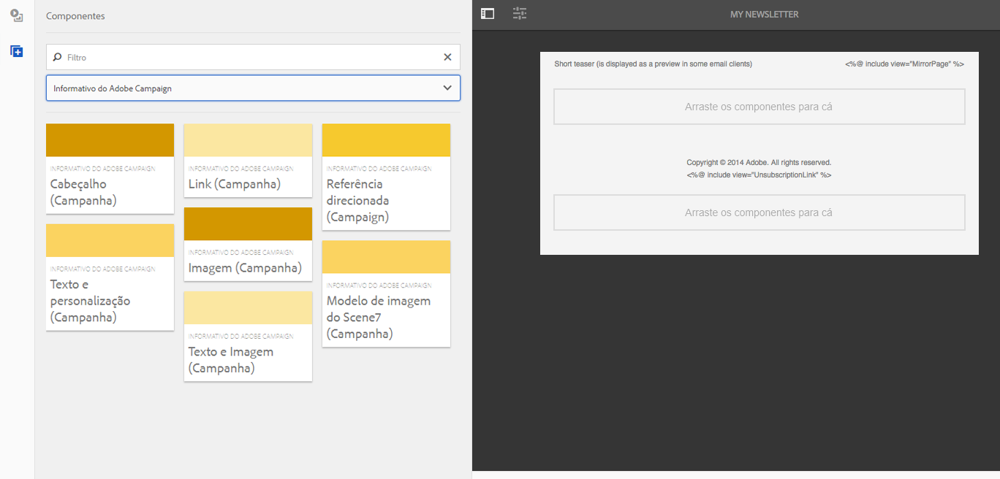

1. Arraste os componentes diretamente para a página e edite-os de acordo. Por exemplo, você pode arrastar uma **Texto e personalização (Campaign)** e adicionar texto personalizado.

   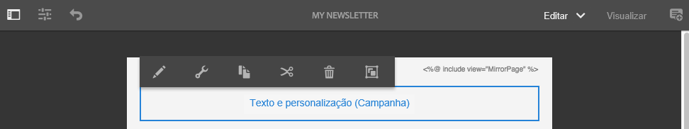

   Consulte [Componentes do Adobe Campaign](/help/sites-authoring/adobe-campaign-components.md) para obter uma descrição detalhada de cada componente.

   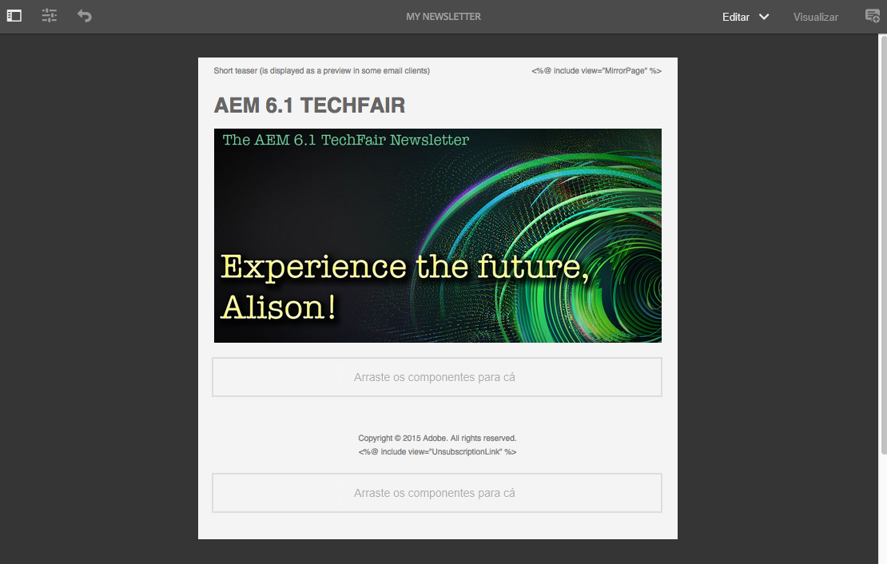

### Inserção de personalização {#inserting-personalization}

Ao editar seu conteúdo, você pode inserir:

* Campos de contexto do Adobe Campaign. Esses são campos que você pode inserir no texto que serão adaptados de acordo com os dados do recipient (por exemplo, nome, sobrenome ou quaisquer dados da dimensão de destino).
* Blocos de personalização do Adobe Campaign. Esses são blocos de conteúdo predefinido que não estão relacionados aos dados do recipient, como um logotipo da marca ou um link para uma mirror page.

Consulte [Componentes do Adobe Campaign](/help/sites-authoring/adobe-campaign-components.md) para obter uma descrição completa dos componentes do Campaign.

>[!NOTE]
>
>* Somente os campos da Adobe Campaign **Perfis** targeting dimension são consideradas.
>* Ao visualizar propriedades de **Sites**, você não tem acesso aos campos de contexto do Adobe Campaign. Você pode acessá-los diretamente do email durante a edição.
>

Para inserir personalização:

1. Inserir um novo **Informativo** > **Texto e personalização (Campaign)** arrastando-o para a página.

   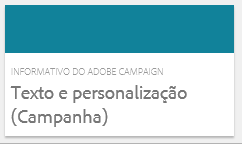

1. Abra o componente clicando no ícone Lápis. O editor local é aberto.

   

   >[!NOTE]
   >
   >**Para Adobe Campaign Standard:**
   >
   >* Os campos de contexto disponíveis correspondem à variável **Perfis** targeting dimension no Adobe Campaign.
   >* Consulte [Vincular uma página de AEM a um email do Adobe Campaign](#linking-an-aem-page-to-an-adobe-campaign-email-adobe-campaign-standard).

   >
   >**Para Adobe Campaign Classic:**
   >
   >* Os campos de contexto disponíveis são recuperados dinamicamente da Adobe Campaign **nms:seedMember** esquema. Os dados da extensão do Target são recuperados dinamicamente do workflow que contém a entrega sincronizada com o conteúdo. (Consulte o [Sincronizar o conteúdo criado no AEM com um delivery do Adobe Campaign](#synchronizing-content-created-in-aem-with-a-delivery-from-adobe-campaign-classic) seção).
   >
   >* Para adicionar ou ocultar elementos de personalização, consulte [Gerenciamento de campos e blocos de personalização](/help/sites-administering/campaignonpremise.md#managing-personalization-fields-and-blocks).
   >* **Importante**: Todos os campos da tabela de distribuição também devem estar na tabela de recipients (ou na tabela de contatos correspondente).

1. Insira o texto digitando. Insira campos de contexto ou blocos de personalização clicando nos componentes do Adobe Campaign e selecionando-os. Quando terminar, selecione a marca de seleção.

   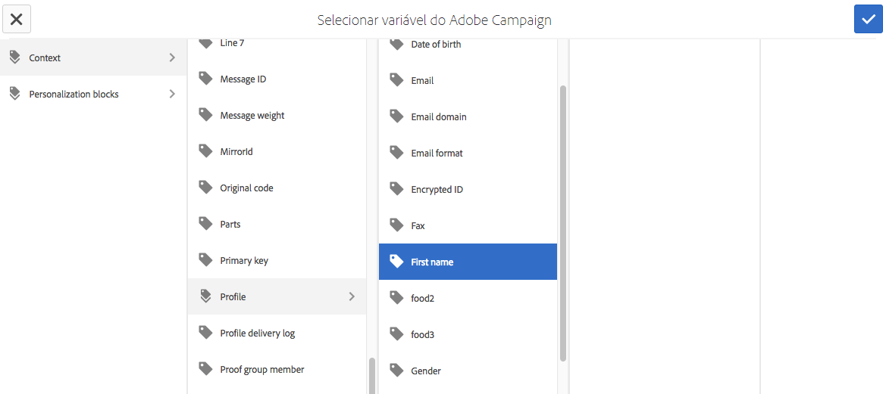

   Após inserir campos de contexto ou blocos de personalização, você pode visualizar seu boletim informativo e testar seus campos. Consulte [Visualização de um informativo](#previewing-a-newsletter).

### Pré-visualização de um boletim informativo {#previewing-a-newsletter}

Você pode visualizar como o boletim informativo será exibido, bem como visualizar a personalização.

1. Com o boletim informativo aberto, clique em **Visualizar** no canto superior direito do AEM. AEM exibe a aparência do boletim informativo quando os usuários o recebem.

   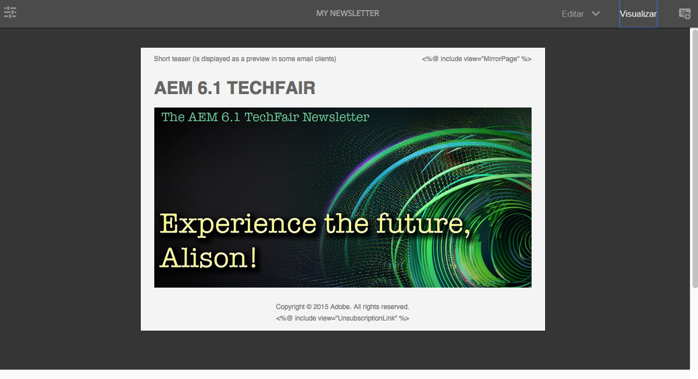

   >[!NOTE]
   >
   >Se estiver usando o Adobe Campaign Standard e o template de amostra, dois blocos de personalização que exibem o conteúdo inicial - **&quot;&lt;%@ include view=&quot;MirrorPage&quot; %>&quot;** e **&quot;&lt;%@ include view=&quot;UnsubscriptionLink&quot; %>&quot;** - gerará erros ao importar o conteúdo durante a entrega. Você pode ajustá-los selecionando os blocos correspondentes usando o seletor de bloco de personalização.

1. Para visualizar a personalização, abra o ContextHub clicando/tocando no ícone correspondente na barra de ferramentas. As tags do campo de personalização agora são substituídas pelos dados de propagação do persona selecionado. Veja como as variáveis se adaptam ao alternar personas no ContextHub.

   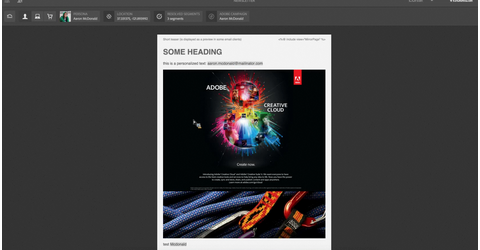

1. Você pode exibir os dados de propagação provenientes do Adobe Campaign que estão associados ao perfil atualmente selecionado. Para fazer isso, clique/toque no módulo Adobe Campaign na barra do ContextHub. Isso abre uma caixa de diálogo exibindo todos os dados de propagação do perfil atual. Novamente, os dados se adaptam ao alternar para um perfil diferente.

   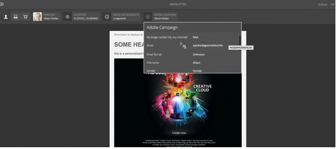

### Aprovar conteúdo em AEM {#approving-content-in-aem}

Após a conclusão do conteúdo, é possível iniciar o processo de aprovação. Vá para o **Fluxo de trabalho** da caixa de ferramentas e selecione o **Aprovar para Adobe Campaign** fluxo de trabalho.

Esse fluxo de trabalho pronto para uso tem duas etapas: revisão e aprovação, ou revisão e então rejeição. No entanto, esse workflow pode ser estendido e adaptado a um processo mais complexo.

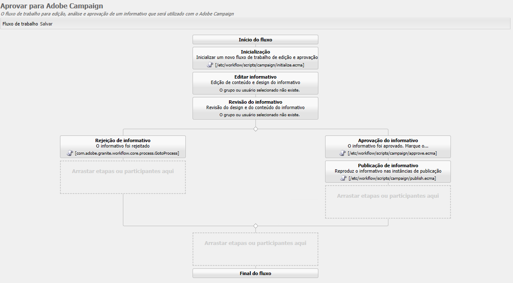

Para aprovar o conteúdo para o Adobe Campaign, aplique o fluxo de trabalho selecionando **Fluxo de trabalho** e seleção **Aprovar para Adobe Campaign** e clique em **Iniciar fluxo de trabalho**. Analise as etapas e aprove o conteúdo. Também é possível rejeitar o conteúdo selecionando **Rejeitar** em vez de **Aprovar** na última etapa do fluxo de trabalho.

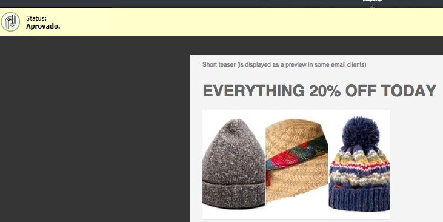

Depois que o conteúdo é aprovado, ele é exibido como aprovado no Adobe Campaign. O email pode ser enviado.

No Adobe Campaign Standard:

No Adobe Campaign Classic:

>[!NOTE]
O conteúdo não aprovado pode ser sincronizado com um delivery no Adobe Campaign, mas o delivery não pode ser executado. Somente o conteúdo aprovado pode ser enviado por meio de deliveries do Campaign.

## Vincular AEM com a Adobe Campaign Standard e a Adobe Campaign Classic {#linking-aem-with-adobe-campaign-standard-and-adobe-campaign-classic}

A forma como você vincula ou sincroniza AEM com o Adobe Campaign depende de você estar usando o Adobe Campaign Standard baseado em assinatura ou o Adobe Campaign Classic baseado no local.

Consulte as seguintes seções para obter instruções com base na solução da Adobe Campaign:

* [Vincular uma página de AEM a um email do Adobe Campaign (Adobe Campaign Standard)](#linking-an-aem-page-to-an-adobe-campaign-email-adobe-campaign-standard)
* [Sincronizar o conteúdo criado no AEM com uma entrega do Adobe Campaign Classic](#synchronizing-content-created-in-aem-with-a-delivery-from-adobe-campaign-classic)

### Vincular uma página de AEM a um email do Adobe Campaign (Adobe Campaign Standard) {#linking-an-aem-page-to-an-adobe-campaign-email-adobe-campaign-standard}

O Adobe Campaign Standard permite recuperar e vincular o conteúdo criado em AEM com:

* Um email.
* Um modelo de email.

Isso permite fornecer o conteúdo. Você verá se um boletim informativo está vinculado a uma única entrega pelo código exibido na página.

>[!NOTE]
Se um boletim informativo estiver vinculado a várias entregas, será exibido o número de entregas vinculadas (mas não cada ID).

Para vincular uma página criada no AEM com um email do Adobe Campaign:

1. Crie um novo email com base em um modelo de email específico do AEM. Consulte [Criar emails no Adobe Campaign Standard](https://helpx.adobe.com/campaign/standard/channels/using/creating-an-email.html) para obter mais informações.

   

1. Abra o **Conteúdo** bloco do painel de delivery.

   

1. Selecionar **Link com um conteúdo do Adobe Experience Manager** na barra de ferramentas para acessar a lista de conteúdos disponíveis no AEM.

   >[!NOTE]
   Se a variável **Link com uma Adobe Experience Manager** não for exibida na barra de ações, verifique se a opção **Modo de edição de conteúdo** está configurado corretamente para **Adobe Experience Manager** nas propriedades do email.

   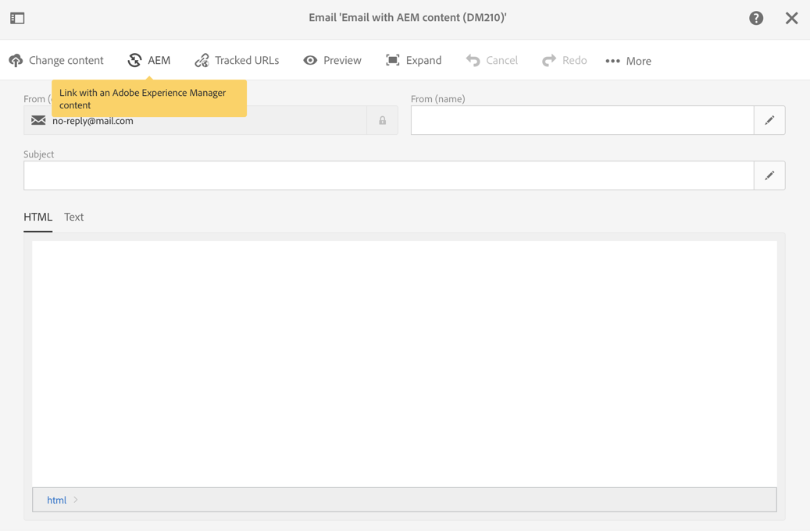

1. Selecione o conteúdo que deseja usar no email.

   Esta lista especifica:

   * O rótulo do conteúdo no AEM.
   * O status de aprovação do conteúdo no AEM. Se o conteúdo não for aprovado, você poderá sincronizá-lo, mas ele terá que ser aprovado antes que o delivery seja enviado. No entanto, é possível executar determinadas operações, como enviar uma prova ou o teste de visualização.
   * A data da última modificação de conteúdo.
   * Qualquer conteúdo já vinculado a um delivery.

   >[!NOTE]
   Por padrão, o conteúdo que já está sincronizado com um delivery está oculto. No entanto, é possível exibi-lo e usá-lo. Por exemplo, se você quiser usar o conteúdo como template para vários deliveries.

   Quando o email está vinculado a um conteúdo AEM, o conteúdo não pode ser editado no Adobe Campaign.

1. Especifique os outros parâmetros do email no painel (públicos-alvo, cronograma de execução).
1. Execute o delivery de email. Durante a análise de delivery, a versão mais atualizada do conteúdo AEM é recuperada.

   >[!NOTE]
   Se o conteúdo for atualizado no AEM enquanto estiver vinculado a um email, ele será atualizado automaticamente no Adobe Campaign durante a análise. A sincronização também pode ser executada manualmente usando **Atualizar conteúdo do Adobe Experience Manager** na barra de ações do conteúdo.
   Você pode cancelar o link entre um email e AEM conteúdo usando **Excluir o link com o conteúdo do Adobe Experience Manager** na barra de ações do conteúdo. Esse botão só estará disponível se um conteúdo já estiver vinculado ao delivery. Para vincular um conteúdo diferente a um delivery, você deve excluir o link de conteúdo atual antes de poder estabelecer um novo link.
   Quando o link é excluído, o conteúdo local é mantido e pode ser editado no Adobe Campaign. Se você vincular novamente o conteúdo após modificá-lo, todas as alterações serão perdidas.

### Sincronizar o conteúdo criado no AEM com um delivery do Adobe Campaign Classic {#synchronizing-content-created-in-aem-with-a-delivery-from-adobe-campaign-classic}

O Adobe Campaign permite recuperar e sincronizar o conteúdo criado no AEM com:

* Um delivery de campanha
* Uma atividade de delivery em um workflow de campanha
* Um delivery recorrente
* Um delivery contínuo
* Um delivery do Centro de mensagens
* Um template do delivery

Em AEM, se um boletim informativo estiver vinculado a um único delivery, o código do delivery será exibido na página.

>[!NOTE]
Se o boletim informativo estiver vinculado a várias entregas, será exibido o número de entregas vinculadas (mas não cada ID).

>[!NOTE]
A etapa Fluxo de trabalho **Publicar no Adobe Campaign** O está obsoleto no AEM 6.1. Essa etapa fazia parte da integração do AEM 6.0 com o Adobe Campaign e não é mais necessária.

Para sincronizar o conteúdo criado no AEM com um delivery do Adobe Campaign:

1. Crie um delivery ou adicione uma atividade de delivery a um workflow de campanha selecionando o **Entrega de email com conteúdo AEM (mailAEMContent)** template do delivery.

   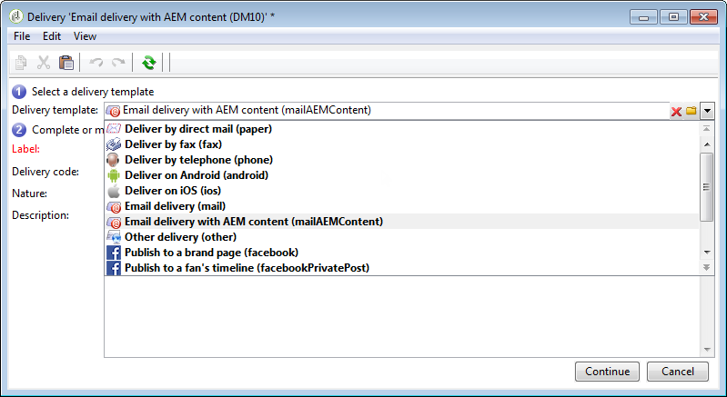

1. Selecionar **Sincronizar** na barra de ferramentas para acessar a lista de conteúdos disponíveis no AEM.

   >[!NOTE]
   Se a variável **Sincronizar** não for exibida na barra de ferramentas do delivery, verifique se a opção **Modo de edição de conteúdo** estiver configurado corretamente em **AEM** selecionando **Propriedades** > **Avançado**.

   

1. Selecione o conteúdo que deseja sincronizar com o delivery.

   Esta lista especifica:

   * O rótulo do conteúdo no AEM.
   * O status de aprovação do conteúdo no AEM. Se o conteúdo não for aprovado, você poderá sincronizá-lo, mas ele terá que ser aprovado antes que o delivery seja enviado. No entanto, é possível executar determinadas operações, como enviar um BAT ou o teste de visualização.
   * A data da última modificação do conteúdo.
   * Qualquer conteúdo já vinculado a um delivery.

   >[!NOTE]
   Por padrão, o conteúdo que já está sincronizado com um delivery está oculto. No entanto, é possível exibi-lo e usá-lo. Por exemplo, se você quiser usar o conteúdo como template para vários deliveries.

   

1. Especifique os outros parâmetros do delivery (target, etc.)
1. Se necessário, inicie o processo de aprovação de delivery no Adobe Campaign. A aprovação do conteúdo no AEM é necessária, além das aprovações configuradas no Adobe Campaign (orçamento, target, etc.). A aprovação do conteúdo no Adobe Campaign só é possível se o conteúdo já estiver aprovado no AEM.
1. Execute o delivery. Durante a análise de delivery, a versão mais atualizada do conteúdo AEM é recuperada.

   >[!NOTE]
   * Após a sincronização do delivery e do conteúdo, o conteúdo do delivery no Adobe Campaign se tornará somente leitura. O assunto do email e seu conteúdo não podem mais ser modificados.
   * Se o conteúdo for atualizado em AEM enquanto estiver vinculado a um delivery no Adobe Campaign, ele será atualizado automaticamente no delivery durante a análise do delivery. A sincronização também pode ser executada manualmente usando o **Atualizar conteúdo agora** botão.
   * Você pode cancelar a sincronização entre um delivery e AEM conteúdo usando o **Dessincronizar** botão. Isso só estará disponível se um conteúdo já estiver sincronizado com a entrega. Para sincronizar um conteúdo diferente com um delivery, você deve cancelar a sincronização de conteúdo atual antes de poder estabelecer um novo link.
   * Se dessincronizado, o conteúdo local será mantido e poderá ser editado no Adobe Campaign. Se ressincronizar o conteúdo após modificá-lo, todas as alterações serão perdidas.
   * Para entregas recorrentes e contínuas, a sincronização com AEM conteúdo é interrompida toda vez que o delivery é executado.

