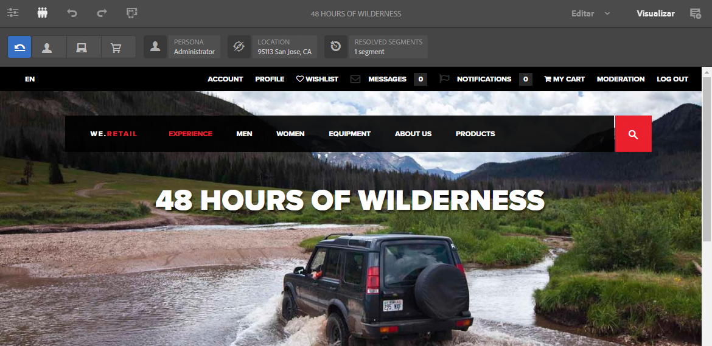

# Visualização de páginas usando dados do ContextHub{#previewing-pages-using-contexthub-data}

>[!CAUTION]
>
>AEM 6.4 chegou ao fim do suporte estendido e esta documentação não é mais atualizada. Para obter mais detalhes, consulte nossa [períodos de assistência técnica](https://helpx.adobe.com/br/support/programs/eol-matrix.html). Encontre as versões compatíveis [here](https://experienceleague.adobe.com/docs/).

O [ContextHub](/help/sites-developing/contexthub.md) A barra de ferramentas exibe dados de armazenamentos do ContextHub e permite alterar os dados de armazenamento. A barra de ferramentas do ContextHub é útil para visualizar o conteúdo que é determinado pelos dados em um armazenamento do ContextHub.

A barra de ferramentas consiste em uma série de modos de interface que contêm um ou mais módulos de interface.

* Os modos da interface do usuário são ícones que aparecem no lado esquerdo da barra de ferramentas. Ao clicar ou tocar em um ícone, a barra de ferramentas revela os módulos de interface que ele contém.
* Os módulos de interface exibem dados de um ou mais armazenamentos do ContextHub. Alguns módulos de interface também permitem manipular os dados de armazenamento.

O ContextHub instala vários modos de interface do usuário e módulos de interface do usuário. O administrador pode ter [ContextHub configurado](/help/sites-administering/contexthub-config.md) para exibir diferentes.

## Revelar a barra de ferramentas do ContextHub {#revealing-the-contexthub-toolbar}

A barra de ferramentas do ContextHub está disponível no modo de Visualização. A barra de ferramentas está disponível somente nas instâncias do autor e somente se o administrador a tiver ativado.

1. Com a página aberta para edição, clique ou toque em Visualizar na barra de ferramentas.

   

1. Para exibir a barra de ferramentas, clique ou toque no ícone ContextHub.

   

## Recursos do módulo da interface do usuário {#ui-module-features}

Cada módulo de interface fornece um conjunto diferente de recursos, mas os seguintes tipos de recursos são comuns. Como os módulos de interface podem ser estendidos, o desenvolvedor pode implementar outros recursos, conforme necessário.

### Conteúdo da barra de ferramentas {#toolbar-content}

Os módulos de interface podem exibir dados de um ou mais armazenamentos do ContextHub na barra de ferramentas. Os módulos de interface usam um ícone e um título para se identificarem.

### Conteúdo pop-up {#popup-content}

Alguns módulos de interface exibem uma sobreposição de pop-up quando clicados ou tocados. Normalmente, o pop-up contém mais informações do que o que aparece na barra de ferramentas.

### Pop-up Forms {#popup-forms}

A sobreposição de pop-up de um módulo pode incluir elementos de formulário que permitem alterar os dados no armazenamento do ContextHub. Se o conteúdo da página for determinado pelos dados de armazenamento, você poderá usar o formulário e observar as alterações no conteúdo da página.

### Modo de tela inteira {#fullscreen-mode}

As sobreposições de pop-up podem incluir um ícone que você clica ou toca para expandir o conteúdo do pop-up para cobrir toda a janela ou tela do navegador.

