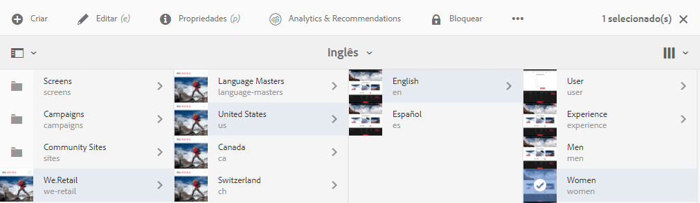
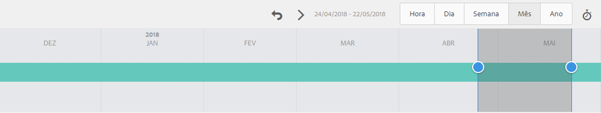
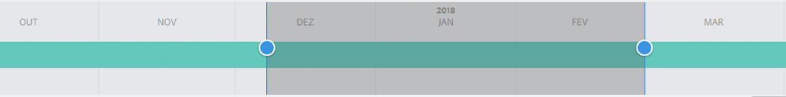

# Analisar o desempenho da página{#analyzing-page-performance}

>[!CAUTION]
>
>AEM 6.4 chegou ao fim do suporte estendido e esta documentação não é mais atualizada. Para obter mais detalhes, consulte nossa [períodos de assistência técnica](https://helpx.adobe.com/br/support/programs/eol-matrix.html). Encontre as versões compatíveis [here](https://experienceleague.adobe.com/docs/).

Abra o [Content Insight](/help/sites-authoring/content-insights.md) para analisar o desempenho da página que você está criando. Configure o período de relatório para concentrar sua análise.

## Abrir o Analytics e o Recommendations para uma página {#opening-analytics-and-recommendations-for-a-page}

Use o procedimento a seguir para visualizar o Analytics e o Recommendations de uma página:

1. Navegue até a página que deseja analisar.
1. Na barra de ferramentas, clique ou toque em **Analytics e Recommendations**.

   >[!NOTE]
   >
   >O Analytics e o Recommendations para uma página só serão exibidos se você tiver configurado AEM para [integrar com o Adobe Analytics](/help/sites-administering/adobeanalytics-connect.md).

   

## Alterar o período de relatório {#changing-the-reporting-period}

Altere os seguintes aspectos relacionados ao tempo dos relatórios de análise:

* O período de tempo do relatório.
* A granularidade dos dados.

As ferramentas para alterar os aspectos relacionados ao tempo dos relatórios são exibidas na parte superior da página Content Insight . 

### Alterar o período de relatório {#changing-the-reporting-period-1}

Altere o período de relatório da página Content Insight para concentrar a análise da atividade da página em um período específico. Quando você altera o período de relatório, os relatórios são atualizados automaticamente. A área sombreada no período de tempo representa o período de relatório. As datas no período de tempo aumentam da esquerda para a direita.

Para alterar o período de relatório de uma página Content Insight:

1. Se o período não for exibido na parte superior da página, clique ou toque no ícone Alternar período.

   

1. Para alterar a data de início do período de relatório, arraste o círculo exibido no lado esquerdo da área sombreada para a data de início desejada.

   Se não conseguir ver o lado esquerdo da área sombreada, use a barra de rolagem para trazê-la à exibição.

1. Para alterar a data de término do período de relatório, arraste o círculo exibido no lado direito da área sombreada para a data de término desejada.

### Alterar a granularidade do período de relatório {#changing-the-granularity-of-the-reporting-period}

Altere a quantidade de tempo que cada ponto de dados abrange em um relatório. Por exemplo, quando a granularidade Semana é selecionada, cada ponto de dados no relatório de Exibições representa o número de exibições para uma semana.

A granularidade afeta os relatórios que plotam dados ao longo do tempo, como os relatórios Exibições e Média de minutos envolvidos na página . A granularidade também afeta a escala do período.

1. Se o controle de granularidade não for exibido, clique ou toque no ícone Alternar granularidade .

   

1. Clique ou toque na granularidade desejada. Depois de selecionado, o relatório é atualizado automaticamente para refletir a granularidade.

## Atribuir tarefas ao SEO Recommendations {#assigning-tasks-for-seo-recommendations}

Use o relatório SEO Recommendations para criar tarefas para melhorar a visibilidade da página para os mecanismos de pesquisa. Para cada recomendação no relatório que não tenha uma marca de seleção, você pode criar uma tarefa que você atribui a um usuário para executar o trabalho necessário.

O status da recomendação de SEO indica quando a tarefa foi criada, mas ainda não foi concluída.

Quando criada, a tarefa é exibida na lista de Tarefas do usuário. Para obter informações sobre tarefas, consulte [Trabalhar com tarefas](/help/sites-authoring/task-content.md).

Use o procedimento a seguir para criar uma tarefa para uma recomendação de SEO.

1. Clique ou toque no ícone de informações da recomendação de SEO.

   

1. Clique no ícone de triângulo circundado que aparece ao lado do ícone de informações.

   

1. Preencha os campos de formulário que aparecem e toque em Criar:

   * Projeto: Selecione o projeto no qual criar a tarefa.
   * Nome: O nome que identifica a tarefa. O nome padrão é o título da recomendação de SEO.
   * Atribuir a: Selecione o usuário ao qual a tarefa será atribuída. Comece digitando o nome do usuário para filtrar a lista.
   * Descrição: Uma descrição da atividade necessária para concluir a tarefa. A descrição padrão são as informações que acompanham a recomendação de SEO.
   * Prioridade da tarefa: A prioridade da tarefa.
   * Data de Vencimento: A data em que a tarefa deve ser concluída.

1. Clique ou toque em Concluído para fechar a mensagem Tarefa criada .

>[!NOTE]
>
>A tarefa criada também inclui o caminho para a página à qual a recomendação de SEO se aplica.
