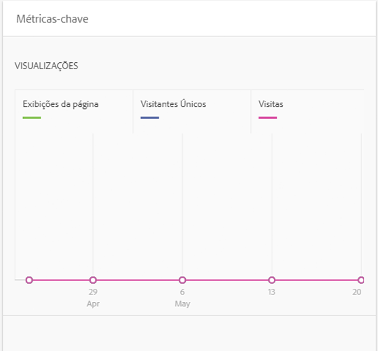
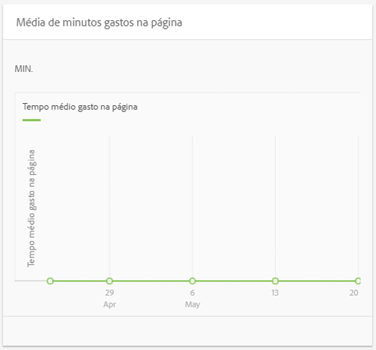
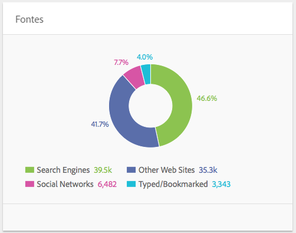

# Content Insight{#content-insight}

>[!CAUTION]
>
>AEM 6.4 chegou ao fim do suporte estendido e esta documentação não é mais atualizada. Para obter mais detalhes, consulte nossa [períodos de assistência técnica](https://helpx.adobe.com/br/support/programs/eol-matrix.html). Encontre as versões compatíveis [here](https://experienceleague.adobe.com/docs/).

O Content Insight fornece informações sobre o desempenho da página usando análises da Web e recomendações de SEO. Use o Content Insight para tomar decisões sobre como modificar páginas ou para saber como alterações anteriores alteraram o desempenho. Para cada página criada, você pode abrir o Content Insight para analisar a página.

O layout da página Content Insight muda para se adequar às dimensões da tela e à orientação do dispositivo que você está usando.

## Dados do relatório

A página Content Insight inclui relatórios que usam dados do Adobe SiteCatalyst, Adobe Target, Adobe Social e BrightEdge:

* SiteCatalyst: Os relatórios das seguintes métricas estão disponíveis:

   * Exibições de página
   * Tempo médio gasto na página
   * Fontes

* Target: Relatórios sobre a atividade da campanha para a qual a página inclui ofertas.
* BrightEdge: Relatórios sobre os recursos da página que melhoram a visibilidade da página para os mecanismos de pesquisa e recomendam os recursos que devem ser implementados.

Consulte [Abrir o Analytics e o Recommendations para uma página](/help/sites-authoring/ci-analyze.md#opening-analytics-and-recommendations-for-a-page).

## Período de relatório

Os relatórios mostram dados de um período de tempo controlado por você. Quando você ajusta o período dos relatórios, os relatórios são atualizados automaticamente com os dados desse período. As dicas visuais indicam o horário em que as versões da página foram alteradas, para que você possa comparar o desempenho de cada versão.

Você também pode especificar a granularidade dos dados reportados, por exemplo, é possível visualizar dados diários, semanais, mensais ou anuais.

Consulte [Alterar o período de relatório](/help/sites-authoring/ci-analyze.md#changing-the-reporting-period).

>[!NOTE]
>
>Os relatórios de Content Insights exigem que o administrador tenha AEM integrado o SiteCatalyst, o Target e o BrightEdge. Consulte [Integração com o SightCatalyst](/help/sites-administering/adobeanalytics.md), [Integração com o Adobe Target](/help/sites-administering/target.md)e [Integração com o BrightEdge](/help/sites-administering/brightedge.md).

## O Relatório de exibições {#the-views-report}

O Relatório de exibições inclui os seguintes recursos para avaliar o tráfego da página:

* O número total de exibições de uma página para o período do relatório.
* Um gráfico do número de exibições durante o período de relatório:

   * Total de exibições.
   * Visitantes únicos.

## O Relatório de média de participação na página {#the-page-average-engaged-report}

O relatório Média de participação na página inclui os seguintes recursos para avaliar a eficácia da página:

* O tempo médio em que a página permanece aberta durante todo o período do relatório.
* Um gráfico da duração média de uma exibição de página durante o período do relatório.

## O Relatório de Fontes {#the-sources-report}

O relatório Fontes indica como os usuários navegaram para a página, por exemplo, a partir dos resultados do mecanismo de pesquisa ou usando o URL conhecido.

## O Relatório de Rejeições {#the-bounces-report}

O relatório Rejeições inclui um gráfico que mostra o número de rejeições que ocorreram para uma página durante o período de relatório selecionado.

## O Relatório de Atividade da Campanha {#the-campaign-activity-report}

Para cada campanha para a qual a página está ativa, um relatório é exibido com o nome *Nome da campanha* Atividade. O relatório mostra impressões e conversões de página para cada segmento para o qual uma oferta é fornecida.

## O relatório de SEO Recommendations {#the-seo-recommendations-report}

O relatório SEO Recommendations contém os resultados da análise do BrightEdge para a página. O relatório é uma lista de verificação dos recursos da página que indica quais recursos a página inclui ou não para maximizar a capacidade de descoberta usando mecanismos de pesquisa.

O relatório permite que você crie tarefas para que sejam feitos aprimoramentos para melhorar a localização da página. O Recommendations indica que as tarefas foram criadas para implementar a recomendação. Consulte [Atribuir tarefas ao SEO Recommendations](/help/sites-authoring/ci-analyze.md#assigning-tasks-for-seo-recommendations).

