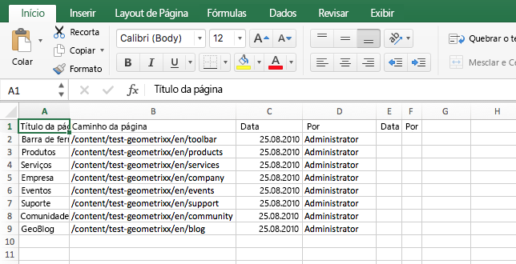
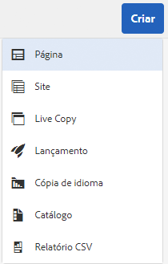
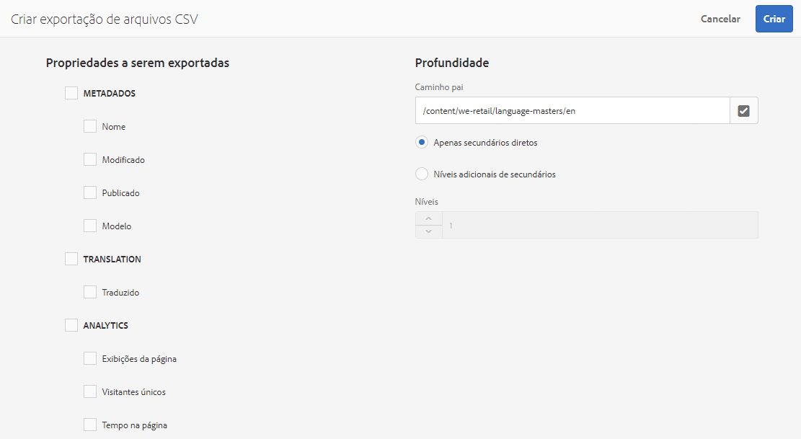

# Exportar para CSV  {#export-to-csv}

**Criar exportação de arquivos CSV** permite exportar informações sobre suas páginas para um arquivo CSV em seu sistema local.

* O arquivo baixado é chamado de `export.csv`
* Os conteúdos dependem das propriedades que você selecionar.
* É possível definir o caminho junto com o detalhamento da exportação.

>[!NOTE]
>
>O recurso para download e o destino padrão do seu navegador são usados.

O assistente Criar exportação de arquivos CSV permite selecionar:

* Propriedades a serem exportadas

   * Metadados

      * Modificado
      * Publicado
   * Análise

      * Exibições da página
      * Visitantes únicos
      * Tempo na página

* Profundidade

   * Caminho pai
   * Apenas secundários diretos
   * Níveis adicionais de secundários
   * Níveis

O arquivo `export.csv` resultante pode ser aberto no Excel ou qualquer outro aplicativo compatível.

The create **CSV Export** option is available when browsing the **Sites** console (in List view): it is an option of the **Create** drop down menu:

Para criar uma exportação de arquivos CSV:

1. Abra o console **Sites** e navegue até o local desejado, se necessário.
1. From the toolbar, select **Create** then **CSV Export** to open the wizard:

   

1. Selecione as propriedades desejadas para exportar.
1. Selecione **Criar**.

