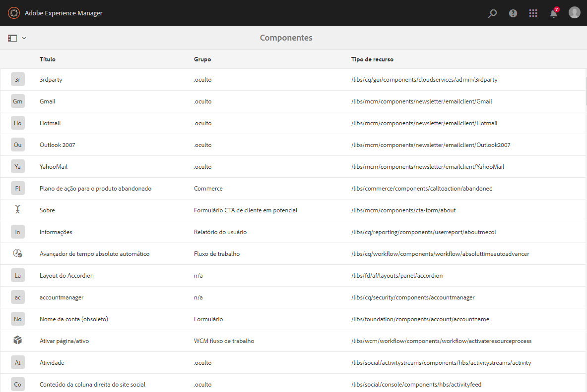
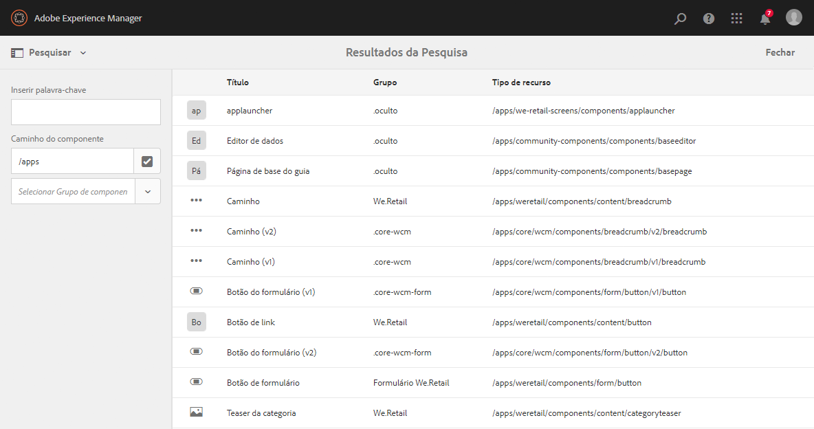
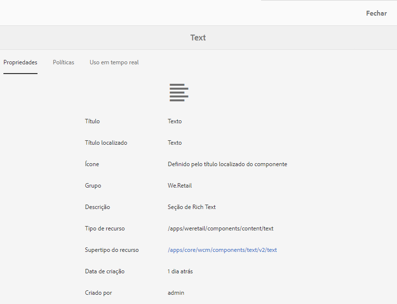
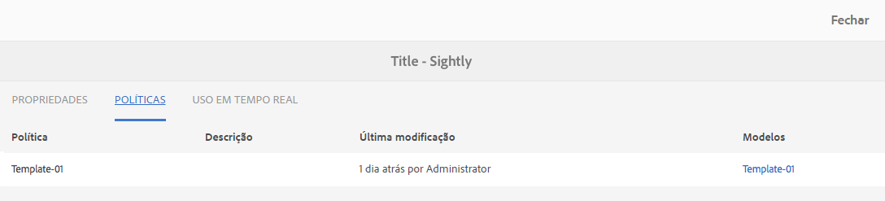
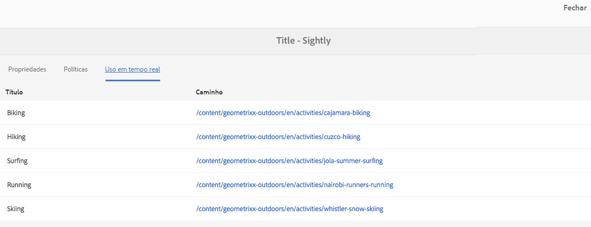
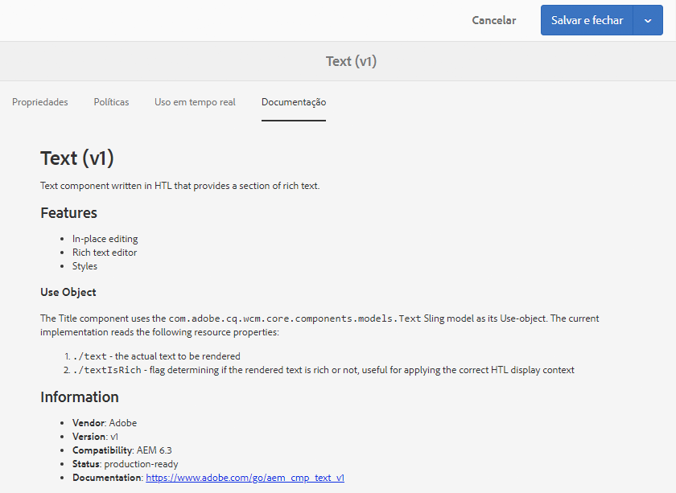

# Console de componentes{#components-console}

O console Componentes permite navegar em todos os componentes definidos para a sua instância e exibir as principais informações de cada componente. 

It can be accessed from **Tools** -> **General** -> **Components**. No console, as visualizações em Cartão e Lista estão disponíveis. Como não há estrutura em árvore para componentes, a exibição em coluna não está disponível.

>[!NOTE]
>
>O console Componentes mostra todos os componentes do sistema. O [Navegador de componentes](/help/sites-authoring/author-environment-tools.md#components-browser) mostra componentes que estão disponíveis para autores e oculta todos os grupos de componentes que começam com um ponto final ( `.`).

## Pesquisar {#search-features}

Com o ícone **Apenas conteúdo** (na parte superior esquerda), você pode abrir o painel **Pesquisar** para pesquisar e/ou filtrar os componentes: 

## Detalhes do componente {#component-details}

Para exibir detalhes sobre um componente específico, toque/clique no recurso desejado. As três guias fornecem:

* **Propriedades**

   

   Na guia Propriedades, é possível:

   * Veja as propriedades gerais do componente.
   * Visualizar como o [ícone ou a abreviação foi definida](/help/sites-developing/components-basics.md#component-icon-in-touch-ui) para o componente.

      * Clicar na origem do ícone levará você até esse componente.
   * Visualizar o **Tipo de recurso** e o **Supertipo do recurso** (se definido) para o componente.

      * Clicar no Supertipo do recurso levará você até esse componente.
   >[!NOTE]
   >
   >Como `/apps` não pode ser editado no tempo de execução, o console Componentes fica somente leitura.

* **Políticas**

   

* **Uso em tempo real**

   

   >[!CAUTION]
   >
   >Devido à natureza das informações coletadas para esta exibição, ela pode levar algum tempo para ser agrupada/exibida. 

* **Documentação**

   Se o desenvolvedor tiver fornecido a [documentação referente ao componente](/help/sites-developing/developing-components.md#documenting-your-component), ela aparecerá na guia **Documentação**. Se não houver documentação disponível, a guia **Documentação** não será exibida.

   

