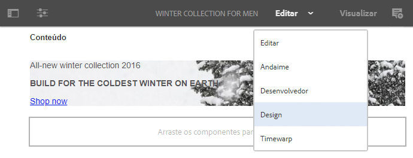
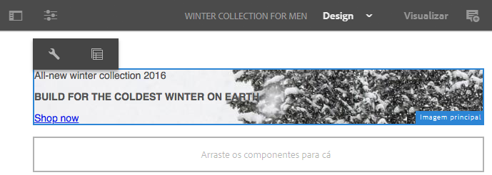
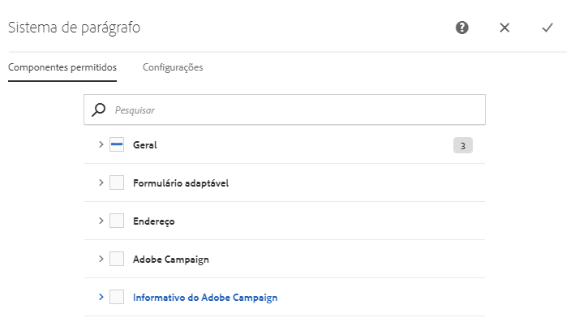
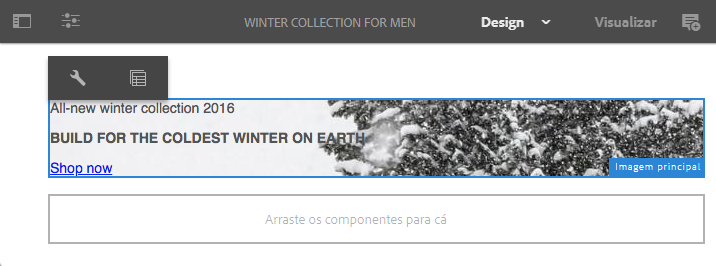
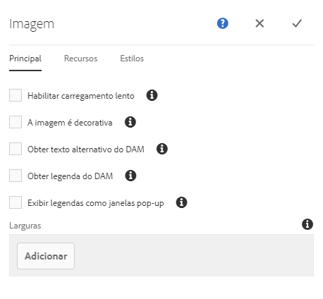
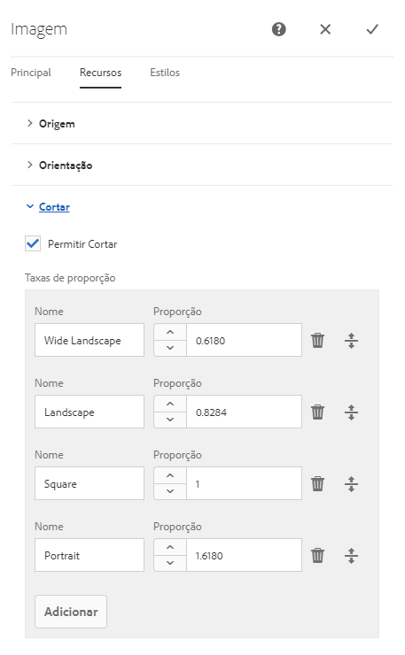

# Configuração dos componentes no Modo de design{#configuring-components-in-design-mode}

Quando a instância do AEM for instalada do modo out-of-the-box, uma seleção de componentes é imediatamente disponibilizada no navegador de componentes.

Além destes, outros componentes também estarão disponíveis. Você pode usar o Modo de design para [Ativar/Desativar tais componentes](#enable-disable-components). Quando ativado e localizado em sua página, você poderá usar o Modo de design para [configurar os aspectos de design do componente](#configuring-the-design-of-a-component) através da edição dos parâmetros do atributo.

>[!NOTE]
>
>Alguns cuidados devem ser tomados ao editar esses componentes. As configurações de design muitas vezes são uma parte integrante do design de todo o site, por isso só devem ser alteradas por alguém com os privilégios adequados e experiência, normalmente um administrador ou desenvolvedor. Consulte [Desenvolvimento de componentes](/help/sites-developing/components.md) para obter mais informações.

>[!NOTE]
>
>O modo de Design só está disponível para modelos estáticos. Os modelos criados com modelos editáveis devem ser editados usando o [editor de modelo](/help/sites-authoring/templates.md).

>[!NOTE]
>
>O modo de design só está disponível para configurações de design armazenadas como conteúdo em ( `/etc`).
>
>Starting in AEM 6.4, it is recommended to store designs as configuration data under `/apps` to support continuous deployment scenarios. Designs stored under `/apps` are not editable at runtime and the Design mode will not be available to non-admin users for such templates.

Isso envolve adicionar ou remover os componentes permitidos no sistema de parágrafos da página. O sistema de parágrafo (`parsys`) é um componente composto que contém todos os outros componentes de parágrafo. O sistema de parágrafo permite aos autores adicionar componentes de diferentes tipos em uma página, pois contêm todos os outros componentes de parágrafo. Cada tipo de parágrafo é representado como um componente.

Por exemplo, o conteúdo de uma página de produto pode conter um sistema de parágrafo com o seguinte:

* Uma imagem do produto (na forma de uma imagem ou de um parágrafo de imagem e texto)
* A descrição do produto (como um parágrafo de texto)
* Uma tabela com os dados técnicos (como um parágrafo de tabela)
* Um formulário para os usuários preencherem (como formas de começar, formas de elemento e formas de parágrafo final)

>[!NOTE]
>
>Consulte [Desenvolvimento de componentes](/help/sites-developing/components.md) e [diretrizes para o uso de modelos e componentes](/help/sites-developing/dev-guidelines-bestpractices.md#guidelines-for-using-templates-and-components) para obter mais informações sobre o `parsys`.

>[!CAUTION]
>
>Editar o design usando o Modo Design como descrito neste artigo é a maneira recomendada de definir designs de modelos estáticos
>
>A modificação de designs no CRX DE por exemplo não uma prática recomendada e a aplicação desses designs pode variar do comportamento esperado. Consulte o documento de desenvolvedor [Modelos de Página - Estático](/help/sites-developing/page-templates-static.md#how-template-designs-are-applied) para obter mais informações.

## Desativar/Ativar componentes {#enable-disable-components}

Para ativar ou desativar um componente:

1. Selecione o modo de **Design.**

   

1. Toque ou clique em um componente. O componente terá uma borda azul quando selecionado.

   

1. Click or tap the **Parent** icon.

   

   Isso vai selecionar o sistema de parágrafo que contém o componente atual.

1. O ícone de **Configuração** para o sistema de parágrafo será mostrado na barra de ação do item pai (principal).

   

   Selecione essa opção para exibir a caixa de diálogo.

1. Use a caixa de diálogo para definir os componentes disponíveis no navegador de componentes ao editar a página atual.

   

   A caixa de diálogo tem duas guias:

   * Componentes permitidos
   * Configurações

   **Componentes permitidos**

   On the **Allowed Components** tab, you define which components are available for the parsys.

   * Os componentes são agrupados por seus grupos de componentes, que podem ser expandidos e recolhidos.
   * Para selecionar um grupo inteiro, marque o nome do grupo. Para cancelar a seleção, desmarque.
   * Um sinal de menos indica que pelo menos um, mas não todos os itens em um grupo foram selecionados.
   * Uma pesquisa está disponível para filtrar um componente pelo nome.
   * As pontuações listadas à direita do nome do grupo de componentes representa o número total de componentes selecionados nesses grupos independentemente do filtro.

   A configuração é definida por um componente de página. Se as páginas secundárias usarem o mesmo modelo e/ou o componente de página (normalmente alinhado), então, a mesma configuração será aplicada ao sistema de parágrafo correspondente.

   >[!NOTE]
   >
   >Os componentes de formulário adaptável são projetados para funcionar dentro do Contêiner de formulário adaptável para aproveitar o ecossistema do Forms. Portanto, esses componentes devem ser usados somente no editor de formulário adaptável e não funcionam no editor de páginas do Sites.

   **Configurações**

   Na guia **Configurações**, é possível definir opções adicionais como para desenhar uma âncora para cada componente e definir o preenchimento da célula de cada contêiner.

1. Select **Done** to save your configuration.

## Configuração do design de um componente {#configuring-the-design-of-a-component}

1. Selecione o modo de **Design.**

   

1. Toque ou clique em um componente com uma borda azul. Neste exemplo, um componente de imagem de herói é selecionado.

   

1. Use o ícone **Configurar** para abrir a caixa de diálogo.

   

   Na caixa de diálogo de design, é possível configurar o componente de acordo com os parâmetros de design disponíveis.

   

   A caixa de diálogo tem três guias:

   * Principal
   * Recursos
   * Estilos

   **Propriedades**

   A guia **Propriedades** permite que você configure os parâmetros de design importantes do componente. Por exemplo, para um componente de imagem, você pode definir os tamanhos máximo e mínimo da imagem ativada.

   **Recursos**

   A guia **Recursos** permite habilitar ou desabilitar recursos adicionais do componente. Por exemplo, para um componente de imagem, você pode definir a orientação da imagem, as opções de corte disponíveis e se uma imagem pode ser carregada.

   **Estilos**

   A guia **Estilos** permite definir as classes e os estilos de CSS a serem usados com o componente.

   

   Use o botão **Adicionar** para adicionar outras entradas a uma lista de diálogo de várias entradas.

   

   Use o ícone** Excluir **para remover uma entrada de uma lista de diálogo de várias entradas.

   

   Use o ícone **Mover** para reorganizar a ordem de entradas em uma lista de diálogo de várias entradas.

   

1. Clique ou toque no ícone **Concluído** para salvar e fechar a caixa de diálogo.

