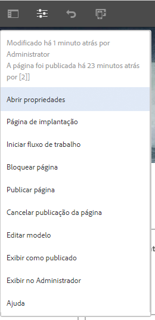
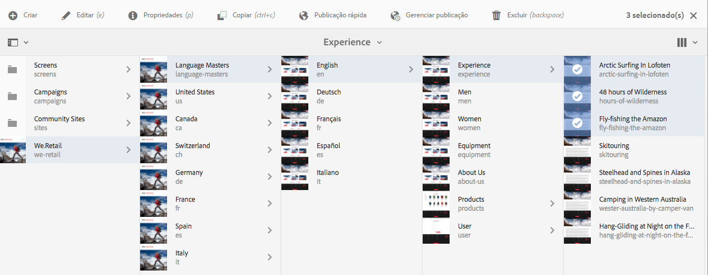
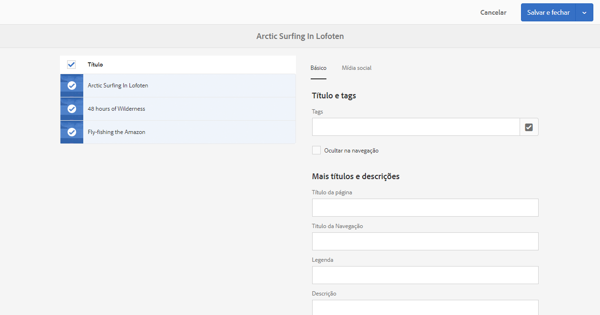

# Editar as propriedades da página{#editing-page-properties}

>[!CAUTION]
>
>AEM 6.4 chegou ao fim do suporte estendido e esta documentação não é mais atualizada. Para obter mais detalhes, consulte nossa [períodos de assistência técnica](https://helpx.adobe.com/br/support/programs/eol-matrix.html). Encontre as versões compatíveis [here](https://experienceleague.adobe.com/docs/).

Você pode definir as propriedades desejadas para uma página. Isso pode variar dependendo da natureza da página. Por exemplo, algumas páginas podem estar conectadas a uma Live Copy, enquanto outras não estão, e as informações da Live Copy estarão disponíveis conforme apropriado.

## Propriedades da página {#page-properties}

As propriedades são distribuídas por várias guias.

### Básico {#basic}

* **Título**

   O título da página é exibido em vários locais. Por exemplo, a variável **Sites** e a **Sites** exibições de cartão/lista.

   Este campo é obrigatório.

* **Tags**

   Aqui você pode adicionar ou remover as tags da página, atualizando a lista na caixa de seleção:

   * Após selecionar uma tag, ela é listada abaixo da caixa de seleção. Você pode remover uma tag dessa lista usando o ícone “x”.
   * Uma tag totalmente nova pode ser inserida digitando o nome em uma caixa de seleção vazia.

      * A nova tag será criada quando você pressionar a tecla Enter.
      * A nova tag será então exibida com uma pequena estrela à direita, indicando que é uma tag nova.
   * Com a funcionalidade de menu suspenso, é possível selecionar tags existentes.
   * Um “x” é exibido ao passar o mouse sobre uma entrada de tag na caixa de seleção, e esse ícone pode ser usado para remover a tag desta página.

   Para obter mais informações sobre tags, consulte [Uso de tags](/help/sites-authoring/tags.md).

* **Ocultar na navegação**

   Indica se a página está visível ou oculta na navegação de página do site resultante.

* **Marcas**

   Aplique uma identidade de marca consistente em todas as páginas, anexando uma descrição da marca a cada título de página. Essa funcionalidade requer o uso do Componente de página da versão 2.14.0 ou posterior do [Componentes principais.](https://experienceleague.adobe.com/docs/experience-manager-core-components/using/introduction.html?lang=pt-BR)

   * **Substituir** - marque essa opção para definir a descrição da marca nesta página.
      * O valor será herdado por qualquer página secundária, a menos que também tenha definidos seus valores para **Substituir**.
   * **Substituir valor** - o texto da descrição da marca a ser anexado ao título da página.
      * O valor é anexado ao título da página após um caractere de barra vertical, como &quot;Cycling Tuscany | Sempre pronto para a WKND&quot;

* **Título da página**

   Um título a ser usado na página. Normalmente é usado pelos componentes de título. Se estiver vazio, o **Título** da página será usado.

* **Titulo da navegação**

   Você pode especificar um título separado para usar na navegação (por exemplo, se desejar algo mais conciso). Se estiver vazio, a variável **Título** será usada.

* **Legenda**

   Um subtítulo para usar na página.

* **Descrição**

   Sua descrição da página, finalidade ou qualquer outro detalhe que desejar adicionar.

* **Em tempo**

   A data e a hora em que a página publicada será ativada. Quando publicada, esta página será mantida inativa até o tempo especificado.

   Deixe esses campos vazios para as páginas que deseja publicar imediatamente (o cenário normal).

* **Tempo desligado**

   A hora em que a página publicada será desativada.

   Deixe novamente esses campos vazios para ação imediata.

* **URL personalizada**

   Permite inserir uma URL personalizada para esta página, o que permite utilizar uma URL mais curta e/ou expressiva.

   Por exemplo, se o URL personalizado estiver definido como w `elcome`para a página identificada pelo caminho / `v1.0/startpage`para o site h `ttp://example.com,` então h `ttp://example.com/welcome`seria a URL personalizada de h `ttp://example.com/content/v1.0/startpage`

   >[!CAUTION]
   >
   >URLs personalizadas:
   >
   >* Ela deve ser exclusiva, portanto, é necessário verificar se o valor já não está sendo usado por outra página.
   >* Não é compatível com padrões de regex.

* **Redirecionar URL do Vanity**

   Indica se você deseja que a página use a URL personalizada.

### Avançado  {#advanced}

* **Idioma**

   O idioma da página.

* **Redirecionar**

   Indique a página para a qual essa página deve ser redirecionada automaticamente.

* **Design**

   Indique o [projeto](/help/sites-developing/designer.md) para ser usado nesta página.

* **Alias**

   Especifique um alias para ser usado com esta página.

   * Por exemplo: se você definir um pseudônimo de `private` para a página `/content/wknd/us/en/magazine/members-only`, essa página poderá ser acessada por meio de `/content/wknd/us/en/magazine/private`.
   * A criação de um pseudônimo define a propriedade de `sling:alias` no nó da página, que afeta apenas o recurso, não o caminho do repositório.
   * As páginas acessadas por pseudônimos no editor não podem ser publicadas. As [Opções de publicação](/help/sites-authoring/publishing-pages.md) no editor só estão disponíveis para páginas acessadas por meio de seus caminhos de fato.
   * Para obter mais detalhes, consulte [Nomes de páginas localizados em Práticas recomendadas de gerenciamento de SEO e URL](/help/managing/seo-and-url-management.md#localized-page-names)

* **Modelos permitidos**

   [Definir a lista de modelos que estará disponível](/help/sites-authoring/templates.md#enabling-and-allowing-a-template-template-author) dentro desta sub-ramificação.

* **Requisitos de autenticação**

   Ativa (ou desativa) o uso de autenticação para acessar a página.

   O requisito para ter autenticação pode ser definido aqui junto com uma página de logon designada. Os grupos de usuários fechados para a página são definidos na guia **[Permissões](/help/sites-authoring/editing-page-properties.md#permissions)**.

   >[!CAUTION]
   >
   >O **[Permissões](/help/sites-authoring/editing-page-properties.md#permissions)** permite a edição de configurações CUG com base na presença do `granite:AuthenticationRequired` mistura. Se as permissões de página forem configuradas usando configurações obsoletas de CUG, com base na presença da propriedade cq:cugEnabled , uma mensagem de aviso será exibida em **Requisito de autenticação** e a opção não será editável, nem a variável [Permissões](/help/sites-authoring/editing-page-properties.md#permissions) ser editável.
   >
   >
   >Nesse caso, as permissões do CUG devem ser editadas no [interface clássica](/help/sites-classic-ui-authoring/classic-page-author-edit-page-properties.md).

* **Página de logon**

   A página a ser usada para logon.

* **Exportar configuração**

   Especifique uma configuração de exportação.

### Miniatura  {#thumbnail}

1. **Miniatura da página**

   Mostra a imagem de miniatura da página. É possível:

   * **Gerar pré-visualização**

      Gere uma pré-visualização da página para usar como miniatura.

   * **Fazer upload de imagem**

      Carregue uma imagem para usar como miniatura.

### Redes sociais {#social-media}

* **Compartilhamento em rede social**

   Define as opções de compartilhamento disponíveis na página. Expõe as opções disponíveis para a [Compartilhamento do componente principal](https://helpx.adobe.com/experience-manager/core-components/using/sharing.html).

   * **Habilitar compartilhamento de usuário para Facebook**
   * **Habilitar compartilhamento de usuário para Pinterest**
   * **Variação preferida de XF**
Definir a variação do fragmento de experiência usada para gerar metadados para a página

### Cloud Services {#cloud-services}

* **Cloud Services**

   Defina as propriedades para [serviços em nuvem](/help/sites-developing/extending-cloud-config.md).

### Personalização {#personalization}

* **Personalização**

   Selecione uma [Marca para especificar um escopo de direcionamento](/help/sites-authoring/personalization.md).

### Permissões   {#permissions}

* **Permissões**

   Nesta guia, é possível:

   * [Adicionar permissões](/help/sites-administering/user-group-ac-admin.md)
   * [Editar grupo de usuários fechado](/help/sites-administering/cug.md#applying-your-closed-user-group-to-content-pages)
   * Exibir as [Permissões ativas](/help/sites-administering/user-group-ac-admin.md)

   >[!CAUTION]
   >
   >O **Permissões** permite a edição de configurações CUG com base na presença do `granite:AuthenticationRequired` mistura. Se as permissões de página forem configuradas usando configurações obsoletas de CUG, com base na presença de `cq:cugEnabled` , uma mensagem de aviso será exibida e as permissões de CUG não serão editáveis, assim como o Requisito de autenticação na [Avançado](/help/sites-authoring/editing-page-properties.md#advanced) poderá ser editada.
   >
   >
   >Nesse caso, as permissões do CUG devem ser editadas no [interface clássica](/help/sites-classic-ui-authoring/classic-page-author-edit-page-properties.md).

   >[!NOTE]
   >
   >A guia Permissões não permite a criação de grupos vazios de CUG, que podem ser úteis como uma forma simples de negar acesso a cada usuário. Para fazer isso, o CRX Explorer deve ser usado. Consulte o documento [Administração de usuários, grupos e direitos de acesso](/help/sites-administering/user-group-ac-admin.md) para obter mais informações.

### Blueprint {#blueprint}

* **Blueprint**

   Defina as propriedades para uma página do Blueprint no [gerenciamento de vários sites](/help/sites-administering/msm.md). Controla as circunstâncias sob as quais as modificações serão propagadas no Live Copy.

### Live Copy  {#live-copy}

* **Live Copy**

   Defina as propriedades para uma página de Live Copy em [gerenciamento de vários sites](/help/sites-administering/msm.md). Controla as circunstâncias sob as quais as modificações serão propagadas do Blueprint.

### Estrutura do site  {#site-structure}

* Forneça links para páginas que oferecem funcionalidade em todo o site, como a **Página de inscrição**, a **Página offline**, entre outras.

## Editar as propriedades da página {#editing-page-properties-2}

É possível definir as propriedades da página:

* No console **Sites**:

   * [Criação de uma nova página](/help/sites-authoring/managing-pages.md#creating-a-new-page) (um subconjunto das propriedades)
   * Ao clicar ou tocar em **Propriedades**

      * Para uma única página
      * Para várias páginas (somente um subconjunto das propriedades está disponível para edição em massa)

* No editor de páginas:

   * Ao usar **Informações da página** (em seguida, **Abrir propriedades**)

### No console Sites - Página única {#from-the-sites-console-single-page}

Ao clicar ou tocar em **Propriedades** para definir as propriedades da página:

1. Usando o console **Sites**, navegue até o local da página no qual deseja visualizar e editar as propriedades.

1. Selecione a opção **Propriedades da exibição** para a página desejada usando uma das seguintes opções:

   * [Ações rápidas](/help/sites-authoring/basic-handling.md#quick-actions)
   * [Modo de seleção](/help/sites-authoring/basic-handling.md#viewing-and-selecting-resources)

   As propriedades da página serão exibidas usando as guias adequadas.

1. Exiba ou edite as propriedades conforme necessário.

1. Em seguida, clique em **Salvar** para salvar as atualizações, e em **Fechar** para retornar ao console.

### Ao editar uma página {#when-editing-a-page}

Ao editar uma página, você pode usar as **Informações da página** para definir as propriedades da página:

1. Abra a página na qual deseja editar as propriedades.

1. Selecione o ícone **Informações da página** para abrir o menu de seleção:

   

1. Selecionar **Abrir propriedades** e uma caixa de diálogo será aberta permitindo que você edite as propriedades, escolhidas através da guia apropriada. Os seguintes botões também estão disponíveis à direita da barra de ferramentas:

   * **Cancelar**
   * **Salvar e fechar**

1. Use o botão **Salvar e fechar** para salvar as alterações.

### No console Sites - Várias páginas {#from-the-sites-console-multiple-pages}

No console **Sites**, é possível selecionar várias páginas e usar **Propriedades de exibição** para exibir e/ou editar as propriedades da página. Isso é conhecido como edição em massa das propriedades da página.

>[!NOTE]
>
>A edição em massa de propriedades também está disponível no Assets. É muito semelhante, mas difere em alguns pontos. Consulte [Editar propriedades de vários ativos](/help/assets/managing-multiple-assets.md) para obter detalhes.
>
>Há também o [Editor em massa](/help/sites-administering/bulk-editor.md), que permite pesquisar o conteúdo de várias páginas usando o GQL (Google Query Language) e, em seguida, editar o conteúdo diretamente no editor de itens em massa antes de salvar as alterações nas páginas de origem.

Você pode selecionar várias páginas para a edição em massa por meio de vários métodos, incluindo:

* Ao navegar pelos consoles dos **Sites**
* Depois de usar a função **Pesquisar** para localizar um conjunto de páginas

Depois de selecionar as páginas, clique ou toque na guia **Propriedades** , as propriedades em massa serão exibidas:

Só é possível editar em massa as páginas que:

* Compartilham o mesmo tipo de recurso
* Não fazem parte de uma live copy

   * Uma mensagem será mostrada quando as propriedades forem abertas, se qualquer página estiver em uma live copy.

Depois de entrar na edição de itens em massa é possível:

* **Exibir**

   Ao visualizar as Propriedades da página de várias páginas, você pode visualizar:

   * Uma lista das páginas afetadas

      * Você pode selecionar/desmarcar, se necessário
   * Guias

      * Assim como ao visualizar propriedades de uma única página, as propriedades são ordenadas em guias.
   * Um subconjunto de propriedades

      * As propriedades que estão disponíveis em todas as páginas selecionadas e tenham sido explicitamente definidas como disponíveis para a edição de itens em massa estão visíveis.
      * Se você reduzir a seleção de página para uma página, em seguida, todas as propriedades ficarão visíveis.
   * Propriedades comuns com um valor comum

      * Apenas as propriedades com um valor comum são mostradas no modo de Exibição.
      * Quando o campo tem vários valores (por exemplo, Tags), eles só serão exibidos quando *todos* forem comuns. Se apenas alguns forem comuns, eles só serão exibidos durante a edição.

   Quando não existirem propriedades com um valor comum, uma mensagem será exibida.

* **Editar**

   Ao editar as Propriedades da página para várias páginas:

   * Você pode atualizar os valores nos campos disponíveis.

      * Os novos valores serão aplicados a todas as páginas selecionadas ao escolher **Concluído**.
      * Quando o campo tem vários valores (por exemplo, tags), você pode anexar um novo valor ou remover um valor comum.
   * Os campos que são comuns, mas têm valores diferentes em várias páginas, serão indicados com um valor especial; como o texto `<Mixed Entries>`. Deve-se tomar cuidado ao editar esses campos para evitar a perda de dados.

>[!NOTE]
>
>O componente da página pode ser configurado para especificar os campos disponíveis para edição de itens em massa. Consulte [Configurar sua página para a edição de itens em massa das propriedades da página](/help/sites-developing/bulk-editing.md).
