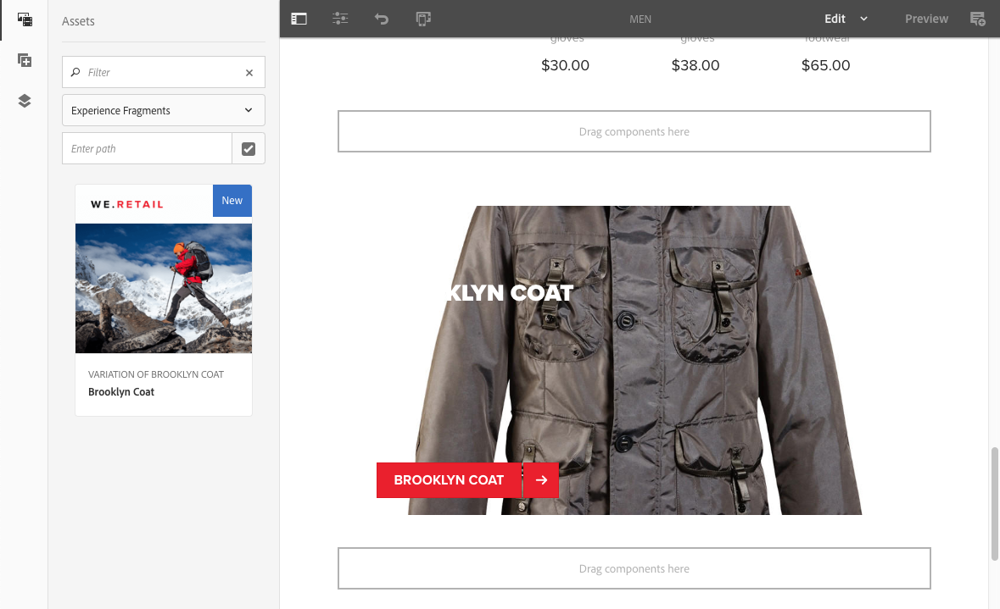
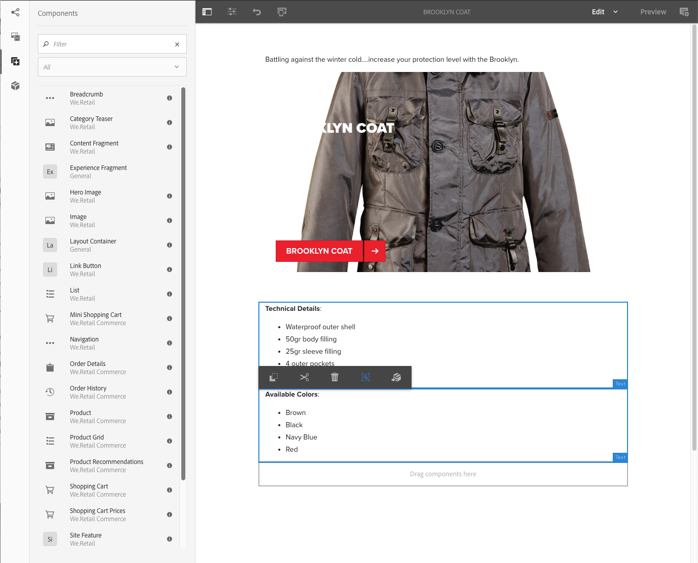
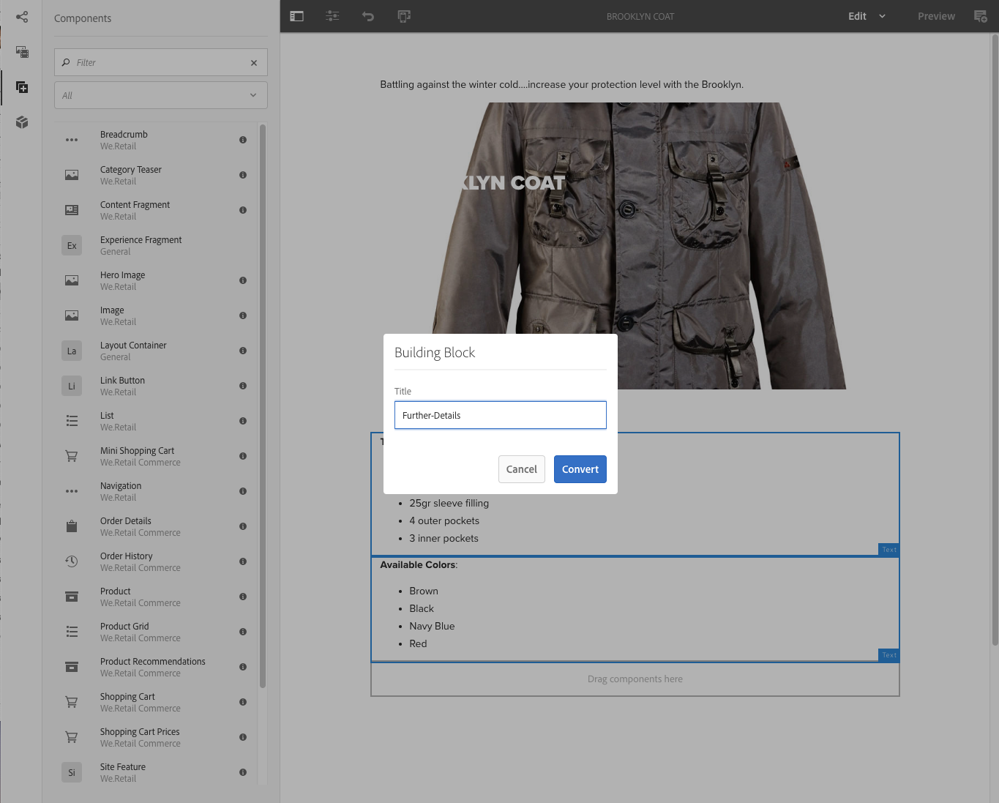

# Fragmentos de experiência{#experience-fragments}

Um Fragmento de experiência é um grupo de um ou mais componentes, incluindo o conteúdo e o layout que podem ser referenciados nas páginas. Podem conter qualquer componente.

Um fragmento de experiência:

* É parte de uma experiência (página).
* Pode ser usado em várias páginas.
* É baseado em um modelo (somente editável) para definir a estrutura e os componentes.
* É composto por um ou mais componentes, com layout, em um sistema de parágrafos.
* Pode conter outros fragmentos de experiência.
* Pode ser combinado com outros componentes (incluindo outros Fragmentos de experiência) para formar uma página completa (experiência).
* Pode apresentar variações diferentes e pode compartilhar conteúdo e/ou componentes.
* Pode ser dividida em blocos de construção que poderão ser usados em várias variações do fragmento.

Use os Fragmentos de experiência:

* Se um criador quiser reutilizar partes (um fragmento de uma experiência) de uma página, terá de copiar e colar esse fragmento. Criar e manter essa experiências de copiar/colar é um processo demorado e pode causar erros feitos pelo usuário. Os fragmentos de experiência eliminam a necessidade de copiar/colar.
* Para dar suporte ao caso de uso de CMS sem periféricos. Os autores desejam usar o AEM somente para criação, não para entrega ao cliente. Um ponto de contato ou sistema de terceiros consumiria essa experiência e a entregaria para o usuário final.

>[!NOTE]
>
>O acesso de gravação para fragmentos de experiência requer que a conta de usuário seja registrada no grupo:
>
>`experience-fragments-editors`
>
>Entre em contato com o administrador do sistema se você tiver problemas.

## Quando você deve usar fragmentos de experiência?   {#when-should-you-use-experience-fragments}

Os fragmentos de experiência devem ser usados:

* Sempre que você quiser reutilizar experiências.

   * Experiências que serão reutilizadas com o mesmo conteúdo ou com conteúdo semelhante

* Ao usar o AEM como uma plataforma de distribuição de conteúdo para terceiros.

   * Qualquer solução que desejar usar o AEM como a plataforma de distribuição de conteúdo
   * Ao incorporar conteúdo em pontos de contato de terceiros

* Se você tiver uma Experiência com variações ou execuções diferentes.

   * Canal ou variações específicas ao contexto
   * Experiências que façam sentido para agrupar (por exemplo, uma campanha com diferentes experiências entre canais)

* Quando você usar o Comércio omnichannel.

   * Ao compartilhar conteúdo comercial em canais de redes sociais em escala
   * Tornar pontos de toque transacionais

## Organizar os Fragmentos de experiência {#organizing-your-experience-fragments}

Recomenda-se:
* usar pastas para organizar os Fragmentos de experiência,

* [configurar os modelos permitidos nessas pastas](#configure-allowed-templates-folder).

A criação de pastas permite:

* criar uma estrutura significativa para os Fragmentos de experiência; por exemplo, de acordo com a classificação

   >[!NOTE]
   >
   >Não é necessário alinhar a estrutura dos Fragmentos de experiência com a estrutura de página do site.

* [alocar os modelos permitidos no nível da pasta](#configure-allowed-templates-folder)

   >[!NOTE]
   >
   >Você pode usar o [editor de modelos](/help/sites-authoring/templates.md) para criar seu próprio modelo.

O exemplo a seguir mostra Fragmentos de experiência estruturados de acordo com `Contributors`. A estrutura usada também ilustra a maneira como outros recursos, como o Gerenciamento de vários sites (incluindo cópias de idiomas), podem ser usados.

>[!CAUTION]
>
>A seguinte captura de tela foi tirada do site da WKND usando o Adobe Experience Manager como Cloud Service.

## Criação e configuração de uma pasta para os Fragmentos de experiência {#creating-and-configuring-a-folder-for-your-experience-fragments}

Para criar e configurar uma pasta para os Fragmentos de experiência, recomenda-se:

1. [Criar uma pasta](/help/sites-authoring/managing-pages.md#creating-a-new-folder).

1. [Configurar os modelos de Fragmento de experiência permitidos para essa pasta](#configure-allowed-templates-folder).

>[!NOTE]
>
>It is also possible to configure the [Allowed Templates for your instance](#configure-allowed-templates-instance), but this method is **not** recommended as the values may be overwritten upon upgrade.

### Configurar os Modelos permitidos para sua Pasta {#configure-allowed-templates-folder}

>[!NOTE]
>
>Esse é o método recomendado para especificar os **[!UICONTROL Modelos permitidos]**, pois os valores não serão substituídos na atualização.

1. Acesse a pasta **[!UICONTROL Fragmentos de experiência]** necessária.

1. Selecione a pasta e depois as **[!UICONTROL Propriedades]**.

1. Especifique a expressão regular para recuperar os modelos necessários no campo **[!UICONTROL Modelos permitidos]**.

   Por exemplo:
   `/conf/(.*)/settings/wcm/templates/experience-fragment(.*)?`

   

1. Selecione **[!UICONTROL Salvar e fechar]**.

### Configurar os Modelos permitidos para sua Instância {#configure-allowed-templates-instance}

>[!CAUTION]
>
>It is not recommended to change the **[!UICONTROL Allowed Templates]** by this method, as the templates specified may be overwritten upon upgrade.
>
>Use esta caixa de diálogo apenas para fins informativos.

1. Acesse o console **[!UICONTROL Fragmentos de experiência]** necessário.

1. Selecione **[!UICONTROL Opções de configuração]**:

   

1. Especifique os modelos necessários na caixa de diálogo **[!UICONTROL Configurar fragmentos de experiência]**:

   

1. Selecione **[!UICONTROL Salvar]**.

## Criação de um fragmento de experiência {#creating-an-experience-fragment}

Para criar um fragmento de experiência:

1. Selecione **[!UICONTROL Fragmentos de experiência]** na Navegação global.

   

1. Navegue até a pasta desejada e selecione **[!UICONTROL Criar]**.

1. Selecione **[!UICONTROL Fragmento de experiência]** para abrir o assistente **[!UICONTROL Criar fragmento de experiência]**.

   Selecione o **[!UICONTROL modelo]** obrigatório e, em seguida, clique em **[!UICONTROL Avançar]**:

   

1. Insira as **[!UICONTROL Propriedades]** do Fragmento de experiência.

   É obrigatório ter um **[!UICONTROL título]**. Se o **[!UICONTROL Nome]** for deixado em branco, ele será derivado do **[!UICONTROL Título]**.

   

1. Clique em **[!UICONTROL Criar]**.

   Uma mensagem será exibida. Selecionar:

   * **[!UICONTROL Concluído]** para retornar ao console
   * **[!UICONTROL Abrir]** para abrir o editor de fragmento

## Edição de seu fragmento de experiência {#editing-your-experience-fragment}

O Editor de fragmento de experiência oferece recursos semelhantes ao Editor de páginas normal. Consulte [Edição de conteúdo de página](/help/sites-authoring/editing-content.md) para obter mais informações sobre como usá-lo.

O exemplo de procedimento a seguir ilustra como criar um teaser para um produto:

1. Drag and drop a **[!UICONTROL Category Teaser]** from the [Components Browser](/help/sites-authoring/author-environment-tools.md#components-browser).

   

1. Selecione **[[!UICONTROL Configurar]](/help/sites-authoring/editing-content.md#edit-configure-copy-cut-delete-paste)** na barra de ferramentas do componente.
1. Adicione o **[!UICONTROL Ativo]** e defina as **[!UICONTROL Propriedades]** conforme necessário.
1. Confirme as definições com **[!UICONTROL Concluído]** (ícone de marca de verificação).
1. Adicione mais componentes conforme necessário.

## Criação de uma variação de Fragmento de experiência {#creating-an-experience-fragment-variation}

Você pode criar variações de seu fragmento de experiência, de acordo com suas necessidades:

1. Abra o fragmento para [edição](/help/sites-authoring/experience-fragments.md#editing-your-experience-fragment).
1. Abra a guia **[!UICONTROL Variações]**.

   

1. **Criar** permite criar:

   * **[!UICONTROL Variação]**
   * **[!UICONTROL Variação como Live Copy]**.

1. Defina as propriedades necessárias:

   * **[!UICONTROL Modelo]**
   * **[!UICONTROL Título]**
   * **[!UICONTROL Nome]**; se deixado em branco, ele será derivado do título
   * **[!UICONTROL Descrição]**
   * **[!UICONTROL Tags de variação]**

   

1. Confirme com **[!UICONTROL Concluído]** (ícone de marca de verificação) e a nova variação será mostrada no painel:

   

## Usar seu fragmento de experiência {#using-your-experience-fragment}

Agora você pode usar o Fragmento de experiência ao criar suas páginas:

1. Abra qualquer página para edição.

   Por exemplo: [http://localhost:4502/editor.html/content/we-retail/language-masters/en/products/men.html](http://localhost:4502/editor.html/content/we-retail/language-masters/br/products/men.html)

1. Crie uma instância do componente do fragmento de experiência arrastando o componente do navegador Componentes até o sistema de parágrafos da página:

   

1. Adicione o Fragmento de experiência real à ocorrência de componente:

   * Arraste o fragmento necessário do Navegador de Ativos e solte no componente
   * Selecione **[!UICONTROL Configurar]** na barra de ferramentas do componente e especifique o fragmento a ser usado, confirme com **Concluído** (marca de seleção)

   

   >[!NOTE]
   >
   >Editar, na barra de ferramentas do componente, opera como um atalho para abrir o fragmento no editor de fragmentos.

## Blocos de construção {#building-blocks}

Selecione um ou mais componentes para criar um bloco de construção para reciclagem no seu fragmento:

### Criar um bloco de construção {#creating-a-building-block}

Para criar um novo Bloco de construção:

1. No editor Fragmento de experiência, selecione os componentes que deseja reutilizar:

   

1. Na barra de ferramentas dos componentes, selecione **[!UICONTROL Converter em bloco de construção]**:

   

   Por exemplo:

   

1. Insira o nome do **[!UICONTROL Bloco de construção]** e confirme com **[!UICONTROL Converter]**:

   

1. O **Bloco de construção** será mostrado na guia e poderá ser selecionado no sistema de parágrafos:

   

### Gerenciar um bloco de construção {#managing-a-building-block}

O bloco de construção está visível na guia **[!UICONTROL Blocos de construção]**. As seguintes ações estão disponíveis para cada bloco:

* Acesse o mestre: abra a variação mestre em uma nova guia
* Renomeie
* Excluir

### Usar um bloco de construção {#using-a-building-block}

Arraste o bloco de construção para o sistema de parágrafo de qualquer fragmento, como com qualquer componente.

## A representação HTML simples {#the-plain-html-rendition}

Using the `.plain.` selector in the URL, you can access the plain HTML rendition.

Isso está disponível no navegador, mas seu objetivo principal é permitir que outros aplicativos (por exemplo, aplicativos da Web de terceiros, implementações móveis personalizadas) acessem o conteúdo do Fragmento de experiência diretamente, usando apenas o URL.

A execução HTML simples adiciona o protocolo, o host e o caminho de contexto aos caminhos que são:

* do tipo: `src`, `href`ou `action`

* ou terminar com: `-src`ou `-href`

Por exemplo:

`.../brooklyn-coat/master.plain.html`

>[!NOTE]
>
>Os links sempre fazem referência à instância de publicação. Eles devem ser consumidos por terceiros, de modo que o link sempre será chamado da instância de publicação, não do autor.

## Exportar fragmentos de experiência   {#exporting-experience-fragments}

Por padrão, os fragmentos de experiência são entregues no formato HTML. Isso pode ser usado pelo AEM e por canais de terceiros.

Para exportação para o Adobe Target, o HTML é usado. Consulte [Integração do Target com os fragmentos de experiência](/help/sites-administering/experience-fragments-target.md) para obter informações completas.

