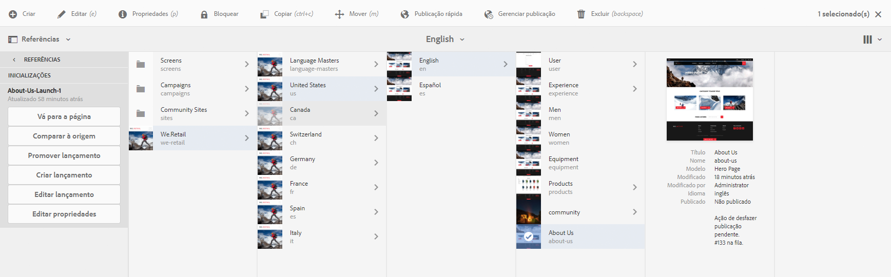
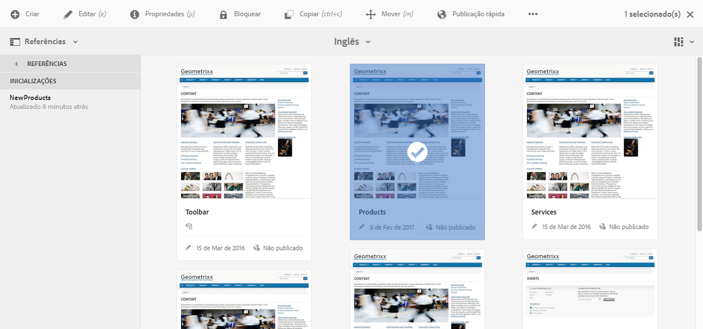

# Edição de inicializações{#editing-launches}

>[!CAUTION]
>
>AEM 6.4 chegou ao fim do suporte estendido e esta documentação não é mais atualizada. Para obter mais detalhes, consulte nossa [períodos de assistência técnica](https://helpx.adobe.com/br/support/programs/eol-matrix.html). Encontre as versões compatíveis [here](https://experienceleague.adobe.com/docs/).

## Editar páginas de lançamento {#editing-launch-pages}

Quando um lançamento é criado para uma página (ou um conjunto de páginas), é possível editar o conteúdo na cópia de lançamento da(s) página(s).

1. Acesse [Inicialização a partir de Referências (console Sites)](/help/sites-authoring/launches.md#launches-in-references-sites-console) para mostrar as ações disponíveis.
1. Selecionar **Ir para a página** para abrir a página para edição.

### Edição de páginas de lançamento sujeitas a uma live copy {#editing-launch-pages-subject-to-a-live-copy}

Se o lançamento se basear em um [live copy](/help/sites-administering/msm.md) em seguida, você:

* consulte símbolos de bloqueio (pequenos cadeados) ao editar um componente (conteúdo e/ou propriedades).
* consulte o **Live Copy** em **Propriedades da página**

Uma livecopy é usada para sincronizar o conteúdo da *ramificação de origem* para a *ramificação de inicialização* (para manter a inicialização atualizada com as alterações feitas na origem).

Você pode fazer alterações da mesma maneira que pode editar uma live copy padrão; por exemplo:

* Clicar em um cadeado fechado quebrará essa sincronização e permitirá que você faça novas atualizações no conteúdo no seu lançamento. Depois de desbloqueadas (cadeado aberto), as alterações não serão substituídas por alterações feitas no mesmo local na ramificação de origem.
* **Suspender** (e **Retomar**) herança de uma página específica.

Consulte [Alterar conteúdo da Live Copy](/help/sites-administering/msm-livecopy.md#changing-live-copy-content) para obter mais informações.

## Comparação de uma página de lançamento a sua página de origem {#comparing-a-launch-page-to-its-source-page}

Para rastrear as alterações feitas, é possível exibir a inicialização em **Referências** e comparar a página de inicialização com a página de origem:

1. No **Sites** console, [navegue até a página de origem do seu lançamento e selecione-a](/help/sites-authoring/basic-handling.md#viewing-and-selecting-resources).
1. Abra o **[Referências](/help/sites-authoring/basic-handling.md#references)** e selecione **Lançamentos**.
1. Selecione seu lançamento específico e **Comparar à Origem**:

   

1. As duas páginas (lançamento e origem) serão abertas lado a lado.

   Para obter informações completas sobre como usar esse recurso, consulte [Diff da página](/help/sites-authoring/page-diff.md).

## Alterar as páginas de origem usadas {#changing-the-source-pages-used}

A qualquer momento, você pode adicionar ou remover páginas ao/do intervalo de páginas de origem para um lançamento:

1. Acesse e selecione o lançamento a partir do seguinte:

   * o [Console Lançamentos](/help/sites-authoring/launches.md#the-launches-console):

      * Selecione **Editar**.
   * [Referências (console Sites)](/help/sites-authoring/launches.md#launches-in-references-sites-console) para mostrar as ações disponíveis:

      * Selecione **Editar lançamento**.

   As páginas de origem serão exibidas.

1. Faça as alterações necessárias e confirme com **Salvar**.

   >[!NOTE]
   >
   >Para adicionar páginas a um lançamento, elas devem estar abaixo de uma raiz de idioma comum; ou seja, em um único site.

## Editar uma configuração do Launch {#editing-a-launch-configuration}

A qualquer momento, você pode editar as propriedades de um lançamento:

1. Acesse e selecione o lançamento a partir do seguinte:

   * o [Console Lançamentos](/help/sites-authoring/launches.md#the-launches-console):

      * Selecionar **Propriedades**.
   * [Referências (console Sites)](/help/sites-authoring/launches.md#launches-in-references-sites-console) para mostrar as ações disponíveis:

      * Selecione **Editar propriedades**.

   Os detalhes serão mostrados.

1. Faça as alterações necessárias e confirme com **Salvar**.

   Consulte [Inicializações - a Ordem dos eventos](/help/sites-authoring/launches.md#launches-the-order-of-events) para obter informações sobre a finalidade e interação dos campos **Data de inicialização** e **Pronto para produção**.

## Descobrindo o status de lançamento de uma página {#discovering-the-launch-status-of-a-page}

O status é mostrado quando você seleciona um lançamento específico na guia Referências (consulte [Lançamentos em Referências (console Sites)](/help/sites-authoring/launches.md#launches-in-references-sites-console)).

