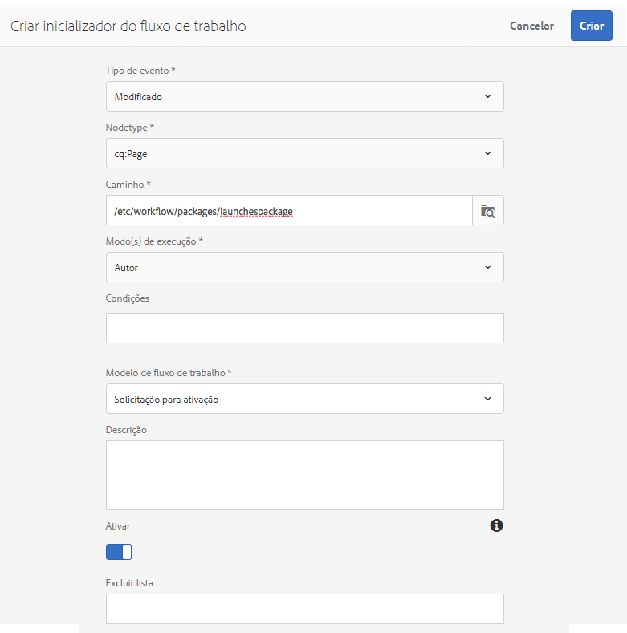

# Promoção de lançamentos{#promoting-launches}

Você precisa promover as páginas de lançamento para retornar o conteúdo à fonte (produção) antes de publicar. Quando uma página de lançamento é promovida, a página correspondente das páginas de origem é substituída pelo conteúdo da página promovida. As seguintes opções estão disponíveis ao promover uma página de lançamento:

* Promover apenas a página atual ou o lançamento inteiro.
* Promover as páginas-filho da página atual.
* Promover o lançamento completo ou apenas as páginas que foram alteradas.

>[!NOTE]
>
>Depois de promover as páginas de lançamento ao destino (**Produção**), é possível ativar as páginas de **Produção** como uma entidade (para tornar o processamento mais rápido). Adicione as páginas a um pacote de fluxo de trabalho e use-as como carga útil para um fluxo de trabalho que ative um pacote de páginas. É preciso criar o pacote de fluxo de trabalho antes de promover o lançamento. Consulte [Processamento de páginas promovidas usando o fluxo de trabalho do AEM](#processing-promoted-pages-using-aem-workflow).

>[!CAUTION]
>
>Um único lançamento não pode ser promovido simultaneamente. This means that two promote actions on the same launch at the same time can result in an error - `Launch could not be promoted` (together with conflict errors in the log).

>[!CAUTION]
>
>Ao promover inicializações de páginas *modificadas*, as modificações nas ramificações de origem e de inicialização são consideradas.

## Promoção de páginas de lançamento {#promoting-launch-pages}

>[!NOTE]
>
>Isso abrange a ação manual de promover páginas de lançamento quando há somente um nível de inicialização. Consulte:
>
>* [Promover um lançamento aninhado](#promoting-a-nested-launch) quando há mais de um lançamento na estrutura.
>* [Lançamentos - a ordem dos eventos](/help/sites-authoring/launches.md#launches-the-order-of-events) para obter mais detalhes sobre promoção e publicação automática.

>

É possível promover os lançamentos no console de **Sites** ou de **Lançamentos**:

1. Abrir:

   * o console **Sites**:

      1. Open the [references rail](/help/sites-authoring/author-environment-tools.md#references) and select the required source page using [selection mode](/help/sites-authoring/basic-handling.md) (or select and open the references rail, the order is not important). Todas as referências serão exibidas.

      1. Selecione **Lançamentos** (por exemplo, Lançamentos [1]) para exibir uma lista de lançamentos específica.
      1. Selecione o lançamento específico para mostrar as ações disponíveis.
      1. Selecione **Promover lançamento** para abrir o assistente.
   * o console de **Lançamentos**:

      1. Selecione seu lançamento (toque/clique na miniatura).
      1. Selecione **Promover**.

1. No primeiro Etapa, é possível especificar:

   * **Promover lançamento completo**
   * **Divulgar as páginas modificadas**
   * **Divulgar a página atual**
   * **Divulgar página atual e subpáginas**

   Por exemplo, ao selecionar para promover somente as páginas modificadas:

   

   >[!NOTE]
   >
   >Isso abrange um único lançamento, se tiver lançamentos aninhados, consulte[ Promover um lançamento aninhado](#promoting-a-nested-launch).

1. Selecione **Próximo** para continuar.
1. É possível analisar as páginas a serem promovidas e isso dependerá do intervalo de páginas escolhido:

   

1. Selecione **Promover**.

## Promover páginas de lançamento ao editar {#promoting-launch-pages-when-editing}

Ao editar uma página de lançamento, a ação **Promover lançamento** também está disponível nas **Informações de página**. Isso abrirá o assistente para coletar as informações necessárias.

>[!NOTE]
>
>Está disponível para [lançamentos aninhados](#promoting-a-nested-launch) e individuais.

## Promover um lançamento aninhado {#promoting-a-nested-launch}

Depois de criar uma inicialização aninhada, é possível promovê-la para qualquer uma das origens, incluindo a origem raiz (produção).

1. Da mesma forma que ao [Criar um lançamento aninhado](/help/sites-authoring/launches-creating.md#creating-a-nested-launch), navegue e selecione o lançamento necessário no console **Lançamentos** ou no painel **Referências**.
1. Selecione **Promover lançamento** para abrir o assistente.

1. Insira os detalhes necessários:

   * **Destino de promoção**

      Você pode promover para qualquer uma das fontes.

   * **Escopo** Aqui é possível promover todo o lançamento ou somente as páginas que foram editadas. Nesse último caso, é possível incluir/excluir as subpáginas. A configuração padrão é promover apenas as alterações da página atual:

      * **Promover lançamento completo**
      * **Divulgar as páginas modificadas**
      * **Divulgar a página atual**
      * **Divulgar página atual e subpáginas**

   

1. Selecione **Próximo**.
1. Revise os detalhes da promoção antes que selecionar **Promover**:

   

   >[!NOTE]
   >
   >As páginas listadas dependerão do **Escopo** definido e, possivelmente, das páginas que foram editadas.

1. Suas alterações serão promovidas e refletidas no console de **Lançamentos**:

   

## Processamento de Páginas promovidas usando o fluxo de trabalho do AEM {#processing-promoted-pages-using-aem-workflow}

Use modelos de fluxo de trabalho para realizar o processamento em massa de páginas de Lançamentos promovidos:

1. Crie um pacote de fluxos de trabalho.
1. Quando os autores promovem páginas de Lançamento, eles as armazenam no pacote de fluxos de trabalho.
1. Inicie um modelo de fluxo de trabalho usando o pacote como carga útil.

Para iniciar um fluxo de trabalho automaticamente quando as páginas forem promovidas, [configure um ativador de fluxo de trabalho](/help/sites-administering/workflows-starting.md#workflows-launchers) para o nó do pacote.

Por exemplo, você pode gerar automaticamente solicitações de ativação de página quando os autores promovem páginas de Lançamentos. Configure um ativador de fluxo de trabalho para iniciar o fluxo de trabalho Solicitar ativação quando o nó do pacote for modificado.

