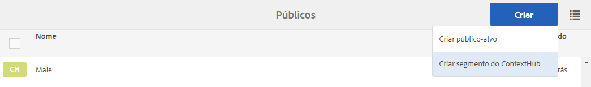
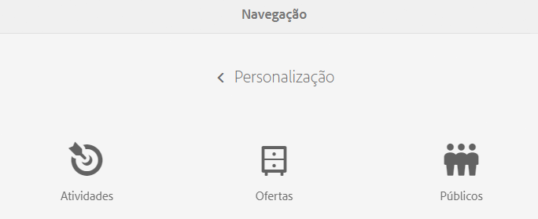
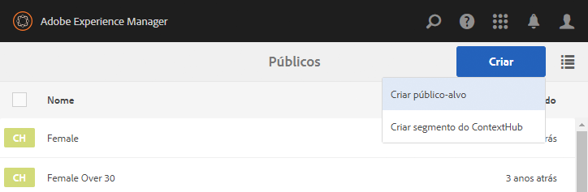

# Gerenciamento de públicos{#managing-audiences}

O console Públicos-alvo permite criar, organizar e gerenciar públicos-alvo da sua conta do Adobe Target ou gerenciar segmentos do ContextHub ou ClientContext:

* Adicionar públicos-alvo: públicos-alvo do Adobe Target ou segmentos do ContextHub.
* Gerenciar públicos-alvo.

An Audiences, called *segment* in ContextHub and Client Context, is a class of visitors defined by specific criteria, which then determines who sees a targeted activity. Ao direcionar uma atividade, você pode selecionar públicos-alvo diretamente no processo de direcionamento ou pode criar novos no console Públicos-alvo.

No console Públicos-alvo, os públicos-alvo são organizados por marca.

Audiences are available in Targeting mode for [authoring targeted content](/help/sites-authoring/content-targeting-touch.md), where you can also create audiences (but you need to create Adobe Target audiences in the Audiences console). Os públicos-alvo que você cria no modo Direcionar aparecem no console Públicos-alvo.

Os públicos-alvo são exibidos com um rótulo descrevendo o tipo de público-alvo definido:

* CH - Segmento do ContextHub
* CC - Segmento do ClientContext
* AT - Público-alvo do Adobe Target

## Criação de um segmento do ContextHub no console Públicos-alvo {#creating-a-contexthub-segment-in-the-audiences-console}

Você pode criar um segmento do ContextHub no console Públicos-alvo ou durante o processo de direcionamento.

Para criar um segmento do ContextHub no console Públicos-alvo:

1. No console Navegação, clique ou toque em **Personalização**. Click or tap **Audiences**.
1. Toque ou clique em **Criar segmento do ContextHub**.

   

1. Na caixa de diálogo **Novo segmento do ContextHub**, insira um título e ajuste o reforço e clique em **Criar**. Seu novo segmento do ContextHub aparece na lista de públicos-alvo.

   >[!NOTE]
   >
   >Classifique a lista modificada ao tocar ou clicar em **Modificado** para classificar por ordem decrescente para ver qualquer público recém-criado.

Para obter mais detalhes sobre como criar segmentos usando o ContextHub, consulte a documentação [Configuração da segmentação com o ContextHub](/help/sites-administering/segmentation.md).

## Criação de um público-alvo do Adobe Target usando o console Públicos-alvo {#creating-an-adobe-target-audience-using-the-audience-console}

Você pode criar públicos-alvo do Adobe Target diretamente no AEM usando o console Públicos.

Os públicos-alvo são definidos por regras que determinam quem está incluído em uma atividade de direcionamento. Uma definição de público-alvo pode incluir várias regras, e cada regra pode incluir vários parâmetros.

Quando você usa mais de uma regra, elas são combinadas pelo operador booleano AND, o que significa que qualquer membro do público-alvo em potencial deve atender a todas as condições definidas para ser incluído na atividade. Por exemplo, se você definir uma regra de SO e uma regra de navegador, apenas os visitantes que usarem o SO definido e (AND) o navegador definido serão incluídos na atividade.

>[!NOTE]
>
>Se você não vir **Criar público-alvo** no menu **Criar**, não terá as permissões necessárias para criar um público-alvo. You need write permissions under **/etc/segmentation** to be able to create audiences. Por padrão, os autores de conteúdo do grupo têm permissões de gravação.

Para criar um público-alvo do Adobe Target:

1. No console Navegação, clique ou toque em **Personalização**. Click or tap **Audiences**.

   

1. No console Públicos-alvo, toque ou clique em **Criar** e, em seguida, em **Criar público-alvo**.

   

1. Na caixa de diálogo **Configurações do Adobe Target**, selecione a configuração de direcionamento e toque ou clique em **OK**.
1. Na área Regra 1, toque ou clique no tipo de atributo e insira qualquer informação de atributo nos campos disponíveis. Quando terminar, ative a marca de seleção à direita do atributo para salvá-lo. Consulte [Atributos e suas opções](#attributes-and-their-options) para obter informações sobre todos os atributos.
1. Clique em **Adicionar regra** para adicionar outra regra. Insira quantas regras forem necessárias. As regras são combinadas com o operador booleano AND, o que significa que o público-alvo deve atender a todos os requisitos de cada regra para ser elegível para uma atividade.
1. Toque ou clique em **Próximo**.
1. Insira um nome para o público-alvo e toque ou clique em **Salvar**.
1. Tap or click **Save**. Seu público-alvo é listado na lista Público-alvo.

### Atributos e suas opções {#attributes-and-their-options}

Você pode criar regras de direcionamento para cada um dos seguintes atributos:

| **Atributo** | **Descrição** | **Para obter mais informações** |
|---|---|---|
| **Móvel** | Dispositivos móveis de Público alvo com base em parâmetros como dispositivo móvel, tipo de dispositivo, fornecedor do dispositivo, dimensões de tela (por pixels) e muito mais. | Consulte a documentação [do](https://docs.adobe.com/content/help/en/target/using/audiences/create-audiences/categories-audiences/mobile.html) Mobile na Adobe Target. |
| **Personalizado** | Parâmetros personalizados são parâmetros de mbox. Se você passar algum parâmetro de mbox para mboxes, ou usar a função targetPageParams, esses parâmetros aparecerão aqui para uso em públicos-alvo. | Consulte a documentação [Parâmetros](https://docs.adobe.com/content/help/en/target/using/audiences/create-audiences/categories-audiences/custom-parameters.html) personalizados na Adobe Target. |
| **OS** | Você pode público alvo visitantes que usam um determinado sistema operacional. | Direcionado a usuários que estejam usando Linux, Macintosh ou Windows. |
| **Páginas do site** | visitantes de Público alvo que estão em uma página específica ou têm um parâmetro de mbox específico. | Consulte a documentação [de Páginas](https://docs.adobe.com/content/help/en/target/using/audiences/create-audiences/categories-audiences/site-pages.html) do site na Adobe Target. |
| **Navegador** | Você pode público alvo usuários que usam um navegador específico ou opções específicas de navegador quando visitam sua página. | Consulte [Documentação de opções de](https://docs.adobe.com/content/help/en/target/using/audiences/create-audiences/categories-audiences/browser.html)navegador no Adobe Target. |
| **Perfil do visitante** | visitantes de Público alvo que atendem a parâmetros de perfil específicos. | Consulte a documentação [do Perfil do](https://docs.adobe.com/content/help/en/target/using/audiences/visitor-profiles/visitor-profile.html) Visitante na Adobe Target. |
| **Fontes de tráfego** | visitantes de Público alvo com base no mecanismo de pesquisa ou na landing page que os referenciam ao site. | Consulte a documentação [Fontes de](https://docs.adobe.com/content/help/en/target/using/audiences/create-audiences/categories-audiences/traffic-sources.html) tráfego na Adobe Target. |

## Modificação de um público-alvo no console Públicos-alvo {#modifying-an-audience-in-the-audiences-console}

>[!NOTE]
>
>Apenas é possível editar públicos-alvo do Adobe Target que tenham sido criados na mesma instância do AEM em que você está editando. Públicos-alvo criados em diferentes ambientes do AEM não podem ser editados.

É possível editar qualquer público-alvo do ContextHub ou do ClientContext no console Públicos-alvo. Você pode editar os públicos-alvo do Adobe Target, mas somente aqueles que foram criados no AEM:

1. No console Navegação, clique ou toque em **Personalização**. Click or tap **Audiences**.
1. Toque ou clique no ícone ao lado do segmento do ContextHub ou do ClientContext que você deseja editar e toque ou clique em **Editar**.
1. Faça edições no editor de segmentos. Consulte a documentação do [ClientContext](/help/sites-administering/campaign-segmentation.md) ou do [ContextHub](/help/sites-administering/contexthub-config.md).

