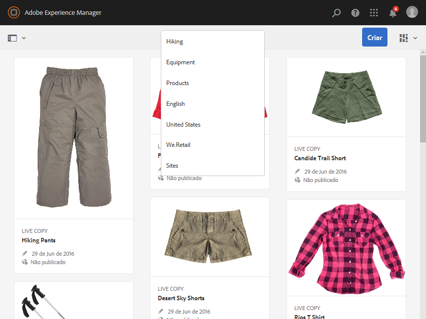
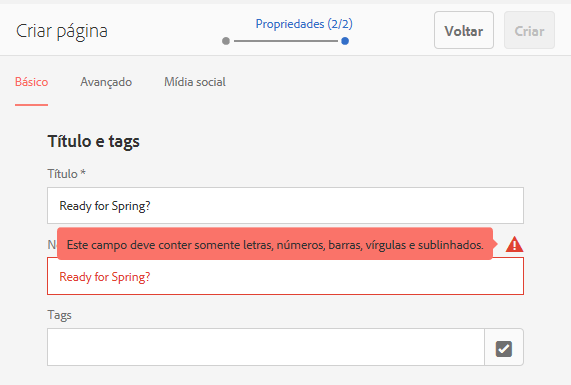
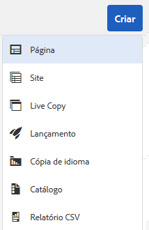
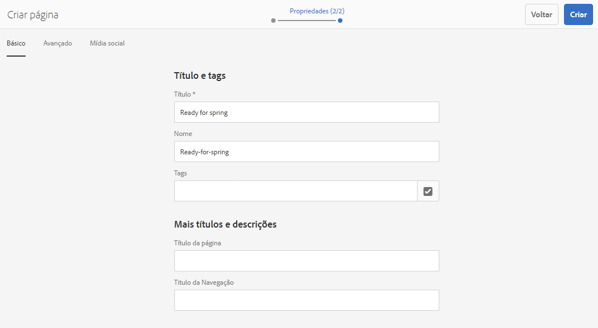
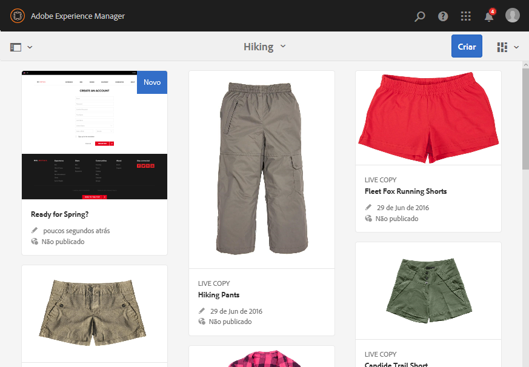
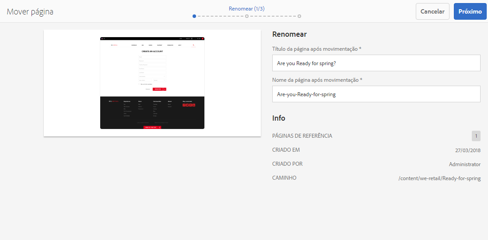
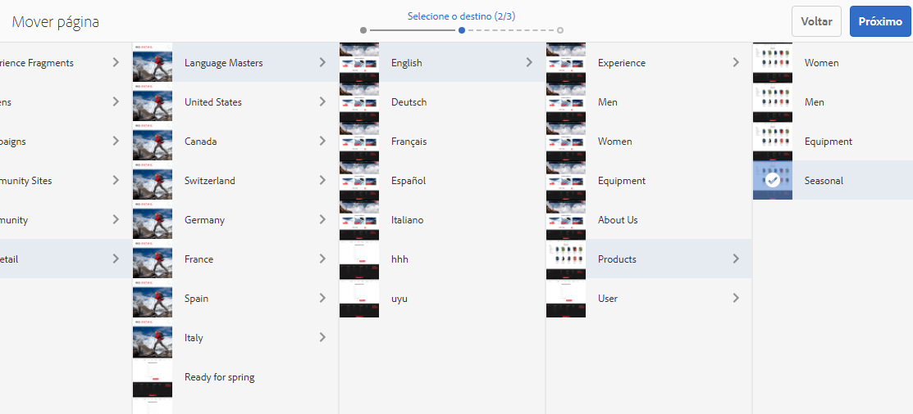
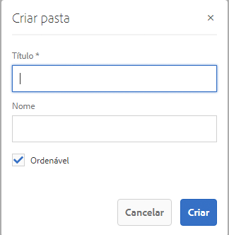

# Criar e organizar páginas{#creating-and-organizing-pages}

>[!CAUTION]
>
>AEM 6.4 chegou ao fim do suporte estendido e esta documentação não é mais atualizada. Para obter mais detalhes, consulte nossa [períodos de assistência técnica](https://helpx.adobe.com/br/support/programs/eol-matrix.html). Encontre as versões compatíveis [here](https://experienceleague.adobe.com/docs/).

Esta seção descreve como criar e gerenciar páginas com o Adobe Experience Manager (AEM) para que você possa [criar conteúdo](/help/sites-authoring/editing-content.md) nessas páginas.

>[!NOTE]
>
>Sua conta precisa do [direitos de acesso apropriados](/help/sites-administering/security.md) e [permissões](/help/sites-administering/security.md#permissions) para realizar ações nas páginas, como criar, copiar, mover, editar e excluir.
>
>Caso encontre algum problema, sugerimos que você entre em contato com o administrador do sistema.

>[!NOTE]
>
>Há vários [atalhos de teclado](/help/sites-authoring/keyboard-shortcuts.md) que você pode usar no console Sites que tornam a organização das suas páginas mais eficiente.

## Organizar seu site {#organizing-your-website}

Como autor, você precisará organizar o site dentro do AEM. Isso envolve criar e nomear suas páginas de conteúdo para que:

* Você pode encontrá-las facilmente no ambiente de criação
* Os visitantes do seu site possam navegar facilmente por elas no ambiente de publicação

Você também pode usar [pastas](#creating-a-new-folder) para ajudar a organizar o seu conteúdo.

A estrutura de um site pode ser considerada como uma estrutura em árvore que armazena suas páginas de conteúdo. Os nomes dessas páginas de conteúdo são usadas para formar os URLs, enquanto o título é exibido quando o conteúdo da página é visualizado.

A seguir, um exemplo do site We.Retail, onde uma página de shorts de caminhada ( `desert-sky-shorts`) é acessada:

* Ambiente do autor: `http://localhost:4502/editor.html/content/we-retail/us/en/products/equipment/hiking/desert-sky-shorts.html`

* Ambiente de publicação: `http://localhost:4503/content/we-retail/us/en/products/equipment/hiking/desert-sky-shorts.html`

Dependendo da configuração da sua instância, use o `/content` pode ser opcional no ambiente de publicação.

```xml
 /content
 /we-retail
  /us
   /en
    /products
     /equipment
      /hiking
       /desert-sky-shorts
       /hiking-poles
       /... 
      /running...
      /surfing...
      /...
     /seasonal...
     /...
    /about-us
    /experience
    /...
   /es...
  /de...
  /fr...
  /...
 /...
```

Esta estrutura pode ser visualizada do console **Sites**, onde é possível [navegar através das páginas do seu site](/help/sites-authoring/basic-handling.md#product-navigation) e executar ações nas páginas. Você também pode criar novos sites e [páginas](#creating-a-new-page).

De qualquer ponto, você pode visualizar a ramificação ascendente da navegação estrutural na barra do cabeçalho:



### Convenções de nomenclatura da página {#page-naming-conventions}

Ao criar uma nova página, existem dois campos principais:

* **[Título](#title)**:

   * O título é exibido ao usuário no console, na parte superior do conteúdo da página ao editar.
   * Esse campo é obrigatório.

* **[Nome](#name)**:

   * Usado para gerar o URI.
   * A entrada do usuário para este campo é opcional. Se não especificado, o nome é derivado do título. Consulte a seguinte seção [Restrições de nome de página e práticas recomendadas](/help/sites-authoring/managing-pages.md#page-name-restrictions-and-best-practices) para obter detalhes.

#### Restrições de nome de página e práticas recomendadas {#page-name-restrictions-and-best-practices}

O **Título** da página e o **Nome** podem ser criados separadamente, mas estão relacionados:

* Ao criar uma página, somente a variável **Título** é obrigatório. Se nenhum **Nome** for fornecido na criação da página, o AEM gerará um nome a partir dos primeiros 64 caracteres do título (observando o conjunto definido abaixo). Somente os primeiros 64 caracteres são usados para dar suporte à prática recomendada de nomes de página curtos.

* Se um nome de página for especificado manualmente pelo autor, o limite de 64 caracteres não se aplicará. Contudo, outras limitações técnicas no comprimento de nome de página poderão ser aplicadas.

>[!NOTE]
>
>Ao definir um nome de página, um princípio básico é manter o nome da página curto, mas tão expressivo e memorável quanto possível para facilitar a compreensão do leitor. Consulte o [guia de estilo W3C](https://www.w3.org/Provider/Style/TITLE.html) no elemento `title`para obter mais informações.
>
>Lembre-se também de que alguns navegadores (por exemplo, versões mais antigas do IE) só podem aceitar URLs de até um determinado comprimento, por isso também há um motivo técnico para manter os nomes de página curtos.

Ao criar uma nova página, o AEM [validará o nome da página de acordo com as convenções](/help/sites-developing/naming-conventions.md) impostas pelo AEM e JCR.

Os caracteres mínimos permitidos são:

* &#39;a&#39; a &#39;z&#39;
* &#39;A&#39; a &#39;Z&#39;
* &#39;0&#39; a &#39;9&#39;
* _ (sublinhado)
* `-` (hífen/sinal de menos)

Detalhes completos sobre todos os caracteres permitidos podem ser encontrados nas [convenções de nomenclatura](/help/sites-developing/naming-conventions.md).

>[!NOTE]
>
>Se AEM estiver em execução em um [Implantação do gerenciador de persistência do MongoMK](/help/sites-deploying/recommended-deploys.md), os nomes de página são limitados a 150 caracteres.

#### Título {#title}

Quando você fornece apenas um **Título** de página ao criar uma nova página, o AEM deriva o **Nome** de página desta cadeia de caracteres e o valida[ de acordo com as convenções](/help/sites-developing/naming-conventions.md) impostas pelo AEM e JCR. Um campo de **Título** que contém caracteres inválidos será aceito, mas o nome derivado terá os caracteres inválidos substituídos. Por exemplo:

| Título | Nome derivado |
|---|---|
| Schön | schoen.html |
| SC%&amp;&amp;ast;ç+ | sc---c-.html |

#### Nome {#name}

Quando você fornece um **Nome** de página ao criar uma nova página, o AEM valida[ o nome de acordo com as convenções](/help/sites-developing/naming-conventions.md) impostas pelo AEM e JCR. Não é possível inserir caracteres inválidos no campo **Nome**. Quando AEM detecta caracteres inválidos, o campo é destacado com uma mensagem explicativa.



>[!NOTE]
>
>Evite usar um código de duas letras, conforme definido por ISO-639-1 como um nome de página, a menos que seja uma raiz de idioma.
>
>Consulte [Preparação de conteúdo para tradução](/help/sites-administering/tc-prep.md) para obter mais informações.

### Modelos {#templates}

Em AEM, um modelo especifica um tipo especializado de página. Um modelo será usado como a base para qualquer nova página que esteja sendo criada.

O modelo define a estrutura de uma página incluindo uma imagem em miniatura e outras propriedades. Por exemplo, você pode ter modelos separados para páginas de produtos, mapas de sites e informações de contato. Os modelos são compostos de [componentes](#components).

AEM vem com vários modelos prontos para uso. Os modelos disponíveis dependem do site individual. Os campos principais são:

* **Título** O título exibido na página da Web resultante.

* **Nome** Usado ao nomear a página.

* **Modelo** Uma lista de modelos disponíveis para uso ao gerar a nova página.

>[!NOTE]
>
>Se configurado na instância,[ os autores de modelo poderão criá-los com o Editor de modelo](/help/sites-authoring/templates.md).

### Componentes {#components}

Os componentes são os elementos fornecidos pelo AEM, desse modo, é possível adicionar tipos específicos de conteúdo. AEM vem com uma variedade de [componentes prontos para uso](/help/sites-authoring/default-components-console.md) que fornecem funcionalidade abrangente. Isso inclui:

* Texto
* Imagem
* Slideshow
* Vídeo
* E muito mais

Depois de criar e abrir uma página, você pode [adicionar conteúdo usando os componentes](/help/sites-authoring/editing-content.md#inserting-a-component), que estão disponíveis no [navegador de componentes](/help/sites-authoring/author-environment-tools.md#components-browser).

>[!NOTE]
>
>O console [Componentes](/help/sites-authoring/default-components-console.md) fornece uma visão geral dos componentes na instância.

## Gerenciamento de páginas {#managing-pages}

### Criar uma nova página {#creating-a-new-page}

A menos que todas as páginas tenham sido criadas antecipadamente para você, antes de começar a criar conteúdo, você deve criar uma página:

1. Abra o console Sites (por exemplo, [http://localhost:4502/sites.html/content](http://localhost:4502/sites.html/content)).
1. Navegue até o local onde deseja criar a nova página.
1. Abra o seletor suspenso usando **Criar** na barra de ferramentas e, em seguida, selecione **Página** na lista:

   

1. A partir do primeiro estágio do assistente, você pode:

   * Selecionar o modelo que deseja usar para criar a nova página, em seguida, clicar/tocar em **Próximo** para prosseguir.
   * **Cancelar** para suspender o processo.

   

1. A partir do último estágio do assistente, você pode:

   * Usar as três guias para inserir as [propriedades de página](/help/sites-authoring/editing-page-properties.md) que deseja atribuir à nova página, em seguida, clicar/tocar em **Criar** para realmente criar a página.
   * Use **Voltar** para retornar à seleção do modelo.

   Os campos principais são:

   * **Título**:

      * Isso é exibido ao usuário e é obrigatório.
   * **Nome**:

      * Usado para gerar o URI. Se não especificado, o nome é derivado do título.
      * Se você fornecer uma página **Nome** ao criar uma nova página, AEM [validar o nome de acordo com as convenções](/help/sites-developing/naming-conventions.md) impostas pelo AEM e JCR.
      * Você **não é possível enviar caracteres inválidos** no **Nome** campo. Quando o AEM detecta caracteres inválidos, o campo é realçado e uma mensagem explicativa é exibida para indicar os caracteres que precisam ser removidos/substituídos.

   >[!NOTE]
   >
   >Consulte [Convenções de nomenclatura da página](#page-naming-conventions).

   As informações mínimas necessárias para criar uma nova página são a variável **Título**.

   

1. Use **Criar** para concluir o processo e criar a sua nova página. A caixa de diálogo de confirmação perguntará se você deseja **Abrir** a página imediatamente ou voltar para o console (**concluído**):

   

   >[!NOTE]
   >
   >Caso crie uma página usando um nome que já existe no local, o sistema vai gerar automaticamente uma variação do nome, ao anexar um número. Por exemplo, se `winter` já existir, uma nova página se tornará `winter0`.

1. Caso volte ao console, você verá em sua nova página:

   

>[!CAUTION]
>
>Depois que uma página é criada, seu modelo não pode ser alterado, a menos que você [criar um lançamento com um novo modelo](/help/sites-authoring/launches-creating.md#create-launch-with-new-template), embora isso perca qualquer conteúdo já existente.

### Abrir uma página para edição {#opening-a-page-for-editing}

Depois de criar uma página ou navegar para uma página existente (no console), você pode abri-la para edição:

1. Abra o **Sites** console.
1. Navegue até que você encontre a página que deseja editar.
1. Selecione a página usando:

   * [Ações rápidas](/help/sites-authoring/basic-handling.md#quick-actions)
   * [Modo de seleção](/help/sites-authoring/basic-handling.md#product-navigation) e a barra de ferramentas

   E, em seguida, selecione o ícone **Editar**:

   

1. A página será aberta e aqui é possível [editar a página](/help/sites-authoring/editing-content.md) conforme necessário.

>[!NOTE]
>
>Navegar para outras páginas do editor de páginas só é possível no modo de visualização, pois os links não estão ativos no modo de Edição...

### Copiar e colar uma página      {#copying-and-pasting-a-page}

É possível copiar uma página e todas as respectivas subpáginas para um novo local:

1. No **Sites** navegue até encontrar a página que deseja copiar.
1. Selecione sua página usando:

   * [Ações rápidas](/help/sites-authoring/basic-handling.md#quick-actions)
   * [Modo de seleção](/help/sites-authoring/basic-handling.md#product-navigation) e a barra de ferramentas

   E depois o **Copiar** ícone da página:

   

   >[!NOTE]
   >
   >Se você estiver no modo de seleção, essa ação será encerrada automaticamente assim que a página for copiada.

1. Navegue até o local para a nova cópia da página.
1. Use o **Colar** ícone da página:

   

   Uma cópia da página original e suas respectivas subpáginas será criada neste local.

   >[!NOTE]
   >
   >Se você copiar a página para um local onde uma página com o mesmo nome que a original já existe, o sistema gera automaticamente uma variação do nome ao anexar um número. Por exemplo, se `winter` já existir, `winter` se tornará `winter1`.

### Mover ou renomear uma página {#moving-or-renaming-a-page}

>[!NOTE]
>
>A renomeação de uma página também está sujeita ao [Convenções de nomenclatura da página](#page-naming-conventions) ao especificar o nome da nova página.

>[!NOTE]
>
>Uma página só pode ser movida para um local onde o modelo no qual a página se baseia é permitido. Consulte [Disponibilidade de modelo](/help/sites-developing/templates.md#template-availability) para obter mais informações.

O procedimento para mover ou renomear uma página é basicamente o mesmo e é realizado pelo mesmo assistente. Com este assistente você pode:

* Renomear uma página sem movê-la.
* Mover a página sem renomeá-la.
* Mover e renomear ao mesmo tempo.

AEM oferece a funcionalidade de atualizar os links internos que se referem à página que está sendo renomeada/movida. Isso pode ser feito página por página para proporcionar flexibilidade total.

1. Navegue até que você encontre a página que deseja mover.
1. Selecione sua página usando:

   * [Ações rápidas](/help/sites-authoring/basic-handling.md#quick-actions)
   * [Modo de seleção](/help/sites-authoring/basic-handling.md#product-navigation) e a barra de ferramentas

   E, em seguida, selecione o **Mover** ícone da página:

   

   Isso abrirá o assistente para mover página.

1. No estágio **Renomear** do assistente, é possível:

   * Especifique o nome que deseja para a página após movê-la, em seguida, clique/toque em **Próximo** para prosseguir.
   * **Cancelar** para suspender o processo.

   

   O nome da página pode permanecer o mesmo se você estiver apenas movendo a página.

   >[!NOTE]
   >
   >Se você mover uma página para um local onde uma página com o mesmo nome já existe, o sistema gera automaticamente uma variação do nome ao anexar um número. Por exemplo, se `winter` já existir, `winter` se tornará `winter1`.

1. No estágio **Selecionar destino** do assistente, é possível:

   * Use a [exibição de coluna](/help/sites-authoring/basic-handling.md#column-view) para navegar até o novo local da página:

      * Para selecionar o destino, clique em sua miniatura.
      * Clique em **Avançar** para continuar.
   * Use **Voltar** para retornar à especificação do nome da página.

   

   >[!NOTE]
   >
   >Se você mover uma página para um local onde uma página com o mesmo nome já existe, o sistema gera automaticamente uma variação do nome ao anexar um número. Por exemplo, se `winter` já existir, `winter` se tornará `winter1`.

1. Se a página estiver vinculada ou referenciada, essas referências serão listadas na variável **Ajustar/republicar** etapa. Você pode indicar o que deve ser ajustado e republicado, conforme necessário.

   

1. Selecionar **Mover** O concluirá o processo e moverá/renomeará sua página, conforme apropriado.

>[!NOTE]
>
>Se a página já tiver sido publicada, movê-la automaticamente desfará a publicação. Por padrão, ela será republicada quando a mudança for concluída, mas isso pode ser alterado ao desmarcar a caixa de seleção **Republicar** no campo **Ajustar/republicar** etapa.

>[!NOTE]
>
>Caso a página não seja mencionada de alguma maneira, então a etapa **Ajustar/republicar** será ignorada.

### Excluir uma página {#deleting-a-page}

1. Navegue até que você possa visualizar a página que deseja excluir.
1. Use o [modo de seleção](/help/sites-authoring/basic-handling.md#viewing-and-selecting-resources) para selecionar a página pretendida, em seguida, use **Excluir** na barra de ferramentas:

   

   >[!NOTE]
   >
   >Como uma precaução de segurança, o ícone de **Excluir página** não está disponível como uma ação rápida.

1. Uma caixa de diálogo pedirá confirmação.

   * **Você deseja arquivar as páginas antes de excluir?** - Se marcada, as versões das páginas selecionadas para exclusão serão criadas após a exclusão.
      * [As versões podem ser restauradas em uma data posterior.](/help/sites-authoring/working-with-page-versions.md)
      * As páginas excluídas sem versões anteriores não podem ser restauradas.
      * Essa opção só está disponível AEM versão 6.4.7.0.
   * **Cancelar** para suspender a ação
   * **Excluir** para confirmar a ação:

      * Se a página não tiver referências, ela será excluída.
      * Caso a página tenha referências, uma caixa de mensagem vai informá-lo de que **Uma ou mais páginas são mencionadas.** Você pode selecionar **Forçar exclusão** ou **Cancelar**.

>[!NOTE]
>
>Se uma página já estiver publicada, sua publicação será automaticamente desfeita antes da exclusão.

### Bloquear uma página   {#locking-a-page}

Você pode [bloquear/desbloquear uma página](/help/sites-authoring/editing-content.md#locking-a-page) em um console ou ao editar uma página individual. Informações sobre se uma página está bloqueada também são mostradas em ambos os locais.

 

### Criação de uma nova pasta {#creating-a-new-folder}

Você pode criar pastas para ajudar a organizar seus arquivos e páginas.

>[!NOTE]
>
>As pastas também estão sujeitas ao [Convenções de nomenclatura da página](#page-naming-conventions) ao especificar o nome da nova pasta.

>[!CAUTION]
>
>* Pastas só podem ser criadas diretamente em **Sites** ou em outras pastas. Eles não podem ser criados em uma página.
>* As ações padrão de mover, copiar, colar, excluir, publicar, cancelar a publicação e exibir/editar propriedades podem ser executadas em uma pasta.
>* As pastas não estão disponíveis para seleção em uma live copy.
>


1. Abra o **Sites** e navegue até o local desejado.
1. Para abrir a lista de opções, selecione **Criar** na barra de ferramentas
1. Selecionar **Pasta** para abrir a caixa de diálogo. Aqui você pode inserir o **Nome** e o **Título**:

   

1. Selecione **Criar** para criar a pasta.
