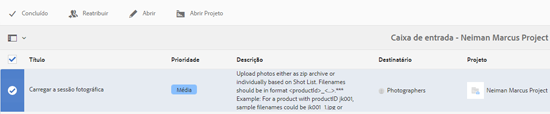

# Integração do Creative Project e do PIM{#creative-project-and-pim-integration}

>[!CAUTION]
>
>AEM 6.4 chegou ao fim do suporte estendido e esta documentação não é mais atualizada. Para obter mais detalhes, consulte nossa [períodos de assistência técnica](https://helpx.adobe.com/br/support/programs/eol-matrix.html). Encontre as versões compatíveis [here](https://experienceleague.adobe.com/docs/).

Se você for um profissional de marketing ou um profissional criativo, poderá usar as ferramentas do Projeto criativo no Adobe Experience Manager (AEM) para gerenciar fotografias de produtos relacionados ao comércio eletrônico e processos criativos associados em sua organização.

Em particular, você pode usar o Projeto de criação para simplificar as seguintes tarefas no fluxo de trabalho de sessão fotográfica:

* Gerar uma solicitação de sessão fotográfica
* Fazer upload de uma sessão fotográfica
* Colaborar em uma sessão fotográfica
* Acondicionamento de ativos aprovados

>[!NOTE]
>
>Consulte [Funções de Usuário do Projeto para obter informações](/help/sites-authoring/projects.md#user-roles-in-a-project) ao atribuir funções de usuário e fluxos de trabalho a determinados tipos de usuários.

## Explorar fluxos de trabalho de Sessão fotográfica do produto  {#exploring-product-photo-shoot-workflows}

O Projeto de criação fornece vários modelos de projeto para atender a diferentes requisitos do projeto. O modelo **Projeto de sessão fotográfica do produto **está disponível para uso imediato. Esse modelo inclui fluxos de trabalho de sessão fotográfica que permitem iniciar e gerenciar solicitações de sessão fotográfica do produto. Ele também inclui uma série de tarefas que permitem obter imagens digitais de produtos por meio de processos de revisão e aprovação apropriados.

O template inclui os seguintes workflows:

* **Fluxo de trabalho de Sessão fotográfica do produto (integração com o Commerce)**: Esse fluxo de trabalho utiliza a integração do Commerce com o sistema de gerenciamento de informações de produtos (PIM) para gerar automaticamente uma lista de capturas para os produtos selecionados (hierarquia). Você pode exibir os dados do produto como parte dos metadados do ativo após a conclusão do fluxo de trabalho.
* **Fluxo de trabalho de Sessão fotográfica do produto**: Esse workflow permite fornecer uma lista de capturas em vez de depender da integração com o Commerce. Ele mapeia as imagens enviadas por upload para um arquivo CSV na pasta de ativos do projeto.

>[!NOTE]
>
>O arquivo CSV que é carregado na tarefa Fazer upload da lista de capturas do fluxo de trabalho de Sessão fotográfica do produto deve ter o nome de arquivo shotlist.csv.

## Criar um projeto de Sessão fotográfica do produto {#create-a-product-photo-shoot-project}

1. No **Projetos** console, toque/clique **Criar** e escolha **Criar projeto** na lista.

   

1. No **Criar projeto** selecione o modelo de projeto da sessão fotográfica e toque/clique **Próximo**.

   

1. Insira os detalhes do projeto, incluindo título, descrição e data de vencimento. Adicione usuários e atribua várias funções a eles. Também é possível adicionar uma miniatura ao projeto.

   

1. Toque/clique em **Criar**. Uma mensagem de confirmação notifica que o projeto foi criado.
1. Toque/clique **Concluído** para retornar ao **Projetos** console. Como alternativa, toque/clique **Abrir** para visualizar os ativos no projeto da sessão fotográfica.

## Iniciar o trabalho em um projeto de sessão fotográfica do produto {#starting-work-in-a-product-photo-shoot-project}

Para iniciar uma solicitação de sessão fotográfica, toque ou clique em um projeto e toque/clique em **Adicionar trabalho** na página de detalhes do projeto para iniciar um fluxo de trabalho.


Um projeto de Sessão fotográfica do produto inclui os seguintes fluxos de trabalho prontos para uso:

* Fluxo de trabalho de Sessão fotográfica do produto (integração com o Commerce)
* Fluxo de trabalho de sessão fotográfica do produto

Use o fluxo de trabalho de Sessão fotográfica do produto (integração com o Commerce) para mapear ativos de imagem com os produtos no AEM. Esse fluxo de trabalho utiliza a integração do Commerce para vincular as imagens aprovadas aos dados existentes do produto no local */etc/commerce*.

O fluxo de trabalho de Sessão fotográfica do produto (integração com o Commerce) inclui as seguintes tarefas:

* Criar lista de capturas
* Carregar a sessão fotográfica
* Retocar a sessão fotográfica
* Revisar e aprovar
* Mover para Tarefa de produção

Se as informações do produto não estiverem disponíveis no AEM, use o fluxo de trabalho de Sessão fotográfica do produto para mapear ativos de imagem com os produtos com base nos detalhes em um arquivo CSV que você faz upload. O arquivo CSV deve conter informações básicas sobre o produto, como ID do produto, categoria e descrição. O fluxo de trabalho busca ativos aprovados para os produtos.

Esse workflow inclui as seguintes tarefas:

* Fazer upload da lista de capturas
* Carregar a sessão fotográfica
* Retocar a sessão fotográfica
* Revisar e aprovar
* Mover para Tarefa de produção

Você pode personalizar esse workflow usando a opção de configurações de workflow.

Ambos os fluxos de trabalho incluem etapas para vincular produtos aos ativos aprovados. Cada fluxo de trabalho inclui as seguintes etapas:

* Configuração do fluxo de trabalho: Descreve as opções para personalizar o fluxo de trabalho
* Iniciar um fluxo de trabalho de projeto: Explica como iniciar uma sessão fotográfica do produto
* Detalhes das Tarefas do Fluxo de Trabalho: Fornece detalhes das tarefas disponíveis no fluxo de trabalho

## Rastreamento do progresso do projeto {#tracking-project-progress}

Você pode acompanhar o progresso de um projeto monitorando as tarefas ativas/concluídas em um projeto.

Use o seguinte para monitorar o progresso de um projeto:

* **Cartão de tarefas**

* **Lista de tarefas**

O Cartão de tarefas descreve o progresso geral do projeto. Ele é exibido na página Detalhes do projeto somente se o projeto tiver tarefas relacionadas. O Cartão de tarefas exibe o status de conclusão atual do projeto com base no número de tarefas concluídas. Não inclui tarefas futuras.

O Cartão de tarefas fornece os seguintes detalhes:

* Porcentagem de tarefas ativas
* Porcentagem de tarefas concluídas


A Lista de tarefas fornece informações detalhadas sobre a tarefa de fluxo de trabalho atualmente ativa para o projeto. Para exibir a lista, toque/clique no Cartão de tarefas. A Lista de tarefas também exibe metadados como data de início, data de vencimento, destinatário, prioridade e status da tarefa.


## Configuração do fluxo de trabalho {#workflow-configuration}

Essa tarefa envolve atribuir etapas de fluxo de trabalho aos usuários com base em suas funções.

Para configurar o **Sessão fotográfica do produto** fluxo de trabalho:

1. Navegar para **Ferramentas** > **Fluxos de trabalho** e toque em **Modelos** bloco para abrir o **Modelos de fluxo de trabalho** página.
1. Selecione o **Sessão fotográfica do produto** e toque em **Editar** ícone na barra de ferramentas para abri-lo no modo de edição.

   

1. No **Fluxo de trabalho de sessão fotográfica do produto** abra uma tarefa do projeto. Por exemplo, abra o **Fazer upload da lista de capturas** tarefa.

   

1. Clique no botão **Tarefa** para configurar o seguinte:

   * Nome da tarefa
   * Usuário padrão (função) que recebe a tarefa
   * Prioridade padrão da tarefa, que é exibida na lista de tarefas do usuário
   * Descrição da tarefa a ser exibida quando o destinatário abrir a tarefa
   * Data de vencimento de uma tarefa, que é calculada com base na hora em que a tarefa foi iniciada

1. Clique em **OK** para salvar as configurações.

   Da mesma forma, é possível configurar as seguintes tarefas para a variável **Sessão fotográfica do produto** fluxo de trabalho:

   * Carregar a sessão fotográfica
   * Retocar a sessão fotográfica do produto
   * Análise da sessão fotográfica
   * Mover para produção

   Execute um procedimento semelhante para configurar as tarefas no **Fluxo de trabalho de Sessão fotográfica do produto (integração com o Commerce)**.

Esta seção descreve como integrar o gerenciamento de informações do produto ao seu projeto criativo.

## Iniciar um fluxo de trabalho do projeto {#starting-a-project-workflow}

1. Navegue até um projeto de Sessão fotográfica do produto e toque/clique no link **Adicionar trabalho** no ícone na **Fluxos de trabalho** cartão.
1. Selecione o **Sessão fotográfica do produto (integração com o Commerce)** cartão de fluxo de trabalho para iniciar o fluxo de trabalho de Sessão fotográfica do produto (integração com o Commerce). Se as informações do produto não estiverem disponíveis em /etc/commerce, selecione o **Sessão fotográfica do produto** e inicie o fluxo de trabalho de Sessão fotográfica do produto .

   

1. Toque/clique **Próximo** para iniciar o fluxo de trabalho no projeto.
1. Insira os detalhes do fluxo de trabalho na próxima página.

   

   Clique em **Enviar** para iniciar o fluxo de trabalho de sessão fotográfica. A página de detalhes do projeto da sessão fotográfica é exibida.

   

### Detalhes das tarefas do fluxo de trabalho {#workflow-tasks-details}

O fluxo de trabalho de sessão fotográfica inclui várias tarefas. Cada tarefa é atribuída a um grupo de usuários com base na configuração definida para a tarefa.

#### Criar tarefa da lista de captura {#create-shot-list-task}

O **Criar lista de capturas** permite que o proprietário do projeto selecione produtos para os quais imagens são necessárias. Com base na opção selecionada pelo usuário, um arquivo CSV é gerado e contém informações básicas sobre o produto.

1. Na pasta do projeto, toque/clique nas reticências na [Cartão de tarefas](#tracking-project-progress) para exibir o item de tarefa no workflow.

   

1. Selecione o **Criar lista de capturas** e toque/clique no botão **Abrir** ícone na barra de ferramentas.

   

1. Revise os detalhes da tarefa e toque/clique no botão **Criar lista de capturas** botão.

   

1. Selecione produtos para os quais existem dados de produto sem imagens associadas.

   

1. Toque/clique no botão **Adicionar À Lista De Permissões** ícone para criar um arquivo CSV que contenha uma lista de todos esses produtos. Uma mensagem confirma que a lista de capturas foi criada para os produtos selecionados. Clique em **Fechar** para concluir o workflow.
1. Depois de criar uma lista de capturas, a variável **Exibir lista de capturas** é exibido. Para adicionar mais produtos à lista de capturas, toque/clique **Adicionar à lista de capturas**. Nesse caso, os dados são anexados à lista de capturas inicialmente criada.

   

1. Toque/clique **Exibir lista de capturas** para visualizar a nova lista de capturas.

   

   Para editar os dados existentes ou adicionar novos dados, toque/clique **Editar** na barra de ferramentas. Somente o **Produto **e **Descrição** são editáveis.

   

   Depois de atualizar o arquivo, toque/clique em **Salvar** na barra de ferramentas para salvar o arquivo.

1. Depois de adicionar os produtos, toque/clique no botão **Concluído** ícone na página **Criar lista de capturas **detalhes da tarefa para marcar a tarefa como concluída. Você pode adicionar um comentário opcional.

   A conclusão da tarefa introduz as seguintes alterações no projeto:

   * Os ativos correspondentes à hierarquia do produto são criados em uma pasta com o mesmo nome do título do fluxo de trabalho.
   * Os metadados dos ativos podem ser editados usando o console Ativos , mesmo antes de o fotógrafo fornecer as imagens.
   * É criada uma pasta de Sessão fotográfica que armazena as imagens fornecidas pelo fotógrafo. A pasta Sessão fotográfica contém subpastas para cada entrada de produto na Lista de capturas.

   Para o fluxo de trabalho de Sessão fotográfica do produto (sem integração com o Commerce), a primeira tarefa é Fazer upload da lista de capturas. Toque/clique **Fazer upload da lista de capturas** para fazer upload de um **shotlist.csv** arquivo. O arquivo CSV deve conter a ID do produto. Os outros campos são opcionais. Você pode usá-los para mapear ativos para produtos.

### Carregar tarefa da lista de captura {#upload-shot-list-task}

Essa tarefa faz parte do fluxo de trabalho de Sessão fotográfica do produto . Execute essa tarefa se as informações do produto não estiverem disponíveis no AEM. Nesse caso, você faz upload de uma lista de produtos em um arquivo CSV para o qual os ativos de imagem são necessários. Com base nos detalhes no arquivo CSV, você mapeia ativos de imagem com os produtos.

Use o **Exibir lista de capturas** no cartão do projeto no procedimento anterior para baixar um arquivo CSV de amostra. Revise o arquivo de amostra para saber o conteúdo normal de um arquivo CSV.

A lista de produtos ou o arquivo CSV podem conter campos, como **Categoria, Produto, Id, Descrição** e **Caminho**. O **Id** é obrigatório e contém a ID do produto. Os outros campos são opcionais.

Um produto pode pertencer a uma categoria específica. A categoria do produto pode ser listada no CSV abaixo da variável **Categoria** coluna. O **Produto** contém o nome do produto. No **Descrição** , insira a descrição do produto ou instruções para o fotógrafo.

>[!NOTE]
>
>O nome das imagens a serem carregadas deve começar com &quot;**&lt;productid>_&quot;** onde a ID do produto é referenciada da variável **Id** no campo *shotlist.csv* arquivo. Por exemplo, para um produto na lista de capturas com **Id 397122**, é possível fazer upload de arquivos com nomes **397122_Highcontraste.jpg**, **397122_lowlight.png** e assim por diante.

1. Na pasta do projeto, toque/clique nas reticências na [Cartão de tarefas](#tracking-project-progress) para exibir a lista de tarefas no workflow.
1. Selecione o **Fazer upload da lista de capturas** e toque/clique no botão **Abrir** ícone na barra de ferramentas.

   

1. Revise os detalhes da tarefa e toque/clique no botão **Fazer upload da lista de capturas** botão.

   

1. Toque/clique no botão **Fazer upload da lista de capturas** para fazer upload do arquivo CSV com o nome do arquivo shotlist.csv. O workflow reconhece esse arquivo como uma fonte a ser usada para extrair dados do produto para a próxima tarefa.
1. Faça upload de um arquivo CSV contendo informações do produto no formato apropriado. O link **Exibir ativos enviados por upload **aparece no cartão depois que o arquivo CSV é carregado.

   

   Clique no botão **Concluído** para concluir a tarefa.

1. Toque/clique no botão **Concluído** para concluir a tarefa.

### Tarefa Fazer upload da sessão fotográfica {#upload-photo-shoot-task}

Se você for um Editor, poderá fazer upload de capturas para os produtos listados na **shotlist.csv** arquivo criado ou carregado na tarefa anterior.

O nome das imagens a serem carregadas deve começar com **&quot;&lt;productid>_&quot;** onde a ID do produto é referenciada da variável **Id** no campo **shotlist.csv** arquivo. Por exemplo, para um produto com **ID 397122** na lista de capturas, você pode fazer upload de arquivos com nomes **397122_Highcontraste.jpg**, **397122_lowlight.png** e assim por diante.

Você pode fazer upload das imagens diretamente ou fazer upload de um arquivo ZIP que contém as imagens. Com base em seus nomes, as imagens são colocadas dentro das respectivas pastas de produto no **Sessão fotográfica** pasta.

1. Na pasta do projeto, toque/clique nas reticências na [Cartão de tarefas](#tracking-project-progress) para exibir o item de tarefa no workflow.
1. Selecione o **Fazer upload da sessão fotográfica** e toque/clique no botão **Abrir** ícone na barra de ferramentas.

   

1. Toque/clique em **Fazer upload da sessão fotográfica ** e faça upload das imagens da sessão fotográfica.
1. Toque/clique no botão **Concluído** ícone na barra de ferramentas para concluir a tarefa.

### Tarefa Retocar sessão fotográfica {#retouch-photo-shoot-task}

Se você tiver direitos de edição, execute a tarefa Retocar a sessão fotográfica para editar as imagens carregadas na pasta Sessão fotográfica.

1. Na pasta do projeto, toque/clique nas reticências na [Cartão de tarefas](#tracking-project-progress) para exibir o item de tarefa no workflow.
1. Selecione o **Retocar sessão fotográfica** e toque/clique no botão **Abrir** ícone na barra de ferramentas.

   

1. Toque/clique no botão **Exibir ativos carregados** no **Retocar sessão fotográfica** para navegar pelas imagens carregadas.

   

   Se necessário, edite as imagens usando um aplicativo Adobe Creative Cloud.

   

1. Toque/clique no botão **Concluído** ícone na barra de ferramentas para concluir a tarefa.

### Tarefa Revisar e aprovar {#review-and-approve-task}

Nesta tarefa, você revisa as imagens da sessão fotográfica carregadas por um fotógrafo e marca as imagens conforme aprovadas para uso.

1. Na pasta do projeto, toque/clique nas reticências na [Cartão de tarefas](#tracking-project-progress) para exibir o item de tarefa no workflow.
1. Selecione o **Revisar e aprovar** e toque/clique no botão **Abrir** ícone na barra de ferramentas.

   

1. No **Revisar e aprovar** atribua a tarefa de revisão à função, por exemplo Revisores, e toque/clique em **Revisar **para começar a revisar as imagens de produto enviadas por upload.

   

1. Selecione uma imagem de produto e toque/clique no ícone Aprovar na barra de ferramentas para marcá-la como aprovada.

   

   Depois que você aprovar uma imagem, um banner aprovado será exibido sobre ela.

   >[!NOTE]
   Você pode deixar de fora alguns produtos sem nenhuma imagem. Posteriormente, é possível revisitar a tarefa e marcá-la como concluída.

1. Toque/clique **Concluído**. As imagens aprovadas são vinculadas aos ativos vazios que foram criados.

É possível navegar até os ativos do projeto usando a interface do usuário do Assets e verificar as imagens aprovadas.

Toque/clique no próximo nível para exibir os produtos de acordo com a hierarquia de dados do produto.

O Projeto de criação associa os ativos aprovados ao produto referenciado. Os metadados do ativo são atualizados com a referência do produto e as informações básicas na guia **Dados do produto **nas propriedades do ativo em que aparecem na seção Metadados do ativo AEM .

>[!NOTE]
No fluxo de trabalho de Sessão fotográfica do produto (sem integração com o Commerce), as imagens aprovadas não têm associação com produtos.

### Mover para Tarefa de produção {#move-to-production-task}

Essa tarefa move os ativos aprovados para a pasta pronta para produção para disponibilizá-los para uso.

1. Na pasta do projeto, toque/clique nas reticências na [Cartão de tarefas](#tracking-project-progress) para exibir o item de tarefa no workflow.
1. Selecione o **Mover para produção** e toque/clique no botão **Abrir** ícone na barra de ferramentas.

   

1. Para exibir os ativos aprovados da sessão fotográfica antes de movê-los para a pasta pronta para produção, clique no botão **Exibir ativos aprovados** link abaixo da miniatura do projeto no **Mover para produção** página da tarefa.

   

1. Insira o caminho da pasta pronta para produção no **Mover para** campo.

   

   Toque/clique **Mover para produção**. Feche a mensagem de confirmação. Os ativos são movidos para o caminho mencionado e um conjunto de rotação é criado automaticamente para os ativos aprovados para cada produto com base na hierarquia de pastas.

1. Toque/clique no botão **Concluído** ícone na barra de ferramentas. O fluxo de trabalho é concluído quando a última etapa é marcada como concluída.

## Visualização de metadados de ativos DAM {#viewing-dam-asset-metadata}

Após aprovar, os ativos serão vinculados aos produtos correspondentes. O [Página Propriedades](/help/assets/managing-assets-touch-ui.md#editing-properties) dos ativos aprovados agora tem um **Dados do produto** guia (informações vinculadas do produto). Esta guia exibe os detalhes do produto, o número SKU e outros detalhes relacionados ao produto que vinculam o ativo. Toque/clique no botão **Editar** ícone para atualizar uma propriedade do ativo. As informações relacionadas ao produto permanecem somente leitura.

Toque/clique no link exibido para navegar até a respectiva página de detalhes do produto no console do produto ao qual o ativo está associado.

## Personalização dos fluxos de trabalho da sessão fotográfica do projeto {#customizing-the-project-photo-shoot-workflows}

Você pode personalizar os fluxos de trabalho da Sessão fotográfica do projeto com base nos requisitos. Essa é uma tarefa opcional baseada em funções que você executa para definir o valor de uma variável dentro do projeto. Posteriormente, é possível usar o valor configurado para chegar a uma decisão.

1. Clique/toque no logotipo do AEM e navegue até **Ferramentas** > **Fluxo de trabalho** > **Modelos** para abrir a página Modelos de fluxo de trabalho .
1. Selecione o **Sessão fotográfica do produto (integração com o Commerce)** ou **Sessão fotográfica do produto** e o clique/toque em **Editar** na barra de ferramentas para abrir o fluxo de trabalho no modo de edição.
1. Abra o **Projetos** tarefas no sidekick e arraste a **Criar função com base na tarefa do projeto** para o fluxo de trabalho.

   

1. Abra o **Tarefa baseada na função** etapa.
1. No **Tarefa** , forneça um nome para a Tarefa que será exibido no **Tarefa** Lista. Você também pode atribuir a tarefa a uma função, definir a prioridade padrão, fornecer uma descrição e especificar um horário em que a tarefa deve ser concluída.

   

1. No **Roteamento** , especifique as ações da tarefa. Para adicionar várias ações, toque/clique no link **Adicionar item **.

   

1. Depois de adicionar as opções, clique em **OK** para adicionar as alterações na etapa .

   >[!NOTE]
   Tocar/clicar **OK** não salva as alterações no fluxo de trabalho. Para salvar as alterações no fluxo de trabalho, toque/clique em **Salvar**.

1. Abra o **Fluxo de trabalho** tarefas do sidekick e adicionar um **Ir para** tarefa.
1. Abra o **Ir para** e toque/clique no botão **Processo** guia .
1. Especifique o seguinte código no **Script** Caixa:

```
   function check() {

   if (workflowData.getMetaDataMap().get("lastTaskAction","") == "Reject All") {

   return true

   }

   // set copywriter user in metadata

   var previousId = workflowData.getMetaDataMap().get("lastTaskCompletedBy", "");

   workflowData.getMetaDataMap().put("copywriter", previousId);

   return false;

   }
```

>[!NOTE]
Para obter detalhes sobre scripts em etapas de fluxo de trabalho, consulte [Definição de uma regra para uma divisão OR](/help/sites-developing/workflows-models.md).


1. Toque/clique **OK**.

1. Toque/clique **Salvar** para salvar o workflow.

   

1. Uma nova tarefa de aceitação do proprietário do Projeto surge após a [Mover para a tarefa Produção](#move-to-production-task) está concluído e é atribuído ao proprietário.

   O usuário na função Proprietário pode concluir a tarefa e selecionar uma ação (na lista de ações adicionadas nas configurações de etapa do fluxo de trabalho) na lista no pop-up de comentários.

   

   Selecione a opção apropriada e clique em **Concluído** para executar o **Etapa Ir para** no fluxo de trabalho.

>[!NOTE]
Quando você inicia um servidor, o servlet da lista de tarefas do Projeto armazena em cache os mapeamentos entre os tipos de tarefas e os URLs definidos em `/libs/cq/core/content/projects/tasktypes`. Você pode executar a sobreposição normal e adicionar tipos de tarefa personalizados, posicionando-os em `/apps/cq/core/content/projects/tasktypes`.
