# Trabalhar com conteúdo direcionado em vários sites{#working-with-targeted-content-in-multisites}

>[!CAUTION]
>
>AEM 6.4 chegou ao fim do suporte estendido e esta documentação não é mais atualizada. Para obter mais detalhes, consulte nossa [períodos de assistência técnica](https://helpx.adobe.com/br/support/programs/eol-matrix.html). Encontre as versões compatíveis [here](https://experienceleague.adobe.com/docs/).

Se você precisar gerenciar conteúdo direcionado, como atividades, experiências e ofertas entre seus sites, é possível aproveitar AEM suporte multisite integrado para conteúdo direcionado.

>[!NOTE]
>
>Trabalhar com o suporte Multisite para conteúdo direcionado é um recurso avançado. Para usar esse recurso, você deve estar familiarizado com o [Gerenciador de vários sites](/help/sites-administering/msm.md) e a [integração do Adobe Target](/help/sites-administering/target.md) com o AEM.

Este documento descreve o seguinte:

* Fornece uma breve visão geral AEM suporte multisite para conteúdo direcionado.
* Descreve alguns cenários de uso possíveis sobre como você pode vincular sites (em uma marca).
* Fornece um exemplo de demonstração sobre como os profissionais de marketing usariam esse recurso.
* Instruções detalhadas sobre como implementar o suporte multisite para conteúdo direcionado.

Para configurar como seus sites compartilham conteúdo personalizado, você precisa executar as seguintes etapas:

1. [Criar uma nova área](#creating-new-areas) ou [criar uma nova área como Live Copy](#creating-new-areas). Uma área inclui todas as atividades que estão disponíveis para um *area* da página; ou seja, o local na página em que o componente é direcionado. A criação de uma nova área cria uma área vazia, enquanto a criação de uma nova área como uma live copy permite herdar o conteúdo nas estruturas do site.

1. [Vincule seu site ou página](#linking-sites-to-an-area) para uma área.

A qualquer momento, você pode suspender ou restaurar a herança. Além disso, se você não quiser suspender a herança, também poderá criar experiências locais. Por padrão, todas as páginas usam a Área Principal, a menos que você especifique o contrário.

## Introdução ao suporte multisite para conteúdo direcionado {#introduction-to-multisite-support-for-targeted-content}

O suporte multisite para conteúdo direcionado está disponível imediatamente e permite enviar o conteúdo direcionado da página principal que você gerencia por meio do MSM para uma live copy local ou permite gerenciar modificações globais e locais desse conteúdo.

Esse gerenciamento é feito em uma **Área**. Áreas separam o conteúdo direcionado (atividades, experiências e ofertas) usado em diferentes sites e fornecem um mecanismo baseado no MSM para criar e gerenciar a herança do conteúdo direcionado junto com a herança do site. Isso evita que você tenha que recriar o conteúdo direcionado em sites herdados, conforme era necessário em AEM antes da versão 6.2.

Em uma área, somente as atividades vinculadas a essa área são enviadas para cópias em tempo real. Por padrão, a Área Principal é selecionada. Depois de criar áreas adicionais, você pode vinculá-las a seus sites ou páginas para indicar qual conteúdo direcionado é enviado.

Um site ou uma live copy se vincula a uma área que contém as atividades que precisam estar disponíveis nesse site ou nessa live copy. Por padrão, o site ou a live copy se vincula à área principal, mas você também pode vincular outras áreas além da área principal.

>[!NOTE]
>
>Você deve estar ciente do seguinte ao usar o suporte multisite para conteúdo direcionado:
>
>* Quando você está usando implantações ou cópias ativas, é necessária uma licença MSM.
>* Quando você está usando a sincronização com o Adobe Target, é necessária uma licença do Adobe Target.
>

## Casos de uso {#use-cases}

Você pode configurar o suporte multisite para conteúdo direcionado de várias maneiras, dependendo do caso de uso. Esta seção descreve como isso funcionaria teoricamente com uma marca. Além disso, [Exemplo: Direcionamento de conteúdo com base em região](#example-targeting-content-based-on-geography), você pode ver uma aplicação real do conteúdo do direcionamento em vários sites.

O conteúdo direcionado é envolvido em áreas chamadas , que definem o escopo de sites ou páginas. Essas áreas são definidas no nível da marca. Uma marca pode conter várias áreas. Áreas podem ser distintas entre marcas. Embora uma marca possa conter apenas a área principal e, portanto, ser compartilhada em todas as marcas, outra marca pode conter várias marcas (por exemplo, por região). As marcas, portanto, não precisam refletir o conjunto de áreas entre elas.

Com o suporte multisite para conteúdo direcionado, você pode, por exemplo, ter dois (ou mais) sites com **one** marca que tem uma das seguintes opções:

* Um conjunto completamente *distinto* de conteúdo direcionado - A edição de conteúdo direcionado em um dos sites não afeta o outro. Sites vinculados à áreas distintas fazem leituras e gravações em suas próprias áreas configuradas. Por exemplo:

   * O Site A se vincula à Área X
   * O Site B se vincula à Área Y

* Um conjunto *compartilhado* de conteúdo direcionado - A edição em um site afeta os dois sites diretamente; você pode configurar isso fazendo com que dois sites referenciem à mesma área. Sites vinculados à mesma área compartilham o conteúdo direcionado nessa área. Por exemplo:

   * O Site A se vincula à Área X
   * O Site B se vincula à Área X

* Um conjunto distinto de conteúdo direcionado *herdado* de outro site por meio do MSM. O conteúdo pode ser implantado de forma unidirecional do original para a Live Copy. Por exemplo:

   * O Site A se vincula à Área X
   * O Site B se vincula à Área Y (que é uma live copy da Área X)

Você também pode ter **multiple** marcas que são usadas em um site, que podem ser mais complexas que este exemplo.

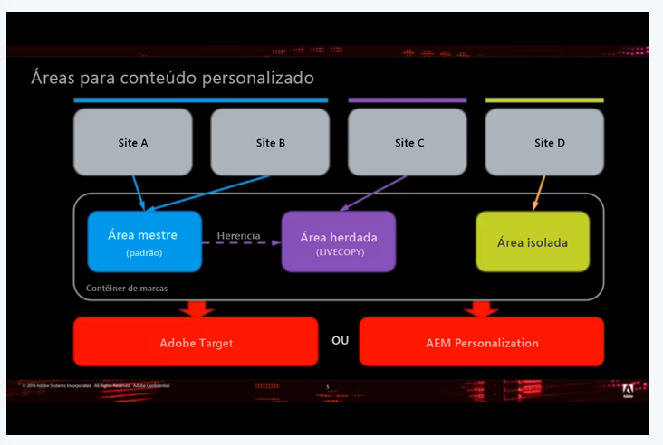

>[!NOTE]
>
>Para obter uma visão mais técnica desse recurso, consulte [Como é estruturado o gerenciamento de vários sites para conteúdo direcionado](/help/sites-authoring/technical-multisite-targeted.md).

## Exemplo: Direcionamento de conteúdo com base na geografia {#example-targeting-content-based-on-geography}

Usar vários sites para conteúdo direcionado permite compartilhar, implantar ou isolar o conteúdo de personalização. Para ilustrar melhor como esse recurso é usado, considere um cenário em que você deseja controlar como o conteúdo direcionado é implementado com base na geografia, como no seguinte cenário:

Existem quatro versões do mesmo site com base na geografia:

* O **Estados Unidos** site está no canto superior esquerdo e é o site principal. Neste exemplo, ele está aberto no modo de Direcionamento.
* As três outras versões deste site são **Canadá**, **Grã-Bretanha** e **Austrália**, que são todas cópias em tempo real. Esses sites estão abertos no modo de Visualização.

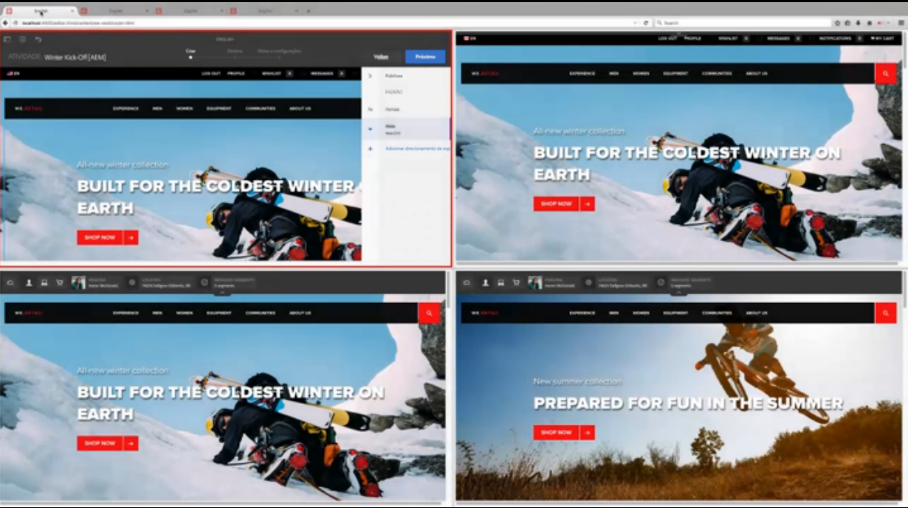

Cada site compartilha conteúdo personalizado em regiões geográficas:

* O Canadá compartilha a área principal com os Estados Unidos.
* O Grande Britânico está vinculado à área europeia e herda da área principal.
* A Austrália, por estar no hemisfério sul e não ser aplicável para produtos sazonais, tem seu próprio conteúdo personalizado.

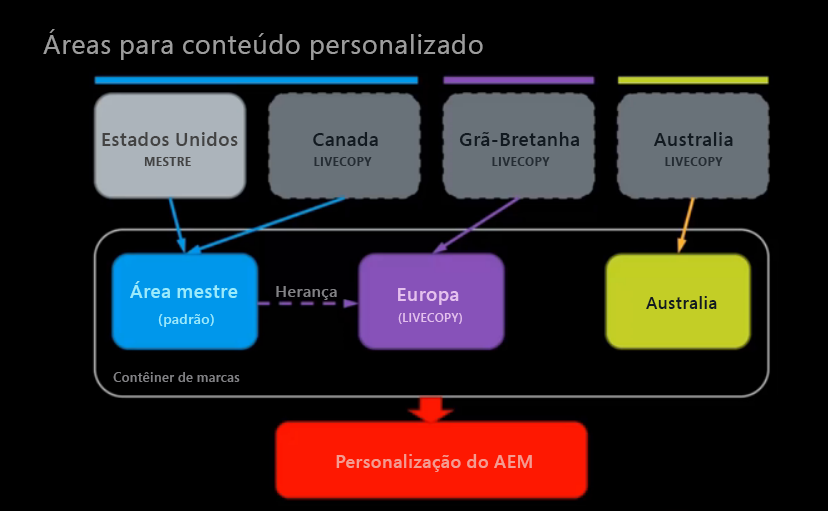

Para o hemisfério norte, temos uma atividade de inverno criada, mas, para o público-alvo masculino, o profissional de marketing na América do Norte gostaria de uma imagem diferente para o inverno, então ele(a) a modifica no site dos Estados Unidos.

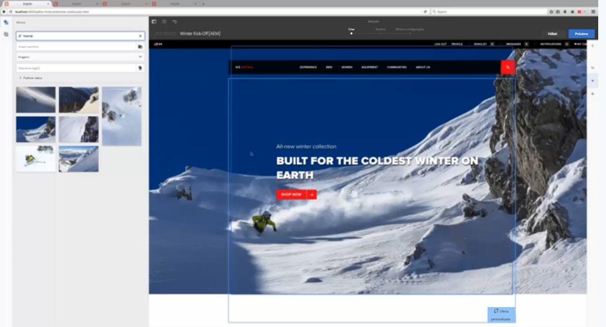

Depois de atualizar a guia, o site canadense muda para a nova imagem sem nenhuma ação da nossa parte. Fá-lo porque partilha a principal área com os Estados Unidos. Nos sites Grã-Bretanha e Austrália, a imagem não muda.

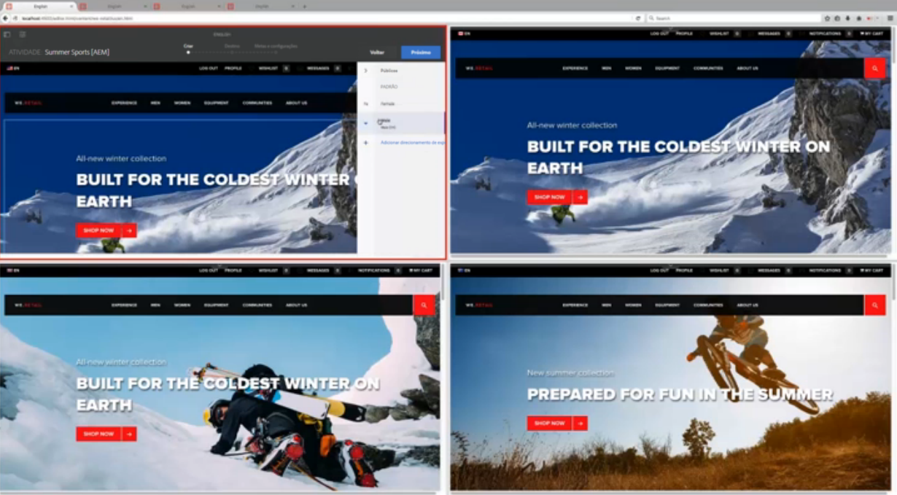

O comerciante gostaria de introduzir estas alterações na região europeia e [executa a live copy](/help/sites-administering/msm-livecopy.md) tocando ou clicando em **Página de implantação**. Depois de atualizar a guia, o site Grã-Bretanha tem a nova imagem, pois a área da Europa herda da área principal (após a implantação).

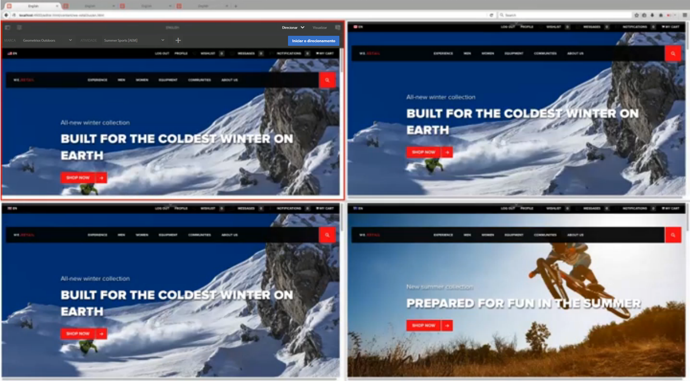

A imagem no site Austrália permanece inalterada, o que é o comportamento desejado, pois é verão na Austrália e o profissional de marketing não deseja alterar esse conteúdo. O site da Austrália não muda porque não compartilha uma área com nenhuma outra região nem é uma live copy de outra região. O profissional de marketing nunca precisa se preocupar com a substituição do conteúdo direcionado do site australiano.

Além disso, para a Grã-Bretanha, cuja área é uma live copy da área principal, você pode ver o status da herança pelo indicador verde ao lado do nome da atividade. Se uma atividade for herdada, você não poderá modificá-la, a menos que suspenda ou desconecte a live copy.

A qualquer momento, você pode suspender a herança ou desconectar a herança completamente. Você também pode sempre adicionar experiências locais que estão disponíveis apenas para essa experiência sem suspender a herança.

>[!NOTE]
>
>Para obter uma visão mais técnica desse recurso, consulte [Como é estruturado o gerenciamento de vários sites para conteúdo direcionado](/help/sites-authoring/technical-multisite-targeted.md).

### Criação de uma nova área em vez de criar uma nova área como cópia dinâmica {#creating-a-new-area-versus-creating-a-new-area-as-livecopy}

No AEM, você tem a opção de criar uma nova área ou criar novas áreas como live copy. A criação de uma nova área agrupa atividades e qualquer coisa que pertença a essas atividades, como ofertas, experiências e assim por diante. Você cria uma nova área quando deseja criar um conjunto completamente distinto de conteúdo direcionado ou deseja compartilhar um conjunto de conteúdo direcionado.

No entanto, se você tiver uma herança configurada por meio do MSM entre os dois sites, talvez queira herdar as atividades. Nesse caso, você cria uma nova área como uma live copy, em que Y é uma live copy de X e, portanto, herda todas as atividades também.

>[!NOTE]
>
>A implantação padrão aciona implantações subsequentes do conteúdo direcionado sempre que uma página se trata de uma Live Copy vinculada a uma área que é, em si, uma Live Copy da área vinculada ao blueprint das páginas.

Por exemplo, no diagrama a seguir, há quatro sites: dois deles compartilham a área principal (e todas as atividades que fazem parte dessa área), um site possui uma área que é uma Live Copy de outra área e, portanto, compartilha as atividades após a implantação, e o quarto site está completamente separado (e, portanto, requer uma área para suas atividades).

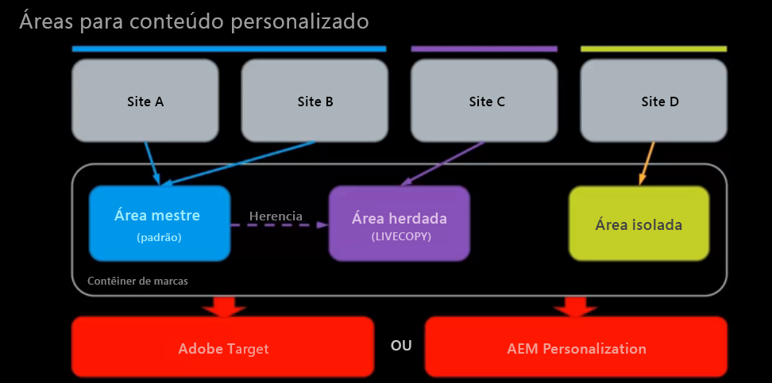

Para fazer isso no AEM, faça o seguinte:

* O Site A vincula-se à Área Principal - não é necessária nenhuma criação de área. A Área principal é selecionada por padrão em AEM. Os sites A e B compartilham atividades e assim por diante.
* O Site B vincula-se à Área Principal - não é necessária nenhuma criação de área. A Área principal é selecionada por padrão em AEM. Os sites A e B compartilham atividades e assim por diante.
* O Site C vincula-se à Área herdada, que é uma live copy da Área Principal - Criar Área como Live Copy, onde você cria uma live copy com base na Área Principal. A Área herdada herda as atividades da Área Principal após a implantação.
* O Site D vincula-se à sua própria área isolada - crie uma área onde você crie uma área totalmente nova, sem atividades ainda definidas. A área isolada não compartilhará atividades com nenhum outro site.

## Criação de novas áreas {#creating-new-areas}

Áreas podem abranger atividades e ofertas. Depois de criar uma área em qualquer uma delas (por exemplo, atividades), você também tem a área disponível na outra (por exemplo, ofertas).

>[!NOTE]
>
>A área padrão chamada Área mestre é recolhida por padrão ao tocar ou clicar no nome de uma marca **até** criar outra área. Em seguida, ao selecionar uma marca no console **Atividade** ou **Ofertas**, você verá o console **Área**.

Para criar uma nova área:

1. Navegue até **Personalização** > **Atividades** ou **Ofertas** e, em seguida, acesse sua marca.
1. Toque ou clique em **Criar área**.

   

1. Clique no botão **Área** ícone e clique em **Próximo**.
1. No **Título** , insira um nome para a nova área. Opcionalmente, selecione tags.
1. Toque ou clique em **Criar**.

   AEM redireciona para a janela da marca, onde lista todas as áreas criadas. Se houver outra área além da Área Principal, você poderá criar áreas diretamente no console Marca.

   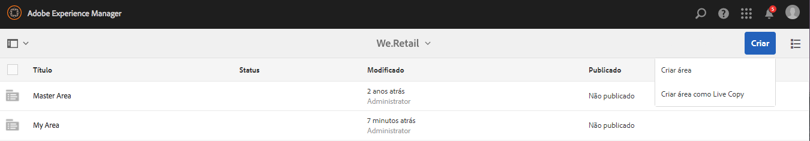

## Criação de áreas como cópias em tempo real {#creating-areas-as-live-copies}

Você cria uma área como uma live copy para herdar o conteúdo direcionado nas estruturas do site.

Para criar uma área como uma live copy:

1. Navegue até **Personalização** > **Atividades** ou **ofertas** e, em seguida, acesse sua marca.
1. Toque ou clique em **Criar área como Live Copy**.

   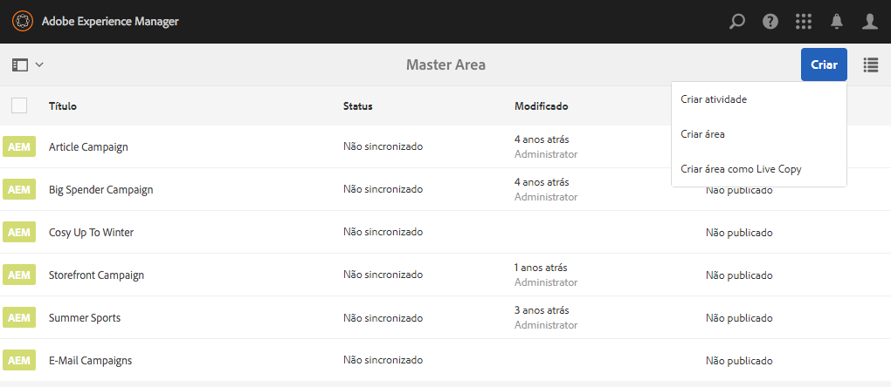

1. Selecione a área que você deseja transformar em uma Live Copy e clique em **Próximo**.

   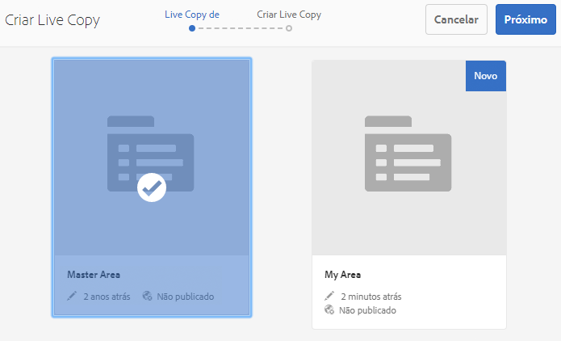

1. No campo **Nome**, digite um nome para a live copy. Por padrão, as sub páginas são incluídas; exclua-as selecionando a caixa de seleção **Excluir sub páginas**.

   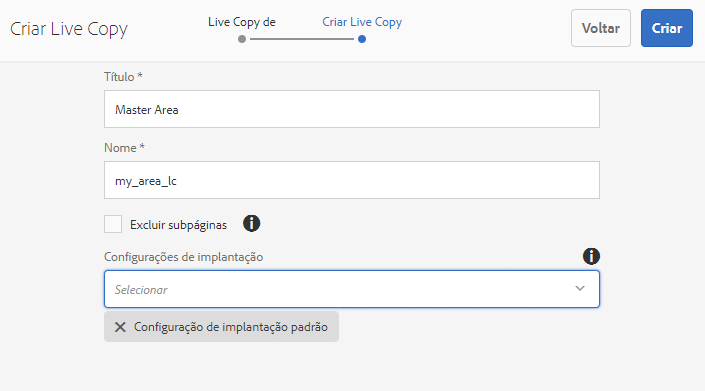

1. No **Configurações de implantação** selecione a configuração apropriada no menu suspenso.

   Consulte [Configurações de implementação instaladas](/help/sites-administering/msm-sync.md#installed-rollout-configurations) para obter descrições de cada opção.

   Consulte [Criação e sincronização de cópias em tempo real](/help/sites-administering/msm-livecopy.md) para obter mais informações sobre cópias em tempo real.

   >[!NOTE]
   >
   >Quando uma página é implantada em uma Live Copy e a área configurada para a página Blueprint também é o Blueprint da área configurada para a Live copy da Página, a ação dinâmica **personalizationContentRollout** aciona uma subRollout síncrona, que faz parte da **Configuração de implantação padrão**.

1. Toque ou clique em **Criar**.

   AEM redireciona para a janela da marca, onde lista todas as áreas criadas. Se houver outra área além da Área Principal, você poderá criar áreas diretamente na janela da marca.

   

## Vinculação de sites a uma área {#linking-sites-to-an-area}

É possível vincular áreas a páginas ou a um site. Áreas são herdadas por todas as subpáginas, a menos que essas páginas sejam sobrepostas por um mapeamento em uma subpágina. Em geral, no entanto, você vincula no nível do site.

Quando você vincula, somente essas atividades, experiências e ofertas da área selecionada ficam disponíveis. Isso evita a mistura acidental de conteúdo gerenciado de forma independente. Se nenhuma outra área for configurada, a área principal de cada marca será usada.

>[!NOTE]
>
>Páginas ou sites que fazem referência à mesma área estão usando o *mesmo* conjunto compartilhado de atividades, experiências e ofertas. A edição de uma atividade, experiência ou oferta compartilhada por vários sites afeta todos esses sites.

Para vincular um site a uma área:

1. Navegue até o site (ou página) que você deseja vincular a uma área.
1. Selecione o site ou a página e toque ou clique em **Propriedades da exibição**.
1. Toque ou clique na guia **Personalização.**
1. No **Marca** selecione a marca à qual deseja vincular sua área. Após selecionar a marca, as áreas disponíveis são disponibilizadas na variável **Referência da área** menu.

   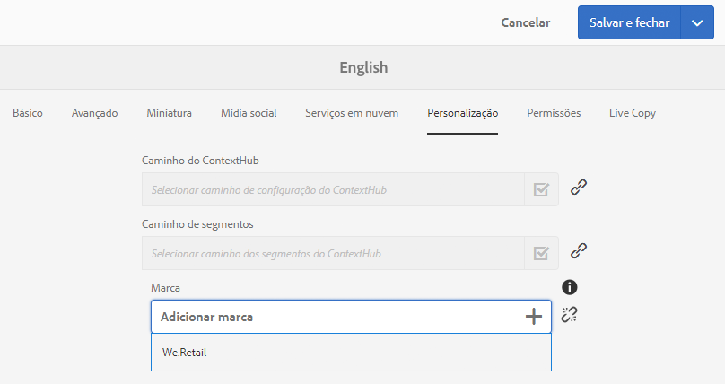

1. Selecione a área no menu suspenso **Referência da área** e toque ou clique em **Salvar**.

   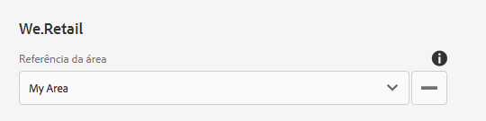

## Desconexão da live copy ou suspensão da herança do conteúdo direcionado {#detaching-live-copy-or-suspending-inheritance-of-targeted-content}

Você pode querer suspender ou desconectar a herança do conteúdo direcionado. A suspensão ou desconexão da live copy é feita por atividade. Por exemplo, você pode modificar experiências em sua atividade, mas se essa atividade ainda estiver vinculada à cópia herdada, não será possível modificar a experiência ou qualquer uma das propriedades da atividade.

A suspensão da live copy interrompe temporariamente a herança, mas no futuro você poderá restaurar a herança. A desconexão da live copy interrompe permanentemente a herança.

Você suspende ou desconecta a herança do conteúdo direcionado restaurando-o em uma atividade. Se uma página ou site for vinculado a uma área que se trata de uma Live Copy, você poderá ver o status de herança de uma atividade.

Uma atividade que está herdando de outro site é marcada em verde ao lado do nome da atividade. Uma herança suspensa é marcada em vermelho e uma atividade criada localmente não tem ícone.

>[!NOTE]
>
>* Você só pode suspender ou desconectar cópias ao vivo em uma atividade.
>* Não é necessário suspender ou desconectar cópias ao vivo para estender uma atividade herdada. Você sempre pode criar **novo** experiências e ofertas locais para essa atividade. Se quiser modificar uma atividade existente, será necessário suspender a herança.
>

### Suspensão da herança {#suspending-inheritance}

Para suspender ou desconectar a herança do conteúdo direcionado em uma atividade:

1. Navegue até a página onde deseja desconectar ou suspender a herança e toque ou clique em **Direcionamento** no menu suspenso de modo.
1. Se a página estiver vinculada a uma área que é uma live copy, você verá o status da herança. Toque ou clique em **Iniciar o direcionamento**.
1. Para suspender uma atividade, siga um destes procedimentos:

   1. Selecione um elemento da atividade, como o público-alvo. AEM exibe automaticamente uma caixa de confirmação Suspender Live Copy . (Você pode suspender a live copy tocando ou clicando em qualquer elemento durante todo o processo de Direcionamento.)
   1. Selecionar **Suspender Live Copy** no menu suspenso da barra de ferramentas.

   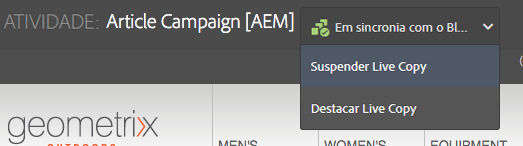

1. Toque ou clique em **Suspender** para suspender a atividade. Atividades suspensas são marcadas em vermelho.

   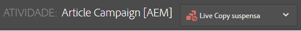

### Quebrando Herança {#breaking-inheritance}

Para interromper a herança do conteúdo direcionado em uma atividade:

1. Navegue até a página onde deseja desconectar a live copy da principal e toque ou clique em **Direcionamento** no menu suspenso de modo.
1. Se a página estiver vinculada a uma área que é uma live copy, você verá o status da herança. Toque ou clique em **Iniciar o direcionamento**.
1. Selecione **Desanexar Live Copy** no menu suspenso na barra de ferramentas. O AEM confirma que você deseja desanexar a live copy.
1. Toque ou clique **Desanexar** para desconectar a live copy da atividade. Depois de desanexado, o menu suspenso de herança não é mais exibido. A atividade agora é local.

   

## Restauração da herança do conteúdo direcionado {#restoring-inheritance-of-targeted-content}

Se você suspendeu a herança do conteúdo direcionado em uma atividade, é possível restaurá-la a qualquer momento. No entanto, se você desconectou a live copy, não poderá restaurar a herança.

Para restaurar a herança do conteúdo direcionado em uma atividade:

1. Navegue até a página em que deseja restaurar a herança e toque ou clique em **Direcionamento** no menu suspenso de modo.
1. Toque ou clique em **Iniciar o direcionamento**.
1. Selecione **Retomar Live Copy** no menu suspenso da barra de ferramentas.

   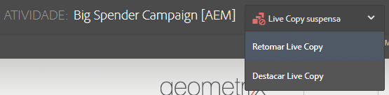

1. Toque ou clique **Retomar** para confirmar que você deseja retomar a herança da live copy. Quaisquer modificações feitas na atividade atual serão perdidas se você retomar a herança.

## Exclusão de áreas {#deleting-areas}

Ao excluir uma área, você exclui todas as atividades nessa área. AEM avisa você antes de excluir uma área. Ao excluir uma área à qual um site está vinculado, o mapeamento dessa marca será automaticamente redefinido para a área principal.

Para excluir uma área:

1. Navegue até **Personalização** > **Atividades** ou **Ofertas** e, em seguida, acesse sua marca.
1. Toque ou clique no ícone ao lado da área que deseja excluir.
1. Toque ou clique **Excluir** e confirme se deseja excluir a área.
