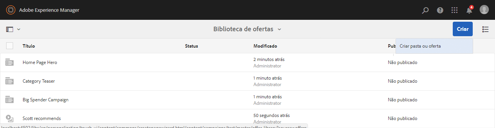
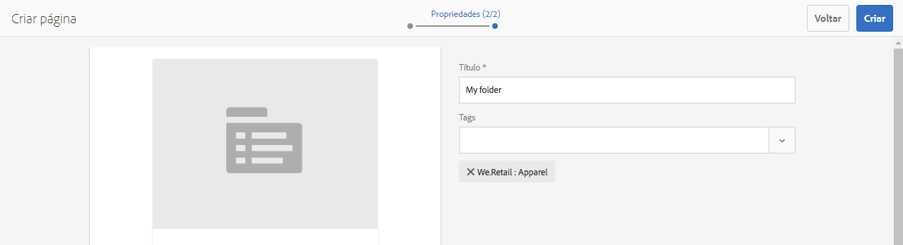
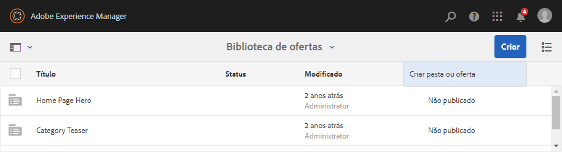
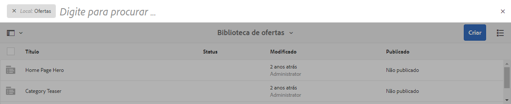

# Criação e gerenciamento de ofertas{#creating-and-managing-offers}

>[!CAUTION]
>
>AEM 6.4 chegou ao fim do suporte estendido e esta documentação não é mais atualizada. Para obter mais detalhes, consulte nossa [períodos de assistência técnica](https://helpx.adobe.com/br/support/programs/eol-matrix.html). Encontre as versões compatíveis [here](https://experienceleague.adobe.com/docs/).

Use o console Ofertas para criar ofertas que você pode [usar em experiências de atividade](/help/sites-authoring/content-targeting-touch.md). Criar ofertas no console Ofertas economiza tempo quando várias experiências exigem a mesma oferta:

* Crie a oferta uma vez na biblioteca e use-a em várias experiências das atividades da marca.
* Altere a oferta na biblioteca e a alteração afeta todas as experiências que a usam.

O console Ofertas organiza ofertas por marca. Cada marca contém uma biblioteca de ofertas que podem ser usadas nas experiências de uma marca. Use pastas para definir uma estrutura hierárquica para organizar ofertas em cada biblioteca. Uma estrutura de pastas lógica permite que os autores encontrem ofertas facilmente, navegando. As ferramentas de marcação e pesquisa também permitem que os autores encontrem ofertas.

## Adicionar uma marca usando o console Ofertas {#add-a-brand-using-the-offers-console}

Crie uma marca à qual suas ofertas estejam associadas. Abra uma marca no console Ofertas para acessar sua biblioteca de ofertas, onde você pode criar pastas e ofertas.

Ao criar uma marca usando o console Ofertas , ela também aparece no [Console de atividades](/help/sites-authoring/activitylib.md) onde você pode adicionar e administrar atividades da marca.

1. No console Navegação, clique ou toque em **Personalização** > **Ofertas**.

   

1. Clique ou toque em **Criar** e depois em **Criar marca**.
1. Selecione o modelo da marca e clique ou toque **Próximo**.
1. Digite um título para a marca como deseja que apareça nos consoles Ofertas e Atividades . Opcionalmente, digite ou selecione uma ou mais tags para associar à marca.
1. Clique ou toque em **Criar**.

## Adicionar uma pasta a uma biblioteca de ofertas {#add-a-folder-to-an-offer-library}

Adicione uma pasta à biblioteca de ofertas de uma marca para organizar e armazenar ofertas. Você pode criar uma pasta abaixo da marca ou abaixo de outras pastas.

1. No console Ofertas , abra o local onde deseja criar a pasta. Por exemplo, abra a marca para criar uma pasta de nível superior ou abra outra pasta na biblioteca.
1. Clique ou toque em **Criar** > **Criar pasta ou oferta**.

   

1. Selecione **Pasta** e clique em **Avançar**.
1. Digite o título que você atribuir para a exibição da pasta na biblioteca de ofertas e digite ou selecione tags.

   

1. Clique ou toque em **Criar**.

## Adicionar uma oferta a uma biblioteca de ofertas {#add-an-offer-to-an-offer-library}

Adicione uma oferta à biblioteca de ofertas de uma marca para que ela possa ser adicionada às experiências da marca. Ao adicionar uma oferta, você fornece um título. Também é possível associar a oferta a uma ou mais tags para melhorar a capacidade de pesquisa.

Após criar a oferta, você pode abri-la para criar o conteúdo.

1. No console Ofertas , abra o local onde deseja criar a oferta. Por exemplo, abra a marca para criar uma oferta de nível superior ou abra uma pasta na biblioteca.
1. Clique ou toque em **Criar** > **Criar pasta ou oferta**.

   

1. Selecione o **Página de ofertas** modelo e, em seguida, clique ou toque em **Próximo**.
1. Digite um título para a oferta e, opcionalmente, selecione ou digite uma ou mais tags a serem associadas à oferta, em seguida, clique ou toque em **Criar**.
1. Na caixa de diálogo de confirmação, para abrir a oferta para edição, clique ou toque em **Abrir página**.

## Editar uma oferta {#editing-an-offer}

Abra uma oferta e edite o conteúdo como deseja que ele apareça nas experiências que o utilizam. Ao editar uma oferta usada em qualquer experiência, suas alterações aparecem nas experiências.

É possível abrir uma oferta de uma pasta em uma biblioteca de ofertas ou a partir de resultados de pesquisa. Também é possível abrir uma oferta de uma experiência que a utilize.

1. No console Ofertas, toque ou clique no ícone ao lado da oferta e clique ou toque em **Editar**.
1. Adicione componentes à oferta e edite o conteúdo do componente como de costume.

## Exclusão de uma oferta {#deleting-an-offer}

Exclua uma oferta quando ela não for mais necessária. Ao tentar excluir uma oferta usada em uma experiência, você será solicitado a confirmar a exclusão. A confirmação exclui a oferta e a remove das experiências.

É possível excluir uma oferta ao exibir o conteúdo da pasta em uma biblioteca de ofertas ou os resultados de pesquisa.

1. No console Ofertas, toque ou clique no ícone ao lado da oferta e clique ou toque em **Excluir**.

   Selecione a oferta e clique ou toque em **Excluir**.

1. Na caixa de diálogo exibida, clique ou toque em **Excluir** para confirmar a exclusão.
1. Se a oferta for usada em uma ou mais experiências, uma caixa de diálogo será exibida para indicar que a oferta é referenciada:

   * Para excluir a oferta e removê-la das experiências, clique ou toque em **Forçar exclusão**.
   * Para manter a oferta, clique ou toque em **Cancelar**.

## Pesquisar ofertas {#searching-for-offers}

Procure ofertas de qualquer marca usando palavras-chave para correspondência do título.

Os critérios de pesquisa atuais são exibidos ao lado dos resultados da pesquisa. Também é possível classificar os resultados por coluna em ordem crescente ou decrescente. Você pode realizar uma pesquisa em qualquer pasta de qualquer biblioteca de ofertas. Os resultados da pesquisa são os mesmos, independentemente da pasta atual.

Para pesquisar ofertas:

1. Na parte superior do console Ofertas, clique ou toque no ícone de lupa. Por padrão, a pesquisa é limitada a ofertas.
1. Insira sua palavra-chave para procurar ofertas. Selecione nos resultados.
