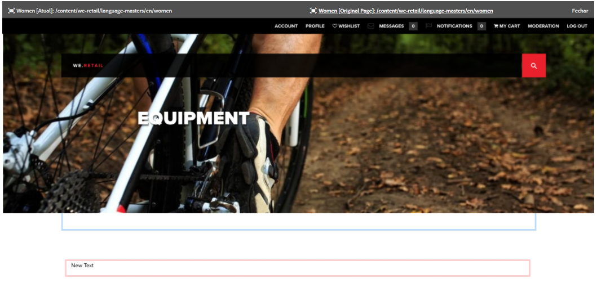

# Diferencial de páginas  {#page-diff}

>[!CAUTION]
>
>AEM 6.4 chegou ao fim do suporte estendido e esta documentação não é mais atualizada. Para obter mais detalhes, consulte nossa [períodos de assistência técnica](https://helpx.adobe.com/br/support/programs/eol-matrix.html). Encontre as versões compatíveis [here](https://experienceleague.adobe.com/docs/).

## Introdução {#introduction}

A criação de conteúdo é um processo iterativo. A criação com eficiência requer a capacidade de ver o que mudou de uma iteração para outra. Visualizar uma versão de página e depois a outra é ineficiente e propenso a erros. Um autor deseja poder comparar facilmente a página atual lado a lado com outra versão.

O recurso de diferencial de páginas permite a comparação lado a lado conveniente de duas páginas com suas diferenças realçadas.

>[!CAUTION]
>
>Se você estiver executando uma versão anterior ao AEM 6.4.3, o usuário deverá ter a variável **Modificar/Criar/Excluir** permissão no nó `/content/versionhistory` para usar o recurso.
>
>Consulte [Desenvolvimento e diff de página](/help/sites-developing/pagediff.md#operation-details) para obter mais detalhes técnicos sobre este recurso.

## Utilização {#use}

O diferencial lado a lado pode comparar o seguinte:

* [Versões](/help/sites-authoring/working-with-page-versions.md#comparing-a-version-with-current-page) - versão anterior de uma página com seu estado atual
* [Live Copies](/help/sites-administering/msm-livecopy.md#comparing-a-live-copy-page-with-a-blueprint-page) - Live Copy com blueprint
* [Lançamentos](/help/sites-authoring/launches-editing.md#comparing-a-launch-page-to-its-source-page) - lançamento com sua origem
* [Cópias de idioma](/help/sites-administering/tc-manage.md#comparing-language-copies) - uma página antes e depois da (nova) tradução

Consulte os respectivos tópicos sobre como iniciar o diferencial nesses contextos.

### Apresentação das diferenças   {#presentation-of-differences}

Independentemente do conteúdo que está sendo comparado, a apresentação do diferencial permanece a mesma.

* O conteúdo selecionado quando você iniciou o diferencial é exibido à esquerda (o ponto de entrada do diferencial).
* O conteúdo comparativo é exibido à direita (com base no qual o conteúdo selecionado é comparado).

Por exemplo, ao comparar versões, a versão atual é exibida à esquerda e a versão anterior é exibida à direita.

A origem de ambas as páginas é claramente exibida na barra de cabeçalho na parte superior da janela do navegador.

O diferencial detecta alterações no nível do componente e do HTML. Os itens que foram alterados são realçados com cores diferentes.

**Alterações de componentes**

* Verde claro - Componente adicionado
* Rosa - Componente removido
* Azul - Componente alterado
* Azul - Componente movido

Observe que as cores alteradas e movidas são as mesmas.

**Alterações de HTML**

* Verde escuro - HTML adicionado
* Vermelho - HTML removido

>[!NOTE]
>
>Ao comparar cópias de idioma, o realce é desativado, pois em uma tradução tudo muda e o realce não seria benéfico.

### Tela cheia e ao sair   {#fullscreen-and-exiting}

Para se concentrar em um conteúdo específico, você pode clicar no ícone de tela inteira para qualquer &quot;lado&quot; da comparação lado a lado, ampliando o conteúdo até o tamanho da janela do navegador.

O lado selecionado preencherá a janela inteira, mas a barra permanecerá no topo, permitindo que você alterne entre as duas páginas.

Você também pode optar por fechar a visualização em tela cheia clicando no ícone Saída da tela cheia.

Você pode sair do diferencial lado a lado a qualquer momento clicando no botão Fechar no cabeçalho.

## Limitações   {#limitations}

Há algumas situações em que o diferencial de páginas pode não detectar uma diferença conforme esperado.

* Ao diferenciar versões e lançamentos, o recurso de diferencial não leva em conta componentes dinâmicos, como navegações estruturais, menus, listas de produtos ou logotipos (componentes que dependem da estrutura do site para renderizar seu conteúdo).
* Para versões, o diferencial não recria a política de controle de acesso e as relações de live copy.
* Se for feita alguma alteração em uma imagem, como modificar os atributos alt, title ou src, ela será destacada em azul como alterada. No entanto, em alguns casos, a imagem tem uma representação Base64 do atributo src e, mesmo que as duas imagens tenham a mesma aparência, elas serão marcadas pelo recurso de diferencial como diferentes por causa dos diferentes atributos src.
* O recurso de diferencial é incapaz de detectar a rotação da imagem.
* Se uma página for movida, não será mais possível executar um diff com nenhuma versão feita antes da movimentação.

   * Se tiver problemas com um diff, verifique a [Linha do tempo](/help/sites-authoring/basic-handling.md#timeline) para que a página veja se a página foi movida.

>[!NOTE]
>
>Versões não podem ser comparadas entre si. Somente a versão atual pode ser comparada com outras versões da página. A versão atual é sempre a versão realçada com alterações.

>[!NOTE]
>
>Para obter mais detalhes sobre a operação do mecanismo diff da página, bem como limitações que podem afetar o diff da página, consulte o [documentação do desenvolvedor](/help/sites-developing/pagediff.md) deste recurso.
