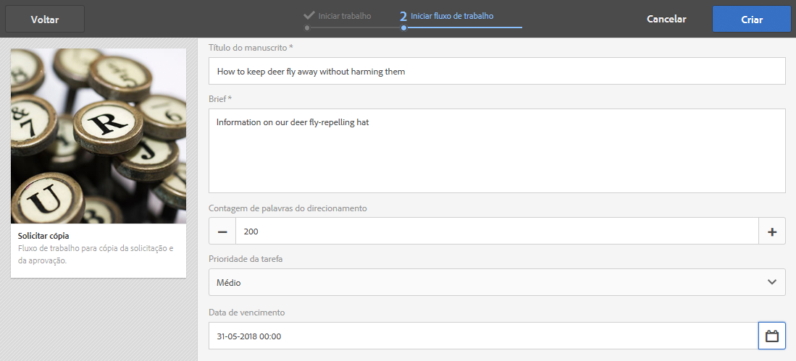
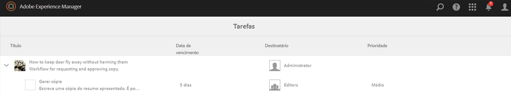
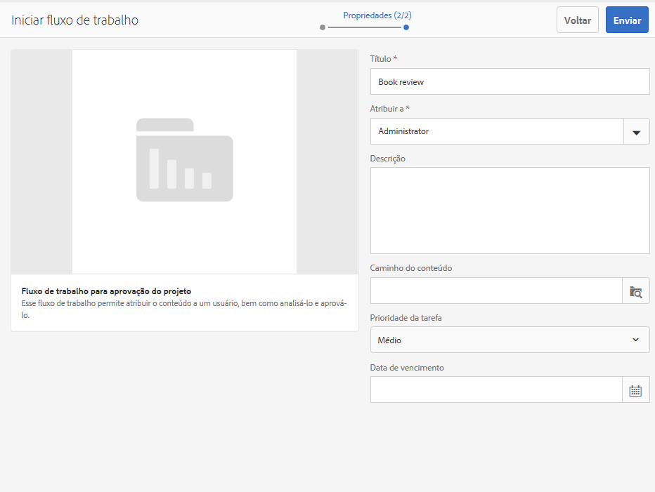
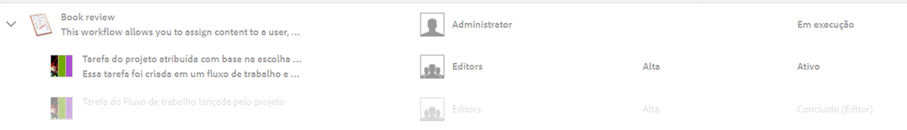
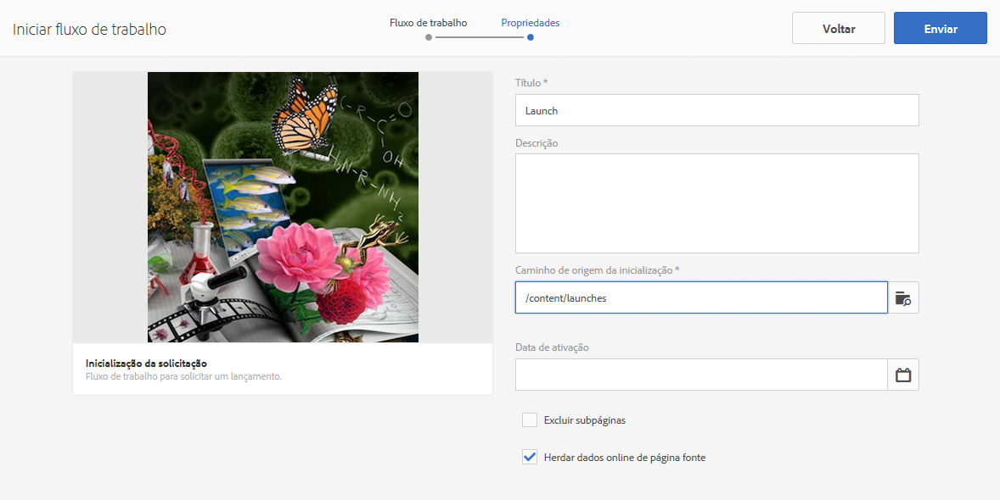
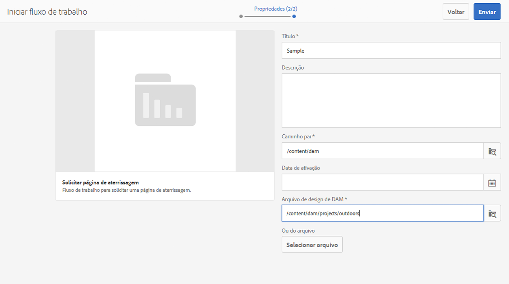
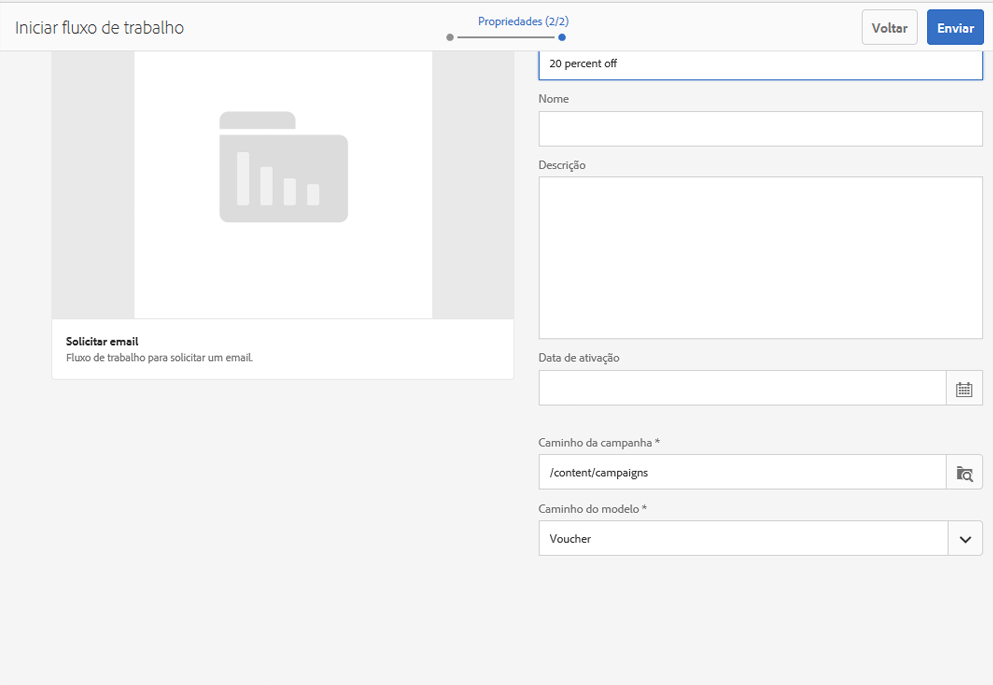
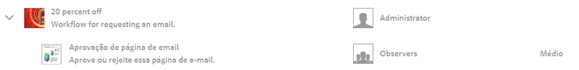

# Trabalhar com fluxos de trabalho de projeto{#working-with-project-workflows}

>[!CAUTION]
>
>AEM 6.4 chegou ao fim do suporte estendido e esta documentação não é mais atualizada. Para obter mais detalhes, consulte nossa [períodos de assistência técnica](https://helpx.adobe.com/br/support/programs/eol-matrix.html). Encontre as versões compatíveis [here](https://experienceleague.adobe.com/docs/).

Os fluxos de trabalho de projeto disponíveis para uso imediato incluem o seguinte:

* **Fluxo de trabalho para aprovação de projeto** - esse fluxo de trabalho permite atribuir conteúdo a um usuário, analisar esse conteúdo e depois aprová-lo.
* **Solicitar inicialização** - um fluxo de trabalho que solicita uma inicialização.
* **Solicitar página de aterrissagem** - esse fluxo de trabalho solicita uma página de aterrissagem.
* **Solicitar email** - Fluxo de trabalho para solicitar um email.
* **Sessão fotográfica do produto e Sessão fotográfica do produto (Comércio)** - Mapeia ativos com produtos
* **Criar e traduzir cópia DAM e criar cópia de idioma DAM** - Cria binários, metadados e tags traduzidos para ativos e pastas.

Dependendo de qual modelo de Projeto você selecionar, você terá determinados fluxos de trabalho disponíveis:

|  | **Projeto simples** | **Projeto de mídia** | **Projeto de sessão de fotos do produto** | **Projeto de tradução** |
|---|:-:|:-:|:-:|:-:|
| Solicitar cópia |  | x |  |  |
| Sessão fotográfica do produto |  | x | x |  |
| Sessão fotográfica do produto (Comércio) |  |  | x |  |
| Aprovação de projeto | x |  |  |  |
| Solicitar inicialização | x |  |  |  |
| Solicitar página de aterrissagem | x |  |  |  |
| Solicitar email | x |  |  |  |
| Criar cópia de idioma do DAM&amp;ast; |  |  |  | x |
| Criar e traduzir cópia de idioma do DAM;&amp;ast; |  |  |  | x |

>[!NOTE]
>
>&amp;ast; Esses fluxos de trabalho não são iniciados no bloco **Fluxo de trabalho** em Projetos. Consulte [Criação de cópias de idioma para ativos.](/help/sites-administering/tc-manage.md)

As etapas para iniciar e concluir workflows são as mesmas, independentemente do workflow escolhido. Somente as etapas mudam.

Você inicia um fluxo de trabalho diretamente em Projetos (exceto para Criar cópia de idioma DAM ou Criar e traduzir cópia de idioma DAM). As informações sobre quaisquer tarefas pendentes em um projeto são listadas no **Tarefas** mosaico. As notificações para tarefas que precisam ser concluídas aparecem ao lado do ícone do usuário.

Para obter mais informações sobre como trabalhar com fluxos de trabalho no AEM, consulte o seguinte:

* [Participar de fluxos de trabalho](/help/sites-authoring/workflows-participating.md)
* [Aplicação de fluxos de trabalho a páginas](/help/sites-authoring/workflows-applying.md)
* [Configuração de fluxos de trabalho](/help/sites-administering/workflows.md)

Esta seção descreve os fluxos de trabalho disponíveis para Projetos.

## Fluxo de trabalho Solicitar cópia {#request-copy-workflow}

Esse workflow permite solicitar um manuscrito de um usuário e depois aprová-lo. Para iniciar o fluxo de trabalho de cópia de solicitação:

1. No projeto Mídia, selecione o sinal **+** no bloco **Fluxos de trabalho** e selecione **Solicitar fluxo de trabalho de cópia**.
1. Insira um título de manuscrito e um breve resumo do que você está solicitando. Se aplicável, insira uma contagem de palavras de destino, uma prioridade de tarefa e uma data de vencimento.

   

1. Clique em **Criar**. O fluxo de trabalho é iniciado. A tarefa é exibida no **Tarefas** mosaico.

   

## Fluxo de trabalho de Sessão fotográfica do produto {#product-photo-shoot-workflow}

Os fluxos de trabalho de Sessão fotográfica do produto (comércio e sem comércio) são abordados detalhadamente em [Projeto criativo](/help/sites-authoring/managing-product-information.md).

## Fluxo de trabalho de aprovação do projeto {#project-approval-workflow}

No fluxo de trabalho Aprovação de projeto , você atribui conteúdo a um usuário, revisa e aprova o conteúdo.

1. No projeto Simples, selecione o ****+** faça logon no **Fluxos de trabalho** bloco e selecione **Fluxo de trabalho de aprovação do projeto**.
1. Insira um título e selecione a quem ele deve ser atribuído na lista Equipe. Se aplicável, insira uma descrição, um caminho de conteúdo, uma prioridade de tarefa e uma data de vencimento.

   

1. Clique em **Criar**. O fluxo de trabalho é iniciado. A tarefa é exibida no **Tarefas** mosaico.

   

## Fluxo de trabalho Solicitar lançamento {#request-launch-workflow}

Esse workflow permite solicitar um lançamento.

1. No projeto simples, selecione o sinal **+** no bloco **Fluxos de trabalho** e selecione **Solicitar fluxo de trabalho de inicialização**.
1. Insira um título para o lançamento e forneça o caminho de origem do lançamento. Você também pode adicionar uma descrição e uma data de ativação, se aplicável. Selecione Herdar dados online da página de origem ou excluir subpáginas, dependendo de como deseja que o lançamento se comporte.

   

1. Clique em **Criar**. O fluxo de trabalho é iniciado. O fluxo de trabalho aparece na lista **Fluxos de trabalho** (clique nas reticências **...** no bloco **Fluxos de trabalho** para acessar essa lista).

## Fluxo de trabalho Solicitar página de aterrissagem {#request-landing-page-workflow}

Esse workflow permite solicitar uma landing page.

1. No projeto Simples, selecione o **+** faça logon no **Fluxos de trabalho** e selecione Solicitar fluxo de trabalho da página de aterrissagem.
1. Insira um título para a landing page e o caminho pai. Se aplicável, insira uma data de ativação ou escolha um arquivo para sua página de aterrissagem.

   

1. Clique em **Criar**. O fluxo de trabalho é iniciado. A tarefa é exibida no **Tarefas** mosaico.

## Fluxo de trabalho Solicitar email {#request-email-workflow}

Esse workflow permite solicitar um email. Ele é o mesmo fluxo de trabalho que aparece no **Emails** mosaico.

1. No projeto Mídia ou Simples, selecione o **+** faça logon no **Fluxos de trabalho** bloco e selecione **Solicitar fluxo de trabalho por email**.
1. Insira um título de email, bem como os caminhos da campanha e do modelo. Além disso, você pode fornecer um nome, uma descrição e uma data de ativação.

   

1. Clique em **Criar**. O fluxo de trabalho é iniciado. A tarefa é exibida no **Tarefas** mosaico.

   

## Criar (e traduzir) fluxo de trabalho de cópia de idioma para ativos {#create-and-translate-language-copy-workflow-for-assets}

O **Criar Cópia de Idioma** e **Criar e traduzir cópia de idioma** os workflows são abordados detalhadamente em [Criação de cópias de idioma para ativos.](/help/assets/translation-projects.md)
