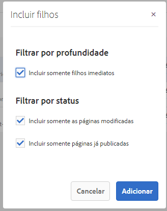
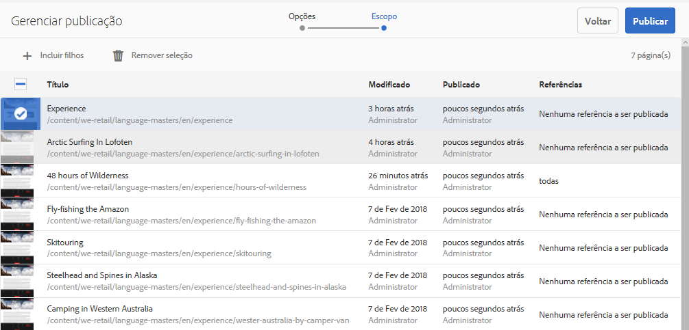

# Publicar páginas{#publishing-pages}

Depois de criar (e revisar) seu conteúdo no ambiente de criação, o objetivo é [disponibilizá-lo em seu site público ](/help/sites-authoring/author.md#concept-of-authoring-and-publishing)(seu ambiente de publicação).

Isso é referido como a publicação de uma página. Quando você deseja remover uma página do ambiente de publicação, este é o processo de desfazer a publicação. Ao publicar e desfazer a publicação, a página permanece disponível no ambiente de criação para modificações adicionais até que você a exclua.

Você também pode publicar/desfazer a publicação de uma página imediatamente ou em uma data/hora predefinida posteriormente.

>[!NOTE]
>
>Certos termos relacionados à publicação podem ser confundidos:
>
>* **Publicar/Desfazer a publicação**
   >  Esses são os termos principais para as ações que tornam o conteúdo publicamente disponível no ambiente de publicação (ou não).
   >
   >
* **Ativar / Desativar**
   >  Estes termos são sinônimos de publicar/desfazer a publicação.
   >
   >
* **Replicar / Replicação**
   >  Esses são os termos técnicos que descrevem a movimentação de dados (por exemplo, conteúdo da página, arquivos, código, comentários do usuário) de um ambiente para outro, como ao publicar ou reverter a replicação de comentários do usuário.
>

>[!NOTE]
>
>Caso não tenha os privilégios necessários para a publicação de uma página específica:
>
>* Um fluxo de trabalho será acionado para notificar a pessoa adequada sobre a sua solicitação para publicação.
>* Esse [fluxo de trabalho pode ter sido personalizado](/help/sites-developing/workflows-models.md) pela sua equipe de desenvolvimento.
>* Uma mensagem será exibida brevemente para notificar que o fluxo de trabalho foi disparado.

>

## Publicar páginas {#publishing-pages-2}

Dependendo da sua localização, você pode publicar:

* [No editor de páginas](/help/sites-authoring/publishing-pages.md#publishing-from-the-editor)
* [Do console de sites](/help/sites-authoring/publishing-pages.md#publishing-from-the-console)

### Publicação por meio do Editor {#publishing-from-the-editor}

Se você estiver editando uma página, ela poderá ser publicada diretamente do editor.

1. Selecione o ícone **Informações da página** para abrir o menu e depois a opção **Publicar página**.

   

1. Se a página tiver referências que precisam de publicação:

   * A página será publicada diretamente se não existirem referências a serem publicadas.
   * Caso a página tenha referências que precisam ser publicadas, elas serão listadas no **Assistente de publicação,** onde é possível:

      * Especificar qual dos ativos/tags/etc. você deseja publicar junto com a página. Em seguida, use **Publicar** para concluir o processo.
      * Usar a opção **Cancelar** para suspender a ação.

   

1. Se você selecionar **Publicar**, replicará a página no ambiente de publicação. No editor de páginas, será mostrado um banner de informações confirmando a ação de publicação.

   

   Ao visualizar a mesma página no console, o status da publicação atualizada estará visível.

   

>[!NOTE]
>
>A publicação por meio do Editor é um processo superficial, ou seja, apenas as páginas selecionadas são publicadas, sem incluir páginas filhas.

### Publicação por meio do Console {#publishing-from-the-console}

No console de sites, existem duas opções para publicação:

* [Publicação rápida](/help/sites-authoring/publishing-pages.md#quick-publish)
* [Gerenciar publicação](/help/sites-authoring/publishing-pages.md#manage-publication)

#### Publicação rápida    {#quick-publish}

A **Publicação rápida** serve para casos simples e publica as páginas selecionadas imediatamente, sem qualquer outra interação. Por isso, quaisquer referências não publicadas também serão publicadas automaticamente.

Para publicar uma página com a Publicação rápida:

1. Selecione as páginas no console de sites e clique no botão **Publicação rápida**.

   

1. In the Quick Publish dialogue, confirm the publication by clicking on **Publish** or cancel by clicking on **Cancel**. Lembre-se de que todas as referências não publicadas também serão publicadas automaticamente.

   

1. Quando a página é publicada, é mostrado um alerta confirmando a publicação.

>[!NOTE]
>
>A Publicação rápida é uma publicação superficial, ou seja, apenas as páginas selecionadas são publicadas, sem incluir páginas filhas.

#### Gerenciar publicação    {#manage-publication}

A opção **Gerenciar publicação** oferece mais opções do que a Publicação rápida, permitindo a inclusão de páginas filhas, a personalização das referências e o início de qualquer fluxo de trabalho aplicável, além de oferecer a opção de publicação em uma data posterior.

Para publicar ou desfazer a publicação de uma página usando Gerenciar publicação:

1. Selecione as páginas no console Sites e clique no botão **Gerenciar publicação**.

   

1. O assistente para **Gerenciar publicação** é iniciado. A primeira etapa, **Opções**, permite fazer o seguinte:

   * Optar por publicar ou desfazer a publicação de páginas selecionadas.
   * Optar por realizar a ação agora ou em uma data posterior.

   A publicação posterior inicia um fluxo de trabalho para publicar as páginas selecionadas no horário especificado. Por outro lado, o cancelamento posterior da publicação inicia um fluxo de trabalho para desfazer a publicação das páginas selecionadas em um horário específico.

   Caso deseje cancelar a publicação/desfazer a publicação mais tarde, acesse o [console Sites](/help/sites-administering/workflows.md) para encerrar o fluxo de trabalho correspondente.

   

   Clique em **Avançar** para continuar.

1. In the next step of the Manage Publication wizard, **Scope**, you can define the scope of the publication/unpublication such as including to include child pages and/or including references.

   

   Você pode usar o botão **Adicionar conteúdo** para adicionar outras páginas à lista de páginas a serem publicadas caso tenha se esquecido de selecionar uma antes de iniciar o assistente para Gerenciar publicação.

   Clicar no botão Adicionar conteúdo inicia o [navegador de caminho](/help/sites-authoring/author-environment-tools.md#path-browser) para permitir a seleção de conteúdo.

   Escolha as páginas necessárias e clique em **Selecionar** para adicionar o conteúdo ao assistente ou em **Cancelar** para cancelar a seleção e retornar ao assistente.

   De volta ao assistente, é possível selecionar um item na lista para configurar suas opções adicionais, como:

   * Incluir seus filhos.
   * Removê-lo da seleção.
   * Gerenciar suas referências publicadas.

   

   Clicar em **Incluir filhos** abre uma caixa de diálogo que permite:

   * Incluir somente filhos imediatos.
   * Incluir somente as páginas modificadas.
   * Incluir somente páginas já publicadas.

   Clique em **Adicionar** para adicionar as páginas filhas à lista de páginas a serem publicadas ou não, com base nas opções de seleção. Clique em **Cancelar** para cancelar a seleção e retornar ao assistente.

   

   Ao retornar ao assistente, você verá as páginas adicionadas com base na sua escolha de opções na caixa de diálogo Incluir filhos.

   É possível visualizar e modificar as referências a serem publicadas ou não para uma página. Basta selecionar a referência desejada e clicar no botão **Referências publicadas**.

   

   The **Published References** dialogue displayes the references for the selected content. Por padrão, todas elas são selecionadas e serão publicadas/não publicadas, mas você pode desmarcá-las para desativá-las e evitar que elas sejam incluídas na ação.

   Click **Done** to save your changes or **Cancel** to cancel the selction and return to the wizard.

   

   De volta ao assistente, a coluna **Referências** será atualizada para refletir sua seleção de referências a serem publicadas ou não publicadas.

   

1. Clique em **Publicar** para concluir.

   De volta ao console de sites, uma mensagem de notificação confirmará a publicação.

   

1. Se as páginas publicadas estiverem associadas a fluxos de trabalho, elas poderão ser exibidas em uma etapa final de **Fluxos de trabalho** do assistente de publicação.

   >[!NOTE]
   >
   >A etapa **Fluxos de trabalho** será mostrada com base em quais direitos seu usuário pode ou não possuir. See the [previous note on this page](/help/sites-authoring/publishing-pages.md) regarding publishing privileges as well as [Managing Access to Workflows](/help/sites-administering/workflows-managing.md) and [Applying Workflows to Pages](/help/sites-authoring/workflows-applying.md) for details.

   Os recursos são agrupados pelos fluxos de trabalho acionados e cada uma das opções especificadas para:

   * Definir o título do fluxo de trabalho.
   * Manter o pacote de fluxo de trabalho, desde que o fluxo de trabalho tenha [suporte para vários recursos](/help/sites-developing/workflows-models.md#configuring-a-workflow-for-multi-resource-support).
   * Definir um título do pacote de fluxo de trabalho se a opção para manter esse pacote tiver sido escolhida.

   Click **Publish** or **Publish Later **to complete the publication.

   

## Desfazer a publicação de páginas {#unpublishing-pages}

Desfazer a publicação de uma página fará com que ela seja removida do seu ambiente de publicação, deixando de estar disponível aos seus leitores.

De uma [maneira semelhante à publicação](/help/sites-authoring/publishing-pages.md#publishing-pages), uma ou mais páginas podem ter a publicação desfeita:

* [No editor de páginas](/help/sites-authoring/publishing-pages.md#unpublishing-from-the-editor)
* [Do console de sites](/help/sites-authoring/publishing-pages.md#unpublishing-from-the-console)

### Desfazer a publicação por meio do editor    {#unpublishing-from-the-editor}

Ao editar uma página, se quiser desfazer a publicação, selecione **Desfazer a publicação da página** no menu **Informações da página**, da mesma maneira que faria para [publicar essa página](/help/sites-authoring/publishing-pages.md#publishing-from-the-editor).

### Desfazer a publicação por meio do Console  {#unpublishing-from-the-console}

Da mesma forma que você [usa a opção Gerenciar publicação para publicar](/help/sites-authoring/publishing-pages.md#manage-publication), também pode usá-la para desfazer a publicação.

1. Selecione as páginas no console Sites e clique no botão **Gerenciar publicação**.
1. O assistente para **Gerenciar publicação** é iniciado. Na primeira etapa, **Opções**, selecione **Desfazer a publicação** em vez da opção padrão **Publicar**.

   

   Da mesma forma que a opção para publicar mais tarde inicia um fluxo de trabalho para publicar essa versão de página no horário especificado, a opção para desativar mais tarde inicia um fluxo de trabalho para desfazer a publicação das páginas selecionadas em um momento específico.

   Caso deseje cancelar a publicação/desfazer a publicação mais tarde, acesse o [console Sites](/help/sites-administering/workflows.md) para encerrar o fluxo de trabalho correspondente.

1. Para concluir o cancelamento da publicação, prossiga com o assistente como faria para [publicar a página](/help/sites-authoring/publishing-pages.md#manage-publication).

## Publicar e desfazer a publicação de uma Arvore {#publishing-and-unpublishing-a-tree}

Ao inserir ou atualizar um número considerável de páginas de conteúdo, todas residentes na mesma página raiz, pode ser mais fácil publicar a árvore inteira em uma única ação.

Você pode usar a opção [Gerenciar publicação](/help/sites-authoring/publishing-pages.md#manage-publication) no console de sites para fazer isso.

1. No console de sites, selecione a página raiz da árvore que você deseja publicar ou desfazer a publicação e depois selecione **Gerenciar publicação**.
1. O assistente para **Gerenciar publicação** é iniciado. Opte por publicar ou desfazer a publicação e quando a ação deve ocorrer. Em seguida, selecione **Próximo** para continuar.
1. Na etapa **Escopo**, selecione a página raiz e selecione **Incluir filhos**.

   

1. Na caixa de diálogo **Incluir filhos**, desmarque as opções:

   * Incluir somente filhos imediatos
   * Incluir somente páginas já publicadas

   Essas opções são selecionadas por padrão e, portanto, você deve se lembrar de desmarcá-las. Clique em **Adicionar** para confirmar e adicionar o conteúdo à publicação ou ao cancelamento da publicação.

   

1. O assistente para **Gerenciar publicação** lista o conteúdo da árvore para revisão. Você pode personalizar ainda mais a seleção, adicionando outras páginas ou removendo as selecionadas.

   

   Lembre-se de que você também pode rever as referências a serem publicadas por meio da opção **Referências publicadas**.

1. [Continue com o assistente Gerenciar publicação como normal](#manage-publication) para concluir a publicação ou o cancelamento da publicação da árvore.

## Determinação do status de publicação {#determining-publication-status}

Você pode determinar o status de publicação de uma página:

* Nas [informações de visão geral de recursos do console de sites](/help/sites-authoring/basic-handling.md#viewing-and-selecting-resources)

   

   O status da publicação é mostrado nas exibições [cartão](/help/sites-authoring/basic-handling.md#card-view), [coluna](/help/sites-authoring/basic-handling.md#column-view) e [lista](/help/sites-authoring/basic-handling.md#list-view) do console de sites.

* Na [linha do tempo](/help/sites-authoring/basic-handling.md#timeline)

   

* No menu [Informações da página](/help/sites-authoring/author-environment-tools.md#page-information), ao editar uma página

   

