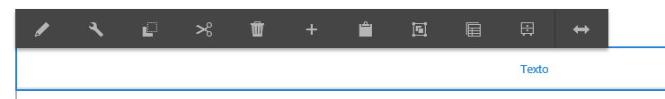
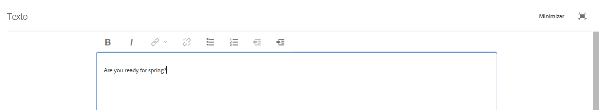
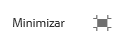

# Using the Rich Text Editor to author content {#using-the-rich-text-editor-to-author-content}

O Editor de Rich Text (RTE) é um elemento básico fundamental para a criação de texto em AEM páginas. Muitos componentes, como Texto, Texto e Imagem, e Tabela, são baseados no RTE.

>[!NOTE]
>
>A cópia de listas aninhadas no RTE não funciona como esperado. Ao copiar listas aninhadas do Microsoft Word, será necessário limpar manualmente as listas depois de colar o texto no RTE.

## Edição no local {#in-place-editing}

Selecionar um componente baseado em texto com um único toque ou clique revela a barra de ferramentas [do](../sites-authoring/editing-content.md#edit-configure-copy-cut-delete-paste)componente.

Tocar/clicar novamente ou selecionar inicialmente o componente com um toque/clique lento no duplo abre a edição no local, que tem sua própria barra de ferramentas. Aqui, você pode editar o conteúdo e efetuar alterações básicas na formatação.

Essa barra de ferramentas fornece as seguintes opções:

* **Formato**: Defina a formatação Negrito, Itálico e Sublinhado.

* **Listas**: Crie listas com marcadores ou numeradas ou defina o recuo.

* **Hiperlink**

* **Desvincular**

* **Tela cheia**

* **Fechar**

* **Salvar**

## Edição em tela cheia {#full-screen-editing}

Para componentes baseados em texto, selecionar o modo de tela cheia na barra de ferramentas abrirá o editor de Rich Text e ocultará o restante do conteúdo da página.

O modo de tela inteira mostra todas as opções do editor de Rich Text, que são configuradas pelo administrador. Elas podem variar AEM instâncias, [dependendo da configuração](../sites-administering/rich-text-editor.md) fornecida pelos administradores ou AEM desenvolvedores. Se encontrar uma opção ausente, peça ao administrador para disponibilizá-la.

Outras opções do editor de Rich Text incluem:

* **Âncora**: crie uma âncora no texto para a qual você poderá mais tarde vincular ou fazer referência.
* **Alinhar texto à esquerda**
* **Centralizar texto**
* **Alinhar texto à direita**

Para fechar o modo de tela cheia, clique no ícone Minimizar.

