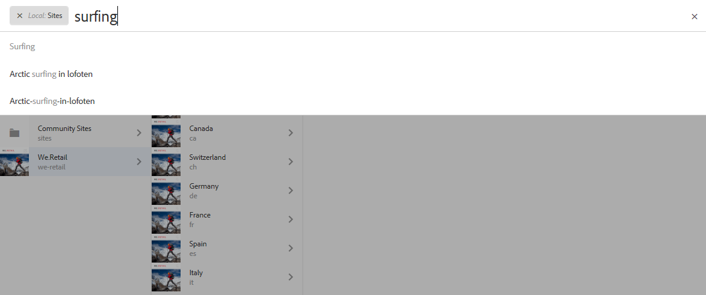
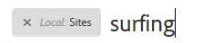
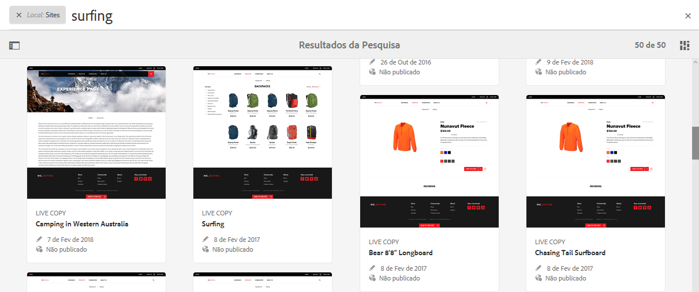
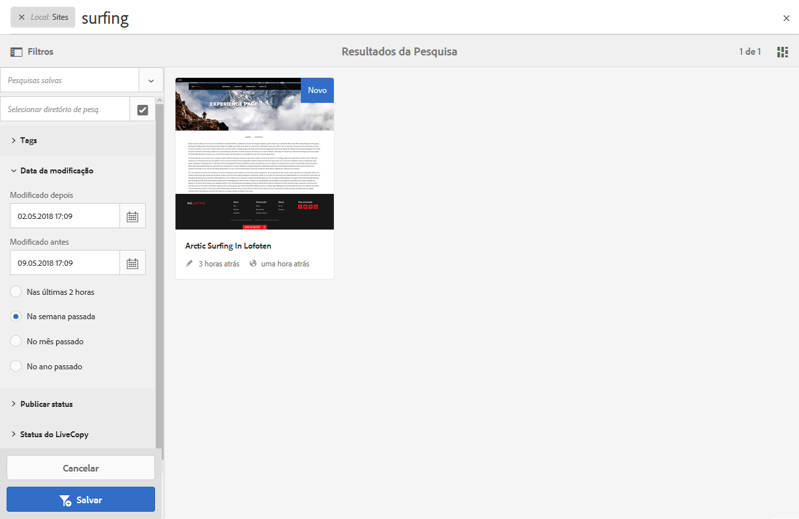
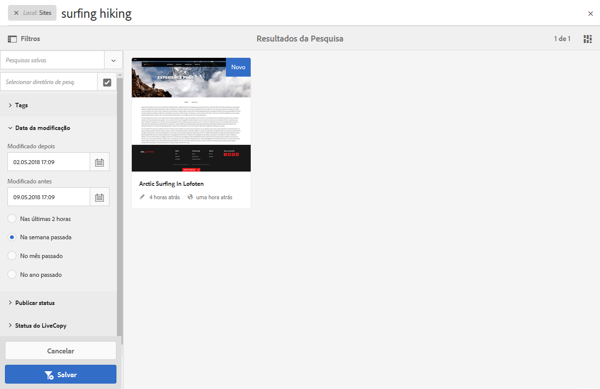
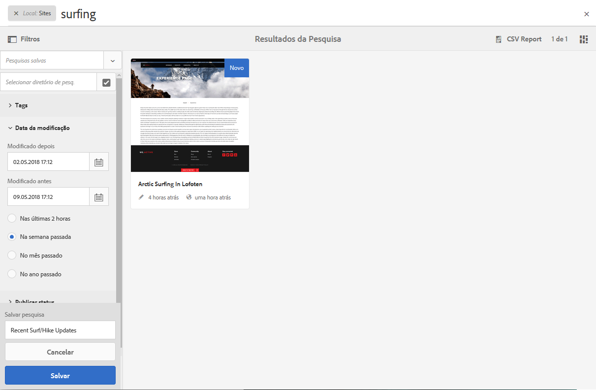
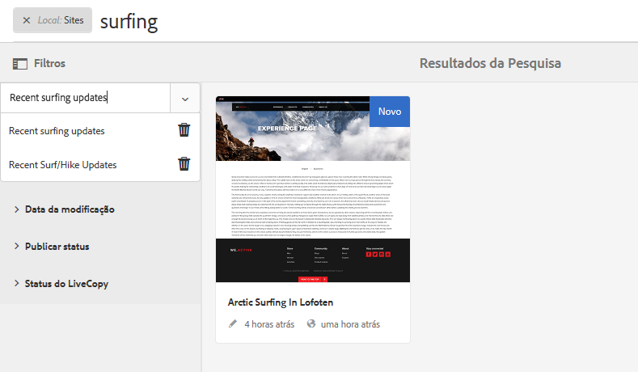
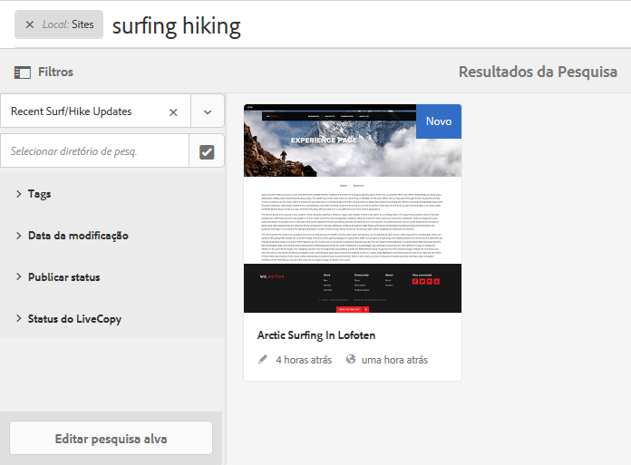

# Pesquisar{#search-features}

O ambiente de criação do AEM fornece vários mecanismos de pesquisa de conteúdo, dependendo do tipo de recurso.

>[!NOTE]
>
>Fora do ambiente de criação, outros mecanismos também estão disponíveis para a pesquisa, como o [Construtor de consultas](/help/sites-developing/querybuilder-api.md) e o [CRXDE Lite](/help/sites-developing/developing-with-crxde-lite.md).

## Noções básicas de pesquisa {#search-basics}

A pesquisa está disponível na barra de ferramentas superior:

Com o painel de pesquisa, você pode:

* Pesquise por uma palavra-chave, um caminho ou uma tag específica.
* Filtre de acordo com os critérios específicos dos recursos, como datas modificadas, status da página, tamanho do arquivo, etc.
* Defina e use uma [pesquisa salva](#saved-searches) - com base nos critérios acima.

>[!NOTE]
>
>A pesquisa também pode ser invocada usando a tecla de atalho `/` (barra) sempre que o painel de pesquisa estiver visível.

## Pesquisar e filtrar {#search-and-filter}

Para pesquisar e filtrar os recursos:

1. Abra **Pesquisar** (com a lupa na barra de ferramentas) e insira o termo de pesquisa. Serão feitas sugestões que poderão ser selecionadas:

   

   Por padrão, os resultados da pesquisa ficarão limitados à sua localização atual (ou seja, o console e o tipo de recurso relacionado): 

   

1. Se necessário, é possível remover o filtro de localização (selecione **X** no filtro que deseja remover) para pesquisar em todos os consoles/tipos de recurso.
1. Os resultados serão mostrados, agrupados de acordo com o console e o tipo de recurso relacionado.

   Você pode selecionar um recurso específico (para a ação adicional) ou detalhar selecionando o tipo de recurso desejado; por exemplo, **Exibir todos os sites**: 

   

1. Se desejar mais detalhes, selecione o símbolo do Painel (parte superior esquerda) para abrir o painel lateral **Filtros e opções**.

   

   De acordo com o tipo de recurso, a Pesquisa mostrará uma seleção predefinida de critérios de pesquisa/filtro.

   O painel lateral permite selecionar:

   * Pesquisas salvas
   * Diretório de pesquisa
   * Tags
   * Critérios de pesquisa; por exemplo, datas modificadas, status de publicação, status da Live Copy. 

   >[!NOTE]
   >
   >O critério de pesquisa pode variar:
   >
   >* Dependendo do tipo de recurso selecionado; por exemplo, os critérios de Ativos e comunidades são compreensivelmente especializados.
   >* Sua instância, como os [Formulários de pesquisa,](/help/sites-administering/search-forms.md) pode ser personalizada (adequada ao local no AEM).

   

1. Você também pode adicionar outros termos de pesquisa:

   

1. Feche a **Pesquisa** com o **X** (canto superior direito).

>[!NOTE]
>
>Os critérios de pesquisa persistem ao selecionar um item nos resultados de pesquisa.
>
>Quando você seleciona um item na página de resultados da pesquisa e retorna à página de pesquisa após usar o botão Voltar do navegador, os critérios de pesquisa permanecem.

## Pesquisas salvas {#saved-searches}

Além de pesquisar por uma grande variedade de aspectos, também é possível salvar uma configuração de pesquisa específica para recuperar e usar em um estágio posterior:

1. Defina o seu critério de pesquisa e selecione **Salvar**.

   

1. Atribua um nome, em seguida, use **Salvar** para confirmar:

   

1. Sua pesquisa salva estará disponível no seletor da próxima vez que você acessar o painel de pesquisa:

   

1. Depois de salvo é possível:

   * Use **X** (em comparação ao nome da pesquisa salva) para iniciar uma nova consulta (a própria pesquisa salva não será excluída).
   * **Edite a pesquisa salva**, altere as condições de pesquisa e, em seguida, **Salve** novamente.

As pesquisas salvas podem ser modificadas ao selecionar a pesquisa salva e clicar em **Editar pesquisa salva** na parte inferior do painel de pesquisa.

