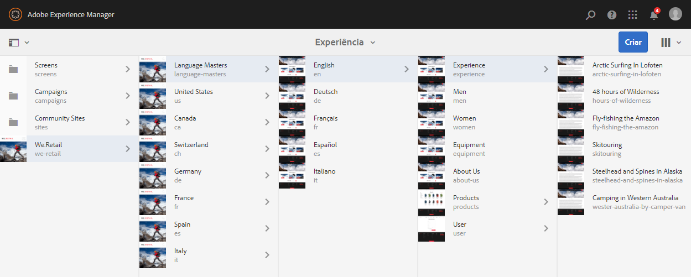
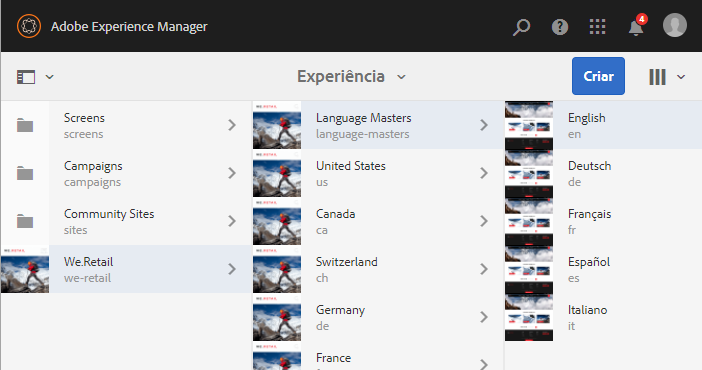
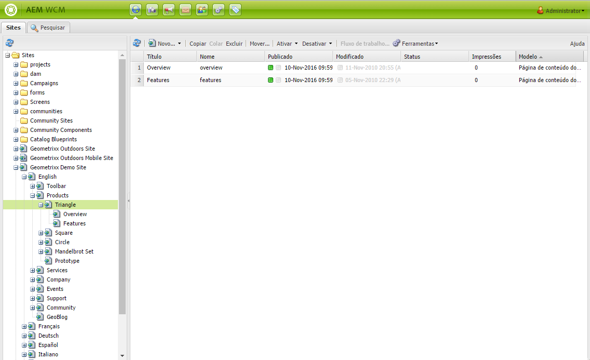
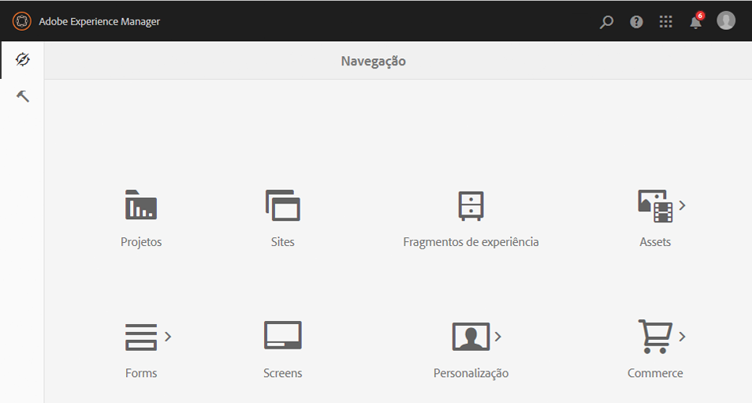
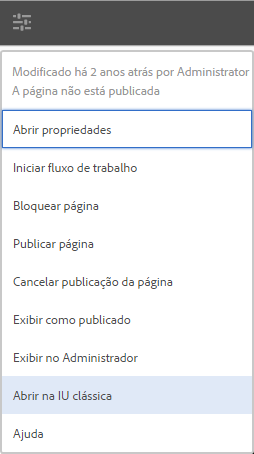

# Selecionar sua interface do usuário{#selecting-your-ui}

## Como entender as interfaces

O ambiente de criação permite:

* [Criação](/help/sites-authoring/author.md) (incluindo [criação de páginas](/help/sites-authoring/author-environment-tools.md), [gerenciamento de ativos](/help/assets/home.md) e [comunidades](/help/communities/author-communities.md))

* [Administração ](/help/sites-administering/home.md) de tarefas necessárias ao gerar e manter o conteúdo no seu site

Duas interfaces gráficas de usuário são fornecidas para isso. Elas podem ser acessadas por meio de qualquer navegador moderno.

1. Interface do usuário habilitada para toque

   * This is the modern, default AEM UI.
   * É predominantemente cinza, com uma interface limpa e plana.
   * Projetada para uso em dispositivos desktop e habilitados para toque, a aparência e a experiência de uso são iguais em todos os dispositivos, embora [ visualizar e selecionar recursos](/help/sites-authoring/basic-handling.md#viewing-and-selecting-resources) sejam um pouco diferentes (toques vs cliques).

      * Desktop:

   

   * Dispositivos tablet (ou desktop com menos de 1.024 pixels de largura):

   

1. Interface do usuário clássica

   * Esta é a interface do usuário legada e está disponível no AEM por anos.
   * É predominantemente verde.
   * Ela foi projetada para uso em dispositivos de desktop.
   * A seguinte documentação se concentra na interface do usuário moderna. Para obter informações sobre a criação na interface do usuário clássica, consulte a [ documentação de criação para a interface do usuário clássica](/help/sites-classic-ui-authoring/classicui.md).

   

## Alternando UIs

Although the touch-enabled UI is now the standard UI and [feature parity](../release-notes/touch-ui-features-status.md) has been nearly reached with the administration and editing of sites, there may be times when the user wishes to switch to the [classic UI](/help/sites-classic-ui-authoring/classicui.md). Há várias opções para fazer isso.

>[!NOTE]
>
>Para obter detalhes sobre o status da paridade de recursos com a IU clássica, consulte o documento [Paridade de recursos da interface de usuário de toque](../release-notes/touch-ui-features-status.md).

Há vários locais em que você pode definir qual interface de usuário deve ser usada:

* [Configuração da interface padrão para sua instância](#configuring-the-default-ui-for-your-instance) - isso definirá a interface padrão a ser exibida no login do usuário, embora o usuário possa substituí-la e selecionar uma interface diferente para sua conta ou sessão atual.

* [Configuração da criação da interface clássica para sua conta](/help/sites-authoring/select-ui.md#setting-classic-ui-authoring-for-your-account) - isso definirá a interface para ser usada como padrão ao editar páginas, embora o usuário possa substituí-la e selecionar uma interface diferente para sua conta ou sessão atual.

* [Alternar para a interface clássica para a sessão](#switching-to-classic-ui-for-the-current-session) atual - Isso alterna para a interface clássica para a sessão atual.

* No caso da [criação de página, o sistema faz certas substituições em relação à interface](#ui-overrides-for-the-editor).

>[!CAUTION]
>
>Várias opções para alternar para a interface do usuário clássica não estão disponíveis imediatamente, elas devem ser configuradas especificamente para sua instância.
>
>See [Enabling Access to Classic UI](/help/sites-administering/enable-classic-ui.md) for more information.

>[!NOTE]
>
>As instâncias atualizadas de uma versão anterior manterão a interface clássica para a criação de página.
>
>After upgrade, page authoring will not be automatically switched to the touch-enabled UI, but you can configure this using the [OSGi configuration](/help/sites-deploying/configuring-osgi.md) of the **WCM Authoring UI Mode Service** ( `AuthoringUIMode` service). Consulte [Substituições da interface do usuário para o Editor](#ui-overrides-for-the-editor).

## Configuração da interface de usuário padrão para a sua instância {#configuring-the-default-ui-for-your-instance}

Um administrador do sistema pode configurar a interface do usuário que é vista na inicialização e logon usando um [Mapeamento de raiz](/help/sites-deploying/osgi-configuration-settings.md).

Isso pode ser substituído pelos padrões do usuário ou configurações de sessão.

## Definir a interface de criação clássica para a sua conta {#setting-classic-ui-authoring-for-your-account}

Cada usuário pode acessar suas [preferências de usuário](/help/sites-authoring/user-properties.md) para definir se desejam usar a interface clássica para a criação de página (em vez da interface padrão).

Isso pode ser substituído pelas configurações de sessão.

## Alternando para interface clássica para a sessão atual {#switching-to-classic-ui-for-the-current-session}

Usando a interface habilitada para toque, os usuários de desktop podem querer reverter para a interface clássica (somente desktop). Há vários métodos de alternar para a interface de usuário clássica na sessão atual:

* **Links de navegação**

   >[!CAUTION]
   >
   >Essa opção para alternar para a interface do usuário clássica não estão disponíveis imediatamente, elas devem ser configuradas especificamente para sua instância.
   >
   >
   >See [Enabling Access to Classic UI](/help/sites-administering/enable-classic-ui.md) for more information.

   Se isso for habilitado, será exibido um ícone (símbolo de monitor) sempre que você passar o mouse sobre um console aplicável. Tocar/clicar nesse link abrirá a localização apropriada na UI clássica.

   Por exemplo, os links dos **Sites** para **siteadmin**: 

   

* **URL**

   The classic UI can be accessed using the URL for the welcome screen at `welcome.html`. For example:

   `http://localhost:4502/welcome.html`

   >[!NOTE]
   >
   >A interface habilitada para toque pode ser acessada via `sites.html`. Por exemplo:
   >
   >
   >`http://localhost:4502/sites.html`

### Alternando para interface clássica ao editar uma página {#switching-to-classic-ui-when-editing-a-page}

>[!CAUTION]
>
>Essa opção para alternar para a interface do usuário clássica não estão disponíveis imediatamente, elas devem ser configuradas especificamente para sua instância.
>
>See [Enabling Access to Classic UI](/help/sites-administering/enable-classic-ui.md) for more information.

Se habilitada, a opção **Abrir a interface do usuário clássica** estará disponível na caixa de diálogo **Informações da página**:

### UI Overrides for the Editor {#ui-overrides-for-the-editor}

As configurações definidas por um usuário ou administrador de sistema podem ser substituídas pelo sistema, em caso de criação de página.

* Durante a criação de páginas:

   * Use of the classic editor is forced when accessing the page using `cf#` in the URL. Por exemplo:

      `http://localhost:4502/cf#/content/geometrixx/en/products/triangle.html`

   * Use of the touch-enabled editor is forced when using `/editor.html` in the URL or when using a touch device. Por exemplo:

      `http://localhost:4502/editor.html/content/geometrixx/en/products/triangle.html`

* Qualquer ação forçada é temporária e válida somente para a sessão do navegador

   * A cookie set will be set dependent on whether touch-enabled ( `editor.html`) or classic ( `cf#`) is used.

* Ao abrir as páginas com o `siteadmin`, serão feitas verificações relacionadas à existência de:

   * Um cookie
   * Uma preferência de usuário
   * Se nenhum dos dois existir, as definições feitas na [configuração OSCi](/help/sites-deploying/configuring-osgi.md) do **Serviço de modo da interface de criação do WCM** (`AuthoringUIMode`serviço do ) ) serão o padrão.

>[!NOTE]
>
>Caso [um usuário já tenha definido uma preferência para a criação de página](#setting-classic-ui-authoring-for-your-account), isso não será substituído pela alteração da propriedade do OSGi.

>[!CAUTION]
>
>Devido ao uso de cookies, conforme já discutido, nenhuma das ações abaixo é recomendável:
>
>* Editar manualmente o URL - Um URL não padrão pode resultar em uma situação desconhecida e em falta de funcionalidade.
>* Ter ambos os editores abertos ao mesmo tempo - Por exemplo, em janelas separadas.

>

