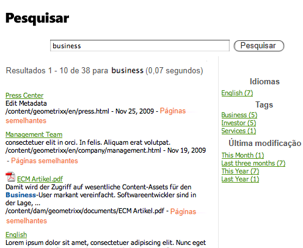

# Uso de tags   {#using-tags}

>[!CAUTION]
>
>AEM 6.4 chegou ao fim do suporte estendido e esta documentação não é mais atualizada. Para obter mais detalhes, consulte nossa [períodos de assistência técnica](https://helpx.adobe.com/br/support/programs/eol-matrix.html). Encontre as versões compatíveis [here](https://experienceleague.adobe.com/docs/).

Tags são um método rápido e fácil de classificar o conteúdo em um site. As tags podem ser consideradas palavras-chave ou rótulos que podem ser anexados a uma página, ativo ou outro conteúdo para permitir que as pesquisas encontrem esse conteúdo e conteúdo relacionado.

* Consulte [Administração de tags](/help/sites-administering/tags.md) para obter informações sobre como criar e gerenciar tags, bem como sobre quais tags de conteúdo foram aplicadas.
* Consulte [Marcação para desenvolvedores](/help/sites-developing/tags.md) para obter informações sobre a estrutura de marcação e sobre como incluir e estender tags em aplicativos personalizados.

## Dez razões para usar marcação {#ten-reasons-to-use-tagging}

1. Organização do conteúdo : a marcação facilita a vida dos autores, pois eles podem organizar rapidamente o conteúdo com pouco esforço.

1. Organização de tags : enquanto tags organizam conteúdo, taxonomias/namespaces hierárquicos organizam tags.

1. Tags profundamente organizadas : com a capacidade de criar tags e subtags, é possível expressar sistemas taxonômicos inteiros, abrangendo termos, subtermos e seus relacionamentos. É possível criar uma segunda (ou terceira) hierarquia de conteúdo em paralelo à oficial.

1. Marcação controlada : a marcação pode ser controlada com a aplicação de permissões a tags e/ou espaços de nome para controlar a criação e o aplicativo de tags.

1. Marcação flexível : As tags têm muitos nomes e faces: tags, termos de taxonomia, categorias, rótulos e muito mais. Elas são flexíveis em seu modelo de conteúdo e na maneira como podem ser usadas. Por exemplo, ao estruturar dados demográficos de direcionamento, categorizar e classificar conteúdo ou criar uma hierarquia de conteúdo secundário.

1. Pesquisa aprimorada : o componente de pesquisa padrão no AEM inclui amplamente tags criadas e tags aplicadas, às quais é possível aplicar filtros para restringir os resultados apenas àqueles que são relevantes.

1. Habilitação de SEO : as tags aplicadas como propriedades da página serão exibidas automaticamente nas metatags da página, tornando-a visível para os mecanismos de pesquisa.

1. Sofisticação simples : tags podem ser criadas simplesmente a partir de uma palavra e com o toque de um botão. Posteriormente, um título, uma descrição e um número ilimitado de etiquetas podem ser adicionadas para fornecer mais semântica à tag.

1. Consistência principal : o sistema de marcação é um componente essencial do AEM e é usado por todos os recursos AEM para categorizar o conteúdo. Além disso, a API de marcação está disponível para os desenvolvedores criarem aplicativos ativados para marcação com acesso às mesmas taxonomias.

1. Combina estrutura e flexibilidade : AEM é ideal para trabalhar com informações estruturadas, devido ao aninhamento de páginas e caminhos. Ele é igualmente poderoso ao trabalhar com informações não estruturadas, devido à pesquisa de texto completo integrada. A marcação combina os pontos fortes de estrutura e flexibilidade.

Ao projetar a estrutura de conteúdo para um site e o esquema de metadados para ativos, considere a abordagem leve e acessível que a marcação oferece.

## Aplicação de tags   {#applying-tags}

No ambiente de criação, os autores podem aplicar tags acessando as propriedades da página e digitando uma ou mais tags no campo **Tags/Palavras-chave**.

Aplicar [tags predefinidas](/help/sites-administering/tags.md)no **Propriedades da página** use a **Tags** e o **Selecionar Tags** janela. A guia **Tags padrão** é o namespace padrão, o que significa que não há `namespace-string:` prefixado à taxonomia.

### Publicação de tags {#publishing-tags}

Assim como com as páginas, você pode executar o seguinte em tags e namespaces:

**Ativar**

* Ativar tags individuais.

   Assim como com as páginas, tags recém-criadas precisam ser ativadas antes de serem disponibilizadas no ambiente de publicação.

>[!NOTE]
>
>Quando você ativa uma página, uma caixa de diálogo é aberta automaticamente e permite ativar tags não ativadas pertencentes a essa página.

**Desativar**

* Desativar as tags selecionadas.

## Nuvens de tags {#tag-clouds}

Nuvens de tags mostram uma nuvem de tags, seja para a página atual, o site inteiro ou as tags mais acessadas. Nuvens de tags são um meio de destacar os problemas que são (ou foram) de interesse do usuário. O tamanho do texto usado para exibir a tag varia em relação ao seu uso.

O [Nuvem de tags](/help/sites-authoring/default-components-foundation.md#tag-cloud) componente (grupo de componentes Geral) é usado para adicionar uma nuvem de tags a uma página.

## Pesquisar em tags {#searching-on-tags}

Você pode pesquisar por tags nos ambientes de autor e publicação.

### Uso do componente de pesquisa {#using-search-component}

Adicionar um [Componente de pesquisa](/help/sites-authoring/default-components-foundation.md#search) para uma página fornece um recurso de pesquisa que inclui tags e pode ser usado nos ambientes de autor e publicação.

