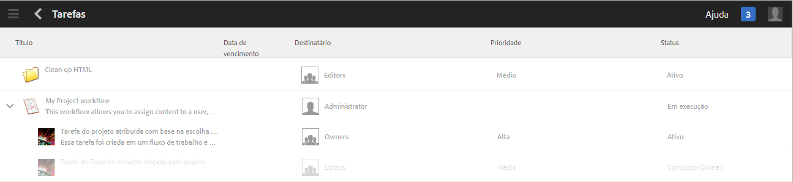

# Trabalhar com tarefas{#working-with-tasks}

>[!CAUTION]
>
>AEM 6.4 chegou ao fim do suporte estendido e esta documentação não é mais atualizada. Para obter mais detalhes, consulte nossa [períodos de assistência técnica](https://helpx.adobe.com/br/support/programs/eol-matrix.html). Encontre as versões compatíveis [here](https://experienceleague.adobe.com/docs/).

As tarefas representam itens de trabalho a serem feitos no conteúdo. Quando uma tarefa é atribuída, ela é exibida na Caixa de entrada do fluxo de trabalho. Os itens de tarefa têm um valor de tarefa na coluna Tipo .

As tarefas também são usadas em projetos para determinar o nível de integridade das tarefas atuais, incluindo tarefas de fluxo de trabalho.

## Rastreamento do progresso do projeto {#tracking-project-progress}

Você pode acompanhar o andamento do projeto observando as tarefas ativas/concluídas dentro de um projeto representado pela variável **Tarefas** mosaico. O andamento do projeto pode ser determinado por:

* **Bloco de tarefas:** um progresso geral do projeto é representado no Bloco de tarefas disponível na página Detalhes do projeto.

* **Lista de tarefas:** ao clicar no bloco Tarefa, uma lista de tarefas é exibida. Essa lista contém informações detalhadas sobre todas as tarefas relacionadas ao projeto.

As duas tarefas do fluxo de trabalho de lista, bem como as tarefas criadas diretamente na **Tarefas** mosaico.

### Mosaico de tarefas {#task-tile}

Se um projeto tiver tarefas relacionadas, um Mosaico de tarefas será exibido dentro do projeto. O Mosaico de tarefas mostra o status atual do projeto. Isso é baseado nas tarefas existentes dentro do fluxo de trabalho e não inclui tarefas que serão geradas no futuro, conforme o fluxo de trabalho continuar. As seguintes informações estão visíveis no bloco de tarefas:

* Porcentagem de tarefas concluídas
* Porcentagem de tarefas ativas
* Porcentagem de tarefas vencidas

### Exibindo ou Modificando as Tarefas em um Projeto {#viewing-or-modifying-the-tasks-in-a-project}

Além de rastrear o progresso, também é possível visualizar mais informações sobre o projeto ou modificá-lo.

#### Lista de tarefas {#task-list}

Clique nas reticências (...) no Mosaico de tarefas para exibir a lista de tarefas relacionadas ao projeto. As tarefas são divididas por workflows principais. Os detalhes da tarefa são exibidos junto com metadados, como data de vencimento, destinatário, prioridade e status.

#### Detalhes da tarefa {#task-details}

Para obter mais informações sobre uma tarefa específica, na Lista de tarefas, toque/clique na tarefa e em **Detalhes da tarefa **abrir.

### Exibindo e Modificando Comentários da Tarefa {#viewing-and-modifying-task-comments}

Nos detalhes da Tarefa, você pode editar ou adicionar comentários. Além disso, todos os comentários em um projeto são visíveis na área Comentários .

### Adicionar tarefas {#adding-tasks}

É possível adicionar novas tarefas a projetos. Essas tarefas são exibidas no bloco Tarefas e estão disponíveis na caixa de entrada Notificações para executar ações.

Para adicionar uma tarefa:

1. No projeto, no bloco **Tarefas**, toque/clique no ícone +. A janela **Adicionar tarefa** é aberta.
1. Insira informações sobre a tarefa. O título da tarefa e o grupo ao qual ela está atribuída são obrigatórios. Informações adicionais, como caminho do conteúdo, descrição, prioridade da tarefa e data de vencimento são opcionais. Além disso, é possível selecionar a variável **Avançado** para inserir o nome da tarefa, que é usado para nomear o URL.

   

1. Toque/clique em **Criar**.

## Trabalhar com tarefas na Caixa de entrada {#working-with-tasks-in-the-inbox}

Outra maneira de acessar tarefas é na Caixa de entrada. Na caixa de entrada, é possível abrir o conteúdo para implementar as alterações necessárias. Quando concluído, você define o status da tarefa como Concluído. As tarefas também aparecem na sua caixa de entrada quando são atribuídas a um grupo de usuários ao qual você pertence. Nesse caso, qualquer membro do grupo pode executar o trabalho e concluir a tarefa.

Para concluir uma tarefa, selecione-a e clique em **Concluído**. Adicione informações à tarefa e clique em **Concluído**. Consulte [Sua Caixa de entrada](/help/sites-authoring/inbox.md) para obter mais informações.

