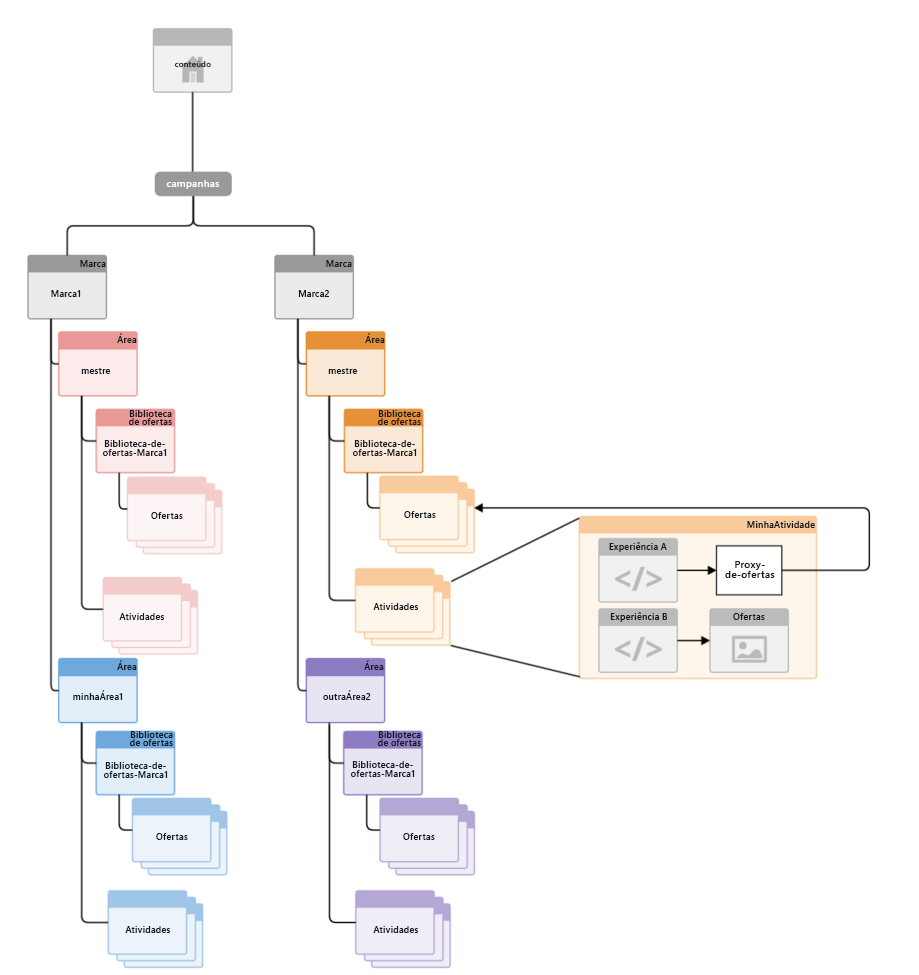
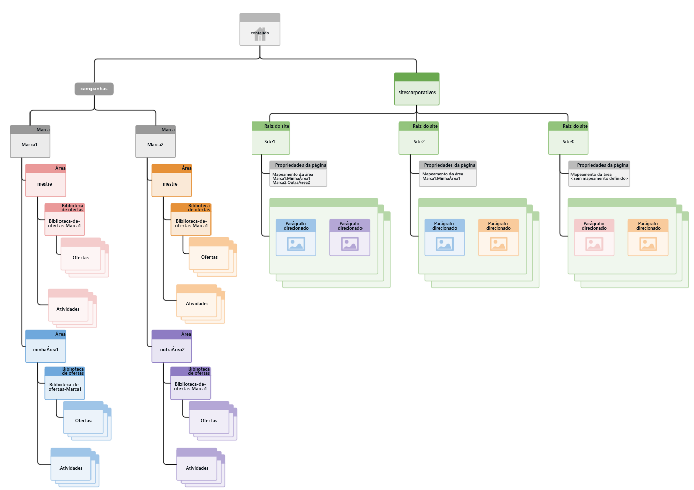

# Como o gerenciamento multisite para conteúdo direcionado está estruturado{#how-multisite-management-for-targeted-content-is-structured}

>[!CAUTION]
>
>AEM 6.4 chegou ao fim do suporte estendido e esta documentação não é mais atualizada. Para obter mais detalhes, consulte nossa [períodos de assistência técnica](https://helpx.adobe.com/br/support/programs/eol-matrix.html). Encontre as versões compatíveis [here](https://experienceleague.adobe.com/docs/).

O diagrama a seguir mostra como o suporte multisite para conteúdo direcionado está estruturado.

As áreas aparecem dentro de **/conteúdo/campanhas/&lt;marca>** e, por padrão, cada marca tem uma área principal, que é criada automaticamente. Cada área contém seu próprio conjunto de atividades, experiências e ofertas.

Para pesquisar conteúdo direcionado, as páginas ou sites podem mapear para uma área. Se não houver área configurada, AEM voltará para a área principal para essa marca específica.

O diagrama a seguir é um exemplo de como a lógica funciona para três sites, chamados de site1, site2 e site3.

* site1 pesquisa myarea1 em busca de brand1 e otherarea2 em busca de brand2 com base no mapeamento de área.
* site2 procura myarea1 por brand1 e área principal por brand2, pois somente o mapeamento de área para brand1 é definido.
* site3 procura a área principal para brand1 e brand2, pois nenhum outro mapeamento de área é definido para esse site.
