# Gerenciamento de projetos{#managing-projects}

>[!CAUTION]
>
>AEM 6.4 chegou ao fim do suporte estendido e esta documentação não é mais atualizada. Para obter mais detalhes, consulte nossa [períodos de assistência técnica](https://helpx.adobe.com/br/support/programs/eol-matrix.html). Encontre as versões compatíveis [here](https://experienceleague.adobe.com/docs/).

Projetos permite organizar seu projeto agrupando recursos em uma entidade.

No **Projetos** , você acessa e executa ações em seus projetos:

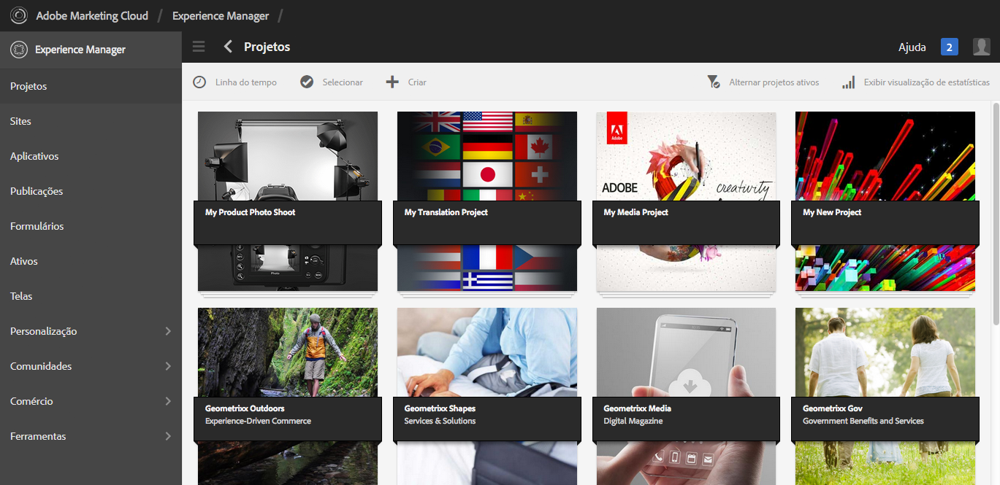

Em Projetos, você pode criar um projeto, associar recursos ao projeto e também excluir um projeto ou links de Recursos. Talvez você queira abrir um bloco para exibir seu conteúdo e adicionar itens a ele. Este tópico descreve esses procedimentos.

>[!NOTE]
>
>O 6.2 introduziu a capacidade de organizar projetos em pastas. Na página Projetos , você pode criar um projeto ou uma pasta.
>
>Se uma pasta for criada, o usuário será direcionado para essa pasta, onde poderá criar outra pasta ou um projeto. Ajuda a organizar os projetos em pastas com base em categorias como campanhas de produto, localização, idiomas de tradução e assim por diante.
>
>Os projetos e pastas podem ser visualizados em uma exibição de lista e também pesquisados.

>[!CAUTION]
>
>Para que os usuários em projetos vejam outros usuários/grupos ao usar a funcionalidade Projetos, como criar projetos, criar tarefas/fluxos de trabalho, ver e gerenciar a equipe, esses usuários precisam ter acesso de leitura no **/home/users** e **/home/groups**. A maneira mais fácil de implementar isso é dar **projects-users** acesso de leitura de grupo para **/home/users** e **/home/groups**.

## Criação de um projeto {#creating-a-project}

Imediatamente, o AEM fornece estes modelos para escolha ao criar um projeto:

* Projeto simples
* Projeto de mídia
* Projeto de sessão de fotos do produto
* Projeto de tradução

O procedimento de criação de um projeto é o mesmo em todos os projetos. A diferença entre os tipos de projetos inclui [funções de usuário](/help/sites-authoring/projects.md) e [fluxos de trabalho](/help/sites-authoring/projects-with-workflows.md) disponíveis.  Para criar um novo projeto:

1. Em **Projetos**, toque/clique em **Criar** para abrir o assistente **Criar projeto**:
1. Selecione um modelo. Pronto para uso, Projeto simples, Projeto de mídia, [Projeto de tradução](/help/sites-administering/tc-manage.md)e [Produto de Sessão fotográfica do produto](/help/sites-authoring/managing-product-information.md) estão disponíveis e clique em **Próximo**.

   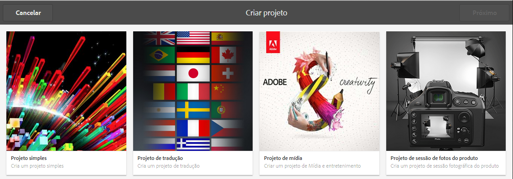

1. Defina o **Título** e a **Descrição** e adicione uma imagem de **Miniatura** se necessário. Também é possível adicionar ou excluir usuários e a que grupo pertencem. Além disso, clique em **Avançado** para adicionar um nome usado no URL.

   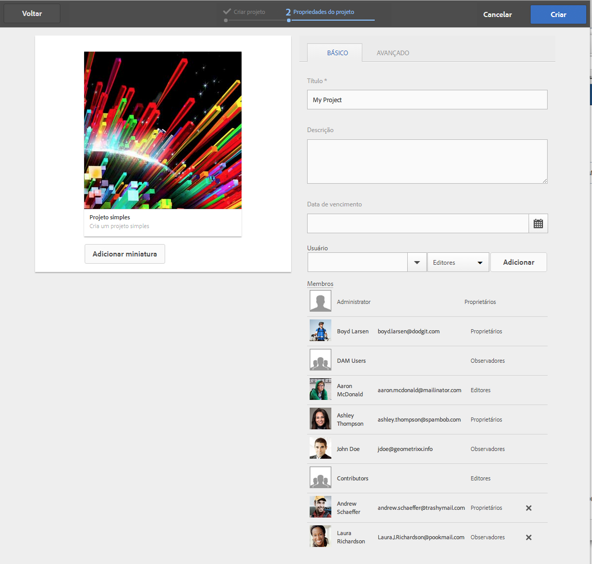

1. Toque/clique em **Criar**. A confirmação pergunta se você deseja abrir o novo projeto ou retornar ao console.

### Associar recursos ao seu projeto {#associating-resources-with-your-project}

Como os projetos permitem agrupar recursos em uma única entidade, você deseja associar recursos ao projeto. Esses recursos são chamados de **Mosaicos**. Os tipos de recursos que você pode adicionar são descritos em [Mosaicos do projeto](/help/sites-authoring/projects.md#project-tiles).

Para associar recursos ao projeto:

1. Abra o projeto no **Projetos** console.
1. Toque/clique **Adicionar mosaico** e selecione o bloco que deseja vincular ao seu projeto. É possível selecionar vários tipos de mosaicos.

   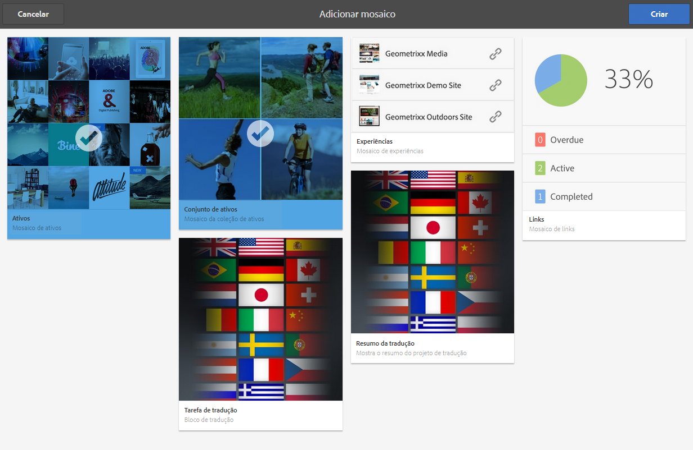

   >[!NOTE]
   >
   >Os mosaicos que podem ser associados a um projeto são descritos mais detalhadamente em [Mosaicos do projeto.](/help/sites-authoring/projects.md#project-tiles)

1. Toque/clique em **Criar**. O recurso é vinculado ao seu projeto e a partir de agora é possível acessá-lo do próprio projeto.

### Excluir um vínculo de projeto ou recurso {#deleting-a-project-or-resource-link}

O mesmo método é usado para excluir um projeto do console ou um recurso vinculado do seu projeto:

1. Navegue até o local apropriado:

   * Para excluir um projeto, vá para o nível superior da variável **Projetos** console.
   * Para excluir um vínculo de recurso em um projeto, abra o projeto no console **Projetos**.

1. Entre no modo de seleção clicando em **Selecionar** e selecionando o vínculo do projeto ou do recurso.
1. Toque/clique em **Excluir**.

1. É necessário confirmar a exclusão em uma caixa de diálogo. Se confirmado, o link do projeto ou recurso será excluído. Toque/clique em **Desmarcar** para sair do modo de seleção.

>[!NOTE]
>
>Ao criar o projeto e adicionar usuários às várias funções, os grupos associados ao projeto são criados automaticamente para gerenciar as permissões associadas. Por exemplo, um projeto chamado Myproject teria três grupos: **Proprietários do Myproject**, **Editores do Myproject**, **Observadores do Myproject**. No entanto, se o projeto for excluído, esses grupos não serão excluídos automaticamente. Um administrador precisa excluir manualmente os grupos em **Ferramentas** > **Segurança** > **Grupos**.

### Adicionar itens a um mosaico {#adding-items-to-a-tile}

Em alguns blocos, talvez você queira adicionar mais de um item. Por exemplo, você pode ter mais de um fluxo de trabalho em execução ao mesmo tempo ou mais de uma experiência.

Para adicionar itens a um mosaico:

1. Em **Projetos**, navegue até o projeto e clique no ícone Adicionar + no mosaico ao qual deseja adicionar um item.

   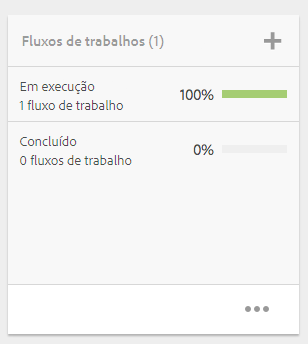

1. Adicione um item ao mosaico da mesma maneira que ao criar um novo mosaico. Os mosaicos do projeto são descritos [here](/help/sites-authoring/projects.md#project-tiles). Neste exemplo, outro workflow foi adicionado.

   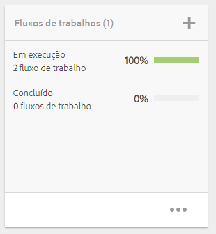

### Abrir um mosaico {#opening-a-tile}

Você pode querer ver quais itens estão incluídos em um bloco atual ou modificar ou excluir itens no bloco.

Para abrir um bloco para que você possa exibir ou modificar itens:

1. No console Projetos , toque/clique nas reticências (...)

   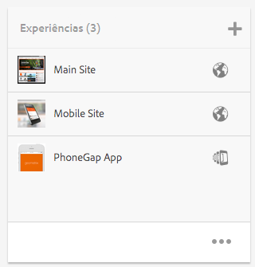

1. AEM lista os itens nesse bloco. Você pode entrar no modo de seleção para modificar ou excluir os itens.

   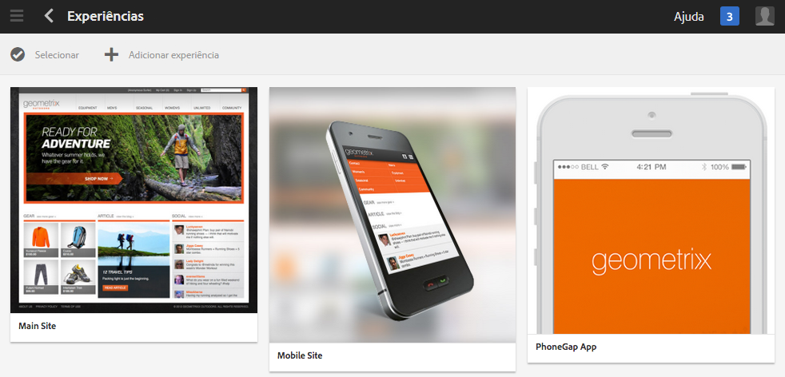

## Exibir as estatísticas do projeto {#viewing-project-statistics}

Para exibir as estatísticas do projeto, no **Projetos** , clique em **Exibir Exibição de Estatísticas**. O nível de conclusão de cada projeto é exibido. Clique em **Exibir Exibição de Estatísticas** novamente para acessar o **Projetos** console.

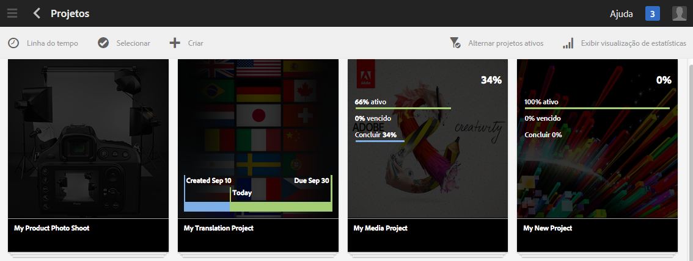

### Exibindo uma Linha do Tempo do Projeto {#viewing-a-project-timeline}

A linha do tempo do projeto fornece informações sobre quando os ativos no projeto foram usados pela última vez. Para exibir a linha do tempo do projeto, clique/toque em **Linha do tempo**, entre no modo de seleção e selecione o projeto. Os ativos são exibidos no painel esquerdo. Toque/clique em **Linha do tempo** para voltar ao console de **Projetos**.

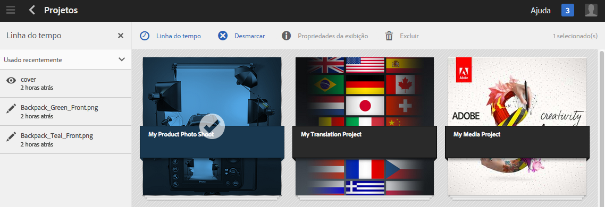

### Exibir projetos ativos/inativos {#viewing-active-inactive-projects}

Para alternar entre os projetos ativos e inativos, no console de **Projetos**, clique em **Alternar projetos ativos**. Se o ícone tiver uma marca de seleção ao lado, estará exibindo os projetos ativos.

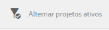

Se o ícone tiver um X, estará exibindo os projetos inativos.

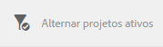

## Tornar os projetos inativos ou ativos {#making-projects-inactive-or-active}

Você pode querer tornar um projeto inativo se tiver concluído, mas ainda quiser manter as informações sobre o projeto.

Para tornar um projeto inativo (ou ativo):

1. No **Projetos** abra o projeto e localize o **Informações do projeto** mosaico.

   >[!NOTE]
   Talvez seja necessário adicionar esse bloco se ele ainda não estiver em seu projeto. Consulte [Adição de blocos](#adding-items-to-a-tile).

1. Toque/clique em **Editar**.
1. Altere o seletor de **Ativo** para **Inativo** (ou vice-versa).

   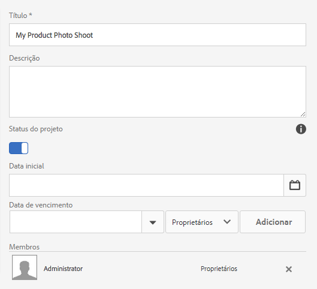

1. Toque/clique em **Concluído** para salvar as alterações.
