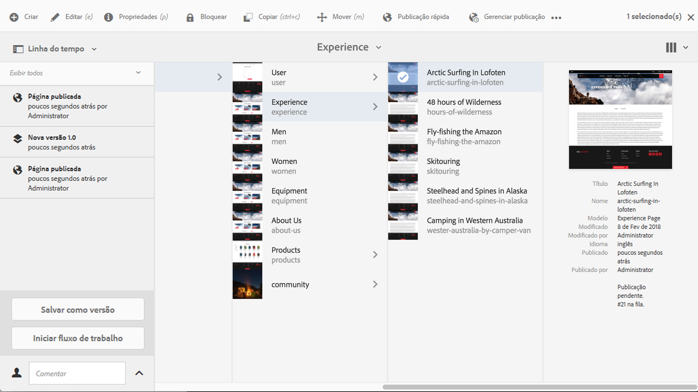
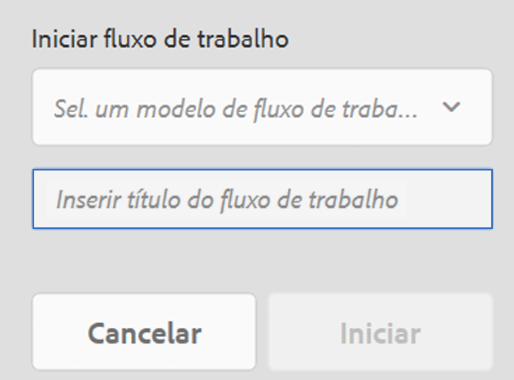

# Aplicação de fluxos de trabalho a páginas{#applying-workflows-to-pages}

Ao criar, você pode chamar fluxos de trabalho para executar ações em suas páginas; também é possível aplicar mais de um fluxo de trabalho.

Ao aplicar o fluxo de trabalho, você especifica as seguintes informações:

* O fluxo de trabalho a ser aplicado.

   É possível aplicar qualquer fluxo de trabalho (ao qual você tenha acesso, conforme atribuído pelo administrador do AEM).

* Opcionalmente, um título que ajude a identificar a instância de fluxo de trabalho na Caixa de entrada de um usuário..
* A carga útil do fluxo de trabalho. Pode ser uma ou mais páginas.

Fluxos de trabalho podem ser iniciados a partir de:

* o console **[Sites.](#starting-a-workflow-from-the-sites-console)**
* ao editar uma página, em **[Informações da página](#starting-a-workflow-from-the-page-editor)**.

>[!NOTE]
>
>Consulte também:
>
>* [Como aplicar fluxos de trabalho a ativos do DAM](/help/assets/assets-workflow.md).
>* [Trabalhar com fluxos de trabalho de projeto](/help/sites-authoring/projects-with-workflows.md).
>

>[!NOTE]
>
>Os administradores do AEM podem [iniciar fluxos de trabalho usando vários outros métodos](/help/sites-administering/workflows-starting.md).

## Início de um fluxo de trabalho no console Sites {#starting-a-workflow-from-the-sites-console}

Você pode iniciar um fluxo de trabalho com:

* a opção **[Criar](#starting-a-workflow-from-the-sites-toolbar)**da barra de ferramentas Sites.
* o painel **[Linha do tempo](#starting-a-workflow-from-the-timeline)**do console Sites.

Em ambos os casos, é necessário:

* [Especificar os Detalhes do fluxo de trabalho no assistente Criar fluxo de trabalho](#specifying-workflow-details-in-the-create-workflow-wizard).

### Início de um fluxo de trabalho na barra de ferramentas de Sites {#starting-a-workflow-from-the-sites-toolbar}

You can start a workflow from the toolbar of the **Sites** console:

1. Navegue até página desejada e selecione-a.

1. From the **Create** option in the toolbar you can now select **Workflow**.

   

1. O assistente **Criar fluxo de trabalho** ajudará você a [especificar os detalhes do fluxo de trabalho](#specifying-workflow-details-in-the-create-workflow-wizard).

### Início de um fluxo de trabalho na Linha do tempo {#starting-a-workflow-from-the-timeline}

Na **Linha do tempo**, você pode iniciar um fluxo de trabalho a ser aplicado ao seu recurso selecionado.

1. [Selecione o recurso](/help/sites-authoring/basic-handling.md#viewing-and-selecting-resources) e abra a [Linha do tempo](/help/sites-authoring/basic-handling.md#timeline) (ou abra a Linha do tempo e selecione o recurso).
1. A ponta da seta no campo de comentário pode ser usada para revelar a opção **Iniciar fluxo de trabalho**:

   

1. O assistente **Criar fluxo de trabalho** ajudará você a [especificar os detalhes do fluxo de trabalho](#specifying-workflow-details-in-the-create-workflow-wizard).

### Especificar detalhes do fluxo de trabalho no assistente Criar fluxo de trabalho {#specifying-workflow-details-in-the-create-workflow-wizard}

O assistente **Criar fluxo de trabalho** ajudará você a selecionar o fluxo de trabalho e a especificar os detalhes necessários.

Depois de abrir o assistente **Criar fluxo de trabalho** em um destes locais:

* a opção **[Criar](#starting-a-workflow-from-the-sites-toolbar)**da barra de ferramentas Sites.
* o painel **[Linha do tempo](#starting-a-workflow-from-the-timeline)**do console Sites.

Você pode especificar os detalhes:

1. Na etapa **Propriedades**, as opções básicas do fluxo de trabalho são definidas:

   * **Modelo de fluxo de trabalho**
   * **Título do fluxo de trabalho**

      * Você pode especificar um título para essa instância, para que ele possa ser identificado em um estágio posterior.
   Dependendo do modelo de fluxo de trabalho, as seguintes opções também estão disponíveis. Isso permite que o pacote criado como carga seja mantido após a conclusão do fluxo de trabalho.

   * **Manter o pacote do fluxo de trabalho**
   * **Título do pacote**

      * Você pode especificar um título para o pacote, para ajudar na identificação.
   >[!NOTE]
   >
   >A opção **Manter pacote de fluxo de trabalho** estará disponível quando o fluxo de trabalho for configurado para Suporte a vários recursos e vários recursos foram selecionados.

   Quando terminar, use **Próximo** para prosseguir.

   

1. Na etapa **Escopo**, você pode selecionar:

   * **Adicionar conteúdo** para abrir o navegador [de](/help/sites-authoring/author-environment-tools.md#path-browser) caminho e selecionar recursos adicionais; quando estiver no navegador, clique/toque em **Selecionar** para adicionar o conteúdo à instância do fluxo de trabalho.
   * Um recurso existente para ver ações adicionais:

      * **Incluir filhos** para especificar que os filhos desse recurso serão incluídos no fluxo de trabalho.

         Uma caixa de diálogo será aberta, permitindo que você refine a seleção de acordo com:

         * Incluir somente filhos imediatos.
         * Incluir somente as páginas modificadas.
         * Incluir somente páginas já publicadas.
         Qualquer filho especificado é adicionado à lista de recursos aos quais o fluxo de trabalho será aplicado.

      * **Remover seleção** para remover esse recurso do fluxo de trabalho.
   

   >[!NOTE]
   >
   >Se você adicionar recursos extras, poderá usar **Voltar** para ajustar a configuração **Manter fluxo de trabalho do pacote** na etapa **Propriedades**.

1. Use **Create** to close the wizard and create the workflow instance. Uma notificação é exibida no console Sites.

## Iniciar um fluxo de trabalho no editor de páginas {#starting-a-workflow-from-the-page-editor}

Ao editar uma página, você pode selecionar **Informações da página** na barra de ferramentas. O menu suspenso tem a opção **Iniciar no fluxo de trabalho**. Isso abrirá uma caixa de diálogo na qual você pode especificar o fluxo de trabalho necessário, juntamente com um título, se necessário:

